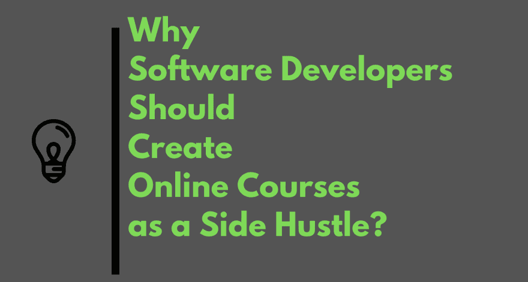
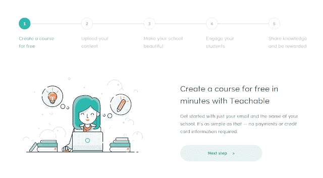

# 为什么软件开发者应该创建在线课程作为副业？

> 原文:[https://dev . to/javin Paul/why-software-developers-should-create-online-courses-as-a-side-hustle-3011](https://dev.to/javinpaul/why-sofware-developers-should-create-online-courses-as-a-side-hustle-3011)

*披露:这篇文章包括附属链接；如果您从本文提供的不同链接购买产品或服务，我可能会收到报酬。*

[T2】](https://res.cloudinary.com/practicaldev/image/fetch/s--IwJ0ktX7--/c_limit%2Cf_auto%2Cfl_progressive%2Cq_auto%2Cw_880/https://thepracticaldev.s3.amazonaws.com/i/aywtepumkb7tmi8dyfrs.png)

作为一名导师和一个编程博客的作者，我经常收到这样的问题，比如软件工程师应该创造一个替代收入来源，还是开发人员应该创建他们自己的 T2 博客或网站？

这两个问题都很常见，大多是对创业感兴趣的高级开发人员问的。曾经有一段时间，我建议程序员创建自己的，不仅仅是为了学习和提高自己对所知技术的理解，也是为了在做自己热爱的事情的同时赚到钱，但时过境迁。

现在，我建议程序员和软件开发人员在可教的、可教的、T2 的、Udemy 的、T4 的、Thinkific 的、Podia 的、Skillshare 的、Kajabi 的和其他平台上创建和销售在线课程。道理还是一样，你学，你赚，只是方法变了。

博客永远是在网上建立自己的绝佳方式，但它需要更多的努力和时间来赚取一些有意义的东西。

另一方面，在线课程将很快创造一个收入的替代课程。我认识许多人，他们通过创建和销售在线课程获得了可观的收入，比如我亲爱的朋友尤金·帕拉斯基夫，他的春季课程已经帮助你们许多人更好地学习了 Spring Framework。

他不是一个人，像 Ranga Karnan 这样的博主也是 Udemy 上最受欢迎的导师之一，在这个平台上有数百名学生。他的 [Spring Boot 微服务器课程](https://click.linksynergy.com/deeplink?id=JVFxdTr9V80&mid=39197&murl=https%3A%2F%2Fwww.udemy.com%2Fmicroservices-with-spring-boot-and-spring-cloud%2F)是 Udemy 上最畅销的课程之一。

简而言之，创建和销售在线课程是程序员在网上赚钱、学习有价值的东西和影响人们生活的最佳方式。

是的，你需要对教学有一点热情，但是大多数程序员通常都很擅长，因为他们在工作中不断地接受指导和培训。

现在，你们中的一些人可能会想为什么我还没有创建一个在线课程。嗯，这有时是在卡片上，我做了很多关于过程和设备的研究，比如我应该买哪个 USB 麦克风(我买了 [**蓝耶提阿兹特克铜**](https://www.amazon.com/Blue-Yeti-USB-Microphone-Copper/dp/B07CY5HS72?tag=javamysqlanta-20) )以及我应该加入哪个平台，比如 Teachable 或 Udemy，但不知何故，我没有足够的时间来准备我想教的课程。

如果你们想看到我创建一个关于 Java 或任何其他主题的在线课程，请在评论中告诉我，这可能有助于我尽快开设课程。无论如何，今天不是关于我，而是你，我希望我所有的读者都有兴趣创造一个替代收入流，并对教学有热情，以开发在线课程。

也许你对 Java、Python、编程、算法之类的主题非常了解，那么你应该就这个主题创建一门课程，并在像 [Udemy](https://javarevisited.blogspot.com/2019/09/codecademy-vs-udemy-vs-onemonth-which-is-better-for-learning-code.html) 或 [Teachable](https://javarevisited.blogspot.com/2019/09/teachable-or-udemy-which-platform-is-best-online-course.html) 这样的平台上推出。这种策略最好的部分是，一旦你做了创建课程的最初工作，你就可以继续从每个新入学的学生那里获得报酬。

## 2021 年打造网络课程最好的平台是什么？

teachable/thinkfic 和 Udemy 是我最喜欢的两个平台，它们既直观又用户友好。有了[可教的](https://teachable.sjv.io/c/1193463/998814/12646)或[有思想的](http://try.thinkific.com/javinpaul8817)，你对自己的定价和课程的观感有了更多的控制，但你没有固定的听众，这是你的课程成功的最重要的因素之一。

相反，你必须自己做所有的营销工作。虽然 Teachable 确实提供了很多指导，并尝试和测试了电子邮件模板，这可以帮助你很多。Eugen 的 [Spring 框架课程](http://courses.baeldung.com/?affcode=22136_bkwjs9xa)建立在可教的基础上，Heinz Kabutz 的 [Java 并发课程](https://javarevisited.blogspot.com/2018/06/top-5-java-multithreading-and-concurrency-courses-experienced-programmers.html)也是如此，两者都非常成功。

另一方面， [Udemy](https://click.linksynergy.com/fs-bin/click?id=JVFxdTr9V80&offerid=323058.9409&type=3&subid=0) 有固定的学生基础，但你没有太多的控制权，他们拿走你大部分的收入，因为他们在卖你的课程。Ranga 选择了 Udemy，他的 Spring 和 Java 课程在那边取得了巨大的成功，所以是的，Udemy 也是另一个必不可少的平台。

好的一面是，如果你喜欢的话，你可以不局限于其中一种，你可以两种都用。不过，如果你正在重新开始，没有网上平台，我推荐 Udemy，如果你有博客和某种形式的网上平台，这将使你更容易以更高的价格出售课程。

## 如何创建网络课程？

现在创建一门课程非常容易，你几乎可以免费创建一门课程，你所需要的只是一个电子邮件地址、时间、知识和教学热情。

Udemy 和 Teachable 都允许你创建自己的课程，并提供许多工具来上传你的内容，如课程视频、音频、演示、图像和文本。

Teachable 还允许您用您的品牌、颜色、徽标等定制您的学校。他们还举办了 [**可教现场会议**](https://mbsy.co/B7Z8p) ，在那里你可以见到成功的在线课程创建者，并向他们学习创建优秀在线课程的策略。

他们还会在每一步指导你，比如创建课程大纲、拍摄、编辑、发布和交付。所以，你不仅创造了另一种收入来源，还通过教新学生学习了一项新技能，提高了你现有的专业技能和知识。

这里有一个截图表格[启动你自己的盈利在线课程](https://teachable.sjv.io/c/1193463/1014938/12646)的 7 个步骤，它大致概述了你需要做些什么来创建一个成功的免费在线课程:

[T2】](https://teachable.sjv.io/c/1193463/1014938/12646)

这是一个非常棒的东西，我怎么推荐都不为过。这对每个参与者来说都是一个双赢的局面，你可以从教学中获得金钱，但你也提高了你的编程技能，学习了制作视频和做在线业务的新技能。学生从你的现实生活经验中学习，成就自己的事业。

一切顺利，随着你的学习和课程的创建。如果你创建了一个在线课程，并需要我的帮助，我随时准备提供帮助，只需给我留言。我也会帮你在网上推广你的课程，毕竟你是我的读者，社区给了我这么多的爱。我只是尽力而为。

***更新-*** Teachable 正在为有抱负的女性课程创建者举办一次免费的在线会议，以创建名为 [**2021 -女性创造**](https://teachable.sjv.io/c/1193463/1008095/12646) 的在线课程。我已经等这个会议很久了，如果你想创建一个在线课程，它是免费的，如果你想免费加入，这里有链接到 [**加入 T2021 -女性创造**](https://teachable.sjv.io/c/1193463/1008095/12646) 。

通常情况下，你需要投资 1000 多美元才能买到一张为期三天的会议门票，但 Teachable Live 是完全免费的。

您可能喜欢的其他**技术文章**

*   [2021 年网络开发者路线图](https://hackernoon.com/the-2019-web-developer-roadmap-ab89ac3c380e)
*   [2021 年 React.js 开发者路线图](https://javarevisited.blogspot.com/2018/10/the-2018-react-developer-roadmap.html)
*   [面向程序员的 10 大多元化课程和认证](https://javarevisited.blogspot.com/2017/12/top-10-pluralsight-courses-java-and-web-developers.html)
*   [2021 年 Java 开发人员应该学会的 10 件事](https://javarevisited.blogspot.com/2017/12/10-things-java-programmers-should-learn.html#axzz5atl0BngO)
*   [2021 年 DevOps 开发者路线图](https://dev.to/javinpaul/the-2019-devops-engineering-roadmap-2klc)
*   [面向程序员的 10 门免费 Python 编程课程](https://hackernoon.com/10-free-python-programming-courses-for-beginners-to-learn-online-38312f3b9912)
*   [十大数据科学和机器学习认证课程](https://hackernoon.com/10-machine-learning-data-science-and-deep-learning-courses-for-programmers-7edc56078cde)
*   [10 程序员数据结构与算法课程](https://www.java67.com/2019/02/top-10-free-algorithms-and-data.html)
*   [初学者学习 Java 的 5 大课程](https://javarevisited.blogspot.com/2018/05/top-5-java-courses-for-beginners-to-learn-online.html)
*   [面向开发者的十大 Java 和 Web 开发框架](http://javarevisited.blogspot.sg/2018/01/top-10-udemy-courses-for-java-and-web-developers.html)
*   [2021 年学习 Python 的 5 大课程](https://medium.com/better-programming/top-5-courses-to-learn-python-in-2018-best-of-lot-26644a99e7ec)

> 这不仅适用于程序员和软件开发人员，也适用于任何想在网上赚点钱的人。它不仅为程序员创造了另一种收入来源，还让你感到快乐，带来更多的能量，因为你将做你热爱并充满激情的事情。