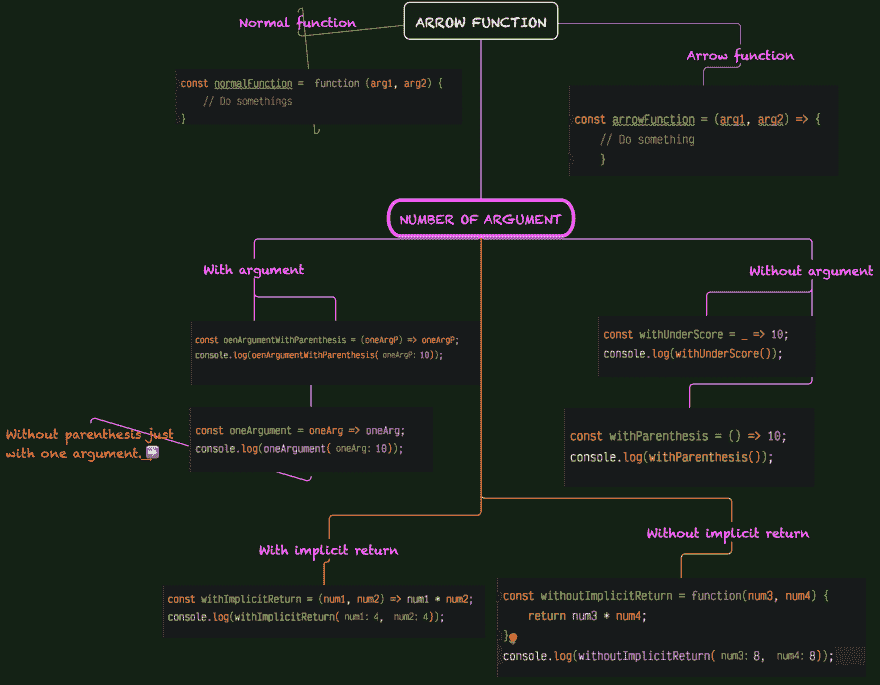

# 箭头功能=>=>= >

> 原文:[https://dev.to/giandodev/arrow-function-55i8](https://dev.to/giandodev/arrow-function-55i8)

## 箭头功能思维导图。

[T2】](https://res.cloudinary.com/practicaldev/image/fetch/s--2pGXud7A--/c_limit%2Cf_auto%2Cfl_progressive%2Cq_auto%2Cw_880/https://thepracticaldev.s3.amazonaws.com/i/ba1dvshuzlr4ni9uh2r3.png)