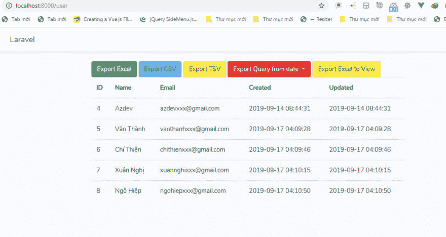

# 在 Laravel 5.8 中使用 maatwebsite/excel 导出 Excel

> 原文:[https://dev . to/skip perhoa/export-excel-using-maat website-excel-in-laravel-5-8-2f 24](https://dev.to/skipperhoa/export-excel-using-maatwebsite-excel-in-laravel-5-8-2f24)

[在 Laravel 5.8](https://hoanguyenit.com/export-excel-using-maatwebsite-excel-in-laravel-58.html)
 中使用 maatwebsite/excel 导出 Excel