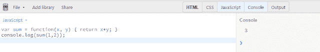
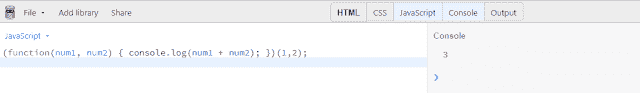
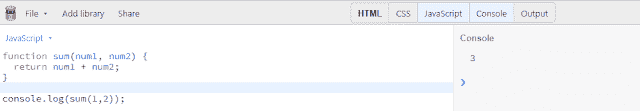
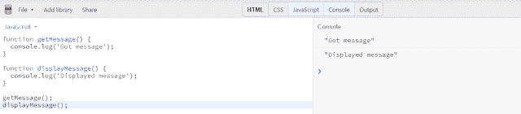
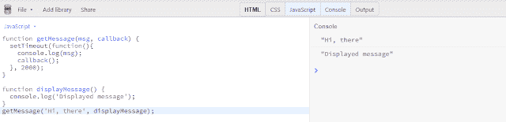

# 2019 年深度指南中的 Javascript 回调函数

> 原文：<https://dev.to/nileshsanyal/javascript-callback-functions-in-depth-guide-for-2019-gj7>

*阅读原文[此处](https://www.devhelperworld.in/2019/09/javascript-callback-in-depth.html)T3】*

[](https://res.cloudinary.com/practicaldev/image/fetch/s--SkTmxFUo--/c_limit%2Cf_auto%2Cfl_progressive%2Cq_auto%2Cw_880/https://1.bp.blogspot.com/-tTje5SxR_qg/XYJtEEHSOdI/AAAAAAAABYM/DLZmRgI9KVgeHG2Ysd_qGDViSFOFt3GEwCLcBGAsYHQ/s640/javascript-callback-cover-image.jpg)

**Javascript 回调**函数；另一个你必须了解的重要概念。否则，要成为一名成功的 javascript 开发人员，你可能会面临很多困难。但是我确信，在通读完这篇文章之后，你将能够克服你之前在面试中遇到的任何障碍。

在此之前，我将更多地讨论回调函数，但是首先，你需要有一些关于函数的最基本的知识。我的意思是你应该知道什么是函数，它实际上是如何工作的，什么是不同类型的函数等等。

# 快速回顾:Javascript 函数

## 什么是函数？

函数是一个逻辑构建块，其中编写了一组代码来执行特定的任务。实际上，函数允许以更有组织的方式编写代码，这也易于调试和维护。函数还允许代码重用。

您只需定义一次函数，然后在需要时调用它，而无需反复编写相同的代码。

## 声明函数的语法

我们讨论了一下什么是函数。现在，让我们看看如何在 javascript 中声明一个函数。

1.  **使用函数构造器**:在这种方法中，函数是在“函数”构造器的帮助下创建的。从技术上讲，这种方法比用函数表达式语法和函数声明语句语法声明函数效率低。

[](https://res.cloudinary.com/practicaldev/image/fetch/s--CwKFASG7--/c_limit%2Cf_auto%2Cfl_progressive%2Cq_auto%2Cw_880/https://1.bp.blogspot.com/-fY4ognZ_mjY/XYJvYeFQOxI/AAAAAAAABZA/mK5P3Cg4Uo0hZvMU7w26U3KJ_BoocVbxACLcBGAsYHQ/s640/javascript-callback-function-constructor-syntax.png)

1.  **使用函数表达式**:通常，这种方法与变量赋值相同。简单地说，函数体被认为是一个表达式，而这个表达式被赋给一个变量。用这种语法定义的函数可以是命名的，也可以是匿名的。

没有名字的函数称为匿名函数。匿名函数是自我调用的，这意味着它会自动调用自己。这种行为也称为立即调用函数表达式(IIFE)。

[](https://res.cloudinary.com/practicaldev/image/fetch/s--02NGM-Jp--/c_limit%2Cf_auto%2Cfl_progressive%2Cq_auto%2Cw_880/https://1.bp.blogspot.com/-7EcJXpTpzu0/XYJtZU-X52I/AAAAAAAABYU/335Wk61hWgoC7hCF-s2-oUBjl9PZkgpWgCLcBGAsYHQ/s640/javascript-callback-function-expression-named-syntax.png)

[](https://res.cloudinary.com/practicaldev/image/fetch/s--xGl9Bznu--/c_limit%2Cf_auto%2Cfl_progressive%2Cq_auto%2Cw_880/https://1.bp.blogspot.com/-nA--Vxpnsj0/XYJtr-HevbI/AAAAAAAABYc/i62S98ivMLQjfQbdCnVvIpaFWSAoTmbCQCLcBGAsYHQ/s640/javascript-callback-function-expression-anonymous-syntax.png)

1.  **使用函数声明语句**:其实这个方法是 javascript 中常用的老派方法。这里，在关键字“function”之后，您必须指定函数的名称。之后，如果函数接受多个参数或自变量；你也需要提到他们。虽然这部分是完全可选的。

在函数体中，函数必须向调用者返回值。找到 return 语句后，函数将停止执行。在函数内部，参数将作为局部变量。

此外，在函数内部声明的变量将是该函数的局部变量。局部变量只能在该函数中访问，因此同名的变量可以很容易地在不同的函数中使用。

[](https://res.cloudinary.com/practicaldev/image/fetch/s--cSRQwkJq--/c_limit%2Cf_auto%2Cfl_progressive%2Cq_auto%2Cw_880/https://1.bp.blogspot.com/-vh59QjIzPLs/XYJt29sAjeI/AAAAAAAABYg/U4I46S849xEty6UvPrAqD61OF5lKDjKpgCLcBGAsYHQ/s640/javascript-callback-function-declaration-syntax.png)

## 调用函数

当下列任一情况发生时，将调用之前声明的函数:

*   当一个事件发生时，例如，用户点击一个按钮或者用户从下拉列表中选择一些选项等等。

*   当 javascript 代码调用该函数时。

*   函数也可以被自动调用，我们已经在匿名函数表达式中讨论过了。

()操作符调用函数。

# 什么是 Javascript 回调函数？

根据 MDN: *回调函数是作为参数传递给另一个函数的函数，然后在外部函数中调用它来完成某种例程或动作*。

我知道看了这个技术定义后，你很困惑，几乎无法理解实际上什么是回调函数。

让我用简单的话来澄清这一点，回调函数是一个在另一个函数刚刚执行完之后执行的函数。回调函数是作为参数传递给另一个 javascript 函数的函数。回调函数在它被传递到的函数内部执行。

在 javascript 中，函数被视为一级对象。我们所说的一级对象是指一个数字、一个函数或一个变量，可以和语言中的任何其他实体一样对待。作为一个一级对象，我们可以将函数作为变量传递给其他函数，函数也可以从其他函数返回。

能做到这一点的函数称为高阶函数。回调函数实际上是一种模式。单词“ *pattern* ”意思是解决软件开发中常见问题的某种经过验证的方法。在那里最好调用回调函数作为回调模式。

# 为什么我们需要 Javascript 回调？

客户端 javascript 在浏览器中运行，主浏览器进程是一个单线程事件循环。如果我们试图在单线程事件循环中执行长时间运行的操作，进程就会被阻塞。这在技术上是不好的，因为进程在等待操作完成时会停止处理其他事件。

例如，“alert”语句被认为是浏览器中 javascript 中的阻塞代码之一。如果您运行警报；在关闭报警对话窗口之前，您不能再在浏览器中进行任何交互。为了防止长时间运行的操作被阻塞，使用了回调。

让我们深入研究一下，以便您能够准确理解回调在哪个场景中使用。

[](https://res.cloudinary.com/practicaldev/image/fetch/s--hVQ9krdx--/c_limit%2Cf_auto%2Cfl_progressive%2Cq_auto%2Cw_880/https://1.bp.blogspot.com/--N7eR5j1C9g/XYJuEecqIAI/AAAAAAAABYo/RAFBbuY0xNY-Qujp2pvCwoHMMaA5EkzlQCLcBGAsYHQ/s640/javascript-callback-function-usage-scenario.png)

在上面的代码片段中，首先执行 getMessage()函数，然后执行 displayMessage()。两者都在浏览器的控制台窗口中显示了一条消息，并且都立即执行。

但是在某些情况下，有些代码不会立即执行。例如，如果我们假设 getMessage()函数执行一个 API 调用，我们必须向服务器发送请求并等待响应，那么我们将如何处理它呢？

很简单，为了处理这种情况，我们需要在 javascript 中使用回调函数。

# 如何使用 Javascript 回调函数？

与其告诉你 javascript 回调函数的语法，我认为我们最好在前面的例子中实现回调函数。代码片段如下面的屏幕截图所示。

[](https://res.cloudinary.com/practicaldev/image/fetch/s--MHG2SjxN--/c_limit%2Cf_auto%2Cfl_progressive%2Cq_auto%2Cw_880/https://1.bp.blogspot.com/-5i-urIeXOwg/XYJuOvKEhLI/AAAAAAAABYw/nZ9t3PKhXN4Xn0aaBew2bZWQIJSv5DyTACLcBGAsYHQ/s640/javascript-callback-function-how-to.png)

为了使用回调函数，我们需要执行某种不能立即显示结果的任务。为了模拟这种行为，我们使用 javascript 的 setTimeout()函数。该功能将花费 2 秒钟在控制台窗口显示消息“Hi，there”。

显示此消息后，浏览器的控制台窗口中将显示“显示的消息”。所以在这个场景中，首先我们等待 getMessage()函数，在这个函数成功执行之后，我们执行 displayMessage()函数。

# Javascript 回调如何工作？

让我解释一下在前面的例子中幕后实际发生了什么。

从前面的例子可以看出，在 getMessage()函数中，我们传递了两个参数；第一个参数是显示在浏览器控制台窗口中的“msg”变量，第二个参数是“回调”函数。

现在，你可能想知道为什么“回调”函数作为参数被传递。这是因为要实现回调函数，我们必须将一个函数作为参数传递给另一个函数。

在 getMessage()函数完成它的任务后，我们调用“callback()”函数。之后，当我们调用 getMessage()函数时，我们将引用传递给“displayMessage()”函数，该函数被视为回调函数。

请注意，当调用 getMessage()函数时，我们只传递对“displayMessage”函数的引用。这就是为什么，你不会看到函数调用操作符，也就是旁边的“()”。

# Javascript 回调异步吗？

Javascript 被认为是单线程脚本语言。术语“单线程”意味着 javascript 一次执行一个代码块。当 javascript 忙于执行一个块时，它不可能移动到下一个块。

换句话说，我们可以说 javascript 代码本质上总是阻塞的。但是这种阻塞的性质，阻止我们在某些情况下编写代码，当我们在运行一些特定的任务后不能立即得到结果时。

我说的是跟随之类的任务。

*   向特定端点发送 API 调用以获取数据。

*   发送网络请求以获取某些资源(例如，文本文件、图像文件、二进制文件等)。)从远程服务器。

为了处理这些情况，我们必须编写异步代码，回调函数是处理这些情况的一种方法。因此，回调函数本质上是异步的。

# Javascript 回调地狱是什么？

当多个异步函数相继执行时，就会出现回调地狱。它也被称为**末日金字塔**。

让我们假设，您想要获得所有 github 用户的列表，然后在这些用户中，您想要只搜索 javascript 库的顶级贡献者。然后在这些人中，你想得到名字叫约翰的人的详细资料。

为了在回调的帮助下实现这一功能，代码片段类似于下面所示。

```
http.get('https://api.github.com/users', function(users) {
  /* Display all users */
  console.log(users);
  http.get('https://api.github.com/repos/javascript/contributors?q=contributions&order=desc', function(contributors) {
  /* Display all top contributors */
    console.log(contributors);
    http.get('https://api.github.com/users/Jhon', function(userData) {
    /* Display user with username 'Jhon' */
      console.log(userData);
    });
  });
}); 
```

<svg width="20px" height="20px" viewBox="0 0 24 24" class="highlight-action crayons-icon highlight-action--fullscreen-on"><title>Enter fullscreen mode</title></svg> <svg width="20px" height="20px" viewBox="0 0 24 24" class="highlight-action crayons-icon highlight-action--fullscreen-off"><title>Exit fullscreen mode</title></svg>

从上面的代码片段中，您可以看到代码变得更难理解，更难维护，也更难修改。这是由于所有回调函数的嵌套造成的。

# 你怎么停止回调地狱？

可以使用多种技术来避免回调地狱。

1.  通过使用[承诺](https://dev.to/nileshsanyal/promises-in-javascript-a-complete-guide-for-2019-4o99)。

2.  在异步等待的帮助下。

3.  通过使用 async.js 库。

我已经讨论过，如何处理承诺以及异步等待如何有助于避免回调地狱。

## 通过使用 Async.js 库

让我们谈谈如何使用 async.js 库来避免回调地狱。

根据 async.js 的官方网站: *Async 是一个实用模块，它为使用异步 JavaScript* 提供了直接、强大的功能。

Async.js 总共提供了近 70 个函数。现在，我们将只讨论其中的两个，即**异步瀑布()**和**异步系列()**。

### async .瀑布()

当您希望一个接一个地运行一些任务，然后将前一个任务的结果传递给下一个任务时，这很有用。它接受一个函数“tasks”数组和一个最终的“callback”函数，该函数在“tasks”数组中的所有函数完成后被调用，或者用一个错误对象调用一个“callback”。

```
var async = require('async');
async.waterfall([
    function(callback) {
      /*  
        Here, the first argument value is null, it indicates that
        the next function will be executed from the array of functions.
        If the value was true or any string then final callback function
        will be executed, other remaining functions in the array 
        will not be executed.
      */
        callback(null, 'one', 'two');
    },
    function(param1, param2, callback) {
        // param1 now equals 'one' and param2 now equals 'two'
        callback(null, 'three');
    },
    function(param1, callback) {
        // param1 now equals 'three'
        callback(null, 'done');
    }
], function (err, result) {
    /*
      This is the final callback function.
      result now equals 'done'
    */
}); 
```

<svg width="20px" height="20px" viewBox="0 0 24 24" class="highlight-action crayons-icon highlight-action--fullscreen-on"><title>Enter fullscreen mode</title></svg> <svg width="20px" height="20px" viewBox="0 0 24 24" class="highlight-action crayons-icon highlight-action--fullscreen-off"><title>Exit fullscreen mode</title></svg>

### [T1】async . series()](#asyncseries)

当您想要运行函数，然后需要在所有函数成功执行后获得结果时，此函数非常有用。async . fault()和 async.series()之间的主要区别在于 async.series()不会将数据从一个函数传递到另一个函数。

```
async.series([
    function(callback) {
        // do some stuff ...
        callback(null, 'one');
    },
    function(callback) {
        // do some more stuff ...
        callback(null, 'two');
    }
],
// optional callback
function(err, results) {
    // results is now equal to ['one', 'two']
}); 
```

<svg width="20px" height="20px" viewBox="0 0 24 24" class="highlight-action crayons-icon highlight-action--fullscreen-on"><title>Enter fullscreen mode</title></svg> <svg width="20px" height="20px" viewBox="0 0 24 24" class="highlight-action crayons-icon highlight-action--fullscreen-off"><title>Exit fullscreen mode</title></svg>

## Javascript 回调 vs 闭包

### 闭合

用技术术语来说，闭包是一个函数的组合，这些函数被捆绑在一起，引用其周围的状态。

简单地说，闭包允许从内部函数访问外部函数的范围。

要使用闭包，我们需要在另一个函数中定义一个函数。然后我们需要返回它或者把它传递给另一个函数。

### 回调

从概念上讲，回调类似于闭包。回调基本上是一个函数接受另一个函数作为参数。

# 最后的话

我希望这篇文章能消除你对 javascript 回调函数的所有疑虑。如果你觉得这篇文章很有帮助，请与他人分享。