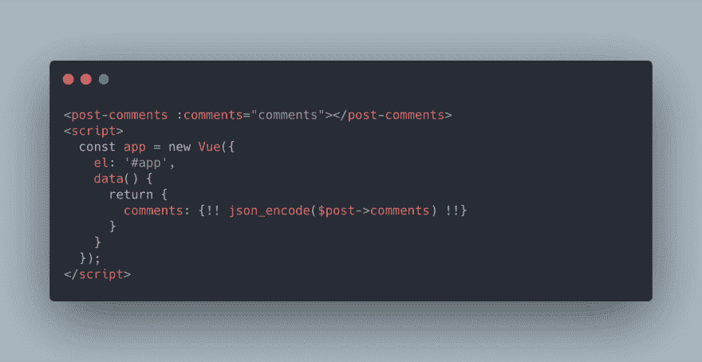
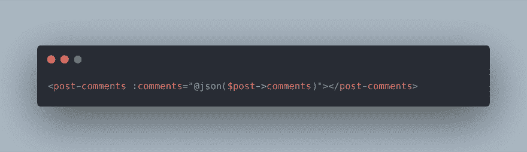
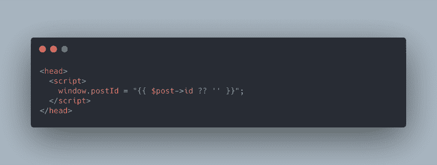
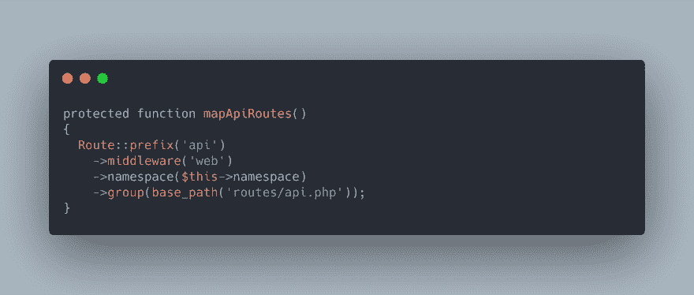
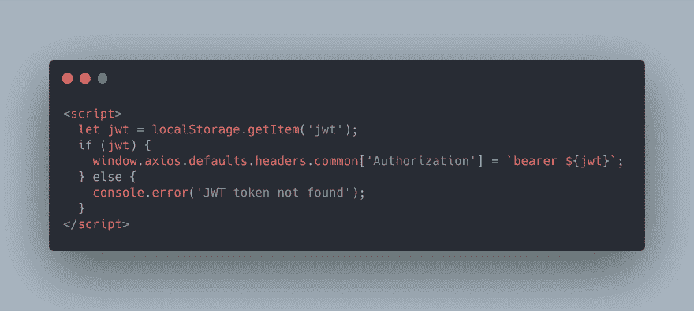

# 将数据从 Laravel 传递到 Vue 的四种方法

> 原文：<https://dev.to/aschmelyun/four-ways-to-pass-data-from-laravel-to-vue-5d8m>

在过去的两到三年里，我一直在从事同时使用 Vue 和 Laravel 的项目，在每个项目开发的开始阶段，我必须问自己“我如何将我的数据从 Laravel 传递到 Vue？”。这既适用于 Vue 前端组件与刀片模板紧密耦合的应用程序，也适用于完全独立于 Laravel 后端运行的单页面应用程序。

这里有四种不同的方法让你的数据从一个到另一个。

## 直接回显到数据对象或组件属性中

[](https://res.cloudinary.com/practicaldev/image/fetch/s--VAg3GPNO--/c_limit%2Cf_auto%2Cfl_progressive%2Cq_auto%2Cw_880/https://miro.medium.com/max/3168/1%2AQHVRtz9BhdGV-it6ihxa4g.png)

*   **亲:**简单明了
*   **缺点:**必须与嵌入刀片式服务器模板的 Vue 应用一起使用

可以说是将数据从 Laravel 应用程序转移到 Vue 前端的最简单的方法。使用上面的任何一种方法，您都可以回显 JSON 编码的数据，供您的应用程序或其组件拾取。

然而，最大的缺点是可扩展性。您的 JavaScript 将需要直接在模板文件中公开，以便引擎可以呈现您的数据。如果您使用 Vue 为 Laravel 站点的页面或区域添加一些基本的交互性，这应该不是问题，但是您很容易在试图将数据强制打包成脚本时碰壁。

[](https://res.cloudinary.com/practicaldev/image/fetch/s--7T-nj_qr--/c_limit%2Cf_auto%2Cfl_progressive%2Cq_auto%2Cw_880/https://miro.medium.com/max/3168/1%2AuVPbEcpxdiFt98sAugu8ZQ.png)

使用定制组件和 Laravel 的`json` blade 指令确实可以让你轻松地将数据移入 props。这种方法允许您划分 Vue 代码，将您的脚本与 webpack 或 mix 捆绑在一起，同时仍然能够将数据直接注入其中。

## 注入项目作为全局窗口属性

[](https://res.cloudinary.com/practicaldev/image/fetch/s--BsqN25pL--/c_limit%2Cf_auto%2Cfl_progressive%2Cq_auto%2Cw_880/https://miro.medium.com/max/3168/1%2AB20k8KbgdUBlIMIbJZu-lA.png)

*   **Pro:** 在整个 Vue 应用程序和任何其他脚本中全球可用
*   **缺点:**可能会很混乱，通常不推荐用于大型数据集

虽然这看起来有点不切实际，但是向 window 对象添加数据可以让您轻松地创建全局变量，这些变量可以从应用程序上使用的任何其他脚本或组件中访问。在过去，我使用它作为一种快速和肮脏的方法来存储和访问 API 基本 URL、公钥、特定的模型 id 和各种我需要在整个前端使用的其他小数据项。

不过，使用这种方法有一点需要注意，这就是如何访问 Vue 组件内部的数据。在你的模板内部，你不能使用类似下面的东西，因为 Vue 假设你试图访问的窗口对象将位于同一个组件内部:

```
// won't work
<template>
    <div v-if="window.showSecretWindow">
        <h1>This is a secret window, don't tell anyone!</h1>
    </div>
</template> 
```

相反，您需要使用一个计算方法来返回值:

```
// will work
<template>
    <div v-if="showSecretWindow">
        <h1>This is a secret window, don't tell anyone!</h1>
    </div>
</template>
<script>
    export default {
        computed: {
            showSecretWindow() {
                return window.showSecretWindow;
            }
        }
    }
</script> 
```

如果这种方法的用例是较小的字符串或数值，并且使用 Laravel 的 mix 来编译您的资产，事情实际上会变得非常简单。您可以使用 process.env 对象在 JavaScript 中引用来自`.env`文件的值。例如，如果我的环境变量文件中有`API_DOMAIN=example.com`，我可以在我的 Vue 组件(或者用 mix 编译的其他 JavaScript)中使用`process.env.API_DOMAIN`来访问这个值。

## 使用带有 Laravel 的 web 中间件和 CSRF 令牌的 API

[](https://res.cloudinary.com/practicaldev/image/fetch/s--MgPeyg-1--/c_limit%2Cf_auto%2Cfl_progressive%2Cq_auto%2Cw_880/https://miro.medium.com/max/3168/1%2ALrpglXhYd0XxvhamKram6A.png)

*   **Pro:** 易于上手，非常适合单页应用
*   **缺点:**要求你的前端由一个刀片模板渲染

对我来说，这个解决方案是开始进入 Vue 前端+ Laravel 后端世界的最直接的方式。Laravel 自带了两个不同的路径文件，`web.php`和`api.php`。这些都是通过你的应用程序的**提供者**目录中的`RouteServiceProvider.php`文件获取和映射的。默认情况下，web 组的中间件设置为 web，api 组的中间件设置为 api。

追溯到`app/Http/Kernel.php`,您会注意到在第 30 行附近，有两个组映射在一个数组中，web 组包含会话、cookie 加密和 CSRF 令牌验证等内容。同时，api 组只有一个基本的节流和一些绑定。如果您的目标只是通过一个基本的、轻量级的 api 将信息拉入 Vue，不需要认证或 post 请求，那么您可以就此打住。否则，只需一个简单的修改就能确保在几秒钟内完全兼容 Vue。

回到`RouteServiceProvider`，将`mapApiRoutes`方法中的 **api** 中间件换成 **web** 。我们为什么要这样做，它有什么作用？它使我们通过 api 获取的路由也包含我们的应用程序的常规 web 路由通常会使用的任何会话变量和令牌。当使用 axios 或另一个异步 JavaScript http 客户端调用这些函数时，我们能够在后端使用 Auth::user()和其他验证技术，而这是默认 api 无法做到的。

这个方法唯一的警告是你必须使用 Laravel 和一个刀片模板来渲染你的前端。这样，框架可以将必要的会话令牌和变量注入到请求中。

## 通过 JWT 认证使用 API 调用

[](https://res.cloudinary.com/practicaldev/image/fetch/s--SUrChdaQ--/c_limit%2Cf_auto%2Cfl_progressive%2Cq_auto%2Cw_880/https://miro.medium.com/max/3168/1%2AcKu2RCewRG-rjdrSUWDsLQ.png)

*   **Pro:** 最安全和分离的选项
*   **缺点:**需要安装和配置第三方软件包

okens 是一种安全、易于使用的方法，可以锁定对 API 端点的访问，使用 Tymon 的 jwt-auth 包可以使向新的或现有的 Laravel 应用程序添加功能变得非常容易。

在您的 API 上安装和配置该功能需要几个简短的步骤:

1.  从你的应用根目录，运行`composer require tymon/jwt-auth`。在撰写本文时，目前正处于过渡期，因此您可能需要指定版本(例如 1.0.0-rc.5)

2.  如果您使用的是 Laravel 5.4 或更低版本，请在 config/app.php 的 providers 数组中添加行`Tymon\JWTAuth\Providers\LaravelServiceProvider::class`

3.  通过运行`php artisan vendor:publish`并选择 jwt-auth 包来发布配置文件

4.  运行`php artisan jwt:secret`以生成签名应用令牌所需的密钥

完成之后，您需要指定应用程序中的哪些路由将受到 JWTs 的保护和验证。您可以通过使用内置的 api auth 中间件来实现这一点，或者使用自己的中间件在发送的请求中寻找令牌。在您的 API 的登录方法中，您将使用与默认 Laravel 应用程序相同的`auth()->attempt`方法，除了从它返回的将是您应该传回的 JSON Web 令牌。

在那里，您的 Vue 应用程序应该存储该令牌(在 LocalStorage 或 Vuex store 中)，并将其作为授权头添加到每个需要它的传出请求中。回到您的 Laravel 应用程序，您可以使用他们的令牌来引用发出请求的特定用户，传回应该只显示给他们的数据。

如果你想要一个更深入的教程来解释如何将 jwt 安装和集成到你的 Laravel API 中，我已经[发布了一个视频](https://www.youtube.com/watch?v=6eX9Pj-GhZs)并且[写了一个关于这个的帖子](https://medium.com/@aschmelyun/securing-your-laravel-api-with-jwts-in-10-minutes-or-less-9622541244f6)！

暂时就这样吧！如果您对上述内容有任何问题或评论，或者只想查看有用的提示和每日行业新闻，请随时在 [Twitter](https://twitter.com/aschmelyun) 上关注我！此外，如果你正在寻找一个**超级简单的错误和日志监控服务，专门针对 Laravel 应用**，我已经建立了 [Larahawk](https://larahawk.com) 。它目前处于私人测试阶段，将于 10 月推出，价格为 5 美元/应用/月。