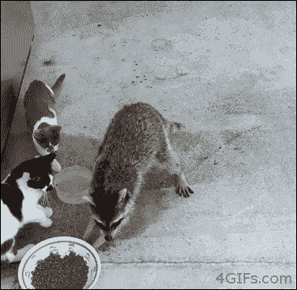

# 我是一个代码窃贼(为什么你也应该是一个)

> 原文:[https://dev . to/redpandaman 7/I-m-a-code-thief-and-why-you-should-one-too-34eg](https://dev.to/redpandaman7/i-m-a-code-thief-and-why-you-should-be-one-too-34eg)

我是个密码窃贼。

 
是啊，我说对了。

我应该澄清，这并不意味着我什么都不做就到处复制粘贴，然后把我的名字放在上面。然而，这确实意味着我在你的 github 仓库里，拿走了我能找到的所有东西。

[T2】](https://i.giphy.com/media/3o85xKvzHaEr5ihOes/giphy.gif)

## **解说**

让我解释一下。艺术界有一句名言，也许你以前听过；好的艺术家文案；伟大的艺术家偷窃。我喜欢这句话，作为一名年轻的艺术学校学生，在日本的一所技术学校学习如何画漫画；这句话让我成为了同年级的尖子生之一。

现在，你可能在想。这家伙是只老鼠！他只是偷了别人的东西，然后对所有的赞美手舞足蹈。

你完全正确！

[T2】](https://i.giphy.com/media/6s1hcLp1VQzTSRu7Jl/giphy.gif)

## **略跑题历史时间**

你知道，在艺术学校，我会在早上 4:30 醒来，为一天做准备。上课前，我会花上几个小时看一幅某个人画的吸引我的画，然后我会拿出笔记本，一行一行地复制每一个细节。9:00 我会去学校和大家一起学习，直到 15:30 左右，然后我会回去偷东西。

我会呆在学校的自习室，直到学校 21:00 关门，然后我才会去吃晚饭，然后回家。我一回到家，我做了什么？你猜对了！我继续偷东西，一直偷到午夜过后，第二天上床睡觉时再开始整个过程。

[T2】](https://i.giphy.com/media/iNqNlmBrb7iQ4gsmVo/giphy.gif)

现在你可能会问自己；这家伙到底在说什么？这和编程有什么关系？你就等着瞧吧，因为我们就要到了。

## **法**

我是这样偷艺术品的:我翻遍了所有能找到的东西，直到找到我喜欢的东西。也许是有人画眼睛的方式，也许是给头发涂墨水的方式，也许是女孩的一种鼻子，我不禁觉得很可爱。

[T2】](https://i.giphy.com/media/3ndAvMC5LFPNMCzq7m/giphy.gif)

不管是什么，我找到了它，然后复制了整张画，每一行。我甚至可能会找到更多同一位艺术家的画，我也会偷那些图像，只是为了更好的衡量。在此之后，我将在我的一幅原画上尝试一下。不完全正确，找到另一个图像，复制它，重复。直到我可以在我自己的画中使用它，它看起来完全是我想要的样子。那东西现在是我的了。我光明正大地偷了它！

这样做了一年后，我为自己偷了一种完整的、独一无二的、只属于我自己的艺术风格。

[T2】](https://i.giphy.com/media/l44QjgeQ5ium91n9K/giphy.gif)

## **所以你想做贼**

我如何把它翻译成代码？嗯，我什么都找遍了；网站、知识库、文章、密码笔，凡是你能想到的，我都在挖掘。假设我找到了一个我喜欢的按钮动画。你最好相信我会偷它。我将一个字符一个字符地复制代码。

那我就不找我的一个项目试试看。一个错误会出现，它总是这样。我犯了一些错误，所以我再次检查代码并修复它，在我的下一个项目中，我再次尝试，这次它工作了。那个按钮动画现在是我的了。在我用各种不同的动画和技术重复这个过程，并把它们粘在一起之后，你还是一无所知。

[T2】](https://i.giphy.com/media/10xUbIKC888vYY/giphy.gif)

## **我的建议**

四处看看，找到你喜欢的东西。拿去用吧。找些别的东西，拿着它，用它。把这些东西放在一起，向周围的人展示。获取他人的意见，然后窃取这些想法并将其添加到你的技能中。这样做，你会成为一个更好的开发者。

## **结论**

在我的生活中，我遇到过许多人，他们认为你需要 100%的原创，自己想出所有的事情，然后等待灵感的到来。然而，我还没有遇到一个人有这样的想法，并能够以追求他们的手艺为生。甚至斯蒂芬·金也开始通过混搭他最喜欢的怪物电影的梗概来写故事。帮你自己一个忙，做一个小偷，偷你能偷的所有东西，不放过任何一个地方。你会为此感谢自己的。

[T2】](https://i.giphy.com/media/g9582DNuQppxC/giphy.gif)