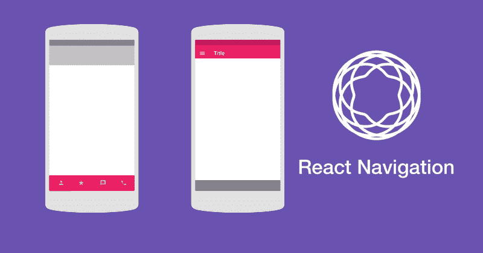
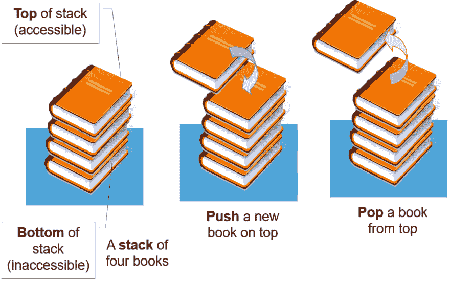

# 使用 React 导航在 React Native 中导航

> 原文：<https://dev.to/kapilgorve/navigation-in-react-native-using-react-navigation-26ag>

[](https://res.cloudinary.com/practicaldev/image/fetch/s--bLWH238A--/c_limit%2Cf_auto%2Cfl_progressive%2Cq_auto%2Cw_880/https://kapilgorve.s3.ap-south-1.amazonaws.com/blog/covers/react-navigation-cover.png)

当你开发一个移动应用程序时，它可能会包含多个用户可以来回切换的屏幕。允许用户在不同屏幕之间切换是导航器的工作，本指南将详细介绍。我们将首先了解导航是如何工作的，然后在 React 本机应用程序中设置导航。我们开始吧。

## 概念

应用程序中的导航工作起来就像一个`Stack`。考虑一个*栈*，它为你提供将屏幕推入或弹出的功能。这正是正在发生的事情。当你导航到一个新的屏幕时，你实际上是将那个屏幕`push`到*堆栈*中。这意味着每当你进入一个新的屏幕，它就会出现在最上面。*堆栈*保持你访问屏幕的顺序，并提供平滑过渡。当你返回时，你实际上是从栈顶*开始*的`popping out`屏幕。你可以用下面一堆书的例子来想象这一点:

[](https://res.cloudinary.com/practicaldev/image/fetch/s--CihVhSVc--/c_limit%2Cf_auto%2Cfl_progressive%2Cq_auto%2Cw_880/https://visualgo.net/img/stack_illustration.png)

我们将需要一个导航器来执行这些操作，而 [react - navigation](https://reactnavigation.org/) 库为 Android 和 iOS 提供了一个易于使用的导航解决方案。让我们在 React 本地应用中设置`react-navigation`。

## React 导航设置

我假设您已经创建并运行了 React Native 或 Expo 应用程序。让我们快速浏览一下安装步骤。

### 第一步。在 react 本地项目中安装 react-navigation 包。

```
yarn add react-navigation 
```

或者用 npm

```
 npm install react-navigation 
```

### 第二步。安装 react native-gesture-handler 和 react-native-reanimated。

如果你使用 Expo，为了确保你得到兼容版本的库，你应该运行:

```
expo install react-native-gesture-handler react-native-reanimated 
```

否则就直接用 yarn 或者 NPM:

```
yarn add react-native-gesture-handler react-native-reanimated 
```

或者用 npm

```
npm install react-native-gesture-handler react-native-reanimated 
```

### 第三步。链接库

接下来，如果你没有使用 Expo 管理的工作流，那么你需要链接这些库。这些步骤取决于您的 React 本机版本:

React Native 0.60 及更高版本在 React Native 的较新版本上，链接是自动的。在 iOS 上，要完成链接，请确保安装了 Cocoapods。然后运行:

```
cd ios
pod install
cd .. 
```

在 Android 上，它应该不需要更多的步骤。但是如果你在构建应用程序的过程中得到关于 Android 支持库的错误，你需要安装和配置`jetifier`。

React Native 0.59 及更低版本如果您使用的是较旧的 React Native 版本，则需要手动链接依赖项。为此，运行:

```
react-native link react-native-reanimated
react-native link react-native-gesture-handler 
```

为了完成 Android 版`react-native-gesture-handler`的安装，请务必对`MainActivity.java` :
进行必要的修改

```
package com.reactnavigation.example; 
```

导入 com . Facebook . react . react activity；//添加这些 lines import com . Facebook . react . react activity delegate；导入 com . Facebook . react . react root view；导入 com . SW mansion . gesture handler . react . rngesturehandlerenablerootview；

公共类 MainActivity 扩展 ReactActivity {

@ override protected String getMainComponentName(){ return " Example "；}

//Add this function @ override protected react activity delegate createractivitydelegate(){ return new react activity delegate(this，getMainComponentName()){ @ override protected react root view createRootView(){ return new rngesturehandlerenablerootview(main activity . this)；}};}}

```
Finally, run `react-native run-android` or `react-native run-ios` to launch the app on your device / simulator.

## Creating a Router and Navigating between screens
* Creating a router is pretty easy, we will create a file `Router.js` and import our screens in it. 
```

javascript
//假设你有两个屏幕
import logins screen from’。/log in screen '；
从'导入主屏幕。/home screen '；

```
 - 

Now, we will create _Stack Navigator_ by calling `createStackNavigator` and wrap it with `createAppContainer`. 
```

从'导入 LoginScreen。/log in screen '；从'导入主屏幕。/home screen '；
//从 react-navigation 导入
从‘react-navigation’导入{createStackNavigator，createAppContainer }；

```
 //creating stack navigatorconst AuthStackNavigator = createStackNavigator({Login: {screen: LoginScreen},Home: {screen: HomeScreen},});

//wrap the root navigator with createAppContainerconst Router = createAppContainer(AuthStackNavigator);

//export to the root file of your appexport default Router; 
```

*   现在我们将从登录屏幕导航到主屏幕。导航器中的每个屏幕组件都接收一组*道具*，我们可以用它们来执行导航。

```
class LoginScreen extends React.Component {

  render() {
    return (
      <View style={{ flex: 1, alignItems: 'center', justifyContent: 'center' }}>
        <Text>Login Screen</Text>
        <Button
          title="Go to Home"
          onPress={() => this.props.navigation.navigate('Home')}
        />
      </View>
    );
  }
}
//calling navigation.navigate on props with screen name that we set earlier 
```

返回到一个屏幕:当可以从活动屏幕返回时(当有多个屏幕时)，stack navigator 提供的标题将自动包含一个 back 按钮。有时，您希望能够以编程方式触发这种行为，为此，您可以使用`this.props.navigation.goBack()`；。

```
class HomeScreen extends React.Component {

render() {
return (
  <View style={{ flex: 1, alignItems: 'center', justifyContent: 'center' }}>
    <Text>Home Screen</Text>
    <Button
      title="Go back to Login"
      onPress={() => this.props.navigation.navigate('Login')}
    />
  </View>
);
}
} 
```

*   返回多个屏幕:假设您的*堆栈*中有多个屏幕，并且您想要取消所有这些屏幕以返回到第一个屏幕。在这种情况下，可以使用`navigation.popToTop()`。

## 航海家的种类

`react-navigation`提供了多个导航器。这些是:

*   createstackanavigator
*   createSwitchNavigator
*   createBottomTabNavigator
*   createMaterialTopTabNavigator
*   createDrawerNavigator

我们将快速浏览每一项，并查看一个示例。

### 1。createStackNavigator

堆栈导航器允许像我们在上面已经看到的*堆栈*一样排列屏幕。您可以添加或移除屏幕，就像在堆栈中推入或弹出屏幕一样。

### 2。createSwitchNavigator

SwitchNavigator 一次只显示一个屏幕，不保留任何堆栈。当您导航到新屏幕时，它会重置屏幕，因此没有返回的功能。在进行身份验证流程时，这种行为非常有用。我们之前写的例子可以更新为:

```
//creating SwitchNavigator in Auth flow ensures that the user can't go back after logging in.
const AuthStackNavigator = createSwitchNavigator({
  Login: {screen: LoginScreen},
  Home: {screen: HomeScreen},
});

const Router = createAppContainer(AuthStackNavigator);

export default Router; 
```

### 3。createBottomTabNavigator

你可能见过很多基于标签导航的应用。选项卡可以在屏幕的底部或顶部，让您在不同的屏幕之间切换。底部选项卡导航器是屏幕底部的一个简单的选项卡栏。用法:

```
import React from 'react';
import { Text, View } from 'react-native';
import { createBottomTabNavigator, createAppContainer } from 'react-navigation';

class HomeScreen extends React.Component {
  render() {
    return (
      <View style={{ flex: 1, justifyContent: 'center', alignItems: 'center' }}>
        <Text>Home!</Text>
      </View>
    );
  }
}

class SettingsScreen extends React.Component {
  render() {
    return (
      <View style={{ flex: 1, justifyContent: 'center', alignItems: 'center' }}>
        <Text>Settings!</Text>
      </View>
    );
  }
}

const TabNavigator = createBottomTabNavigator({
  Home: HomeScreen,
  Settings: SettingsScreen,
});

export default createAppContainer(TabNavigator); 
```

### [t1【4 .创建材料表导航器】T2](#4-creatematerialtoptabnavigator)

屏幕顶部的材质设计主题标签栏，可让您通过点击路线或水平滑动在不同路线之间切换。用法:

```
createMaterialTopTabNavigator(RouteConfigs, TabNavigatorConfig); 
```

### 5。createdDrawerNavigator

抽屉导航器允许您向用户显示导航菜单。您可以向右或向左滑动来打开或关闭抽屉，并在不同屏幕之间切换。它提供了一个默认的标题，该标题对于 Drawer Navigator 中的所有屏幕都是通用的。前往此[链接](https://reactnavigation.org/docs/en/drawer-based-navigation.html)阅读更多内容。例子:

```
class HomeScreen extends React.Component {
  render() {
    return (
      <View style={{ flex: 1, justifyContent: 'center', alignItems: 'center' }}>
        <TouchableOpacity onPress={this.props.navigation.openDrawer}>
          <Text>Open Drawer</Text>
        </TouchableOpacity>
        <Text style={{ fontWeight: 'bold', marginTop: 20 }}>Home</Text>
      </View>
    );
  }
}

class SettingsScreen extends React.Component {
  render() {
    return (
      <View style={{ flex: 1, justifyContent: 'center', alignItems: 'center' }}>
        <TouchableOpacity onPress={this.props.navigation.openDrawer}>
          <Text>Open Drawer</Text>
        </TouchableOpacity>
        <Text style={{ fontWeight: 'bold', marginTop: 20 }}>Settings</Text>
      </View>
    );
  }
}

const DrawerNavigator = createDrawerNavigator(
  {
    Home: HomeScreen,
    Settings: SettingsScreen,
  },
  {
    drawerBackgroundColor: 'rgba(255,255,255,.9)',
    contentOptions: {
      activeTintColor: '#fff',
      activeBackgroundColor: '#6b52ae',
    },
  }
);

export default createAppContainer(DrawerNavigator); 
```

我们已经在 React Native 中介绍了导航的所有基础知识。可以通过[官网](https://reactnavigation.org/docs/en/api-reference.html)了解所有可用的路线配置属性。我希望你在学习本地导航的过程中感到愉快。

这篇文章最初发表于[https://www.jskap.com/blog/react-navigation/](https://www.jskap.com/blog/react-navigation/)

👋嗨！我是卡皮尔。我总是喋喋不休地谈论建造东西，分享我的知识，自由职业。来 https://twitter.com/kapilgorve 和我打招呼吧