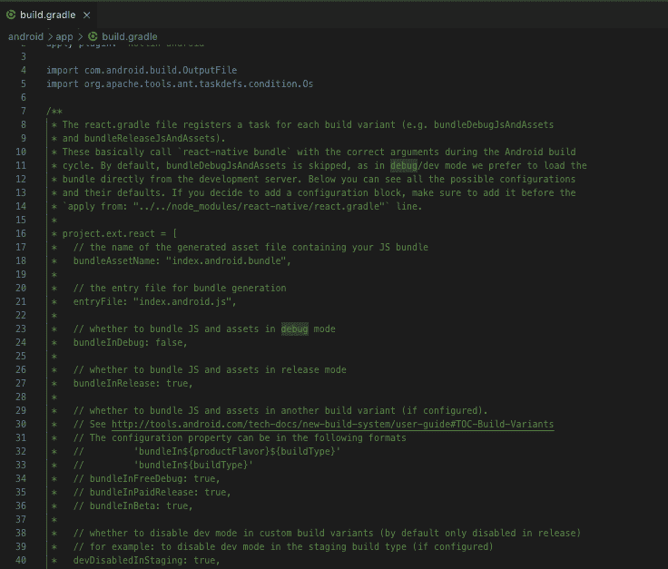
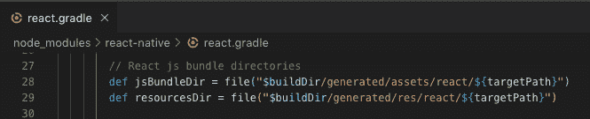

# React Native: Android 调试 APK，无需开发服务器

> 原文：<https://dev.to/kelsiusdeg/react-native-android-debug-apk-without-development-server-2l80>

默认情况下，React 本机调试版本需要开发服务器来运行，因为服务器负责提供 JS 包和调试模式下的资产。然而，如果您发现自己需要一个可以在没有开发服务器的情况下运行的调试 APK，您可以将调试包与生成的 APK 一起手动打包。

有两种方法可以实现这一点:

## 盆内调试

在你的 **app/build.gradle** 文件中，你会看到一个很大的注释块，解释了你可以在 gradle 文件中的`project.ext.react`地图中设置哪些设置:

[](https://res.cloudinary.com/practicaldev/image/fetch/s--pCn9H-nn--/c_limit%2Cf_auto%2Cfl_progressive%2Cq_auto%2Cw_880/https://thepracticaldev.s3.amazonaws.com/i/aogwf9wnt9b1ib4mynox.png)

我们感兴趣的是`bundleInDebug: true`。
在 gradle 配置文件中查找`project.ext.react`映射(应该就在注释掉的块之后),并将`bundleInDebug: true`条目添加到映射:

```
project.ext.react = [
    ...

    //ADD THIS LINE 
    bundleInDebug: true

    ...
] 
```

这告诉 gradle 实际上捆绑 JS 代码和资产，并将这些文件打包到 APK 中，而不是从 dev 服务器提供它们。

如果您尝试这样做，您会注意到，虽然您的应用程序现在在没有开发服务器的情况下运行，但它仍然会显示黄色框警告消息。这是因为它仍然是一个开发版本。如果您想使它成为一个没有警告并且有一个缩小的 JS 包的生产版本，那么将`devDisabledInDebug: true`条目添加到`project.ext.react`映射中。

```
project.ext.react = [
    ...

    bundleInDebug: true

    //ADD THIS LINE
    devDisabledInDebug: true

    ...
] 
```

**注意:** *调试* vs *发布*指的是 Android 构建类型，如 gradle 中所指定的，而*开发* vs *生产*影响 JS 包的行为。
T11】

当您现在使用`./gradlew assembleDebug`或通过运行`react-native
run-android`创建一个 APK 时，它将是一个调试 APK，捆绑了缩小的 JS 包和所有资产，能够在没有开发服务器的情况下运行。

## react-原生束

如果出于某种原因，您想要或者需要手动调用`react-native bundle`命令来捆绑您的 JS 和资产，那么构建独立于开发服务器的 APK 的方法如下:

`react-native bundle --dev false --platform android --entry-file index.js --bundle-output ./android/app/build/generated/assets/react/debug/index.android.bundle --assets-dest ./android/app/build/res/react/debug`

让我们来看看那里发生了什么:

`bundle`命令只是用来捆绑 JS 和资产的命令。

`--dev false`告诉它不要使用开发模式捆绑它，即禁用警告并缩小捆绑包。这对应于上面的`devDisabledInDebug: true`设置。

`--platform android`不言自明。需要设置，因为默认为“ios”。

`--entry-file index.js`也是不言自明的。如果你的入口文件有不同的名字，那么你当然应该把名字写在那里。

有趣的地方就在这里。我们如何知道包输出的路径？为了让 gradle 能够找到这个包，它必须位于 gradle 期望的路径中，并且以 gradle 期望的方式命名。
这些信息可以在**node _ modules/react-native/react . gradle**文件中找到。

找到变量`jsBundleDir`和`resourcesDir`被定义和赋值的那一行:

[](https://res.cloudinary.com/practicaldev/image/fetch/s--Z5a4d7Ly--/c_limit%2Cf_auto%2Cfl_progressive%2Cq_auto%2Cw_880/https://thepracticaldev.s3.amazonaws.com/i/c8id51zwpontpmqx216p.png)

`buildDir`是您项目中的 **android/app/build 目录**，而`targetPath`是 *debug* 或 *release* ，这取决于您构建的构建类型。

gradle 希望通过这些途径找到 JS 包和要与 APK 打包在一起的资产。

如果出于某种原因，您想要覆盖这些位置(或任何其他构建设置)，请不要直接在 **react.gradle** 文件中更改它们，而是在 project.ext.react 映射内的应用程序级 build.gradle 文件中进行更改。