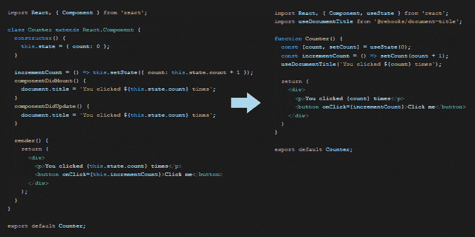

# React 钩子学习指南

> 原文:[https://dev . to/http junkie/a-guide-to-learning-react-hooks-58a 0](https://dev.to/httpjunkie/a-guide-to-learning-react-hooks-58a0)

本指南将提供 React、状态管理的历史背景，并作为学习 React 内置钩子的详尽指南。继续学习，在我们学习从本地组件状态和效果到更高级的挂钩(如管理数据列表等)的基础知识时，可以在任何时候分叉我的代码。让我们来探索一下 React 钩子的基本原理！

## 你将学到什么

在本文中，您将学习如何使用 React 钩子来处理状态和效果、上下文、reducers 和自定义钩子。

## 关于钩子你应该知道什么

Hooks 最初是在 2018 年 10 月底作为测试版发布的，已经在脸书的生产中使用了一个多月，确保社区不会面临重大的错误和问题。为了避免破坏向后兼容性的大规模重写，他们使用了一种渐进的迁移和采用策略，允许新的 API 和现有的 API 和模式彼此共存。

钩子是 React 的一个附加变化，意味着它们是选择性加入和向后兼容的，而且它们在发布之前已经通过了 GitHub 上的 RFC 过程。如果您想使用它们，只需安装 React 的最新版本并逐个导入它们。

Hooks 模式提供了用标准的基于类的语法编写组件的替代方法，相反，它允许您在功能组件中使用状态和生命周期方法，而以前这些方法只在类中可用。我们现在可以通过 useState、useEffect useReducer 和 useContext 来处理 React 本地状态、效果、缩减器和上下文。

附加的钩子包括:useReducer、useCallback、useMemo、useRef、useImperativeHandle、useLayoutEffect 和 useDebugValue。这些 API 可以在 React Hooks API 参考中阅读！

## 那么我们如何使用钩子呢

描述钩子最简单的方法是展示一个需要访问状态和生命周期方法的类组件的并行例子，以及另一个我们用一个功能组件实现相同功能的例子。

下面我提供了一个类似于 ReactJS 文档中的工作示例，但是您可以接触和使用它，在我们学习的每个阶段都可以使用 StackBlitz 演示。所以我们不要再说了，开始学习 React 钩子吧。

## 使用钩子的好处

钩子对开发者来说有很多好处，它们会让我们编写组件的方式变得更好。他们已经帮助我们编写了清晰简洁的代码——就像我们节食减肥，现在我们看起来更好，感觉脚趾更轻了。它突出了我们的下颌轮廓，让我们感觉更好。看看 React Hooks 为别人做过什么就知道了！

[T2】](https://res.cloudinary.com/practicaldev/image/fetch/s--t-G9iDrh--/c_limit%2Cf_auto%2Cfl_progressive%2Cq_auto%2Cw_880/https://imgur.com/eh3Fme6.jpg)

玩笑归玩笑，钩子确实能修剪脂肪。为了演示，我们将检查一个规范的“文档标题效果”的类版本，看看我们过去如何编写这样的东西之间的差异。

下面的并排显示了我们的组件如何减轻了一些重量。可读性也随着我们的改变而提高。将现有代码切换到钩子上会对您编写的代码量及其可读性产生很大的影响。请记住，Hooks 是向后兼容的，可以与你的旧的基于类的组件共存，这意味着没有必要重写你的代码库。在这里查看这些代码的 StackBlitz 演示:之前的[和](https://stackblitz.com/edit/react-state-hook-04?file=Counter.js)之后的

[T2】](https://res.cloudinary.com/practicaldev/image/fetch/s--s_xmXxlD--/c_limit%2Cf_auto%2Cfl_progressive%2Cq_66%2Cw_880/https://imgur.com/WVji79L.gif)

我知道在 dev.to 上已经有很多关于 Hooks 的讨论和文章，这就是为什么我创建了一个详尽的完整指南，你可以用它来一步一步地学习。我有上面的例子和关于[状态和效果](https://www.telerik.com/kendo-react-ui/react-hooks-guide/#toc-hooks-for-state-and-effects)、[上下文](https://www.telerik.com/kendo-react-ui/react-hooks-guide/#toc-hooks-for-context)、[减速器](https://www.telerik.com/kendo-react-ui/react-hooks-guide/#toc-hooks-for-reducers)、[自定义钩子](https://www.telerik.com/kendo-react-ui/react-hooks-guide/#toc-custom-react-hooks)和[管理组件](https://www.telerik.com/kendo-react-ui/react-hooks-guide/#toc-managing-control-state-of-a-kendoreact-component)的控制状态的章节。

这些都在一个易于阅读的资源中，你可以从我们刚刚离开的地方继续阅读:[学习 React Hooks 的指南](https://www.telerik.com/kendo-react-ui/react-hooks-guide/#toc-hooks-for-state-and-effects)。

你可以在[Telerik.com/blogs](http://Telerik.com/blogs/author/eric-bishard)网站上找到我写的类似的文章和其他文章！