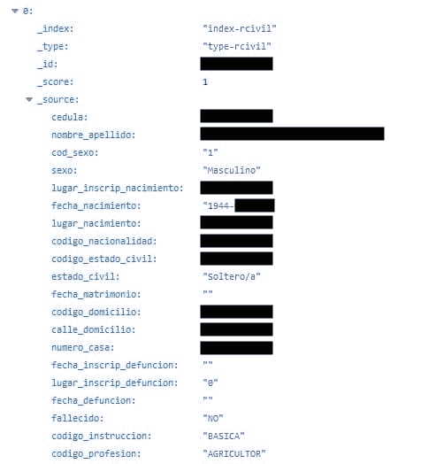
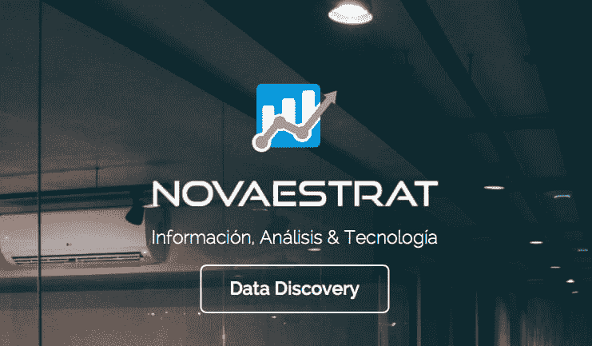

# 厄瓜多尔的大规模数据泄漏。

> [https://dev . to/danielverec/filtering-massive-de-data-en-Ecuador-o8n](https://dev.to/danielveraec/filtracion-masiva-de-datos-en-ecuador-o8n)

最近几天，有消息称，大多数厄瓜多尔人的个人数据，包括近 700 万儿童的信息，已完全过滤到因特网上。大约有 2 000 万人(18 GB 的数据)。

-我知道-我...。厄瓜多尔有 1600 万人口。剩下的在哪里出来的？
因为数据库如此完备，还包括曾居住过厄瓜多尔的游客，甚至包括死人。

该数据库目前处于离线状态，已被[eccert](https://www.ecucert.gob.ec/)(*厄瓜多尔计算机事件响应中心*)部分[电信保护和控制机构](http://www.arcotel.gob.ec/)注销。

他们注销了设在佛罗里达州迈阿密的一家厄瓜多尔公司的数据库。他们去了公司在厄瓜多尔的办事处，拿走了他们拥有的所有服务器和数据。

事实上，他们去了该公司首席执行官的家里，并逮捕了该公司目前正在调查的法律代表，因为他过滤了全国各地的数据。

> 【Maria Paula romo】@ mariapauloromo
> 
> 【搜查是根据法官的命令进行的，作为进行调查的一部分，【21 检察官】【2019 年 9 月 1 日:20 AM - 17 日】

## 数据被过滤了吗？

据公布发现的[VPN tor](https://www.vpnmentor.com/blog/report-ecuador-leak/)的门户网站透露，过滤出的个人信息为:

*   全名(名字、中间名、姓氏)
*   性别问题
*   出生日期
*   出生地点
*   住家地址
*   电子邮件
*   家庭、工作和手机号码
*   国家民事
*   结婚日期(如适用)
*   死亡日期(_ s)
*   教育程度

但那还不是最糟的。假如你在[社保局](BIESS(https://www.biess.fin.ec/inicio))银行有账户的话，也是你账户的状态，你在银行里有多少钱，你借了多少钱，你有什么样的贷款。

该数据库还包括你的亲属(父母、兄弟、表兄弟姐妹)的关系，以至于可以利用这些数据重建厄瓜多尔全体人口的家族和家族结构。

进入数据库时，可以看出它基本上是一个公开的搜索系统，采用 CSV 和 Json 格式，具有多种索引(数据库)。家庭、多企业及其运动数据库。

并进入数据类型，发现了 Json 风格的格式，如: 

甚至可以看到儿童的数据(将近 700 万)。他们有截至 2019 年 3 月的最新数据，包括新生儿。

## 是起源吗？

这是有史以来最引人注目的数据泄漏之一，是由于一个名为弹性搜索的系统配置不良所致。

elasticsearch 是一种开源软件，它允许您为任何东西创建非常深且非常有趣的搜索引擎。
当被有能力的人使用时，可以完成不可思议的事情，是很好的工具。但是当一个无能的人使用它时，这些事情就会发生。

问题是:**一家私营公司是否可以接触到所有这些信息？**因为这是厄瓜多尔政府的官方数据。

可以归咎于 novaestrat，这是卷入这场丑闻的公司的名称。这家公司当然已经从互联网上消失了。

这家公司显然提供信息系统、技术分析、人员搜索、市场细分、数字营销。很明显，他们可以做一个惊人的数字营销-我...。如果他们有整个厄瓜多尔的数据库。他们什么都知道！

他们知道你有多少钱在银行如果他们有你的银行账户馀额。

## Lo que no se disute...

不仅要考虑已经发生的泄漏；而是因为只有一家私营公司拥有这些数据，我们从其中一家公司那里得知弹性搜索设置不当，而且因为它们愚蠢。

这不仅是 Novartis 的错，也是政府的错，是谁允许他们不受限制地获取他们所掌握的这种夸大的数据。

我们不必走得这么远，[【Sri】t1】的网页和你去地籍选项可以下载任何厄瓜多尔省份的整个基地，包括私人数据，而不需要侵入任何人。](https://www.sri.gob.ec/web/guest/catastros)

您可以在这里访问一个数据库，在该数据库中，您只需按人员姓名进行搜索，就可以知道您所在的公司、公司的状态、公司在哪里、何时启动、何时启动、何时结束、地址。

想象一个人想伤害你，想找你的地址-我...。你可以从那里得到它。

很多人认为这次泄密事件与朱利安阿桑奇的案子有关。但这只是一个偶然的例子，其根源不是黑客的恶意，而是各级无能者的愚蠢。从政府到私营部门的无能。

很明显，政府要怪公司，会有法律指控，监狱里的人，还有整个协议。

## 他们能用这些信息做些什么？

### Extorsiones。

他们可以打电话给他们，威胁他们，假装他们绑架了任何家庭成员(或假装他们绑架了他们的家人)。这在拉丁美洲很常见。甚至每天都可以看到有人用这种勒索手段记录电话的视频。

你可以说我不会有事的。但可能会发生在你身边的人，你的父母，叔叔，爷爷奶奶，他们没有那么多的技术知识，因为他们有这些数据。

### 身份盗窃

人们可能会假装是某人，如果他们已经有了这些数据，你的银行账户的安全问题可能会被侵犯，举个例子。

### 网络钓鱼

电子邮件和银行信息可能会利用假邮件模板发送邮件，欺骗人们提供他们的银行账户访问密钥。

### 密码

我们通常不太清楚我们在金融机构中处理的钥匙，而关于出生日期或子女姓名的信息可以推断出这些钥匙。

## 我们能做到吗？

显然，在数据方面没有什么是安全的，即使是政府也无法保护您的数据。现在要纠正严重的疏忽为时已晚。

但如果有什么我们能做的。我们可以更直接地要求在这方面采取行动。

去找代表你住的地方(技术上你投过票的地方)的议员。他们唯一的工作就是在法律上代表你，唯一的解决办法就是从法律上改变这一点。

他们只要继续认为这个问题是看不见的、无关紧要的，就会无所作为，继续为废话互相争斗。

查查他是谁联系你当地的议员。如果可能的话给你的办公室打电话-什么电话由秘书接听并不重要。打电话告诉他：

> 我很担心这家公司和这次泄漏的事我想知道我们会做些什么。

不到 5 分钟你就不会浪费太多时间了，你可以成功地把这个问题列入你国家的法律议程。

以其他方式解决？我不这么认为。作为拉丁人，我们不相信政治，但我们可以这样做，因为他们别无选择。
他们知道，在选举中，投票是有区别的。而且如果有人花时间打电话(我们通常不这样做是因为我们认为一切都是在社交媒体的评论点上解决的)，那是因为确实存在问题。

试试看，你会发现如果能实现改变。

###### 注:本邮件的大部分信息来自东方[视频](https://www.youtube.com/watch?v=dr5UJseFkUI)。我之所以重复这句话，是因为我认为它很有用，我想传达这个信息。