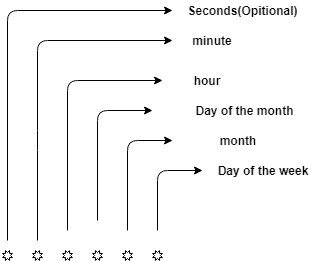

# 在 Node.js 中实现作业调度程序

> 原文:[https://dev . to/ganeshmani/implementing-job-schedulers-in-node-js-j2f](https://dev.to/ganeshmani/implementing-job-schedulers-in-node-js-j2f)

在本文中，我们将了解什么是作业调度器，以及如何在 nodejs 中实现作业调度器。在 Node.js 中实现作业调度程序

最近一篇关于 node.js 的文章

[node . js 开发者的 PM2](https://cloudnweb.dev/2019/09/pm2-for-node-js-developers/)

[使用 webRTC 和 Node.js 构建 P2P 视频聊天应用](https://cloudnweb.dev/2019/09/building-p2p-video-chat-application-using-webrtc-and-node-js/)

[用用例](https://cloudnweb.dev/2019/08/understanding-eventemitter-in-node-js-with-a-usecase/)理解 Node.js 中的 EventEmitter

想知道应用服务器如何在没有任何物理中断的情况下定期备份文件吗？这就是 Cron jobs 的用武之地。

Cron 作业定期安排一个作业来执行配置的操作。

cron 作业发挥重要作用的用例很少。他们是，

*   **删除日志文件** -应用程序生成大量日志。清除旧日志将节省大量服务器空间。这可以使用 cron 作业来完成。
*   **数据库备份** -数据库备份将应用从灾难中拯救出来。Cron job 将有助于做到这一点。
*   **应用程序逻辑**——我们可以使用 cron 作业在时间的基础上做一些应用程序逻辑。

### cron job 如何工作

我们将编写一个 cron 作业，将数据库中的旧记录归档到生产应用程序中。

首先，创建一个项目并安装以下依赖项，

```
npm init --yes
npm install express node-cron mongoose faker
```

*   **express**-nodejs 中的 web 服务器库
*   **node-cron**-nodejs 中的 cron 作业调度程序库
*   mongose-ORM for MongoDB

之后，创建一个名为 **Model.js** 的文件，并添加以下代码

```
const mongoose = require('mongoose');

const weatherSchema = new mongoose.Schema({
    minTemp : {
        type: Number
    },
    maxTemp : {
        type : Number
    },
    recordedDate : {
        type : Date
    },
    isArchived : {
        type : Boolean,
        default : false
    }
});

class Weather {

    static getRec(date) {
        return this.find({
            recordedDate : {
                '$lte' :new Date(date)
            }
        }).exec();
    }

    static insertBulkData(data){
        return this.insertMany(data);
    }

    static archiveData(date){

        return this.updateMany({
            recordedDate : {
                '$lte' :new Date(date)
            }
        },{
            $set : {
                isArchived : true
            }
        }).exec();
    }

    static getArchivedData(){
        return this.find({
            isArchived : true
        }).exec();
    }
}

weatherSchema.loadClass(Weather);

module.exports = mongoose.model('Weather',weatherSchema)
```

主要是， **Model.js** 为数据库中存储天气数据的 DB 表创建一个 mongoose 模式。

之后，创建一个名为 **scheduler.js** 的文件，添加 job scheduler 的代码。

```
cron.schedule("* * * * * *",() => {
    console.log("Running every minute");
})
```

cron schedule 按照提到的时间格式调度作业。

[T2】](https://res.cloudinary.com/practicaldev/image/fetch/s--ihV8Z2A_--/c_limit%2Cf_auto%2Cfl_progressive%2Cq_auto%2Cw_880/https://cloudnweb.dev/wp-content/uploads/2019/09/nodeschduler.png)

要了解更多关于 cron 作业格式的信息，有一个很棒的网站 [crontab-guru](https://crontab.guru/) 有详细的解释

将 mongoose 与 Express 连接，向数据库中插入一些虚拟数据。

```
const cron = require('node-cron');
const express = require('express');
const mongoose = require('mongoose');
const app = express();
const faker = require('faker');
const model = require('./Model');

mongoose.connect('mongodb://localhost:27017/nodescheduler').then((res) => {

    console.log('mongoose connected successfully');

    app.get("/insertdata",async (req,res) => {
        let data = [];
        for(let i=0;i < 100;i++){
            let record = {
                minTemp: faker.random.number(),
                maxTemp : faker.random.number(),
                recordedDate : faker.date.past()
            }
            data.push(record);
        }

        await model.insertBulkData(data);

        res.send("Data is inserted");
    })

    app.listen(4000,() => {
        console.log("Server is running port 4000");
    })

})
.catch((err) => {
    console.error(err);
})
```

使用 [fakerjs](https://github.com/marak/Faker.js/) 插入一些虚拟数据。使用命令运行脚本，并访问 URL[http://localhost:4000/insert data](http://localhost:4000/insertdata%20)

```
node scheduler.js
```

它将创建一些批量虚拟数据来测试作业调度程序。现在是添加作业调度程序的时候了。

```
cron.schedule("* * * * */3 *",async() => {

    var d = new Date();
    d.setMonth(d.getMonth() - 2); //1 month ago

    await model.archiveData(d);

    console.log("scheduler => archived");  
})
```

以上 cron 作业将每 3 个月运行一次，以将数据标记为在数据库中存档。

同样，我们可以使用 cron 作业为我们的应用程序逻辑调度一个作业。

### 摘要

最重要的是，cron 作业在一些应用程序开发用例中起着至关重要的作用。了解 cron 作业在应用程序开发中的工作方式总是有好处的。

如果您想以最小的努力实现生产级标准的作业调度器，我推荐您查看 [bree](https://github.com/breejs/bree)

参考: [https://crontab.guru](https://crontab.guru/)

[ ](https://click.linksynergy.com/link?id=YIJ5oggSvpI&offerid=507388.1587718&type=2&murl=https%3A%2F%2Fwww.udemy.com%2Fadvanced-node-for-developers%2F) [ ](https://res.cloudinary.com/practicaldev/image/fetch/s--NBhMqqmc--/c_limit%2Cf_auto%2Cfl_progressive%2Cq_auto%2Cw_880/https://ad.linksynergy.com/fs-bin/show%3Fid%3DYIJ5oggSvpI%26bids%3D507388.1587718%26type%3D2%26subid%3D0)