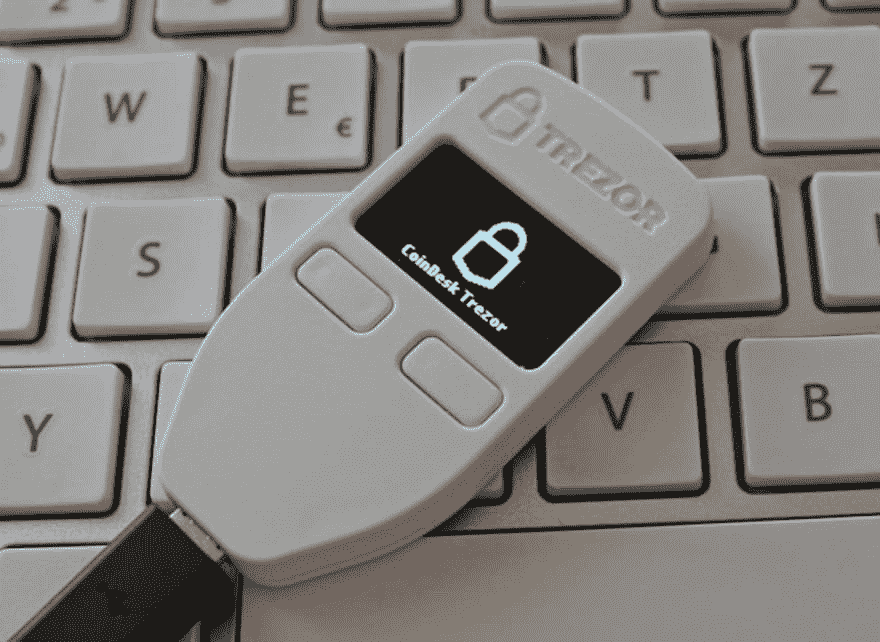

# Trezor 硬件钱包，带 Python

> 原文：<https://dev.to/codesharedot/trezor-hardware-wallet-with-python-16fo>

[Trezor](https://trezor.io/) 是一个“硬件钱包”。这是一种电子设备，你可以把它插在电脑上，用于各种用途:

*   存储加密货币(冷藏)
*   U2F 认证
*   用作密码管理器(相对于 keepass，pass 等将密码存储在您的联网计算机上)
*   嘘
*   通过 GPG 加密

和许多更酷的东西。

这比把你所有的敏感数据都留在联网的电脑上要好得多(很多人都是这样丢失比特币或密码的)。

我们将与设备互动。让我们编写一些 Python 代码！

## Trezor 互动

在你开始之前，确保你知道 Python 编程的[基础。我们将使用一个名为](https://pythonbasics.org/) [trezorlib](https://github.com/trezor/trezor-firmware/tree/master/python) 的模块。

```
pip3 install trezor 
```

安装后，您可以使用下面的代码来打开设备。它将显示主屏幕。

```
#!/usr/bin/python3
from trezorlib.tools import parse_path                                                                                                         
from trezorlib import tezos, ui, device                                                                                                        
from trezorlib import messages as proto                                                                                                        
from trezorlib.transport import TransportException                                                                                             
from trezorlib.exceptions import TrezorFailure                                                                                                 
from trezorlib import btc, coins, messages as proto, tools, ui                                                                                 
from trezorlib.client import TrezorClient                                                                                                      
from trezorlib.transport import get_transport                                                                                                  

device = get_transport()                                                                                                                       
client = TrezorClient(transport=device, ui=ui.ClickUI())                                                                                       

# check PIN protection                                                                                                                         
features = client.call(proto.Initialize())                                                                                                     
print('Has PIN protection? ', features.pin_protection) 
```

很简单，点亮屏幕。大概是这样的:

[](https://res.cloudinary.com/practicaldev/image/fetch/s--O24uQNkB--/c_limit%2Cf_auto%2Cfl_progressive%2Cq_auto%2Cw_880/https://proxy.duckduckgo.com/iu/%3Fu%3Dhttps%253A%252F%252Fthegadgetflow.com%252Fwp-content%252Fuploads%252F2018%252F04%252FTrezor-One-Hardware-Bitcoin-Wallet-03.jpg%26f%3D1%26nofb%3D1)

如果 trezor 设备配置了 pin 保护，它也会返回。

一旦你做好了这些基础工作，你就可以做很多新奇的事情了。就像 GPG 和特雷佐签约一样。

相关链接:

*   [Trezor 硬件钱包](https://trezor.io/)
*   [学习 Python 编程](https://pythonbasics.org)
*   [Trezorlib](https://github.com/trezor/trezor-firmware/tree/master/python)