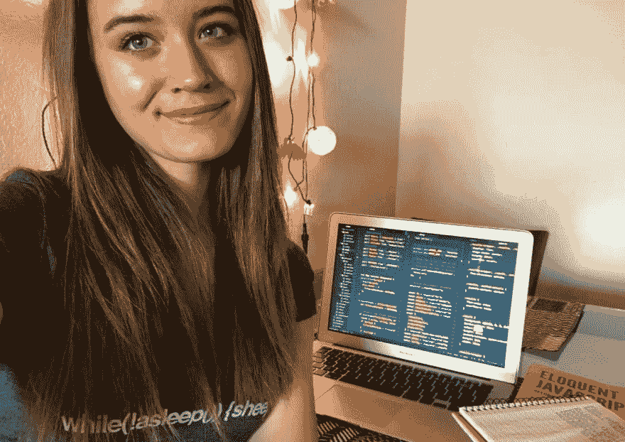
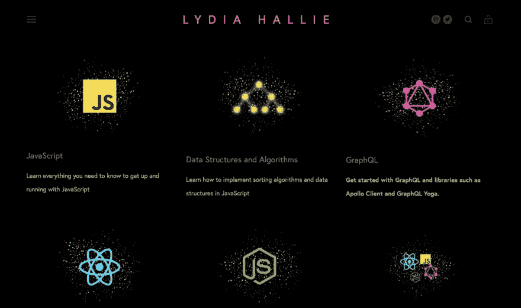
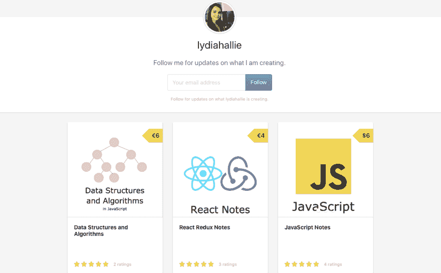

# 关于莉迪亚·哈利如何学习编码的采访

> 原文：<https://dev.to/petecodes/an-interview-with-lydia-hallie-about-how-she-learned-coding-5dd9>

几年前，Lydia Hallie 在 Medium 上发表了一篇关于她已经是一名 19 岁的专业 web 开发人员的文章，引起了我的注意。显然，她在高中毕业一年后做得很好，因为她已经得到了工作机会，尽管她没有正式的公司工作经验。我和她聊了聊她在没有计算机科学学位的情况下学习编程的动力、她对编程新手的建议以及她未来的目标。

## 非常感谢面试！那么能不能给想更多了解你的人介绍一下？

谢谢你面试我！我叫 [Lydia](https://www.theavocoder.com) ，是一名全职软件工程承包商，为几家公司工作，通常沉迷于编程。在我的空闲时间，我指导开发人员，分享技术内容，并试图通过展示编程有多棒来激励更多的人进入技术世界！长话短说，我没有空闲时间，哈哈，但是我喜欢。我试图通过主要使用 JavaScript(是的，TypeScript 不用担心)、GraphQL、Serverless、Golang、AWS 和许多更现代的 web 技术来制作令人敬畏的产品。我爱他们！

## 你最初是怎么进入编码的？你用了什么资源？

我大约 15 岁的时候在 Tumblr 上开始了 web 开发。我想改变我博客的布局，但是你得花大约 50 美元去买一个我不想做的。相反，我开始使用 HTML、CSS 和 jQuery 构建自己的应用程序。我不知道这是“编码”，我只是在建立网站，一直在谷歌上搜索 JavaScript，让东西工作。我当时没有真正使用任何具体的资源，我只是建立了很多，并通过谷歌搜索我的方式哈哈！

## 我听说你在美国完成了一个训练营。与自学相比，这对你的学习有什么帮助？

是啊！我学东西很快，而且我自己也很有动力。我并不真的需要去编码训练营学习如何编码，但是我觉得拥有一个证书将有助于我的可信度，因为我只有 19 岁，并且真正有兴趣开始我的编程生涯。我觉得如果没有证书，就很难证明我的专业精神和真正的热情。老实说，这可能不完全正确，因为我从来没有被要求出示我的证书(我只是展示了我构建的项目)，但我仍然很高兴我去了一个编码训练营，只是为了体验。

## [没有 CS OK——没有学位的开发者的工作板](https://nocsok.com)

## 我知道你有一些学习[时记下的笔记，在 Gumroad 上出售](https://gumroad.com/lydiahallie)。近期还有什么计划吗？

哈哈，可能吧！为我做的东西收钱，我总是感觉不好。我知道从商业角度来看这并不明智，哈哈，但我只是真心实意地想通过分享我所知道的东西来帮助人们。写它们花费了太多的时间，而我已经一直在做免费的资源，所以不幸的是我不得不这么做。我想做的事情太多了，但是时间太少了！

## 我在推特上看到你教你妈妈编码！她编程学得怎么样了？

哈哈，对，很萌。我向她介绍了 React，并向她展示了在没有太多先验知识的情况下，用它建立一个网站是多么容易。她仍然称之为魔法，或者说“你真的能理解所有这些吗？”当我坐在满是代码编辑器和终端的显示器前时。但是，向她展示编码并不是一件神奇、可怕的事情，但它实际上比许多人想象的要容易得多，这绝对是一件好事。

## 对于正在学习编码却觉得力不从心的人，你有什么建议？

那种不知所措的感觉不会消失，习惯了，哈哈。试着找出让你不知所措的事情，把它分解成小步骤。对我来说，有一个明确的目标通常会有所帮助:比如说，我正在做一个简单的聊天应用程序。我会研究所有我需要的技术来建造它，然后研究我实际上需要用这些技术做什么来得到我的最终产品。

通过同时建造一些东西，你会更有动力更好地做你的研究，但是你也会更快地理解概念。观看课程通常很无聊，你不会记得太多，但是通过自己积极地学习，你真的把它变成了你自己的，你更有可能真正理解和记住它是如何工作的。

## [订阅双周刊获取编码灵感](https://mailchi.mp/67e1bf258afa/nocsdegree)

## 你更喜欢在家工作，还是曾经去过咖啡馆或共同工作的地方？

从家里，1000%。我绝对不能在共同工作的空间里工作。实际上我最喜欢的工作地点是在星巴克(或任何其他咖啡馆)，在一个安静的角落，我的屏幕面对着墙，戴着我的降噪耳机，哈哈。我仍然想和人们在一起，而不是完全孤独，我只是不想和他们互动。不幸的是，我真的不能在办公室工作，这有点烦人但我真的不能集中精力。我也不能在办公时间工作，我主要在晚上和凌晨工作。如果你在共同工作空间工作，那就不太好了，哈哈。

## 一位读者在脸书页面问[，你是如何编译你的 Javascript 的？](https://www.facebook.com/nocsdegreedotcom)

巴别。我实际上大部分时间使用 Typescript，所以我只使用 Typescript 编译器。

## **想要一份开发人员的工作却没有学位？通过 [Triple Byte 的测验](https://triplebyte.com/a/Ww4mbM6/d)，直接进入顶级科技公司的最终现场面试**

## 作为一名开发人员，最初从事远程工作是容易还是困难？

超级简单。在我上学期间，我总是在家努力工作，当我在自己舒适的环境中时，我感觉好多了。当我感觉不到任何人看着我的屏幕时，我可以想得更清楚，我可以穿上我舒适的衣服，哈哈。身边有自己的食物/零食，只要我想，就可以出去散步或跑步，这大大提高了我的工作效率。是的，我真的不喜欢办公室。

## 我知道你每周疯狂地工作 60 个小时。对人们有什么提高生产力的建议吗？

只要提醒自己你在朝着什么方向努力。知道你为什么这么努力工作，以及你的目标将如何影响你的生活。说实话，我的心态并不健康。我倾向于忽视自己和生活中的其他事情，因为我一直在工作和学习，我仍然在努力寻找健康的工作/生活平衡。但是现在，这么多的工作给了我生活中所需要的快乐、动力和成就感。努力工作让我更快乐，一旦你注意到努力有回报，它就开始成为一种瘾。然而，这是不可持续的。

## 你才 21 岁，却已经取得了这么多成就。你未来的大梦想是什么？

哈哈，我从来没有看得这么远。我甚至不知道两个月后我会住在哪里，可能直到我不得不再次搬出去之前的一个星期才会开始计划。我只是做当时感觉最好的事情，我知道我总是可以相信自己做出最好的决定。我喜欢致力于减少气候变化的产品，因为我对此非常担心。总的来说，我只是希望我能继续与令人惊讶的，鼓舞人心的和聪明的人一起工作，并致力于我一直认为对我来说太复杂而难以理解的产品，继续挑战自己哈哈！

最后，对于你是哪里人，似乎有些困惑。你的 insta 故事说你是荷兰人，而不是人们认为的瑞典人。那是怎么回事？

Lol，是的。我想这是因为许多人是从我住在斯德哥尔摩时写的文章中认识我的。我是土生土长的荷兰人，但我十几岁时就经常四处旅行。我喜欢这个国家(科技领域也很棒)，但是人太多了，太拥挤了。高中毕业后我搬到了瑞典，所以我在那里住了几年。我会说/听得懂瑞典语等等，但我不是瑞典人，我是荷兰人😀