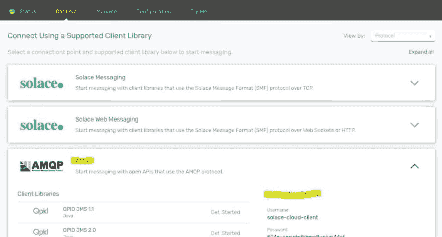
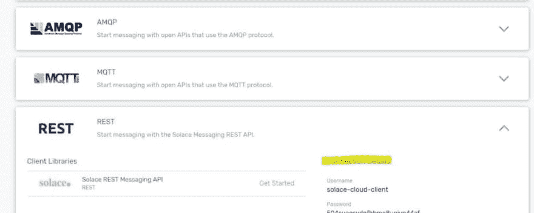
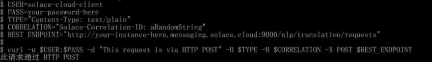
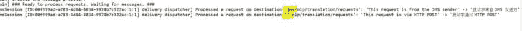
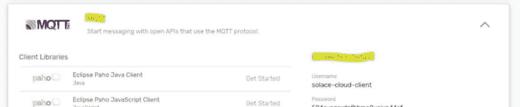
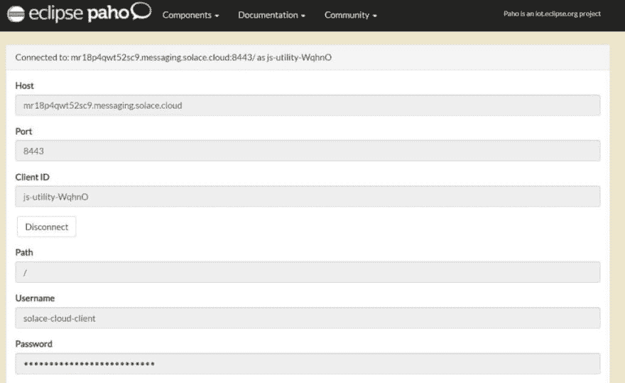
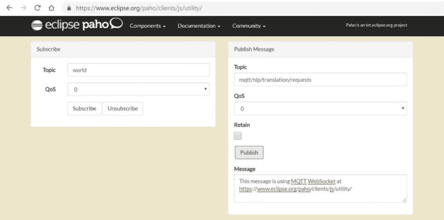

# 用 JMS、HTTP 和 MQTT 释放阿里巴巴机器翻译服务的力量

> 原文:[https://dev . to/solace devs/unlocking-of-power of-Alibaba-s-machine-translation-service-with-JMS-http-and-mqtt-1n 1](https://dev.to/solacedevs/unlocking-the-power-of-alibaba-s-machine-translation-service-with-jms-http-and-mqtt-1nn1)

[T2】](https://res.cloudinary.com/practicaldev/image/fetch/s--EG6IfHhd--/c_limit%2Cf_auto%2Cfl_progressive%2Cq_auto%2Cw_880/https://solace.com/wp-content/uploads/2019/09/machine-translation-featured-blog-image.png)

阿里云提供由机器学习驱动的语言翻译服务。您可以使用它来[轻松地用多种语言展示您的电子商务网站](https://www.alibabacloud.com/blog/applying-alibaba-machine-translation-to-cross-border-e-commerce-scenarios_594006)，启用多语言搜索，甚至实时翻译支持聊天。

该服务目前作为一个名为“机器翻译”的 SDK 提供，也称为阿里 MT。用户需要将 SDK 集成到他们需要执行语言翻译的应用程序组件中。一种方法是实现客户端-服务器模型，SDK 只在指定的“服务器”进程中实现，客户端向它发出翻译请求。这在您的架构中提供了一些抽象，避免了需要让每个想要使用翻译服务的进程都熟悉完整的机器翻译 SDK。

例如，在现代[事件驱动的微服务架构](https://solace.com/blog/event-driven-microservices/)中，您可以设想一组弹性扩展的微服务，为所有其他微服务提供转换功能。

在许多企业中，JMS 代理是连接应用程序和服务的一种非常常见的方式。作为一个易于使用的消息传递 API，JMS 嵌入在许多集成产品中。如果您现在使用企业服务总线(ESB ),那么 JMS 提供者可能是堆栈的一部分。

纵观您的企业 IT 基础设施，除了在微服务架构或功能即服务(FaaS)部署中将它们连接到新的应用程序之外，您可能还需要向连接到 ESB 的现有应用程序公开像这样的新的基于云的服务。您可能还有一些需要访问它们的物联网(IoT)设备。

如果您可以只部署一组服务并处理所有这些不同的客户端和协议需求，那不是很好吗？在 PubSub+这样的[事件代理](https://solace.com/what-is-an-event-broker/)的帮助下，你可以。

# [](#starting-with-jms-for-existing-legacy-applications)从现有遗留应用程序的 JMS 开始

由于 JMS 只是一个 API 规范，并不依赖于任何特定的产品，因此可以根据该 API 编写应用程序，以便它可以与任何符合 JMS 的 JMS 代理一起工作。包含供应商特定详细信息的客户端库可以在运行时从类路径中解析。为了消除应用程序中对特定于供应商的库的依赖，高级消息队列协议( [AMQP](https://docs.solace.com/Open-APIs-Protocols/AMQP/Using-AMQP.htm) )定义了一个基于标准的连接协议，因此一个开源库可以连接到来自多个供应商的代理，而不需要修改库。

为了支持 JMS 与阿里巴巴 MT 的连接，我创建了一个 SDK 的包装器，并在 Github 上提供了它。存储库中有两个演示 JMS 应用程序(作为可运行的 jar ),它们实现了[请求-回复](https://solace.com/samples/solace-samples-jms/request-reply/)模式:

1.  一个“请求者”程序，请求将英文文本翻译成中文，通过 JMS 目的地发送。
2.  一个“Replier”程序，它侦听 JMS 目的地上的请求，将文本翻译成中文，并通过另一个 JMS 目的地对原始请求者做出响应。

Replier 程序在客户端-服务器模式中处于*服务器*角色，并且是唯一需要实现机器翻译 SDK 的程序；请求程序完全不知道 SDK。

默认情况下，存储库构建时支持 Apache Qpid 的 AMQP JMS 库，因此它可以立即连接到 JMS 代理，比如支持 AMQP 的 Solace PubSub+。

要运行程序，您需要更新也在检出存储库中的两个文件的内容:

1.  `jndi.properties`–这告诉程序如何连接到 JMS 代理以及使用什么目的地
2.  这告诉回复程序如何连接到阿里巴巴机器翻译服务。

### [](#get-your-solace-pubsub-connection-details)获取你的安慰 PubSub+连接详情

最简单的入门方法就是注册一个 [PubSub+ Cloud](https://dev.to/products/event-broker/cloud/) 的免费开发者计划。获得服务后，从“连接”选项卡跳转到 AMQP 连接详细信息，如下所示:

[T2】](https://solace.com/wp-content/uploads/2019/09/alibaba-machine-translation-service-jms-http-mqtt_image-1.jpg)

然后，您可以修改 jndi.properties 文件，将连接 URI、用户名和密码添加到 jndi.properties 文件中，就像“connectionfactory”中那样。ConnectionFactory "行:

```
connectionfactory.ConnectionFactory = amqp://your-service-here.messaging.solace.cloud:5672?jms.username=solace-cloud-client&jms.password=YourPasswordHere&jms.clientIDPrefix=NLPTranslationSample-& 
```

出于本演示的目的，还要更新 JMS 目的地名称，如下所示:

```
topic.nlp-translation-requests-send = jms/nlp/translation/requests topic.nlp-translation-requests-receive = \*/nlp/translation/requests 
```

### [](#get-your-alibaba-machine-translation-service-details)获取您的阿里巴巴机器翻译服务详情

接下来，我们需要向程序提供您的机器翻译服务的细节。你可以按照这里的说明[来获取这些细节。](https://www.alibabacloud.com/help/doc-detail/96384.htm)

在 alibaba-mt.properties 中输入您的服务详情，如下:

```
service-region=cn-hangzhou access-key-id=IDGoesHere access-key-secret=SecretGoesHere 
```

如果您还不能访问该服务，您也可以在离线/模拟模式下运行程序。只需将下面一行添加到文件中:

```
simulation-mode=true 
```

### [](#start-translating)开始翻译

现在，您已经准备好运行程序并通过 JMS 访问机器翻译了。首先启动回复程序:

```
java -jar AlibabaNLPReplier.jar -j ./jndi.properties -a ./alibaba-mt.properties 
```

然后启动请求程序:

```
java -jar AlibabaNLPRequestor.jar -j ./jndi.properties 
```

请求程序将在您键入时收集键盘输入，并将每一行作为翻译请求提交。

## [](#adding-http-support-for-new-microservices)新增微服务 HTTP 支持

对于以“功能即服务”的方式运行的轻量级微服务而言，通过 HTTP 进行通信是一种流行的机制。所以接下来让我们为翻译服务添加 HTTP 支持。

随着 Java replier 程序的运行，我们实际上可以让相同的流程响应通过 HTTP 提交的请求，而无需部署任何进一步的服务或组件。通过选择 Solace PubSub+作为 JMS 提供者，它的 [REST 微网关](https://docs.solace.com/Overviews/Microgateway-Concepts/Microgateways-Overview.htm)通过 HTTP 提供对相同 JMS 目的地的访问。

Solace PubSub+ REST 连接特性可以在两种模式下运行:消息传递和网关。新创建的事件代理或云服务的默认设置是消息传递，但在本练习中，我们需要它以“网关”模式运行。

按照此处的说明[为您的经纪人更改模式。](https://docs.solace.com/Configuring-and-Managing/Microgateway-Tasks/Managing-Microgateway.htm#Configure_VPN_Mode)

### [](#get-your-rest-connectivity-details)获取您的休息连接详情

回到 PubSub+ Cloud 实例的 Connection 选项卡，现在收集如何通过 HTTP REST 连接同一个实例的详细信息:

[](https://solace.com/wp-content/uploads/2019/09/alibaba-machine-translation-service-jms-http-mqtt_image-2.jpg)

### [](#set-up-curl-command-example)设置卷曲命令示例

假设一个 Linux shell 环境，我们可以使用 curl 客户机通过 HTTP POST 方法发出翻译请求。为了方便起见，我们将相关的连接细节放入 shell 变量中，如下所示:

```
$ USER=solace-cloud-client $ PASS=your-password-here $ REST\_ENDPOINT="http://your-instance-here.messaging.solace.cloud:9000/nlp/translation/requests" 
```

您会注意到 REST 端点添加了`nlp/translation/requests`路径，作为匹配 JMS 程序和它已经在监听的目的地的一种方式。

当 JMS 程序接收请求并响应它们时，它们期望出现一个`CorrelationID`来正确地响应请求。对于 HTTP POST，我们可以在头中传递它，所以我们也为它设置一个变量:

```
$ CORRELATION="Solace-Correlation-ID: aRandomString" 
```

最后，需要另一个头来指定这是发送的纯文本，而不是二进制。这个最后的 shell 变量也可以设置这个:

```
$ TYPE="Content-Type: text/plain" 
```

这就是所需要的一切。我们已经准备好使用相关参数运行 curl 命令:

```
$ curl -u $USER:$PASS -d "This request is via HTTP POST" -H "$TYPE" -H "$CORRELATION" -X POST $REST\_ENDPOINT 
```

下面是一个将所有这些放在一起的示例响应:

[](https://solace.com/wp-content/uploads/2019/09/alibaba-machine-translation-service-jms-http-mqtt_image-3.jpg)

在回复日志中，您可以看到来自 JMS 和 HTTP 源的消息正在被处理:

[](https://solace.com/wp-content/uploads/2019/09/alibaba-machine-translation-service-jms-http-mqtt_image-4.jpg)

# [](#adding-mqtt-support-for-iot-devices)为物联网设备增加 MQTT 支持

[MQTT](https://docs.solace.com/Open-APIs-Protocols/MQTT/Using-MQTT.htm) 是一种低功耗和低带宽协议，这使得它成为物联网系统非常受欢迎的选择。由于这些设备通常由运行在其他地方(比如本地或云中)的应用程序和服务支持，因此需要使用 MQTT 从这些设备向使用不同协议的应用程序和服务提供双向数据流。幸运的是，PubSub+ event brokers 会很容易地为您完成这个协议翻译。

保持同一个 Java 程序运行，让我们使用 MQTT 协议发送一个翻译请求，以便 Java 程序可以通过 JMS 使用它。

### [](#get-your-mqtt-connectivity-details)获取您的 MQTT 连接详情

和以前一样，回到 PubSub+ Cloud 实例的 Connection 选项卡，这次收集如何通过 MQTT:

[](https://solace.com/wp-content/uploads/2019/09/alibaba-machine-translation-service-jms-http-mqtt_image-5.jpg) 连接到实例的详细信息

### [](#connect-your-mqtt-client)连接您的 MQTT 客户端

由于 MQTT 是一个标准的连接协议，任何 MQTT 客户端 API 都可以发布到 PubSub+事件代理(也就是说，不需要从 Solace 获取 API。)因此，我们可以使用 Eclipse Paho 的在线托管的[JavaScript-over-web socket MQTT](https://www.eclipse.org/paho/clients/js/utility/)实用程序进行演示。

将连接细节复制到在线客户端:

[](https://solace.com/wp-content/uploads/2019/09/alibaba-machine-translation-service-jms-http-mqtt_image-6.jpg) 

从 web 客户端发布消息:

[](https://solace.com/wp-content/uploads/2019/09/alibaba-machine-translation-service-jms-http-mqtt_image-7.jpg)

注意:此请求可以发送到 MQTT 的具体主题`mqtt/nlp/translation/requests`

查看 JMS 回复者日志中的请求到达:

[](https://solace.com/wp-content/uploads/2019/09/alibaba-machine-translation-service-jms-http-mqtt_image-8.jpg)

您可能还记得，我们的 JMS 程序使用“请求-回复”模式进行消息交换，其中“回复”主题对于查看翻译响应至关重要。由于这个托管的 MQTT 客户机没有执行所有这些必要的步骤，请求将不会得到正确的处理。但是，可以在日志中看到消息到达和内容处理的证据。

虽然轻量级 MQTT 协议没有明确定义请求-应答机制，但是可以使用定制的主题和头很容易地模拟它。要进一步了解如何构建自己的 MQTT 发送器来正确实现请求-应答模式，从而成功地将翻译响应返回给 MQTT 发送器，请阅读 [Request/Reply](https://solace.com/samples/solace-samples-mqtt/request-reply/) 指南。

## [](#thats-all-folks)就这些了，乡亲们！

教程到此结束。如果您有任何问题或意见，可以通过 [solace.community](https://solace.community/) 找到我。

用 JMS、HTTP 和 MQTT 释放阿里巴巴机器翻译服务力量的帖子[最早出现在](https://solace.com/blog/alibaba-machine-translation/) [Solace](https://solace.com) 上。