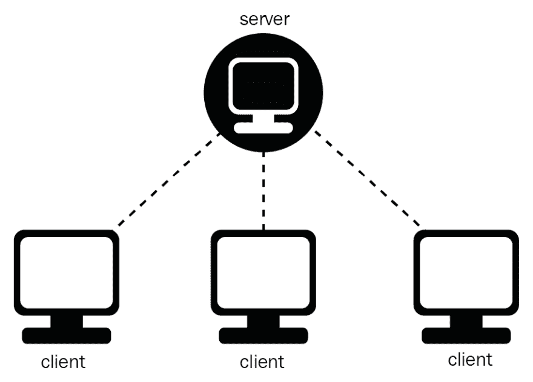
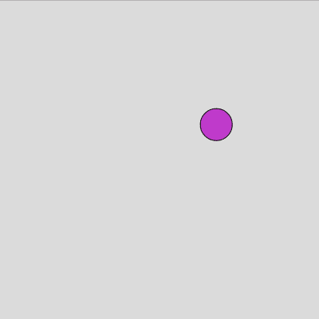
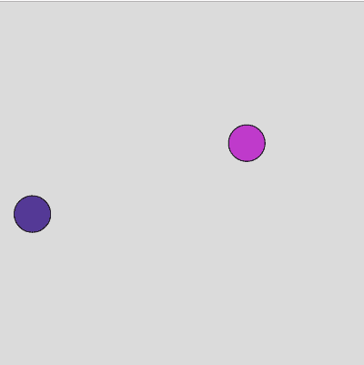

# 编写一个精彩的多人游戏🚀两分钟后。

> 原文:[https://dev . to/Luke garrigan/code-a-brilliant-multiplayer-game-in-2-minutes-2 GDD](https://dev.to/lukegarrigan/code-a-brilliant-multiplayer-game-in-2-minutes-2gdd)

*免责声明:你对卓越的定义可能会有所不同*

# 从哪里开始

编写多人游戏代码最难的部分是设置，这只是一大堆样板文件:

## 设置服务器

*   创建玩家对象
*   设置套接字
*   滴答率
*   加入游戏的玩家
*   玩家离开游戏

## 设置客户端

*   创建画布
*   正在连接到服务器
*   渲染整个游戏

# 等等！！！🛑

不要放弃这个博客。我是一个很好的小伙子，为你编译了一个快速入门项目，所以你可以完全忽略上面所有的东西。

## 什么是 [P5 多人游戏首发](https://github.com/LukeGarrigan/p5-multiplayer-game-starter)？

这是使用 express、socket.io 和 p5.js 启动多人游戏开发的一个非常简单的方法。它代表了一种对多人游戏开发的固执己见的方法，应该允许你跳过艰苦的开始阶段。

## 如何使用这个神奇的储存库？

1.  `git clone https://github.com/LukeGarrigan/p5-multiplayer-game-start.git`
2.  `npm install`在根目录下
3.  让它跑起来！

# 详细信息

该项目非常简单，它设置了一个客户端播放器类和一个服务器播放器。服务器每隔 16 毫秒向客户端发送一次游戏的当前状态。如果一个新的客户端加入服务器，一个新的玩家将被添加到游戏中，并显示在所有客户端上，当玩家离开游戏时，它也会自动删除他们。这些是我在创建一个新的多人游戏时经常要重现的标准特性，所以我希望你和我一样觉得这很有用！

每个客户端都是你游戏的玩家，他们都与服务器通信。服务器会控制所有的游戏状态，比如玩家位置。玩家的位置将被发送到所有的客户端，这样每个客户端都可以渲染(使用 p5)游戏中的玩家！
[T3】](https://res.cloudinary.com/practicaldev/image/fetch/s--DMCWns2U--/c_limit%2Cf_auto%2Cfl_progressive%2Cq_auto%2Cw_880/https://www.oreilly.com/library/view/mastering-c-game/9781788629225/assets/15371b3c-817a-4dd0-8f36-3efc7ed10f5d.png)

# 你的游戏到目前为止的试玩！

一个玩家通过进入本地主机加入游戏:8080

 
你的朋友然后归附！

 
你的朋友看到你在游戏中表现得如此出色，然后迅速离开..

[T2】](https://camo.githubusercontent.com/bac8483e8a1a60836350c70837a1678d4d22f815/68747470733a2f2f736e61672e67792f3130683643732e6a7067)

所以基本上，最简单的形式是存储库处理客户加入和离开游戏。

所以我们开始吧，我建议你做的是在存储库周围玩一玩，添加一些基础物理，与客户进行一些互动。这将为你的下一次 IO 任务提供非常基本的构建模块！

# 终于

我希望这对你们中的一些人有所帮助，我也希望看到你们用 starter 项目创建的游戏！请在评论中分享它们😁

如果你不想错过绝对精彩的编程洞察，请在 twitter 上关注我:🤣[@卢克 _ 加里根](https://twitter.com/luke_garrigan)

谢谢你，如果你喜欢我的漫谈，看看我在 https://codeheir.com/的个人博客网站

## 本博客由[代码画布](https://www.codecanvases.com)赞助

用市场上最酷的编程/编码画布让你的房间变得生动起来。[codecanvases.com](https://www.w3schools.com)是 100%独家设计画布的编程印刷的头号卖家。趁**优惠 20%,立即购买！！**
T7】](https://res.cloudinary.com/practicaldev/image/fetch/s--qTjLHF_e--/c_limit%2Cf_auto%2Cfl_progressive%2Cq_auto%2Cw_880/https://cdn.shopify.com/s/files/1/0311/0151/7955/products/jqbr8djyof6ktl8qopmkpvy4_480x480.png%3Fv%3D1585483987)