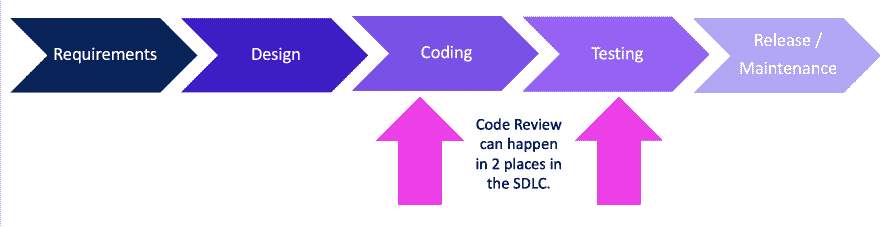

# 像老板一样向左推——第 7 部分:代码评审和静态代码分析

> 原文：<https://dev.to/azure/pushing-left-like-a-boss-part-7-code-review-and-static-code-analysis-1544>

### 这个系列，还有我的博客，都动了！[来看看](https://wehackpurple.com/g8tg)！

* * *

这篇文章是关于安全代码审查和静态代码分析(SCA)，也称为静态应用程序安全测试(SAST)。

注意:有些人在静态组合分析中提到 SCA，在这种情况下，他们指的是验证您的依赖项是否易受攻击。在本文中，我指的是静态代码分析。

#### 当应用安全人员说“静态”分析时，我们的意思是我们将查看*编写的代码*，而不是“动态”，这意味着当你的代码在 web 服务器上*运行*时。

虽然我知道代码审查非常重要，但我不确定我是否会涉及这个话题。我个人觉得代码审查非常困难；我的注意力持续时间很短，有时会不耐烦(例如，当我醒着的时候)。代码审查需要耐心和高度的专注。也就是说，这是一项非常有价值的活动，它可以在您进入测试或发布阶段之前发现许多安全问题，从而潜在地节省时间和金钱。

进行代码审查有两种选择；手动或使用工具。各有利弊。

### [在我的新博客上阅读其余内容！](https://wehackpurple.com/l0m5)！