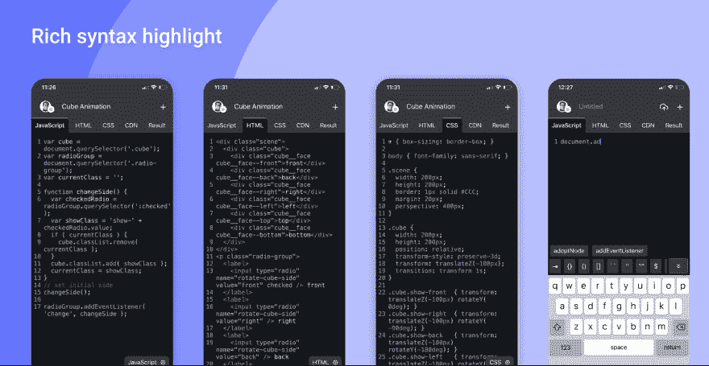
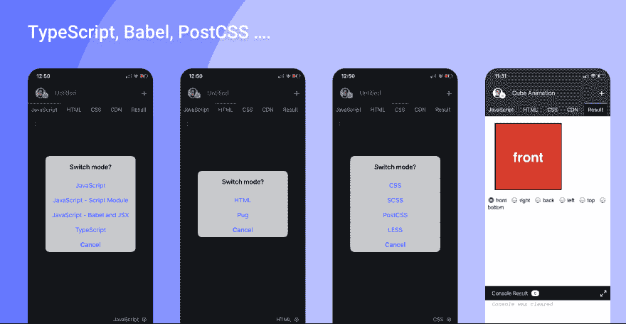
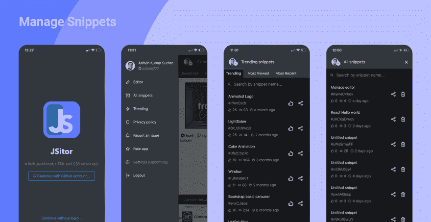

# JSitor 移动应用，JSFiddle、CodePen 和 JSBin 的替代产品

> 原文:[https://dev . to/ash vin 777/jsitor-mobile-app-an-alternative-of-js fiddle-code pen-and-jsbin-434 o](https://dev.to/ashvin777/jsitor-mobile-app-an-alternative-of-jsfiddle-codepen-and-jsbin-434o)

JSitor 是一个用来编写网页片段的网络工具，除了网络版本，它还支持基于移动应用的编辑器，这对于我们在离开笔记本电脑时测试我们的想法非常有帮助。

Android 和 iOS 应用都是由[反应](https://facebook.github.io/react-native/)和[代码镜像](https://codemirror.net/)的力量构建的。

[下载 iOS App](https://itunes.apple.com/us/app/jsitor/id1455784773?mt=8)
[下载 Android App](https://play.google.com/store/apps/details?id=com.ashvin777.apps.jsitor)

# JSitor app 有什么不同？

*   支持**打字脚本、JSX、巴别塔、脚本模块**
*   支持 **Pug** 文档格式
*   支持**少，SCSS，波斯特 CSS**

*   令人敬畏的界面易于使用

*   与网页版[JSitor.com](https://jsitor.com)同步，这样你就可以在任何地方完成你未完成的工作

*   丰富的**语法亮点和建议**

*   键盘上的**快捷键**

*   易于安装外部 **CDN** 库

*   **登录 Github** 管理代码片段

*   **查看趋势/查看次数最多和最近的**片段

# 几张截图

[T2】](https://res.cloudinary.com/practicaldev/image/fetch/s--o078rDfU--/c_limit%2Cf_auto%2Cfl_progressive%2Cq_auto%2Cw_880/https://github.com/jsitor/jsitor/rimg/Screenshot%25202019-09-17%2520at%252012.55.41%2520AM.png)

[T2】](https://res.cloudinary.com/practicaldev/image/fetch/s--To5nERl3--/c_limit%2Cf_auto%2Cfl_progressive%2Cq_auto%2Cw_880/https://github.com/jsitor/jsitor/rimg/Screenshot%25202019-09-17%2520at%252012.55.56%2520AM.png)

[T2】](https://res.cloudinary.com/practicaldev/image/fetch/s--qELjEewQ--/c_limit%2Cf_auto%2Cfl_progressive%2Cq_auto%2Cw_880/https://github.com/jsitor/jsitor/rimg/Screenshot%25202019-09-17%2520at%252012.55.49%2520AM.png)

# 了解更多 JSitor

 [## JSitor，CodePen，JSBin 和 JSFiddle 的替代

### ashvin Kumar Suthar 1919 年 9 月 12 日 3 分钟阅读

#javascript #css #html #react](/ashvin777/jsitor-an-alternative-of-codepen-jsbin-and-jsfiddle-1l98)

我不会说 JSitor 将是最好的工具，但肯定是值得探索的。尝试一下并分享您的反馈。我们很想听听你们的意见。

*   阿什温·苏塔尔(JSitor.com 的创造者)
*   在推特上关注我们-[https://twitter.com/JSitorEditor](https://twitter.com/JSitorEditor)