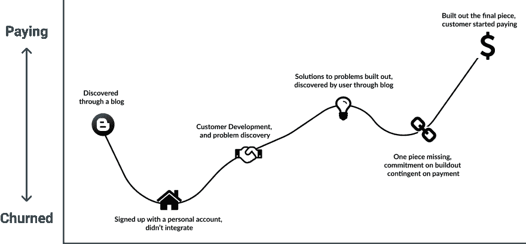
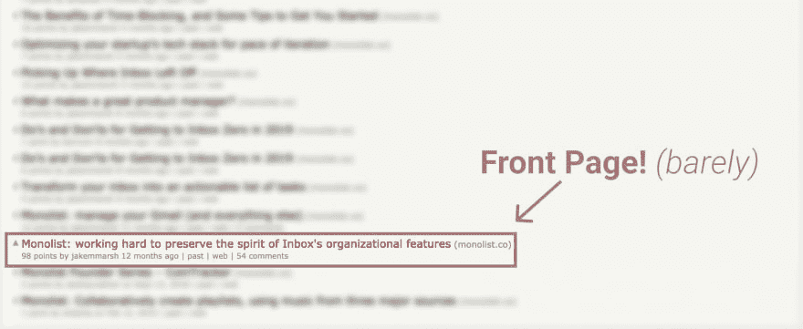
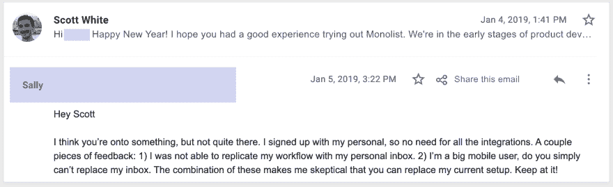
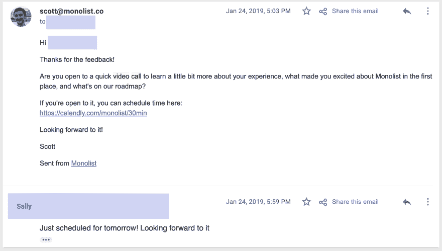
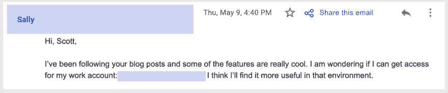
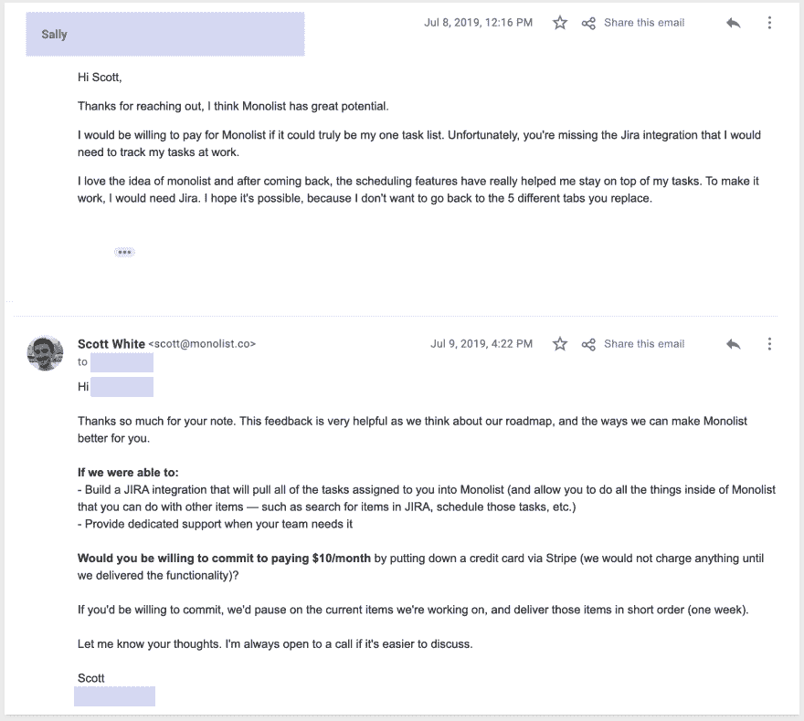
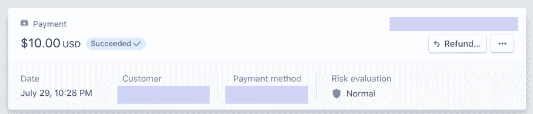
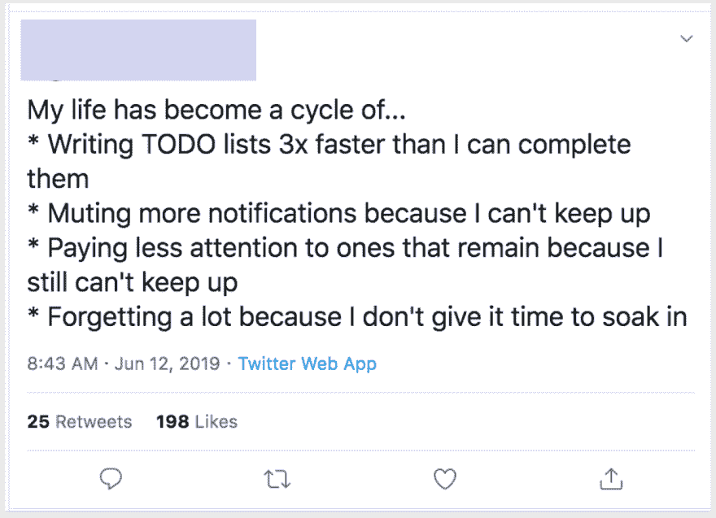
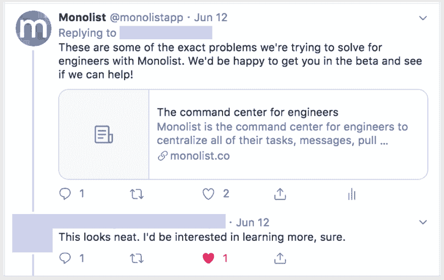

# 我们通向第一个付费客户的旅程

> 原文：<https://dev.to/scahhht/our-journey-to-the-first-paying-customer-2b8a>

从长期来看，创业公司失败是因为每个客户的价值无法抵消获得下一个客户的成本。

从短期来看，创业公司之所以会消亡，是因为它们无法获得客户。

不过，在你做大之前，你需要让一个人付钱。然后你可以专注于 10，然后 100，然后 10000。但首先你需要一个。

我们想分享我们的支付客户#1 之旅，以及在此过程中我们学到的经验。首先，我将客观地概述导致我们的第一位顾客付款的接触点，然后继续我们所学到的，以及一些让第一位顾客付款的技巧。

# 关于我们的一些背景

在 [Monolist](http://monolist.co) ，我们正在为工程师建立指挥中心——在这里，您可以管理工作中使用的所有工具的拉式请求、任务、消息和警报。

我们的目标是解决当试图管理跨许多工具的工作时出现的问题(丢失的任务，不连贯的讨论，缓慢的发布周期)。我们通过这些不同的工具将您的所有任务整合在一起，并提供一个智能层，确保您最重要的工作不会被遗漏。

关于我们的客户:

*   我们的目标客户群是软件工程师
*   为了充分利用 Monolist，客户需要集成各种工具
*   我们销售自下而上的产品，因此我们的目标是公司内部的“消费者”，而不是首席信息官或首席技术官等执行决策者

# 客户旅程

#### **第一天:**莎莉第一次被介绍给 Monolist 是通过一篇在黑客新闻上流传的博客文章。

#### **第二天:**莎莉注册了一个个人账号，没有集成她的任何工具，第一次体验很差。

#### **第 18 天:**莎莉和我约了时间，讨论路线图上有什么，以及它是否足够吸引她继续使用 Monolist。从我们的讨论中，两个即将推出的功能足够吸引人，她说她愿意将她的工作流程转移到 Monolist。

#### **第 60 天:** Sally 通过一篇博文发现了我们讨论过的新功能，并要求将其添加到她的工作帐户的测试版中，以便集成她的工具。

#### **第 120 天:**我们为莎莉确定了缺失的那一部分，并请她承诺如果我们愿意的话，她会付钱。

#### **第 132 天:**我们建了特性，莎莉付钱了。

# 我们学到了什么，我们采取了哪些战术步骤来实现这一目标？

## 第一步:在尝试销售任何东西之前，确定你想卖给谁，他们有什么问题，以及你的产品如何解决这些问题是至关重要的。

出于各种原因，确定目标用户可能是初创公司能做的最重要的事情:

1.  你的目标用户总数代表了你的潜在市场。当你的目标是获得客户时，你的潜在市场的规模很重要。
2.  目标用户决定了你的产品将解决的问题，以及相应的路线图的形状。
3.  识别谁是目标用户揭示了谁不是目标用户。这在用户研究、客户开发、设计以及最终的开发时间上节省了大量的时间。

## **第二步:在销售之前，在你的目标客户群中建立一个潜在客户名单**

一旦你有了一个目标用户群，就该建立一个这个用户群中的人的名单，你想从他们那里收集对你所建立的产品的反馈，并最终卖给他们。对我们来说，有几种方法来建立我们的列表。

### **利用你的网络**

利用你的网络是一个很好的开始方式，因为:

*   你网络中的人更倾向于帮助你
*   他们可以通过把你介绍给你的目标客户群中像他们一样的人来起到倍增效应

你的关系网最重要的一点是:**让你的关系网容易帮助你。**

#### 让你的提问简单明了，并提供你的联系人完成提问所需的资源。

不好问:“如果你能让人们了解我们，我们将不胜感激。”

*   不好:连接不知道怎么分享，分享给谁，分享什么。

**最好问:**“你愿意在{Startup}把我介绍给{Jane Doe}吗？

*   好:问题很具体。你想被介绍给一个特定的人。
*   不好:你的联系人不知道你想从他们那里得到什么

**最佳提问:**“你愿意在{Startup}把我介绍给{Jane Doe}吗？我很乐意给她一个 15 分钟的演示，展示我们到目前为止所做的工作，并收集她的反馈。我附上了一份草稿，您可以发送过来，其中包含一些关于我们所做工作的详细信息，以及我们为什么特别需要{Jane's}的反馈。”

*   好:问题很具体。你想被介绍给一个特定的人。
*   好:人脉知道你想从他们介绍给你的人那里得到什么
*   好:你包括了对起草介绍信息有帮助的资源

### **在与你的受众相关的社区中写博客**

在特定的社区写博客是将你的产品展示给热情且有针对性的观众的好方法。写博客也是对你在线形象的一种投资，在你的博客发布后很久还能获得回报。

*   这些社区中的人通常是技术的早期采用者，可能对您试图解决的问题充满热情，并且愿意提供更好的反馈。
*   博客对于重新吸引不安的或休眠的顾客来说是很棒的。在上面的例子中，我们的第一个客户是通过一篇博客文章再次参与进来的。
*   博客文章提供了很好的搜索引擎优化，并且可以在你发表博客后很长一段时间内带来有机流量。

我们的目标是软件工程师。以下是一些对我们有用的方法:

*   与软件工程和 web 开发相关的 Reddit 论坛([reddit.com/r/programming](https://www.reddit.com/r/programming))
*   像 [Techmasters](https://techmasters.chat) 或 [DevChat](https://devchat.devolio.net/) 这样的开发者的松散社区
*   与创业相关的论坛，如[在线天才](https://onlinegeniuses.com/)

### **和你的目标人群一起去当地聚会**

正如我们已经讨论过的，重要的是将你的销售周期完全集中在你的目标客户群中的人身上——任何其他群体都只会浪费你的时间。聚会是在你的目标市场中找到量身定制的个人群体的好方法。

聚会很棒的其他原因:

*   他们充满了热情的早期用户。
*   经常会有演示或讲座，因此您有机会同时向许多人传达您的价值主张。
*   如果你是新手，面对面销售会非常不舒服，这是克服销售紧张的好方法。

我们大多用 meetup.com 的。

### **矿社交媒体:**

创业是为了解决问题。人们喜欢在社交媒体上谈论他们的问题。因此，社交媒体是一个很好的地方，可以发现那些遭受你的创业公司试图解决的问题的人。

*   识别与产品需求相关的搜索词
*   保存所有这些搜索的链接
*   每天更新这些链接，亲自联系每一个发推文说你认为你的产品解决了某个问题的人

[T6】](https://res.cloudinary.com/practicaldev/image/fetch/s--W-fZ7Poy--/c_limit%2Cf_auto%2Cfl_progressive%2Cq_auto%2Cw_880/https://thepracticaldev.s3.amazonaws.com/i/4r6vmluskhusnhu9ecwq.png)

## **第三步:与你的潜在客户交谈，确认你认为存在的问题在你的目标客户群中确实感受到了**

创业公司有限的时间和金钱来测试他们的价值假设。幸运的是，像 Figma 这样的工具已经大大减少了将原型送到最终用户手中的时间。

在建立太多之前，你应该与你的潜在客户交谈，以确保他们真正感受到你认为他们感受到的痛苦。一旦您理解了这种痛苦的细微差别，您就可以快速设计一些东西来解决它，并将它展示给那些用户。

在写一行代码之前，你应该能够从用户那里得到关于你的解决方案是否有吸引力的回应。

一旦你对一些原型有了强烈的正面反馈，那么就可以开始比赛了。

## **第五步:灵活应对关闭**

一旦你建立了你认为可以解决最终用户痛苦的原型，你几乎总是会发现一个缺失的环节——体验中缺失的东西意味着你的产品不能完全减轻他们的痛苦。你的工作是找出缺失的环节，并从中获得杠杆作用。

在一天结束的时候，你永远无法真正测试你的假设，直到你要求别人付钱。一旦你发现了缺失的环节，主动提出修复它，**以客户最终付款为条件**。

# 包装完毕

销售的过程是关于识别用户的痛苦，并教育潜在客户你的产品或服务如何减轻这种痛苦。

对我们来说，这个公式非常简单:

1.  仔细确定你的目标客户
2.  通过任何必要的手段建立该客户群的潜在客户名单——通常是不可扩展的
3.  确认那些潜在客户感受到了你认为他们感受到的痛苦
4.  在构建之前，先向他们推销解决方案
5.  根据承诺构建解决方案

## ❗️你是软件工程师吗？

在 Monolist，我们正在为工程师建立指挥中心，以提高他们的工作效率。
如果你想免费试用，只需[点击这里](https://app.monolist.co/login)。