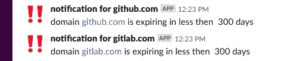

# 当您的 SSL 证书即将过期时，获得延期通知

> 原文:[https://dev . to/neidiom/get-a-slack-notification-when-your-SSL-certificate-to-expire-2c 83](https://dev.to/neidiom/get-a-slack-notification-when-your-ssl-certificate-is-about-to-expire-2c83)

我的任务是完成一个脚本来检查 SSL 证书的到期时间，并将通知发布到我们的 Slack 通道。我写了一个可行的剧本只是为了给一切增添趣味。我很喜欢这样做，所以我将分享代码，希望其他人会觉得有用。

## [](#configure-the-ansible-playbook)配置 Ansible 剧本

您必须定义`slack_webhook`和`domains`，因为这两个变量都是必需的。

可选可配置变量

*   **ssl_port** -标准是 443，
*   **ssl_expiry_days_check** -如果证书在此期限内到期，脚本将发出警告。
*   cron _ period _ check-cron 作业应该何时运行。

示例`ansible_ssl_check.yml`行动手册。

```
---
- hosts: server_name
  roles:
    - user_group_directories
    - rvm
    - whenever
  vars:
    slack_webhook: "https://hooks.slack.com/services/xxxxxxx/xxxxxxx/xxxxxxxx"
    domains:
      - github.com
      - gitlab.com 
```

### [](#testing)测试

如果你想测试的东西，并得到一些假阳性，然后改变以下变量

*   `ssl_expiry_days_check`到像`'300'`这样高的东西，
*   `cron_period_check`到`'hourly'`。

### [](#run-the-playbook)运行剧本

*   将服务器添加到 Ansible 清单文件，然后运行下面的命令。

```
ansible-playbook -i hosts playbok.yml 
```

此命令假定主机清单文件位于当前目录中。

### [](#slack-notifications)时差通知

您的通知将如下所示。

[T2】](https://res.cloudinary.com/practicaldev/image/fetch/s--v0Bo6WE2--/c_limit%2Cf_auto%2Cfl_progressive%2Cq_auto%2Cw_880/https://thepracticaldev.s3.amazonaws.com/i/9iqwr9ylae8xj3fpybp5.png)

### [](#code-repository)代码库

你可以在这里找到 Gitub repo。