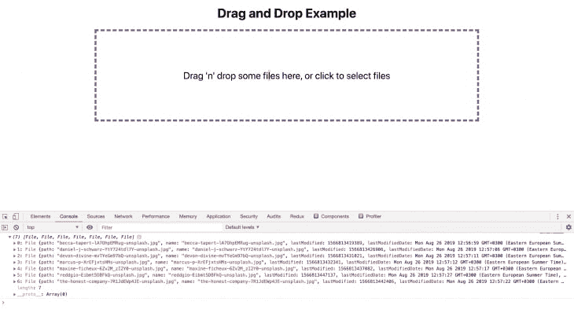
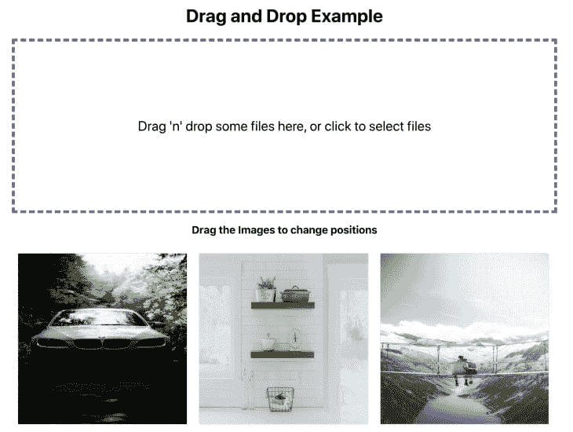

# React 中拖放的最终指南

> 原文:[https://dev . to/bnevilleoneill/the-ultimate-guide-to-drag-and-drop-in-react-5955](https://dev.to/bnevilleoneill/the-ultimate-guide-to-drag-and-drop-in-react-5955)

**作者:[帕拉马南森](https://blog.logrocket.com/author/paramananthamharrison/)哈里森** ✏️

拖放 UI 已经成为大多数现代应用程序不可或缺的一部分。它在不包含 UX 的情况下提供了丰富的用户界面。

拖放 UI 有很多用例。最常见的有:

*   **在浏览器中使用拖放来上传文件。像 Gmail、WordPress、Invision 等产品都将此作为其核心功能之一**
*   **在多个列表之间移动项目。** Trello、Asana 和其他许多生产力产品都有这个功能
*   **重新排列图像或资产。**大多数视频编辑器都有此功能，像 Invision 这样的产品也有此功能，可以在各部分之间重新定位设计资产

今天，我们将通过在 React 中构建一个简单的项目来了解拖放的一些用例。如果你对这个项目感兴趣，你可以在这里找到它。

[T2】](https://logrocket.com/signup/)

我们的简单应用程序将具有以下特性:

*   通过在浏览器中拖放文件来上传图像文件
*   将这些图像的预览显示为网格
*   通过拖放对这些图像重新排序

让我们从使用`create-react-app`引导一个 React 应用程序开始，就像这样:

```
npx create-react-app logrocket-drag-and-drop
cd logrocket-drag-and-drop
yarn start 
```

<svg width="20px" height="20px" viewBox="0 0 24 24" class="highlight-action crayons-icon highlight-action--fullscreen-on"><title>Enter fullscreen mode</title></svg> <svg width="20px" height="20px" viewBox="0 0 24 24" class="highlight-action crayons-icon highlight-action--fullscreen-off"><title>Exit fullscreen mode</title></svg>

## [](#upload-files-using-drag-and-drop)使用拖放上传文件

我们不会通过自己创建所有的逻辑和组件来重新发明轮子。相反，我们将在我们的项目中使用最标准和最著名的库。

对于拖放上传特性，我们将使用 React 中最著名的库之一`react-dropzone`。它在 Github 上有超过 6k 颗星，并且支持 React Hooks。你可以在这里阅读文档[。这是一个非常强大的库，有助于在 React 中创建自定义组件。](https://github.com/react-dropzone/react-dropzone)

先安装一下:

```
yarn add react-dropzone 
```

<svg width="20px" height="20px" viewBox="0 0 24 24" class="highlight-action crayons-icon highlight-action--fullscreen-on"><title>Enter fullscreen mode</title></svg> <svg width="20px" height="20px" viewBox="0 0 24 24" class="highlight-action crayons-icon highlight-action--fullscreen-off"><title>Exit fullscreen mode</title></svg>

安装完之后，让我们创建一个名为`Dropzone.js`的新文件。该组件负责将一个简单的内容区域变成一个 dropzone 区域，您可以在其中放置文件。

`react-dropzone`的工作原理:

*   `react-dropzone`隐藏文件输入并显示漂亮的自定义 dropzone 区域
*   当我们放下文件时，`react-dropzone`使用 HTML `onDrag`事件，并根据文件是否被放入 dropzone 区域来从事件中捕获文件
*   如果我们点击该区域，`react-dropzone`库使用 React `ref`通过隐藏输入启动文件选择对话框，允许我们选择文件并上传

让我们创建一个名为`Dropzone` :
的组件

```
/* 
  filename: Dropzone.js 
*/

import React from "react";
// Import the useDropzone hooks from react-dropzone
import { useDropzone } from "react-dropzone";

const Dropzone = ({ onDrop, accept }) => {
  // Initializing useDropzone hooks with options
  const { getRootProps, getInputProps, isDragActive } = useDropzone({
    onDrop,
    accept
  });

  /* 
    useDropzone hooks exposes two functions called getRootProps and getInputProps
    and also exposes isDragActive boolean
  */

  return (
    <div {...getRootProps()}>
      <input className="dropzone-input" {...getInputProps()} />
      <div className="text-center">
        {isDragActive ? (
          <p className="dropzone-content">Release to drop the files here</p>
        ) : (
          <p className="dropzone-content">
            Drag 'n' drop some files here, or click to select files
          </p>
        )}
      </div>
    </div>
  );
};

export default Dropzone; 
```

<svg width="20px" height="20px" viewBox="0 0 24 24" class="highlight-action crayons-icon highlight-action--fullscreen-on"><title>Enter fullscreen mode</title></svg> <svg width="20px" height="20px" viewBox="0 0 24 24" class="highlight-action crayons-icon highlight-action--fullscreen-off"><title>Exit fullscreen mode</title></svg>

组件是直接的。让我们仔细看看这段代码。

`useDropzone`为我们公开了几个方法和变量来创建自定义的 dropzone 区域。对于我们的项目，我们最感兴趣的是三个不同的属性:

*   `getRootProps`–这是根据 dropzone 区域的父元素设置的道具。所以这个元素决定了 dropzone 区域的宽度和高度
*   `getInputProps`–这是传递给输入元素的属性。这是必需的，这样我们就可以支持点击事件和拖动事件来获取文件
*   所有与我们传递给`useDropzone`的文件相关的选项都将被设置到这个输入元素中。例如，如果您只想支持单个文件，那么您可以通过`multiple: false`。它将自动要求`dropzone`只允许一个文件被接受
*   如果文件被拖动到 dropzone 区域上方，将设置`isDragActive`。这将是非常有用的，使造型的基础上，这个变量

下面是一个如何基于`isDragActive`值设置样式/类名的例子:

```
const getClassName = (className, isActive) => {
  if (!isActive) return className;
  return `${className}  ${className}-active`;
};

...
<div className={getClassName("dropzone", isDragActive)} {...getRootProps()}>
... 
```

<svg width="20px" height="20px" viewBox="0 0 24 24" class="highlight-action crayons-icon highlight-action--fullscreen-on"><title>Enter fullscreen mode</title></svg> <svg width="20px" height="20px" viewBox="0 0 24 24" class="highlight-action crayons-icon highlight-action--fullscreen-off"><title>Exit fullscreen mode</title></svg>

在我们的例子中，我们只使用了两个道具。该库支持很多道具，可以根据你的需要定制`dropzone`区域。

我们使用`accept`道具只允许图像文件。我们的`App.js`应该是这样的:

```
/*
filename: App.js 
*/

import React, { useCallback } from "react";
// Import the dropzone component
import Dropzone from "./Dropzone";

import "./App.css";

function App() {
  // onDrop function 
  const onDrop = useCallback(acceptedFiles => {
    // this callback will be called after files get dropped, we will get the acceptedFiles. If you want, you can even access the rejected files too
    console.log(acceptedFiles);
  }, []);

  // We pass onDrop function and accept prop to the component. It will be used as initial params for useDropzone hook
  return (
    <main className="App">
      <h1 className="text-center">Drag and Drop Example</h1>
      <Dropzone onDrop={onDrop} accept={"image/*"} />
    </main>
  );
}

export default App; 
```

<svg width="20px" height="20px" viewBox="0 0 24 24" class="highlight-action crayons-icon highlight-action--fullscreen-on"><title>Enter fullscreen mode</title></svg> <svg width="20px" height="20px" viewBox="0 0 24 24" class="highlight-action crayons-icon highlight-action--fullscreen-off"><title>Exit fullscreen mode</title></svg>

[T2】](https://res.cloudinary.com/practicaldev/image/fetch/s--BBj3NlbZ--/c_limit%2Cf_auto%2Cfl_progressive%2Cq_auto%2Cw_880/https://blog.logrocket.com/wp-content/uploads/2019/09/dndex-nocdn.png)

我们已经在主页面中添加了`dropzone`组件。现在，如果你放下文件，它会控制放下的图像文件。

*   `acceptedFiles`是一个由`File`值组成的数组。您可以读取文件或将文件发送到服务器并上传。无论你想做什么，你都可以在那里完成
*   甚至当你点击区域并上传时，同样的`onDrop`回调也会被调用
*   道具接受哑剧类型。你可以在[文档](https://github.com/okonet/attr-accept)中查看所有支持的 mime 类型。它支持所有标准的 mime 类型和匹配模式。如果您想只允许 pdf，那么`accept={'application/pdf'}`。如果你既想要图像类型又想要 pdf，那么它支持`accept={'application/pdf, image/*'}`
*   `onDrop`函数被包围在`useCallback`中。截至目前，我们没有进行任何繁重的计算，也没有将文件发送到服务器。我们只是安慰一下`acceptedFiles`。但是稍后，我们将读取文件并设置为在浏览器中显示图像的状态。对于昂贵的函数，建议使用`useCallback`，避免不必要的重新渲染。在我们的例子中，它是完全可选的

让我们读取图像文件并将其添加到`App.js` :
中的一个状态

```
/*
filename: App.js
*/
import React, { useCallback, useState } from "react";
// cuid is a simple library to generate unique IDs
import cuid from "cuid";

function App() {
  // Create a state called images using useState hooks and pass the initial value as empty array
  const [images, setImages] = useState([]);

  const onDrop = useCallback(acceptedFiles => {
    // Loop through accepted files
    acceptedFiles.map(file => {
      // Initialize FileReader browser API
      const reader = new FileReader();
      // onload callback gets called after the reader reads the file data
      reader.onload = function(e) {
        // add the image into the state. Since FileReader reading process is asynchronous, its better to get the latest snapshot state (i.e., prevState) and update it. 
        setImages(prevState => [
          ...prevState,
          { id: cuid(), src: e.target.result }
        ]);
      };
      // Read the file as Data URL (since we accept only images)
      reader.readAsDataURL(file);
      return file;
    });
  }, []);

  ...
} 
```

<svg width="20px" height="20px" viewBox="0 0 24 24" class="highlight-action crayons-icon highlight-action--fullscreen-on"><title>Enter fullscreen mode</title></svg> <svg width="20px" height="20px" viewBox="0 0 24 24" class="highlight-action crayons-icon highlight-action--fullscreen-off"><title>Exit fullscreen mode</title></svg>

我们的`images`状态的数据结构是:

```
const images = [
  {
    id: 'abcd123',
    src: 'data:image/png;dkjds...',
  },
  {
    id: 'zxy123456',
    src: 'data:image/png;sldklskd...',
  }
] 
```

<svg width="20px" height="20px" viewBox="0 0 24 24" class="highlight-action crayons-icon highlight-action--fullscreen-on"><title>Enter fullscreen mode</title></svg> <svg width="20px" height="20px" viewBox="0 0 24 24" class="highlight-action crayons-icon highlight-action--fullscreen-off"><title>Exit fullscreen mode</title></svg>

让我们在网格布局中显示图像预览。为此，我们将创建另一个名为`ImageList`的组件。

```
import React from "react";

// Rendering individual images
const Image = ({ image }) => {
  return (
    <div className="file-item">
      
    </div>
  );
};

// ImageList Component
const ImageList = ({ images }) => {

  // render each image by calling Image component
  const renderImage = (image, index) => {
    return (
      <Image
        image={image}
        key={`${image.id}-image`}
      />
    );
  };

  // Return the list of files
  return <section className="file-list">{images.map(renderImage)}</section>;
};

export default ImageList; 
```

<svg width="20px" height="20px" viewBox="0 0 24 24" class="highlight-action crayons-icon highlight-action--fullscreen-on"><title>Enter fullscreen mode</title></svg> <svg width="20px" height="20px" viewBox="0 0 24 24" class="highlight-action crayons-icon highlight-action--fullscreen-off"><title>Exit fullscreen mode</title></svg>

现在，我们可以将这个 ImageList 组件添加到 App.js 中，并显示图像的预览。

```
function App() {
  ...

  // Pass the images state to the ImageList component and the component will render the images
  return (
    <main className="App">
      <h1 className="text-center">Drag and Drop Example</h1>
      <Dropzone onDrop={onDrop} accept={"image/*"} />
      <ImageList images={images} />
    </main>
  );
} 
```

<svg width="20px" height="20px" viewBox="0 0 24 24" class="highlight-action crayons-icon highlight-action--fullscreen-on"><title>Enter fullscreen mode</title></svg> <svg width="20px" height="20px" viewBox="0 0 24 24" class="highlight-action crayons-icon highlight-action--fullscreen-off"><title>Exit fullscreen mode</title></svg>

我们已经成功地完成了一半的申请。我们将能够使用拖放上传文件，也能够看到图像的预览。

[T2】](https://res.cloudinary.com/practicaldev/image/fetch/s--n0LVDweH--/c_limit%2Cf_auto%2Cfl_progressive%2Cq_auto%2Cw_880/https://blog.logrocket.com/wp-content/uploads/2019/09/dnd-nocdn.png)

接下来，我们将允许使用拖放功能对预览的图像进行重新排序。在此之前，我们将了解一些用于此类解决方案的不同库，以及如何根据我们的应用需求从中选择一个库。

有三种不同的 React 包非常流行于拖放操作:

1.  `react-beautiful-dnd`，[Github 上的 15k 星](https://github.com/atlassian/react-beautiful-dnd)(这个有 Atlasssian 做后盾)
2.  `react-dnd`，[Github 上的 11k 颗星星](https://github.com/react-dnd/react-dnd)
3.  `react-grid-layout`，[Github 上的 9k 星](https://github.com/STRML/react-grid-layout)

所有库在 React 开发人员中同样受欢迎，也有活跃的贡献者，但是每个库都有优点和缺点。

我列出了一个清单，强调了每个库的优缺点:

## [](#react-beautiful-dnd)反应漂亮 DND

### [](#pros)优点

*   它非常适合一维布局(例如，列表),如果你的拖放需要水平移动或垂直移动
    *   例如，一个类似 Trello 的布局和待办事项列表等，都可以通过`react-beautiful-dnd`开箱即用
*   API 是一件轻而易举的事，任何人都可以很容易地解决问题。通过增加代码库的复杂性，开发人员的体验真的很好，也很愉快

### [](#cons)弊

*   `react-beautiful-dnd`不适用于网格，因为您向所有方向移动元素`react-beautiful-dnd`将无法同时计算 x 轴和 y 轴的位置。因此，当拖动网格上的元素时，你的内容会随机移动，直到你放下元素

## [](#react-grid-layout)反应网格布局

### [](#pros)优点

*   它适用于网格。网格本身涵盖了一切，所以从技术上讲，它也适用于一维运动
*   它适用于需要拖放的复杂网格布局
    *   例如，具有完全定制和调整大小功能的仪表板(即 looker、数据可视化产品等)
*   对于大规模的应用需求来说，它的复杂性是值得的

### [](#cons)弊

*   它有一个非常难看的 API——许多计算必须由我们自己完成
*   所有的布局结构都必须通过它们的组件 API 在 UI 中定义，当您动态创建动态元素时，这会带来额外的复杂性

## [](#react-dnd)反应迟钝

### [](#pros)优点

*   它适用于几乎所有的用例(网格、一维列表等)
*   它有一个非常强大的 API，可以在拖放中进行任何定制

### [](#cons)弊

*   对于小例子来说，这个 API 很容易启动。一旦你的应用程序需要一些定制的东西，就很难实现。学习曲线比 react-beautiful-dnd 更高更复杂
*   我们需要做大量的工作来支持网络和触摸设备

对于我们的用例，我选择`react-dnd`。如果我们的布局只涉及一个项目列表，我会选择`react-beautiful-dnd`。但是在我们的例子中，我们有一个图像网格。所以实现拖放的下一个最简单的 API 是`react-dnd`。

## [](#drag-and-drop-for-lists-using-react)使用 React 拖拽列表

在我们深入研究拖放代码之前，我们需要首先理解`react-dnd`是如何工作的。React DND 可以拖动任何元素，也可以放下任何元素。为了实现这一点，react dnd 有几个假设:

*   它需要有所有可删除项目的引用
*   它需要有所有可拖动项目的引用
*   所有可拖放的元素都需要包含在`react-dnd`的上下文提供者中。该提供程序用于初始化和管理内部状态

我们不需要太担心它如何管理状态。它有很好很简单的 API 来暴露这些状态，我们可以用它来计算和更新我们的本地状态。

让我们从代码开始。安装软件包:

```
yarn add react-dnd 
```

<svg width="20px" height="20px" viewBox="0 0 24 24" class="highlight-action crayons-icon highlight-action--fullscreen-on"><title>Enter fullscreen mode</title></svg> <svg width="20px" height="20px" viewBox="0 0 24 24" class="highlight-action crayons-icon highlight-action--fullscreen-off"><title>Exit fullscreen mode</title></svg>

首先，我们将把 ImageList 组件包含在 DND 上下文提供程序中，就像这样:

```
/* 
  filename: App.js 
*/

import { DndProvider } from "react-dnd";
import HTML5Backend from "react-dnd-html5-backend";

function App() {
  ...
  return (
    <main className="App">
      ...
      <DndProvider backend={HTML5Backend}>
        <ImageList images={images} onUpdate={onUpdate} />
      </DndProvider>
    </main>
  );
} 
```

<svg width="20px" height="20px" viewBox="0 0 24 24" class="highlight-action crayons-icon highlight-action--fullscreen-on"><title>Enter fullscreen mode</title></svg> <svg width="20px" height="20px" viewBox="0 0 24 24" class="highlight-action crayons-icon highlight-action--fullscreen-off"><title>Exit fullscreen mode</title></svg>

很简单，我们只需要导入`DNDProvider`并用后端道具初始化它。

正如我之前提到的，这个变量有助于选择拖放所使用的 API。

它支持:

*   HTML5 拖放 API(仅支持 web，不支持触摸设备)
*   触摸拖放 API(触摸设备支持)

目前，我们使用 HTML5 API 来开始，一旦功能完成，我们将编写一个简单的实用程序来为触摸设备提供基本支持。

现在我们需要添加可拖动和可放下的项目。在我们的应用程序中，可拖动和可放下的项目是相同的。我们将拖动`Image`组件并将其放到另一个`Image`组件上。这让我们的工作变得简单了一些。

让我们实现它，就像这样:

```
import React, { useRef } from "react";
// import useDrag and useDrop hooks from react-dnd
import { useDrag, useDrop } from "react-dnd";

const type = "Image"; // Need to pass which type element can be draggable, its a simple string or Symbol. This is like an Unique ID so that the library know what type of element is dragged or dropped on.

const Image = ({ image, index }) => {
  const ref = useRef(null); // Initialize the reference

  // useDrop hook is responsible for handling whether any item gets hovered or dropped on the element
  const [, drop] = useDrop({
    // Accept will make sure only these element type can be droppable on this element
    accept: type,
    hover(item) {
      ...
    }
  });

  // useDrag will be responsible for making an element draggable. It also expose, isDragging method to add any styles while dragging
  const [{ isDragging }, drag] = useDrag({
    // item denotes the element type, unique identifier (id) and the index (position)
    item: { type, id: image.id, index },
    // collect method is like an event listener, it monitors whether the element is dragged and expose that information
    collect: monitor => ({
      isDragging: monitor.isDragging()
    })
  });

  /* 
    Initialize drag and drop into the element using its reference.
    Here we initialize both drag and drop on the same element (i.e., Image component)
  */
  drag(drop(ref));

  // Add the reference to the element
  return (
    <div
      ref={ref}
      style={{ opacity: isDragging ? 0 : 1 }}
      className="file-item"
    >
      
    </div>
  );
};

const ImageList = ({ images }) => {
  ...
};

export default ImageList; 
```

<svg width="20px" height="20px" viewBox="0 0 24 24" class="highlight-action crayons-icon highlight-action--fullscreen-on"><title>Enter fullscreen mode</title></svg> <svg width="20px" height="20px" viewBox="0 0 24 24" class="highlight-action crayons-icon highlight-action--fullscreen-off"><title>Exit fullscreen mode</title></svg>

现在，我们的图像已经可以拖动了。但是如果我们把它放下，图像又会回到原来的位置。因为`useDrag`和`useDrop`会处理它，直到我们放弃它。除非我们改变我们的局部状态，否则它会再次回到原来的位置。

为了更新本地状态，我们需要知道两件事:

*   拖动元素
*   悬停元素(被拖动的元素悬停在其中的元素)

`useDrag`通过`hover`方法公开这些信息。让我们用我们的代码来看看:

```
const [, drop] = useDrop({
    accept: type,
    // This method is called when we hover over an element while dragging
    hover(item) { // item is the dragged element
      if (!ref.current) {
        return;
      }
      const dragIndex = item.index;
      // current element where the dragged element is hovered on
      const hoverIndex = index;
      // If the dragged element is hovered in the same place, then do nothing
      if (dragIndex === hoverIndex) { 
        return;
      }
      // If it is dragged around other elements, then move the image and set the state with position changes
      moveImage(dragIndex, hoverIndex);
      /*
        Update the index for dragged item directly to avoid flickering
        when the image was half dragged into the next
      */
      item.index = hoverIndex;
    }
}); 
```

<svg width="20px" height="20px" viewBox="0 0 24 24" class="highlight-action crayons-icon highlight-action--fullscreen-on"><title>Enter fullscreen mode</title></svg> <svg width="20px" height="20px" viewBox="0 0 24 24" class="highlight-action crayons-icon highlight-action--fullscreen-off"><title>Exit fullscreen mode</title></svg>

当一个元素被拖动并停留在这个元素上时，方法将被触发。通过这种方式，当我们开始拖动一个元素时，我们得到了该元素的索引以及我们所悬停的元素。我们将通过这个`dragIndex`和`hoverIndex`来更新我们的图像状态。

你现在可能有两个问题:

1.  为什么悬停时需要更新状态？
2.  为什么不一边滴一边更新呢？

可以在删除的同时进行更新。然后拖放也将工作，并重新安排位置。但是 UX 不会是好的。

例如，如果你拖动一个图像到另一个图像上，如果我们立即改变位置，那么这将给拖动它的用户一个很好的反馈。否则他们可能不知道拖动功能是否有效，直到他们把图像放到某个位置。

这就是为什么我们在每次悬停时更新状态。当悬停在另一个图像上时，我们设置状态并改变位置。用户将会看到一个漂亮的动画。你可以在我们的演示页面查看。

到目前为止，我们只是将更新状态的代码显示为`moveImage`。我们来看看实现:

```
/*
  filename: App.js
*/

import update from "immutability-helper";

const moveImage = (dragIndex, hoverIndex) => {
    // Get the dragged element
    const draggedImage = images[dragIndex];
    /*
      - copy the dragged image before hovered element (i.e., [hoverIndex, 0, draggedImage])
      - remove the previous reference of dragged element (i.e., [dragIndex, 1])
      - here we are using this update helper method from immutability-helper package
    */
    setImages(
      update(images, {
        $splice: [[dragIndex, 1], [hoverIndex, 0, draggedImage]]
      })
    );
};

// We will pass this function to ImageList and then to Image -> Quiet a bit of props drilling, the code can be refactored and place all the state management in ImageList itself to avoid props drilling. It's an exercise for you :) 
```

<svg width="20px" height="20px" viewBox="0 0 24 24" class="highlight-action crayons-icon highlight-action--fullscreen-on"><title>Enter fullscreen mode</title></svg> <svg width="20px" height="20px" viewBox="0 0 24 24" class="highlight-action crayons-icon highlight-action--fullscreen-off"><title>Exit fullscreen mode</title></svg>

现在，我们的应用程序在支持 HTML5 `onDrag`事件的设备上功能齐全。但不幸的是，它在触摸设备上不起作用。

正如我之前所说，我们可以支持触摸设备以及使用实用功能。这不是最好的解决方案，但仍然有效。不过在触摸设备上拖动的体验不会很好。它只是简单地更新，但你不会觉得你在拖拉。也可以把它弄干净。

```
import HTML5Backend from "react-dnd-html5-backend";
import TouchBackend from "react-dnd-touch-backend";

// simple way to check whether the device support touch (it doesn't check all fallback, it supports only modern browsers)
const isTouchDevice = () => {
  if ("ontouchstart" in window) {
    return true;
  }
  return false;
};

// Assigning backend based on touch support on the device
const backendForDND = isTouchDevice() ? TouchBackend : HTML5Backend;

...
return (
  ...
  <DndProvider backend={backendForDND}>
    <ImageList images={images} moveImage={moveImage} />
  </DndProvider>
)
... 
```

<svg width="20px" height="20px" viewBox="0 0 24 24" class="highlight-action crayons-icon highlight-action--fullscreen-on"><title>Enter fullscreen mode</title></svg> <svg width="20px" height="20px" viewBox="0 0 24 24" class="highlight-action crayons-icon highlight-action--fullscreen-off"><title>Exit fullscreen mode</title></svg>

## [](#conclusion)结论

这是所有的乡亲。我们已经成功地构建了一个小而强大的演示程序，用于拖放文件、上传文件以及重新排序这些文件。你可以点击查看[演示。](https://drag-drop-logrocket.netlify.com/)

该项目的代码库是[这里是](https://github.com/learnwithparam/logrocket-drag-and-drop)。您甚至可以通过查看回购中的分支来一步步了解我是如何构建应用程序的。

我们只是触及了 React 在拖放功能方面的皮毛。我们可以使用拖放库来构建非常详尽的特性。我们讨论了一些业界最好的库。我希望它能帮助您更快、更自信地构建下一个拖放功能。

也看看其他的库，在评论 [](https://res.cloudinary.com/practicaldev/image/fetch/s--0-T2SQiN--/c_limit%2Cf_auto%2Cfl_progressive%2Cq_auto%2Cw_880/https://s.w.oimg/core/emoji/12.0.0-1/72x72/1f60e.png) 里给我看看你用它建了什么

* * *

**编者按:**看到这个帖子有问题？你可以在这里找到正确的版本。

## [](#plug-logrocket-a-dvr-for-web-apps)Plug: [LogRocket](https://logrocket.com/signup/) ，一款适用于网络应用的 DVR

[](https://res.cloudinary.com/practicaldev/image/fetch/s--6FG5kvEL--/c_limit%2Cf_auto%2Cfl_progressive%2Cq_auto%2Cw_880/https://i2.wp.com/blog.logrocket.com/wp-content/uploads/2017/03/1d0cd-1s_rmyo6nbrasp-xtvbaxfg.png%3Fresize%3D1200%252C677%26ssl%3D1)

[log rocket](https://logrocket.com/signup/)是一个前端日志工具，让你重放问题，就像它们发生在你自己的浏览器中一样。LogRocket 不需要猜测错误发生的原因，也不需要向用户询问截图和日志转储，而是让您重放会话以快速了解哪里出错了。它可以与任何应用程序完美配合，不管是什么框架，并且有插件可以记录来自 Redux、Vuex 和@ngrx/store 的额外上下文。

除了记录 Redux 动作和状态，LogRocket 还记录控制台日志、JavaScript 错误、stacktraces、带有头+体的网络请求/响应、浏览器元数据、自定义日志。它还使用 DOM 来记录页面上的 HTML 和 CSS，甚至为最复杂的单页面应用程序重新创建像素级完美视频。

[免费试用](https://logrocket.com/signup/)。

* * *

《React 中拖放操作的终极指南》这篇文章最先出现在[的博客](https://blog.logrocket.com)上。