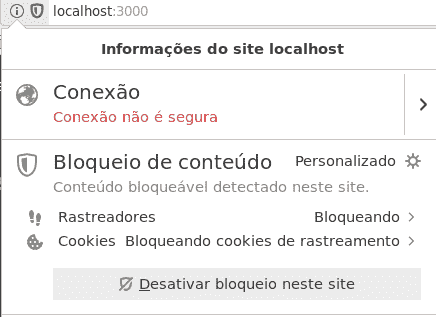

# 在 ReactJS 上嵌入 Twitter 小部件

> 原文:[https://dev . to/heymarkop/embed-Twitter-widget-on-react js-1768](https://dev.to/heymarkkop/embed-twitter-widget-on-reactjs-1768)

我开始做自己的网页，并想在旁边添加一些我最近的推文。

Twitter 有一个[工具](https://publish.twitter.com/)，可以创建嵌入式小工具，但是它们在 JSX 不能开箱即用(React)。

```
<!-- HTML code given by Twitter's Publish tool -->
<a
  class="twitter-timeline"
  href="https://twitter.com/HeyMarkKop?ref_src=twsrc%5Etfw"
>
  Tweets by HeyMarkKop
</a>
<script async
  src="https://platform.twitter.com/widgets.js"
  charset="utf-8"
></script> 
```

<svg width="20px" height="20px" viewBox="0 0 24 24" class="highlight-action crayons-icon highlight-action--fullscreen-on"><title>Enter fullscreen mode</title></svg> <svg width="20px" height="20px" viewBox="0 0 24 24" class="highlight-action crayons-icon highlight-action--fullscreen-off"><title>Exit fullscreen mode</title></svg>

这些是我发现的以下解决方案:

## [](#adding-script-after-mounting)挂载后添加脚本

使用原生 Javascript 和 [useEffect](https://reactjs.org/docs/hooks-effect.html) React hook 在组件挂载后追加脚本元素是我们的第一个选择。

```
// TwitterContainer.js
import React, { useEffect } from "react";

const TwitterContainer = () => {
  useEffect(() => {
    const anchor = document.createElement("a");
    anchor.setAttribute("class", "twitter-timeline");
    anchor.setAttribute("data-theme", "dark");
    anchor.setAttribute("data-tweet-limit", "5");
    anchor.setAttribute("data-chrome", "noheader nofooter noborders");
    anchor.setAttribute("href", "https://twitter.com/HeyMarkKop");
    document.getElementsByClassName("twitter-embed")[0].appendChild(anchor);

    const script = document.createElement("script");
    script.setAttribute("src", "https://platform.twitter.com/widgets.js");
    document.getElementsByClassName("twitter-embed")[0].appendChild(script);
  }, []);

  return (
    <section className="twitterContainer">
      <div className="twitter-embed"></div>
    </section>
  );
};

export default TwitterContainer; 
```

<svg width="20px" height="20px" viewBox="0 0 24 24" class="highlight-action crayons-icon highlight-action--fullscreen-on"><title>Enter fullscreen mode</title></svg> <svg width="20px" height="20px" viewBox="0 0 24 24" class="highlight-action crayons-icon highlight-action--fullscreen-off"><title>Exit fullscreen mode</title></svg>

另一种编码方式是:

```
// TwitterContainer.js
import React, { useEffect } from "react";

const TwitterContainer = () => {
  useEffect(() => {
    const script = document.createElement("script");
    script.src = "https://platform.twitter.com/widgets.js";
    document.getElementsByClassName("twitter-embed")[0].appendChild(script);
  }, []);

  return (
    <section className="twitterContainer">
      <div className="twitter-embed">
        <a
          className="twitter-timeline"
          data-theme="dark"
          data-tweet-limit="5"
          data-chrome="noheader nofooter noborders"
          href="https://twitter.com/HeyMarkKop"
        >
          Tweets by HeyMarkKop
        </a>
      </div>
    </section>
  );
};

export default TwitterContainer; 
```

<svg width="20px" height="20px" viewBox="0 0 24 24" class="highlight-action crayons-icon highlight-action--fullscreen-on"><title>Enter fullscreen mode</title></svg> <svg width="20px" height="20px" viewBox="0 0 24 24" class="highlight-action crayons-icon highlight-action--fullscreen-off"><title>Exit fullscreen mode</title></svg>

## [](#using-a-react-component)使用 React 组件

另一个解决方案是使用 [react-twitter-embed](https://github.com/capaj/react-tweet-embed) 库。

这里有一个例子:

```
// TwitterContainer.js
import React from "react";
import { TwitterTimelineEmbed } from "react-twitter-embed";

const TwitterContainer = () => {
  return (
    <section className="twitterContainer">
      <div className="twitter-embed">
        <TwitterTimelineEmbed
          sourceType="profile"
          screenName="HeyMarkKop"
          options={{
            tweetLimit: "10",
            width: "100%",
            height: "100%"
          }}
          theme="dark"
          noHeader="true"
          noBorders="true"
          noFooter="true"
        ></TwitterTimelineEmbed>
      </div>
    </section>
  );
};

export default TwitterContainer; 
```

<svg width="20px" height="20px" viewBox="0 0 24 24" class="highlight-action crayons-icon highlight-action--fullscreen-on"><title>Enter fullscreen mode</title></svg> <svg width="20px" height="20px" viewBox="0 0 24 24" class="highlight-action crayons-icon highlight-action--fullscreen-off"><title>Exit fullscreen mode</title></svg>

## [](#setting-options)设置选项

您可以按照上面的示例来了解如何将一些选项传递给脚本，但是这里有一些包含更多信息的链接:

*   [https://developer . Twitter . com/en/docs/Twitter-for-websites/timeline/overview](https://developer.twitter.com/en/docs/twitter-for-websites/timelines/overview)
*   [https://saurabhnemade.github.io/react-twitter-embed](https://saurabhnemade.github.io/react-twitter-embed)

## [](#if-it-doesnt-work)如果不工作

值得注意的是，我没有找到禁用 twitter 跟踪的方法，因此在启用浏览器跟踪保护的情况下，推文不会出现。

[T2】](https://res.cloudinary.com/practicaldev/image/fetch/s--mhPyD1TA--/c_limit%2Cf_auto%2Cfl_progressive%2Cq_auto%2Cw_880/http://i.imgur.com/7Q0twsL.png)

## [](#some-useful-references)一些有用的参考资料:

*   [https://publish.twitter.com](https://publish.twitter.com)
*   [https://github.com/capaj/react-tweet-embed](https://github.com/capaj/react-tweet-embed)
*   [https://stack overflow . com/questions/34424845/adding-script-tag-to-react-jsx](https://stackoverflow.com/questions/34424845/adding-script-tag-to-react-jsx)