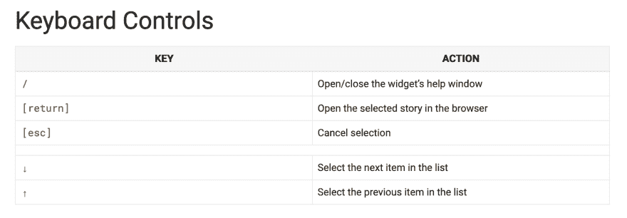
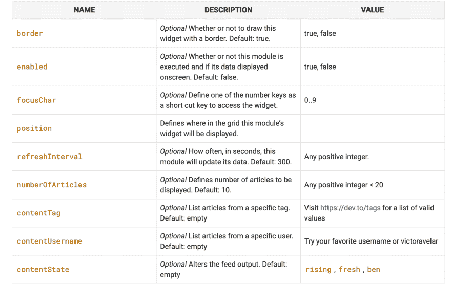

# devto 模块

> 原文:[https://dev.to/victoravelar/the-devto-module-k91](https://dev.to/victoravelar/the-devto-module-k91)

⚠️，模块已经准备好，等待⚠️的检阅

这是源代码

# [ 实现 WTF devto 模块 #644](https://github.com/wtfutil/wtf/pull/644) 

[](https://github.com/VictorAvelar) **[VictorAvelar](https://github.com/VictorAvelar)** posted on [<time datetime="2019-09-20T16:40:49Z">Sep 20, 2019</time>](https://github.com/wtfutil/wtf/pull/644)[View on GitHub](https://github.com/wtfutil/wtf/pull/644)

## [](#thoughts-on-the-process)思想上的过程

缺乏关于如何创建模块的明确信息，所以如果你渴望创建一个模块，你将需要阅读大量的代码。

我发现的另一件棘手的事情是正确地配置键盘集成，但是有一些惊人的模块具有这个特性，您可以复制和修改。

确保在开始之前阅读`CONTRIBUTING.md`文件，它将允许你用所有的需求来计划开发。

最后，请更新文档，如果你看一下源代码，你会发现很多好的模块都没有文档。

## [](#the-process)流程

1.  熟悉 Go 模块，因为它是`wtfutil/wtf`使用的依赖管理系统。

2.  检查现有的模块，这样你可以得到想法，也可以了解一切是如何工作的。

3.  如果您打算安装一些模块，现在是时候了，对于当前的模块，我只是使用了我们在本系列中构建的 API 客户端。

    ## /[devto-API-go](https://github.com/VictorAvelar/devto-api-go)

    ### 开发到 API 的 go 客户端

    <article class="markdown-body entry-content container-lg" itemprop="text">

    # 开发应用编程接口

    开发到 API 的 go 客户端

    [T2】](https://opensource.org/licenses/MIT)

    #### 特拉维斯·CI

    [T2】](https://travis-ci.org/VictorAvelar/devto-api-go)

    #### 仔细或彻底检查

    [](https://scrutinizer-ci.com/g/VictorAvelar/devto-api-go/build-status/master)[](https://scrutinizer-ci.com/g/VictorAvelar/devto-api-go/?branch=master)[](https://scrutinizer-ci.com/g/VictorAvelar/devto-api-go/?branch=master)

    #### Go 生态系统

    [ ](https://goreportcard.com/report/github.com/VictorAvelar/devto-api-go) [ ](https://godoc.org/github.com/VictorAvelar/devto-api-go)

    ## 路标

    *   基本客户端和配置
    *   文章资源
    *   CLI 实用程序
    *   认证资源
    *   扩展测试套件
    *   提供代码示例

    ## 放弃

    这个库不是一个官方的开发者 API 库，而是对开发者社区的友好贡献

    </article>

    [View on GitHub](https://github.com/VictorAvelar/devto-api-go)
4.  转到模块目录，创建一个子目录开始编码，对于这个模块是`modules/devto`

## [](#the-files)文件

将所有内容放在一个文件中是可能的，但是我喜欢将代码分开，这样文件名就可以引用内容。

在检查了`hackernews`模块是如何工作的(这极大地启发了整个系列)之后，我很清楚自己需要什么。

在`keyboard.go`中，我们将为我们的模块放置所有的键盘绑定，我们需要能够从一个历史导航到另一个历史，并且我们还需要能够在我们的默认浏览器中打开内容。

为了方便起见，我会在这里放一张模块文档的截图:

[T2】](https://res.cloudinary.com/practicaldev/image/fetch/s--aiBCXbPz--/c_limit%2Cf_auto%2Cfl_progressive%2Cq_auto%2Cw_880/https://thepracticaldev.s3.amazonaws.com/i/smmryolxwlvpljkexlwx.png)

从代码的角度来看，这并不令人惊讶，这里你有实现这个功能的片段

```
func (widget *Widget) initializeKeyboardControls() {
    widget.InitializeCommonControls(widget.Refresh)

    widget.SetKeyboardKey(tcell.KeyDown, widget.Next, "Select next item")
    widget.SetKeyboardKey(tcell.KeyUp, widget.Prev, "Select previous item")
    widget.SetKeyboardKey(tcell.KeyEnter, widget.openStory, "Open story in browser")
    widget.SetKeyboardKey(tcell.KeyEsc, widget.Unselect, "Clear selection")
} 
```

<svg width="20px" height="20px" viewBox="0 0 24 24" class="highlight-action crayons-icon highlight-action--fullscreen-on"><title>Enter fullscreen mode</title></svg> <svg width="20px" height="20px" viewBox="0 0 24 24" class="highlight-action crayons-icon highlight-action--fullscreen-off"><title>Exit fullscreen mode</title></svg>

在`settings.go`中，您从用户的`config.yaml`文件中获取值，并将其放入您的小部件中。

[T2】](https://res.cloudinary.com/practicaldev/image/fetch/s--lQj35Pja--/c_limit%2Cf_auto%2Cfl_progressive%2Cq_auto%2Cw_880/https://thepracticaldev.s3.amazonaws.com/i/48mkcifly63jo5teqiv2.png)

下面是使用这个模块的 YAML:

```
devto:
  enabled: true
  numberOfArticles: 10
  position:
    top: 1
    left: 1
    height: 1
    width: 2
  contentTag: "showdev" 
  contentUsername: "victoravelar"
  contentState: "rising" 
```

<svg width="20px" height="20px" viewBox="0 0 24 24" class="highlight-action crayons-icon highlight-action--fullscreen-on"><title>Enter fullscreen mode</title></svg> <svg width="20px" height="20px" viewBox="0 0 24 24" class="highlight-action crayons-icon highlight-action--fullscreen-off"><title>Exit fullscreen mode</title></svg>

最后是`widget.go`，TBH 这只是一个 hackernews 窗口小部件文件，做了一些定制，使它能与 dev.to API 一起工作。

## [](#conclusions)结论

这并不像预期的那么难，我希望很多人能够从这个社区直接获得他们终端的文章。

做好自己，请让世界知道。