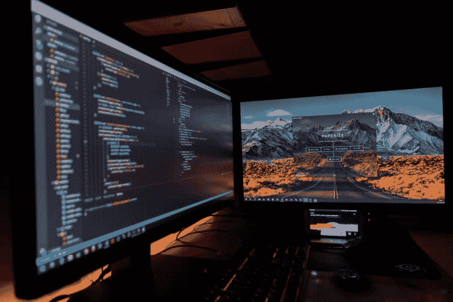

# 熨斗学校的 Linux 开发环境

> 原文：<https://dev.to/eclecticcoding/linux-development-environment-for-flatiron-school-2h9b>

我已经涉足 Linux 很多年了，我想用我新的 System76 笔记本电脑来编码。下面是我为熨斗学校目前使用的学习环境开发的解决方案。本教程将介绍如何设置 [RVM](https://rvm.io/) (用于 Ruby 版本管理)、Ruby gems [Nokogiri](https://nokogiri.org/) 和 [Learn-co](https://rubygems.org/gems/learn-co/versions/1.0.4) 、 [NVM](https://github.com/nvm-sh/nvm) (用于节点版本管理)、SQlite 和 [Postgres](https://www.postgresql.org/) 。

你可以在媒体上继续阅读。

[继续在介质上读取](https://medium.com/@EclecticCoder/linux-development-environment-for-flatiron-school-c06069f23a5a?source=rss-ef76d2e219b4------2)