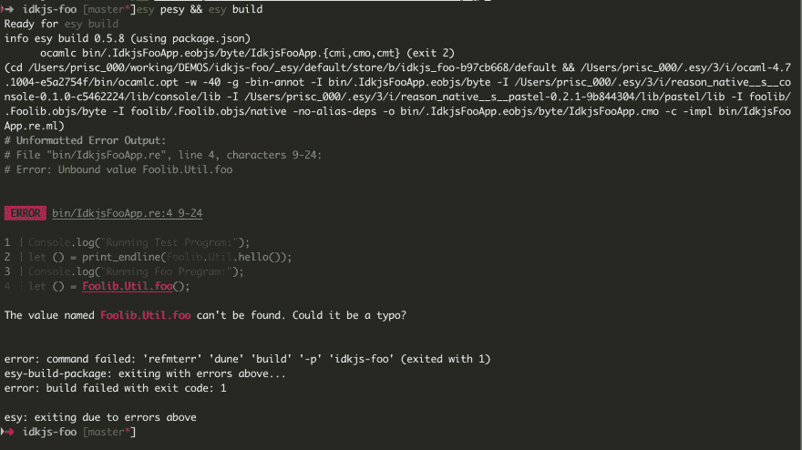

# 创建、发布到 NPM，以及使用原因库和工具

> 原文:[https://dev . to/idkjs/creating-publishing-to-NPM-and-use-reason-libraries-and-tools-58mf](https://dev.to/idkjs/creating-publishing-to-npm-and-using-reason-libraries-and-tools-58mf)

### [](#tldr)TLDR

1.  原指令为[此处](https://github.com/esy/pesy/blob/master/README.md)。
2.  这里的`foo`回购是[T2。](https://github.com/idkjs/esy-pesy-tutorial)
3.  这里的`bar`回购是[T2。](https://github.com/idkjs/esy-pesy-tutorial-bar)

## [](#creating-our-first-library)创建我们的第一个库

首先要做的是安装`pesy`。

```
npm install -g pesy 
```

开始发布你的库的最简单的方法是将源代码发布到 NPM。让我们看一个例子。

在最初的指令中，使用了项目名 foo。我们将下面示例中的`foo`改为其他项目名称，因为`foo`已经在 npm 上使用，您将无法使用该名称运行`npm publish`。

对于这个演示，我使用了`idkjs-foo`。
考虑一个你在 NPM 创建并发布的基础包`foo`。让我们假设，`bar`是消耗`foo`的包。

```
$ mkdir idkjs-foo
$ cd idkjs-foo
$ pesy
# edit code
$ esy pesy # if build config has changes
$ esy build
$ npm publish 
```

发布到 npm 只是运行`npm publish`的问题。让我们仔细看看这些命令。

```
$ mkdir idkjs-foo
$ cd idkjs-foo
$ pesy 
```

正如您现在所知道的，这些命令 bootstrap 安装依赖项并构建整个项目。

此时，我们的项目看起来是这样的

```
│
├── library
│
├── executable
│
├── test
│
└── testExe (test runner) 
```

package.json 的`buildDirs`部分如下所示

```
 "buildDirs":  {  "test":  {  "require":  [  "idkjs-foo/library",  "rely.lib"  ],  "flags":  [  "-linkall",  "-g"  ]  },  "testExe":  {  "require":  [  "idkjs-foo/test"  ],  "bin":  {  "RunIdkjsFooTests.exe":  "RunIdkjsFooTests.re"  }  },  "library":  {},  "executable":  {  "require":  [  "idkjs-foo/library"  ],  "bin":  {  "IdkjsFooApp.exe":  "IdkjsFooApp.re"  }  }  }, 
```

鉴于 pesy 试图统一包和库，对于上面提到的配置，它已经在名称空间`Library`下提供了`library`。因此，每当`foo`作为依赖项被添加时，代码库中就会有一个模块`Library`可用。

由于`Library`是通用的，所以我们将其重命名为`FooLib`(即把包重命名为 foolib)

```
$ mv library foolib 
```

并更新配置

```
 "buildDirs": {
    "test": {
      "require": [
-        "idkjs-foo/library" +        "idkjs-foo/foolib"
        "rely.lib"
      ],
      "flags": [
        "-linkall",
        "-g"
      ]
    },
    "testExe": {
      "require": [
        "idkjs-foo/test"
      ],
      "bin": {
        "RunFooTests.exe": "RunFooTests.re"
      }
    },
-    "library": {}, +    "foolib": {},
    "executable": {
      "require": [
-        "idkjs-foo/library" +        "idkjs-foo/foolib"
      ],
      "bin": {
        "IdkjsFooApp.exe": "IdkjsFooApp.re"
      }
    }
  }, 
```

由于 config 已经更改，我们运行`esy pesy`和`esy build`来构建项目。

```
$ esy pesy
$ esy build 
```

让我们也编辑一下 utils . re

```
let foo = () => print_endline("Hello from foo"); 
```

让我们称之为从`IdkjsFooApp.re`开始。

```
let () = Foolib.Util.foo(); 
```

运行`esy build`，你会得到一个错误，因为`Foolib.Util.foo()`在`Utils.rei`中不可用，它控制`Utils.re`中的哪些函数从`Utils.re`模块中暴露出来。这里值得注意的是，当使用 reason-native 时，你得到的错误是多么的愚蠢。如果你习惯于使用`reason`和`bucklescript`的话，你应该已经知道编译器的错误信息需要一分钟来适应，但是这是非常惊人的。它们只是格式不太清楚。在这里，就在干扰的中间是格式清晰、颜色编码的错误，其类型签名不匹配。您几乎可以将函数的签名复制/粘贴到`.rei`中。这里，错误告诉我们`Foolib.Util.foo`功能对`IdkjsFooApp.re`不可用。就这么办吧。

[T2】](https://res.cloudinary.com/practicaldev/image/fetch/s--dNQU6Zvl--/c_limit%2Cf_auto%2Cfl_progressive%2Cq_auto%2Cw_880/https://thepracticaldev.s3.amazonaws.com/i/mu32ihoi3kcloq8j0x9b.png)

通过在`Utils.rei`中添加以下内容来暴露`foo`:

```
let foo: unit => unit; 
```

构建并发布！

```
$ esy build
$ npm publish 
```

就是这样。我们刚刚在 NPM 创建并出版了我们的第一个图书馆。接下来我们将在一个完全不同的项目中使用这个库，这个项目叫做，wait it，wait it，`Bar`！

## [](#consuming-our-foo-library-from-npm)从 NPM 消费我们的 Foo 库

让我们快速创建一个新项目，`bar`并添加`idkjs-foo`。

```
$ mkdir bar
$ cd bar
$ pesy
$ esy add idkjs-foo 
```

我们现在可以要求`idkjs-foo`(有点像我们在 Javascript 中做的)

```
 "buildDirs": {
    "test": {
      "require": [
        "bar/library",
        "rely.lib"
      ],
      "flags": [
        "-linkall",
        "-g"
      ]
    },
    "testExe": {
      "require": [
        "bar/test"
      ],
      "bin": {
        "RunBarTests.exe": "RunBarTests.re"
      }
    },
    "library": {
      "require": [
+        "idkjs-foo/foolib"
      ]
    },
    "executable": {
      "require": [
        "bar/library"
      ],
      "bin": {
        "BarApp.exe": "BarApp.re"
      }
    }
  }, 
```

然后编辑 Utils.re

```
let foo = () => {
  Foolib.Util.foo();
  print_endline("This is from bar");
}; 
```

然后编辑`Utils.rei`来公开`foo`函数，就像我们上面做的那样。

```
let foo: unit => unit; 
```

从`BarApp.re` :
调用 foo

```
Console.log("Running Foo function");
let () = Library.Util.foo(); 
```

```
$ esy pesy
$ esy build
$ esy x BarApp.exe
Running Test Program:
Hello, World!
Running Foo function Hello from foo
This is from bar 
```

发布和消费来自 NPM 的本地包很容易。我们只需要记住，从我们的库中公开的名称空间依赖于文件夹的名称！

感谢 [@jordwalke](https://mobile.twitter.com/jordwalke) 谁是 [readem.md](https://github.com/esy/pesy/blob/master/README.md) 这基本上是对的直接复制，除了更新的地方和一些额外的评论。

感谢[@ _ 安蒙泰罗](https://mobile.twitter.com/_anmonteiro)， [Et7f3](https://github.com/Et7f3) ，[格里菲斯](https://discordapp.com/channels/235176658175262720/235200837608144898/624302640171319321)， [lessp](https://discordapp.com/channels/235176658175262720/235200837608144898/624303076446175243) ， [@ulrikstrid](https://mobile.twitter.com/UlrikStrid) ， [@cem2ran](https://mobile.twitter.com/cem2ran) ， [@jordwalke](https://mobile.twitter.com/jordwalke) 在`reasonml`[#原生开发](https://discord.gg/sFMSycu)频道举办的即兴大师课，除了可能是为了分享知识，没有任何该死的理由。我希望这篇文章是对他们慷慨的适当回报。《大师课》是一本好书。它从本地发展频道开始。