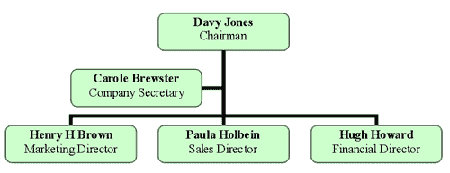

# 图像可访问性 101:图像地图

> 原文:[https://dev . to/alhasenzahl/image-accessibility-101-image-maps-2kc 6](https://dev.to/alhasenzahl/image-accessibility-101-image-maps-2kc6)

图像映射是包含可点击区域的图像。

## [](#tips-for-writing-the-alt-text)书写 alt 文本的提示:

1)这种类型的图像还需要两部分描述，一部分用于整个图像，另一部分用于每个可点击区域。

2)图像的 alt 属性内部是整个图像的基本描述。

3)每个可点击区域还被赋予其自己的 alt 属性，该属性将包含当他们点击图像的该区域时将会发生什么或者他们将被带到哪里的描述。

## [](#examples)例子:

[](https://res.cloudinary.com/practicaldev/image/fetch/s--P7J044Ni--/c_limit%2Cf_auto%2Cfl_progressive%2Cq_auto%2Cw_880/https://thepracticaldev.s3.amazonaws.com/i/ugjjhrqc0b3jfpjmqqp8.png)T3】

```


<map name="Map" id="Map">
    <area
        shape="rect"
        coords="176,14,323,58"
        href="chairman.html"
        alt="Davy Jones: Chairman"
    >
    <area 
        shape="rect" 
        coords="81,75,226,114" 
        href="secretary.html"
        alt="Carole Brewster: Company Secretary"
    >
    <area 
        shape="rect" 
        coords="6,138,155,182" 
        href="marketing-director.html"
        alt="Henry H Brown: Marketing Director (reports to chairman)"
    >
    <area 
        shape="rect"
        coords="175,138,323,182"
        href="sales-director.html"
        alt="Paula Holbein: Sales Director (reports to chairman)"
    >
    <area
        shape="rect" 
        coords="345,136,496,186" 
        href="finance-director.html"
        alt="Hugh Howard: Finance Director (reports to chairman)"
    >
</map> 
```

上面的例子是一家公司的组织结构图，显示了所有人的姓名、职位以及他们的角色之间的关系。在该图中，图表中每个人的区域是一个可点击的元素，可以将用户带到该人的传记。

图像的第一个备选文本解释说，图像是一个公司董事会和相关工作人员的组织结构图，而每个可点击区域向用户传达该人的姓名、角色以及他们是否向任何人报告。

## [](#summary)总结

图像地图是包含可点击区域的图像。这些图像还需要两部分的描述:一部分描述整个图像，另一部分描述图像中每个可点击的区域。对每个可点击区域的描述应该解释当他们点击链接时会发生什么或者会去哪里。