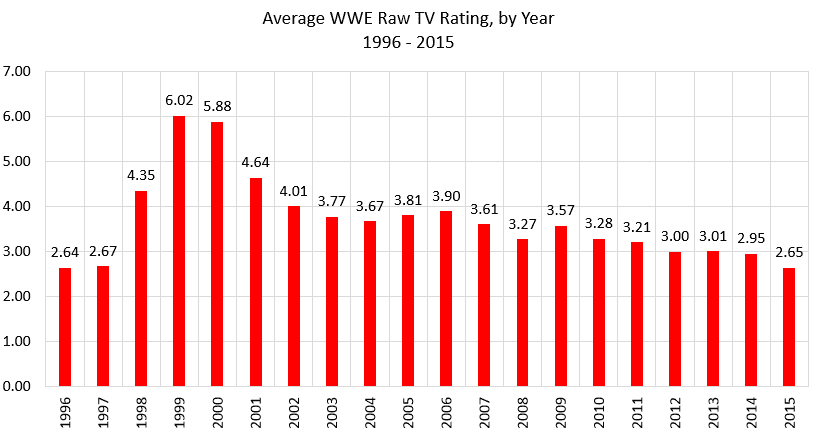
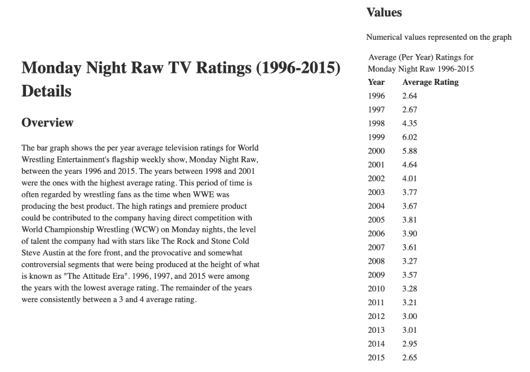

# 图像可访问性 101:复杂图像

> 原文:[https://dev . to/alhasenzahl/image-accessibility-101-complex-images-3en 1](https://dev.to/alhasenzahl/image-accessibility-101-complex-images-3en1)

复杂图像是描绘详细信息的图像。这些图像包括图表、图解、插图、天气图或任何其他无法用一个短语或句子概括的图像。

## [](#tips-for-writing-the-alt-text)书写 alt 文本的提示:

1)这种类型的图像需要两个单独的描述:一个用于图像本身，另一个较长的描述解释图像所描绘的数据和信息。

2)图像的基本描述在图像的 alt 属性中。

3)长描述需要在其他地方可用，或者在与图像相同的页面上的内容中，或者通过到另一个页面的关联链接。

4)对于这种类型的图像，有几种不同的方法来处理长描述方面。我将在下面讨论每一种方法，并解释每种方法的优缺点。

## [](#examples)例子:

[T2】](https://res.cloudinary.com/practicaldev/image/fetch/s--c9kmasmE--/c_limit%2Cf_auto%2Cfl_progressive%2Cq_auto%2Cw_880/https://thepracticaldev.s3.amazonaws.com/i/jj8j2nt3eyjav8zcbwob.png)

[T2】](https://res.cloudinary.com/practicaldev/image/fetch/s--fcfxT4On--/c_limit%2Cf_auto%2Cfl_progressive%2Cq_auto%2Cw_880/https://thepracticaldev.s3.amazonaws.com/i/cw9vj7fm92178qujvvo2.png)

这两张照片显示了 1996 年至 2015 年世界摔跤娱乐公司的每周现场直播节目《周一夜》的年平均电视收视率信息。第一个图像是一个条形图，其中 x 轴列出了年份(1996-2015)，y 轴列出了平均评分(1-7)。第二张图片是图表的详细描述，更详细地解释了图表的数据。本说明的第一部分是概述段落，内容如下...

> 该条形图显示了 1996 年至 2015 年间，世界摔跤娱乐旗舰周播节目《周一夜未加工》的年平均电视收视率。1998 年至 2001 年是平均评分最高的几年。这段时间往往被摔跤迷视为 WWE 在生产最好的产品的时候。高收视率和首映产品可能是由于该公司在周一晚上与世界摔跤锦标赛(WCW)直接竞争，该公司在前线拥有摇滚和冷石·史蒂夫·奥斯汀等明星的人才水平，以及在所谓的“态度时代”的高峰期制作的挑衅和有点争议的片段。1996 年、1997 年、2015 年是平均评分最低的几年。其余年份的平均评级一直在 3 到 4 之间。

这份详细说明的第二部分包括一个表格，列出了每年的情况及其平均评级，如图所示。这些数据点如下...

| 年 | 平均年度评级 |
| --- | --- |
| One thousand nine hundred and ninety-six | Two point six four |
| One thousand nine hundred and ninety-seven | Two point six seven |
| One thousand nine hundred and ninety-eight | Four point three five |
| One thousand nine hundred and ninety-nine | Six point zero two |
| Two thousand | Five point eight eight |
| Two thousand and one | Four point six four |
| Two thousand and two | Four point zero one |
| Two thousand and three | Three point seven seven |
| Two thousand and four | Three point six seven |
| Two thousand and five | Three point eight one |
| Two thousand and six | Three point nine |
| Two thousand and seven | Three point six one |
| Two thousand and eight | Three point two seven |
| Two thousand and nine | Three point five seven |
| Two thousand and ten | Three point two eight |
| Two thousand and eleven | Three point two one |
| Two thousand and twelve | Three |
| Two thousand and thirteen | Three point zero one |
| Two thousand and fourteen | Two point nine five |
| Two thousand and fifteen | Two point six five |

### [](#long-description-approach-1)长描述方法#1

```
<figure role="group">
    
    <figcaption>
        <a href="raw-ratings.html">
          Monday Night Raw TV Ratings details from graph above
        </a>
    </figcaption>
</figure> 
```

上述方法包括链接到一个单独的页面，在该页面上可以找到图形的详细描述。我们将图片和详细描述链接包装在一个`<figure>`标签中，同时将详细描述链接包装在一个`<figcaption>`标签中。这允许屏幕阅读器和辅助技术向用户传达图像和链接是相互关联的。

#### [](#pros)优点:

1)所有浏览器和辅助技术都支持这种方法

2)这反过来使得每个人都可以访问长描述中的信息。

#### [](#cons)缺点:

1)这种方法确实将用户带到一个单独的页面来查看详细的描述信息，这在某些情况下并不总是理想的。

### [](#long-description-approach-2)长描述方法二

```
 <section>
        
    </section>
    [...]
    <section>
        <h2>Monday Night Raw TV Ratings Details</h2>
        <h3>Overview</h3>
        <p>The bar graph shows the per year average television ratings for World 
Wrestling Entertainment's flagship weekly show, Monday Night Raw,  between the 
years 1996 and 2015...</p>
        <h3>Values</h3>
        <p>Numerical values represented on the graph</p>
        <table>
            <caption>Average (Per Year) Ratings for Monday Night Raw 1996-2015</caption>
            <thead>
                <tr>
                    <th>Year</th>
                    <th>Average Rating</th>
                </tr>
            </thead>
            <tbody>
                <tr>
                    <td>1996</td>
                    <td>2.64</td>
                </tr>
                [...]       
            </tbody>
        </table>
    </section> 
```

#### [](#pros)优点:

1)这种方法允许长描述与图像在同一页面上，这使得用户不必离开原始页面来查看详细描述。

2)长描述仍然对每个人可用，因为它包含在页面的文本内容中。

#### [](#cons)缺点:

1)这种方法只有在替代文本中的详细描述非常具体的情况下才有效。如果不具体，那么用户可能会对在哪里找到正确的信息感到困惑，或者他们不得不花时间在页面上搜索信息。

### [](#long-description-approach-3)长描述方法三

```
<figure role="group">
    
    <figcaption>
        <h2>Monday Night Raw TV Ratings Details</h2>
        <h3>Overview</h3>
        <p>The bar graph shows the per year average television ratings for World 
Wrestling Entertainment's flagship weekly show, Monday Night Raw, between the years 
1996 and 2015...</p>
        <h3>Values</h3>
        <p>Numerical values represented on the graph</p>
        <table>
            <caption>Average (Per Year) Ratings for Monday Night Raw 1996-2015</caption>
            <thead>
                <tr>
                    <th>Year</th>
                    <th>Average Rating</th>
                </tr>
            </thead>
            <tbody>
                <tr>
                    <td>1996</td>
                    <td>2.64</td>
                </tr>
            </tbody>
        </table>
    </figcaption>
</figure> 
```

#### [](#pros)优点:

1)这种方法还使用户不必为了查看长描述而离开当前页面。

2)长描述对每个人都是可用的，因为在这种方法中它也包含在页面内容中。

3)因为长描述在与图像的`<figure>`标签相关联的`<figcaption>`标签内，这使得用户不必潜在地搜索页面来寻找内容。

#### [](#cons)缺点:

1)根据页面的设计需求和详细描述中包含的信息长度，以这种方式将所有信息都包含在页面内容中可能并不可取。它最终会使页面变得相当长，并给用户提供大量信息，让用户一次通读并处理。

## [](#summary)总结

一幅图像代表了极其详细的信息，并且不能用一个简短的短语或句子来解释或描述，这是一幅复杂的图像。这些图像可以是图形、图表、天气图、插图或图像，其中页面内容依赖于用户对图像内容的理解。这些图像需要两部分的描述:一部分描述图像的基本背景，另一部分用较长的描述来解释图像提供的信息和数据。

有几种不同的方法可以将长描述包含在代码中。每一个都允许访问该页面的每个人都可以使用该信息，但是在您的页面上使用哪一个取决于设计、用户体验以及最终什么对您的站点最有意义。只要这两个描述都包含在内，并且长描述以一种包含适当语义的方式与图像相关联，并使每个人都可以使用它，那么就应该万事大吉了！