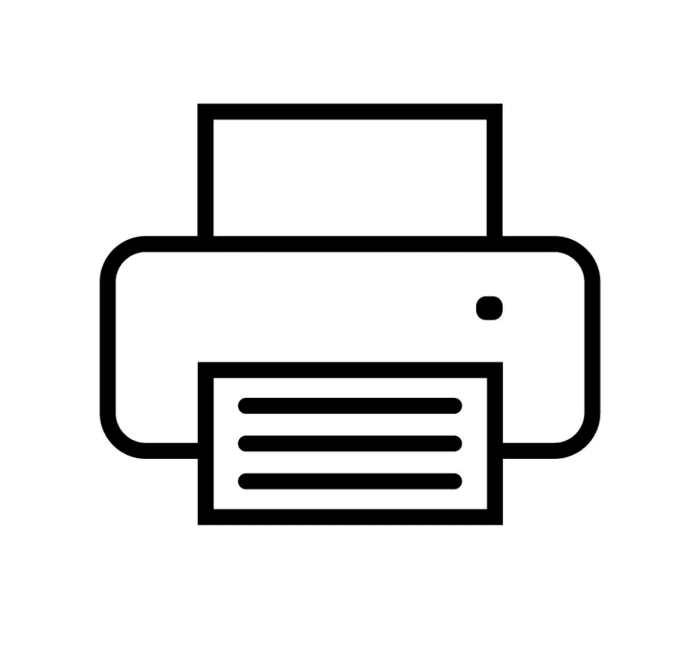

# 图像可访问性 101:功能图像

> 原文：<https://dev.to/alhasenzahl/image-accessibility-101-functional-images-e7>

功能映像是启动操作而不是共享信息的映像。这些图像可以增强按钮、链接和其他功能元素。

## 书写 alt 文本的提示:

1)它应该描述当你点击图像时将发生的动作，而不是图像是什么。

2)这对于理解所显示内容的功能至关重要。

## 例子:

[](https://res.cloudinary.com/practicaldev/image/fetch/s--quIZ866C--/c_limit%2Cf_auto%2Cfl_progressive%2Cq_auto%2Cw_880/https://thepracticaldev.s3.amazonaws.com/i/xa6ubp3mkvlqmo1cpckd.png)T3】

```
<a href="https://www.netflix.com">
    
</a> 
```

上面的图像被认为是一个功能性图像，因为徽标被用作一个链接，将用户重定向回网站的主页。因此，您希望在 alt 文本中包含单词`Home`,以向用户表明单击该链接会将您带回主页。

> 如果徽标只是作为一个独立的图像使用，而不是一个链接，那么 alt 文本将会显示为`alt="Netflix"`。

[](https://res.cloudinary.com/practicaldev/image/fetch/s--XMtask2U--/c_limit%2Cf_auto%2Cfl_progressive%2Cq_auto%2Cw_880/https://thepracticaldev.s3.amazonaws.com/i/s9ts58aa0hgprna6nk7o.jpg)T3】

```
<button onclick="window.print();">
    
</button> 
```

这个图像也被认为是功能性的，因为它是一个按钮内的图像，当点击时打印当前页面的内容。打印机的图像向视力正常的用户指示该按钮用于打印。但是，对于那些看不到打印机的人来说，alt 文本需要向他们传达这个动作。

## 总结

用于启动操作或增强页面上的功能元素的图像是功能图像。alt 文本反映将要发生的动作，而不是描述图像是什么，这一点非常重要。