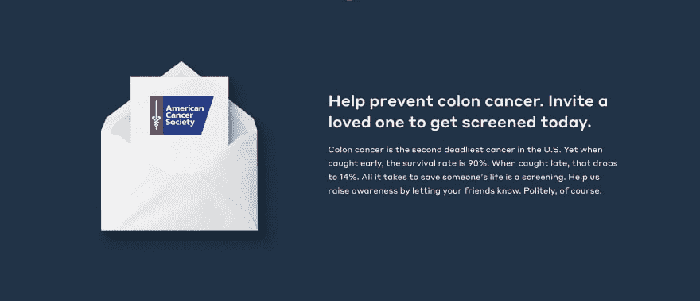

# 图像可访问性 101:装饰图像

> 原文:[https://dev . to/alhasenzahl/image-accessibility-101-decorative-images-3b 30](https://dev.to/alhasenzahl/image-accessibility-101-decorative-images-3b30)

装饰性图像是一种在不添加任何额外重要信息的情况下增加网站视觉吸引力的图像。严格来说，这个图像可以是一个视觉装饰，也可以是一个其内容已经在页面的文本内容中得到充分描述的图像。

## [](#tips-for-writing-the-alt-text)书写 alt 文本的提示:

1)对于这些图像，您希望将 alt 属性留空(`alt=""`)。

## [](#examples)例子:

[](https://res.cloudinary.com/practicaldev/image/fetch/s--EjDpzkn1--/c_limit%2Cf_auto%2Cfl_progressive%2Cq_auto%2Cw_880/https://thepracticaldev.s3.amazonaws.com/i/lyba5sanc8r7pm7gggps.png)T3】

```
<div class="envelope__image">
   
   
   
</div> 
```

上面的图像被认为是一个装饰性的图像，因为它并没有给旁边的文本或页面的其他部分添加任何重要的信息。它仅仅是页面的一个视觉装饰。因此，图像替代文本为空。

> 这个图像示例由多个图像组成，因为图像的部分是动画的，所以需要分别选择它们。这也可以被认为是一组图像，这是本系列后面将出现的另一种类型的图像。

[](https://res.cloudinary.com/practicaldev/image/fetch/s--aOZ5ryRX--/c_limit%2Cf_auto%2Cfl_progressive%2Cq_auto%2Cw_880/https://thepracticaldev.s3.amazonaws.com/i/jgjawwv0xeucoeg5ieke.png)T3】

```
.share-img {
    background-image: url('img/share.jpg');
    background-size: cover;
    display: block;
    height: 27.3rem;
    width: 100%;
} 
```

这个图像也是一个装饰性的图像，只是用来增强页面的外观，但是，您会注意到这个图像的代码与第一个场景不同。由于图像占据了其容器的整个高度和宽度，并且没有向页面添加任何信息，因此可以通过 CSS 背景图像属性轻松地将其添加到页面。这使它完全不在标记中，并允许它被屏幕阅读器忽略。

### [](#important-notes)重要提示:

1)尽管 alt 属性被保留为空，但它仍然需要出现在``标签中。如果完全忽略，屏幕阅读器通常会读出图像文件的名称。这可能会让用户感到非常困惑。

2)在这些类型的图像中添加替代文本会造成声音混乱，或者分散屏幕阅读器用户的注意力。如果共享的信息对页面内容不重要或不匹配，这种情况尤其如此。

3)你也可以使用 WAI-ARIA `role="presentation"`属性对屏幕阅读器隐藏图像，然而，并不是所有的屏幕阅读器都承认这一点。所以，如果要使用它，一定要将它与空的 alt 属性配对。

4)尽可能利用 CSS 中的伪元素和背景图像属性来表示装饰图像。

## [](#summary)总结

在网站上使用的任何图像，如果仅仅是为了增强网站的外观，或者已经在文本内容中进行了详尽的描述，都将被视为装饰性图像。

如果可能的话，尝试通过 CSS 属性来呈现这些图像。如果这对于图像不起作用，图像的 alt 属性需要存在，但保留空白。