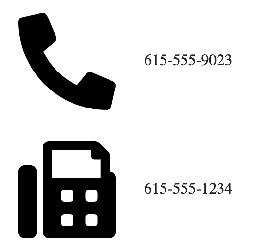
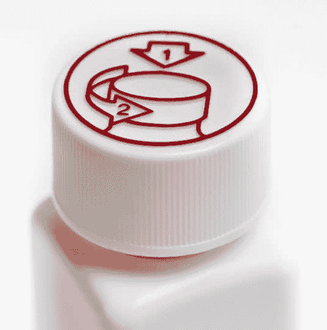

# 图像可访问性 101:信息图像

> 原文：<https://dev.to/alhasenzahl/image-accessibility-101-informative-images-5759>

信息图像是一种图像，它传达了页面上呈现的简单概念或信息。这些图像可以用来补充或标记其他信息，描绘情感或印象，或传达简明的信息或指示。

## 书写 alt 文本的提示:

1)它们应该简明扼要，不要长于一个短语或短句。

2)只应包含最关键的信息。

3)它们通常不是图像的文字描述，然而，在某些情况下，这可能是必要的。

## 例子:

[](https://res.cloudinary.com/practicaldev/image/fetch/s--btJ8f7on--/c_limit%2Cf_auto%2Cfl_progressive%2Cq_auto%2Cw_880/https://thepracticaldev.s3.amazonaws.com/i/me9xl84dkodlcv6r6mf4.png)T3】

```
<span>
     615-555-9023
</span>
<span>
     615-555-1234
</span> 
```

<svg width="20px" height="20px" viewBox="0 0 24 24" class="highlight-action crayons-icon highlight-action--fullscreen-on"><title>Enter fullscreen mode</title></svg> <svg width="20px" height="20px" viewBox="0 0 24 24" class="highlight-action crayons-icon highlight-action--fullscreen-off"><title>Exit fullscreen mode</title></svg>

上面的图像被认为是一个信息图像，因为电话和传真机的图像被用来标记出现在它们旁边的号码，并在您需要联系该个人或公司时澄清哪个是哪个。alt 文本将为任何看不到可视标签的用户标注数字。

[](https://res.cloudinary.com/practicaldev/image/fetch/s--hROQdGPK--/c_limit%2Cf_auto%2Cfl_progressive%2Cq_auto%2Cw_880/https://thepracticaldev.s3.amazonaws.com/i/u9l3noe6lilcm2y4eo12.jpg)T3】

```
 
```

<svg width="20px" height="20px" viewBox="0 0 24 24" class="highlight-action crayons-icon highlight-action--fullscreen-on"><title>Enter fullscreen mode</title></svg> <svg width="20px" height="20px" viewBox="0 0 24 24" class="highlight-action crayons-icon highlight-action--fullscreen-off"><title>Exit fullscreen mode</title></svg>

这张图片可以在一家公司的网站上找到，描绘了一个适合家庭的环境，并努力为其客户提供有趣、安全的体验。因为这是一张普通照片，所以人们不应该被识别，替代文字反而传达图像的预期印象。

[](https://res.cloudinary.com/practicaldev/image/fetch/s--BqPQC9aU--/c_limit%2Cf_auto%2Cfl_progressive%2Cq_auto%2Cw_880/https://thepracticaldev.s3.amazonaws.com/i/kguahi9g6v1e7emcorjg.jpg)T3】

```
 
```

<svg width="20px" height="20px" viewBox="0 0 24 24" class="highlight-action crayons-icon highlight-action--fullscreen-on"><title>Enter fullscreen mode</title></svg> <svg width="20px" height="20px" viewBox="0 0 24 24" class="highlight-action crayons-icon highlight-action--fullscreen-off"><title>Exit fullscreen mode</title></svg>

该图像被认为是信息图像，因为它直观地显示了打开图中药瓶的具体说明。然后，alt 文本用于向那些无法使用 cap 上的视觉提示的人解释这些说明。

[](https://res.cloudinary.com/practicaldev/image/fetch/s--0u7jffZg--/c_limit%2Cf_auto%2Cfl_progressive%2Cq_auto%2Cw_880/https://thepracticaldev.s3.amazonaws.com/i/f9t3dfbctj0q8x9rqxkx.png)T3】

```

<p>Professional snowboarder, Maddie Mastro, lands historic run at the 2019 Burton US Open 
becoming the first woman to successfully land a double crippler in competition.</p> 
```

<svg width="20px" height="20px" viewBox="0 0 24 24" class="highlight-action crayons-icon highlight-action--fullscreen-on"><title>Enter fullscreen mode</title></svg> <svg width="20px" height="20px" viewBox="0 0 24 24" class="highlight-action crayons-icon highlight-action--fullscreen-off"><title>Exit fullscreen mode</title></svg>

这最后一个图像也是一个信息图像，因为该图像向伴随它的文本添加信息。在文章中，你了解到麦蒂在去年冬天的伯顿美国公开赛上创造了历史。然而，这张照片进一步向读者表明，她获得了第一名，领先于和蔡。因此，alt 文本传达了这些额外的信息。

> 现在，如果文本包含了马斯特罗在金和蔡之前获得金牌的事实，那么这个图像很可能会成为一个装饰图像。因为图片中的信息已经在页面的其他地方传达了，所以有替换文字的图像会变得重复。

## 总结

用于向页面内容添加简单概念或信息的图像被视为信息图像。让你的替代文本尽可能简短，并确保只包含最相关的信息。

决定一个图像是装饰性图像还是信息性图像是一个棘手的问题，最终取决于页面作者。它归结为为什么图像被包含在页面上，页面上包含的内容，以及什么是最有意义的。