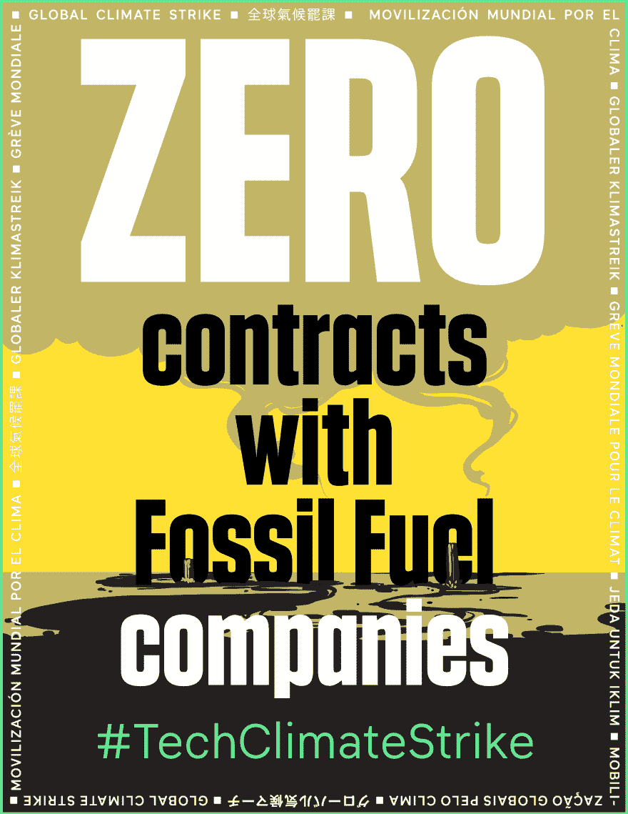

# 气候罢工

> 原文：<https://dev.to/techworkersco/climate-strike-fbi>

## 有一场气候危机，技术工人正在罢工

*原贴于[科技工人联盟](https://techworkerscoalition.org/climate-strike)T3】*

2019 年 9 月 20 日，数百万人将在有史以来最大的#ClimateStrike 中动员起来，由学生、工人和关心宜居未来的人领导。作为技术工人，我们有责任让我们的雇主负起责任，成为解决方案的一部分，而不是问题的一部分。

## 以下是您的参与方式

1.  9 月 20 日，以个人身份或者更好的方式，和你的同事一起参加你附近的抗议活动。作为全球气候罢工的一部分，你可以在这里找到 3000 多场当地游行的列表。

    **来自不同公司的技术工人将在这些游行之前会合，然后一起加入当地的游行。在这里找到一个技术人员的位置和会议时间** [。(如果您没有看到列出您的城市，请随意将其添加到](https://docs.google.com/spreadsheets/d/1ThY98n11LVFV_26P9nmEbvUjvMXwa671nK1gOBPf7mM/)[表格](https://docs.google.com/forms/d/e/1FAIpQLSfJDnN7_u04b-jvDjBGXisUtrQvVbRSqc-wTOkptsPpQV_wnQ/viewform)中。我们将确保它出现在列表中)。

2.  在 9 月 20 日之前，与你的同事交谈，在你公司的 slack 或留言板上发布，在 Twitter 上分享，让人们知道你为什么加入全球气候罢工。使用标签 [#TechClimateStrike](https://twitter.com/search?q=%23TechClimateStrike&src=typed_query) 。

3.  9 月 20 日，用标签#TechClimateStrike 发布你所在城市的罢工照片，最好是穿着你公司的品牌服装。如果你和其他技术人员一起出去，贴一张集体照(当然，要征得所有人的同意)。

## 科技在气候变化中扮演的肮脏角色

科技行业塑造了一个“绿色”的公众形象，但事实上它是气候变化的主要促成因素。以下是科技导致气候危机的三种方式:

### 科技隐藏的碳足迹

科技行业有着巨大的碳足迹，通常被“云计算”或“比特币采矿”等术语掩盖，同时代码和自动化也被描述为抽象和非物质的。

事实上，据估计，科技的计算基础设施排放的碳和航空一样多，占全球排放量的百分比大得惊人。最近的一项研究发现，仅仅创造一个先进的人工智能模型[在整个生命周期中，从创造到分解，排放的二氧化碳是一辆普通美国汽车的五倍。这还不包括生产硬件和消费设备所需的全球供应链和制造业，从采矿到运输到电子垃圾处理。当我们透过宣传，我们看到一个行业隐藏在绿色清洗和营销背后，希望其对气候变化的重大贡献将被忽视。](https://www.technologyreview.com/s/613630/training-a-single-ai-model-can-emit-as-much-carbon-as-five-cars-in-their-lifetimes/)

### 科技与石油巨头的合作加速了气候变化

科技领域的大公司——特别是谷歌、微软和亚马逊——通过与石油和天然气行业的合作加剧了气候变化。这三家公司与大型石油公司签订了数十亿美元的合同。[他们将基础设施、工程资源和人工智能能力授权给化石燃料公司，承诺让开采“更高效”。在 2018 年亚马逊 re:Invent 大会上，亚马逊举办了一场名为“](https://gizmodo.com/how-google-microsoft-and-big-tech-are-automating-the-1832790799)*[的会议，用机器学习以秒为单位预测下一个油田。](https://aws.amazon.com/blogs/machine-learning/your-guide-to-ai-and-machine-learning-at-reinvent-2018/)* “同年，微软在它的一次发布会上的主题是 *[“用 AI 赋能油&气”。谷歌现在有一个能源部门，专门为石油和天然气公司服务。这一切都转化为加速的气候变化，直接与宜居未来的目标背道而驰，这要求化石燃料储备保持未使用和“在地下”。](https://news.microsoft.com/en-xm/2018/11/12/microsoft-demonstrates-the-power-of-ai-and-cloud-to-oil-and-gas-players-at-adipec-2018/)*

### 科技对气候难民和前线社区的压制

有大量数据支持的环境正义运动清楚地表明，有色人种、穷人和那些生活在发展中国家的人处于气候变化的第一线。[仅在 2019 年上半年，极端天气就导致创纪录的 700 万人流离失所。巴哈马群岛和波多黎各最近的灾难是发人深省的例子，美国现任政府拒绝给予来自巴哈马群岛](https://www.nytimes.com/2019/09/12/climate/extreme-weather-displacement.html)[的气候难民临时保护身份的决定树立了一个令人不寒而栗的先例](https://www.reuters.com/article/us-storm-dorian-immigration-bahamas/u-s-denies-protective-status-to-bahamas-hurricane-evacuees-idUSKCN1VW2OS)。这些社区需要那些对碳排放负有最大责任的国家和富人的庇护和帮助。相反，我们看到在科技行业的帮助下，一种排斥和压迫的模式正在出现。

亚马逊、Palantir 和其他公司已经在[出售技术](https://www.technologyreview.com/s/612335/amazon-is-the-invisible-backbone-behind-ices-immigration-crackdown/),这些技术被用于监管、监视和跟踪美国的弱势群体，以及在边境寻求庇护和避难的人。这些技术用于监管和监视前线人群，是基础设施的核心部分，旨在排除那些有需要的人，并保护那些最有责任的人免于问责。

## 诉求

我们要求整个科技行业的雇主大胆而紧迫地行动起来，并承诺:

*   到 2030 年实现零碳排放
*   与化石燃料公司的零合同
*   零资助气候否定游说或其他努力
*   对气候难民和前线社区零伤害

## 工人加入罢工的公司

*   [亚马逊](https://medium.com/@amazonemployeesclimatejustice/amazon-employees-are-joining-the-global-climate-walkout-9-20-9bfa4cbb1ce3)
*   [亚特兰蒂斯](https://www.atlassian.com/blog/announcements/climate-strike)
*   [眼镜蛇](https://blog.cobot.me/cobot-will-join-the-global-climate-strike-public-letter-88af2e473482)
*   [Ecosia](https://blog.ecosia.org/join-ecosia-global-climate-strike/)
*   [脸书](https://twitter.com/FBClimateAction/status/1173646327462281217)
*   谷歌
*   [微软](https://twitter.com/MsWorkers4/status/1173635089495801857)
*   [正方形](https://twitter.com/SquareWorkers/status/1174840277028130816)
*   [推特](https://twitter.com/TwtAction/status/1174735640681799681)

## 社交媒体

*   亚马逊:[https://twitter.com/AMZNforClimate](https://twitter.com/AMZNforClimate)
*   https://twitter.com/FBClimateAction
*   谷歌:[https://twitter.com/GoogleWAC](https://twitter.com/GoogleWAC)
*   微软:[https://twitter.com/MsWorkers4](https://twitter.com/MsWorkers4)
*   广场:[https://twitter.com/SquareWorkers](https://twitter.com/SquareWorkers)
*   推特:[https://twitter.com/TwtAction](https://twitter.com/TwtAction)
*   科技工人联盟:[https://twitter.com/techworkersco](https://twitter.com/techworkersco)

