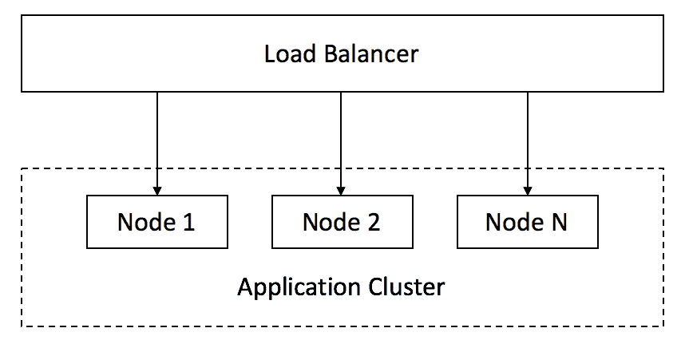
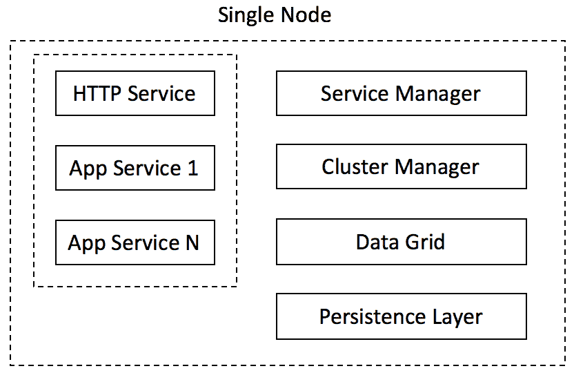

# 纳米服务，或单片和微服务的替代品...

> 原文:[https://dev . to/siy/nano services-or-alternative-to-monolithics-and-micro services-12bb](https://dev.to/siy/nanoservices-or-alternative-to-monoliths-and-microservices-12bb)

微服务无处不在。如今不做微服务就像不写单元测试或者不在吃饭前洗手一样——如果你不这样做，你会感到羞耻。批判性地看待微服务听起来几乎是政治上不正确的。但是我会努力的...

### 清醒的看微服务

首先，我将主要从实用主义(阅读:现实生活)设计的角度来看不同类型的架构。

从设计的角度来看，微服务的引入只有一个好处(顺便说一句，通过施加限制):它要求工程师更加仔细地考虑每个服务的边界以及它如何与系统的其余部分交互。

对于 monolith 应用程序来说，这也很重要，但是它总是有可能走捷径或者在没有太多麻烦的情况下在内部破解一些东西。没有办法用微服务来表演这样的把戏。不用说，设计得更好的系统运行得更好。

微服务的兴起在时间上与反应式方法的兴起和其他技术的成熟(例如 HTTP 服务器实现和微框架)相匹配。随着将单个服务扩展转移到外部基础设施，所有这些一起使得系统性能更高。

以上所有给人的印象是微服务架构更好、更快、可伸缩。事实上，他们是。但是从设计的角度来看，只有两点实际上促成了这种收益:

*   更好的思考系统
*   能够扩展单个服务，而不是整个应用程序

为了实现这两个目标，我们应该付出高昂的代价。让我们抛开部署和维护的噩梦。毕竟，现在它养活了许多开发商和出售软件和服务的公司来管理这个地狱。

从实用设计的角度来看，我们在过渡期间迷失了:

*   设计灵活性。再也没有免费的午餐了，你不能轻易地重构系统，把功能从一个服务转移到另一个服务，不能轻易地改变服务 API。
*   本地部署的简单性。为了调试一些问题，你需要启动一系列依赖项。在我的实践中，我看到大多数应用程序都不能在本地启动了(或者可以，但这太复杂了，没有人会在意)，并且应用程序是使用 debug print 调试的(向 80 年代问好)。
*   按应用程序处理“环境问题”(网络和磁盘故障、配置管理、监控等)。)现在需要为每个服务单独处理。是的，有应用程序、框架和模式来处理所有这些。但是现在我们应该把所有这些问题都记在心里，把宝贵的大脑资源花在与我们正在实现的业务逻辑没有直接关系的事情上。
*   故障模式的可预测性。现在，它们变得更加复杂，更难预测和准备。系统的许多“半工作”状态。

所有这些看起来都像是回归巨石柱的呼吁。但事实并非如此。巨石柱有自己的一系列问题。我觉得没有必要重复这些问题，每一篇关于微服务的文章都不要忘记列出来。

那么，有没有微服务和单片的替代品呢？嗯，我想至少有一个。

### 纳米服务

首先，让我们尝试总结一下替代架构应该实现的目标:

*   以服务为基础，明确定义每个服务的接口。通过这种方式，我们迫使工程师对设计更加小心
*   服务友好-尽可能将服务与环境问题隔离开来
*   支持每项服务的可扩展性

理想情况下，它还应具有以下特性:

*   尽可能减少外部依赖性
*   易于部署和维护，特别是本地部署应该不成问题

首先想到的是传统的应用服务器，因为它最初是由 Sun 公司的人设想的:应用程序应该插入其中，并使用所有可用的服务。这个想法没有得到预期的接受，我认为主要是因为它是针对技术和方法的，而这些技术和方法在引入这个想法的时候是现代的。尽管如此，它还是提供了某种服务友好的环境，尽管对特定的 API 集的管理和限制太多了。

但是下面描述了一些不同的方法。从高层次来看，架构是由相同节点组成的集群。集群构建在数据/计算网格(例如 Apache Ignite、Infinispan、Hazelcast 等)之上。).与传统方法不同，网格不是应用程序之外的东西，而是同一时间内的每个网格节点都是一个应用程序节点。

[T2】](https://res.cloudinary.com/practicaldev/image/fetch/s--u6lAwpRw--/c_limit%2Cf_auto%2Cfl_progressive%2Cq_auto%2Cw_880/https://thepracticaldev.s3.amazonaws.com/i/qu8zerl8ffzcrkr3iedk.png)

每个节点都由服务友好的外壳和用户服务组成。右边的东西是 shell 的一部分，而左边的东西是用户服务:
(嗯，HTTP 也可以是 shell 的一部分，这个其实没多大关系。)

[T2】](https://res.cloudinary.com/practicaldev/image/fetch/s--T09oXU8r--/c_limit%2Cf_auto%2Cfl_progressive%2Cq_auto%2Cw_880/https://thepracticaldev.s3.amazonaws.com/i/p2qdegslbyey3bilsohq.png)

### 工作原理

每个节点有 4 种工作模式-单一，休眠，从和主。单一模式用于开发/调试或非常小的部署。
休眠、从和主是集群环境中启用的模式。节点以休眠模式启动，并尝试连接到群集。当节点处于休眠模式时，所有用户服务都将停止，因此没有出错的风险。如果由于某种原因无法形成集群，例如集群中没有多数节点(因为没有足够的节点连接到集群，或者集群遇到网络问题，并且节点属于断开连接的少数节点)，节点也会切换到休眠模式。一旦节点连接到群集并且大多数节点可用，节点将根据主节点选举结果切换到从节点或主节点。从用户服务的角度来看，主节点和从节点没有区别。这种差异仅对集群管理器可见(见下文)，集群管理器仅在主节点上启用。

#### 服务经理

服务管理器负责根据活动配置(存储在数据网格中)启动/停止各个服务。服务管理器正在侦听群集事件，一旦节点与群集断开连接或仅连接到群集中的少数节点，所有服务都会立即停止，从而保持系统一致性。

#### 集群管理器

集群管理器负责决定每个节点上应该运行哪些服务以及运行多少实例。集群管理器本身只在主节点上被激活，所以关于服务配置总是只有一个真实的来源。可以使用不同的方法来决定服务的数量和位置:静态配置、性能监控、启发式等。还可以通过与外部服务(Amazon ECS/EC2、Kubernetes 等)交互来启用集群管理器触发启动/停止节点。).请注意，与外部监控不同，集群管理器可以访问所有细节，因此可以做出更明智的决策。

#### 数据网格

这只是数据网格代码，是 node 的一部分。

#### 持久层

这是一个可选组件，如果需要将数据持久存储到磁盘(或其他存储设备)中，这是必需的。从技术上来说，这是数据网格配置的一部分，支持将本地数据存储到存储器中。

### 我们得到了什么

首先，透明和(几乎)即时访问系统中的所有数据。数据不仅被存储，而且被复制，所以整个系统是持久和可靠的。可以灵活地调整复制和一致性，以精确满足需求。由于各种问题，整个系统可以承受一定数量的节点(高达 N/2-1，其中 N 是最大集群大小)的损失。节点丢失可能会在一定程度上影响性能，但不会影响系统可用性。

服务友好的环境。服务与环境问题隔离开来，可以表现得好像没有连接问题或类似的问题。Shell 负责在必要时重试和重定向对其他节点的调用。所有这些都大大简化了编写服务，开发人员可以专注于业务逻辑，而不是问题处理。整体服务变得非常轻薄，所以我称之为“纳米服务”。

整个系统高度可扩展。与微服务不同，它有两个维度需要扩展:通过添加节点进行扩展，以及通过启动更多服务实例进行扩展。启动服务比启动新实例要快得多，因此对负载变化做出反应所需的时间要少得多。

系统要么工作，要么不工作，没有中间状态。故障模式在数量上是有限的，并且是可预测的。

最小依赖性。数据库、消息传递、队列、分布式计算等。已经内置了。

简单的部署和配置。不需要外部“编排”服务。

用更多的功能来扩展 shell 是很容易的，例如，让每个节点成为一个 Kafka 节点。

数据和处理是并置的，可以设计服务和配置数据网格，因此所有的处理将在本地保存所有(或大部分)必要数据的节点上执行。这种方法可以显著减少网络流量，并以自然的方式分布处理。通过正确配置数据到节点的分配，可以在相同的节点收集相关数据，甚至进一步提高性能。

这种架构非常适合反应式异步处理。

我们拥有和 monolith 几乎一样的重构自由。

### 后记

没有用上述架构构建的真实系统(至少就我所知)。然而，包含上述体系结构的大部分元素的系统，我在几年前就已经设计并实现了，它仍然工作得很好(据我所知，因为我已经不在那家公司工作了)。