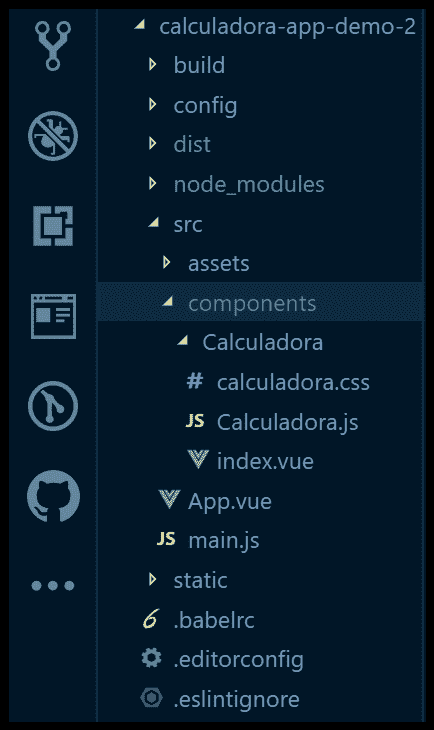

# 在 vue . js 中开发计算器-重构项目

> [https://dev . to/azure/development-in-view-js 计算器-重构-o-project-16e 2](https://dev.to/azure/desenvolvendo-calculadora-em-vue-js-refatorando-o-projeto-16e2)

否 **[【最新帖子】](https://dev.to/glaucia86/desenvolvendo-calculadora-em-vue-js-logica-no-javascript-15n6)** 我们用 JavaScript 创建了我们计算器的全部逻辑。但是，如果您注意到，整个应用程序都集中在一个文件中。尤其是我，我不会像这样开发一个前端项目，因为它可能会发展到无法理解整个项目环境的程度。

在本文中，我们将对该项目进行重构，使其更易于维护。

我们开始吧？！

## 改造工程

在 vue . js 中，有两种方法可以构造项目:

*   **[【单档元件】](https://br.vuejs.org/v2/guide/single-file-components.html)** :这将是在单一文件**中使用 HTML、CSS 和 JavaScript 范围。视图**，它将集中所有的外观和行为责任

*   **[拆分文件](https://forum.vuejs.org/t/split-single-file-component/34155)** :这将是责任分离，以 **[固体](https://www.infoq.com/br/news/2014/02/solid-principios-javascript/)的概念为目标。**

在本教程的这一部分中，我将介绍如何正确执行文件分离，并按照 vue . js 中的“t0”[【style guide】](https://vuejs.org/v2/style-guide/)进行文件和文件夹命名。

## 从‘calculator . view’组件中分离文件

打开 Visual Studio 代码和计算器设计。在资料夹`Calculadora`内，建立名为`Calculadora`的资料夹。

然后在“`Calculadora`”文件夹内创建以下文件:

*   index . view(将文件“calculadora . vue”更改为“index . view”)
*   calculadora.css
*   calculadora.js

文件夹结构如下所示:

[](https://postimg.cc/zVYmKNJ2)

完成后，我们现在将执行文件分离。

## 进行风格块分离

打开文件“`index.vue`”并将标记“`<style></style>`”中包含的所有内容复制并粘贴到文件“`calculadora.css`”中。

文件`calculadora.css`应保持如下:

```
.calculadora {
  margin: 0 auto;
  width: 350px;
  font-size: 40px;
  display: grid;
  grid-template-columns: repeat(4, 1fr);
  grid-auto-rows: minmax(50px, auto);
}

.display {
  grid-column: 1 / 5;
  background-color: #333;
  color: white;
}

.zero {
  grid-column: 1 / 3;
}

.botao {
  background-color: #f2f2f2;
  border: 1px solid #999;
}

.operadores {
  background-color: orange;
  color: white;
} 
```

<svg width="20px" height="20px" viewBox="0 0 24 24" class="highlight-action crayons-icon highlight-action--fullscreen-on"><title>Enter fullscreen mode</title></svg> <svg width="20px" height="20px" viewBox="0 0 24 24" class="highlight-action crayons-icon highlight-action--fullscreen-off"><title>Exit fullscreen mode</title></svg>

已经在文件`index.vue`中，现在让我们在标记`<style></style>`内引用文件`calculadora.css`，并注意它应该是什么样子:

```
<style src="./calculadora.css" scoped /> 
```

<svg width="20px" height="20px" viewBox="0 0 24 24" class="highlight-action crayons-icon highlight-action--fullscreen-on"><title>Enter fullscreen mode</title></svg> <svg width="20px" height="20px" viewBox="0 0 24 24" class="highlight-action crayons-icon highlight-action--fullscreen-off"><title>Exit fullscreen mode</title></svg>

运行应用程序，并检查是否一切正常。如果是的话。让我们继续！

## 进行脚本块分离

过程将与我们在文件`calculadora.css`中所做的非常相似。打开文件`index.vue`，复制整个脚本块并粘贴到文件`Calculadora.js`

文件`Calculadora.js`将如下所示:

```
/**
 * Arquivo: src/components/Calculadura.js
 * Data: 20/06/2019
 * Author: Glaucia Lemos
 * Descrição: arquivo responsável por tratar toda a lógica da Calculadora.
 */

export default {
  name: 'Calculadora',
  data() {
    return {
      numeroAnterior: null,
      valorCorrente: '',
      operador: null,
      operadorClicado: false,
    };
  },

  methods: {
    // Método responsável por limpar o display da 'Calculadora'
    limpar() {
      this.valorCorrente = '';
    },

    /*
    * Método responsável por colocar o sinal '-' ou '+' para realização de operações
    * matemáticas especiais.
    */
    sinal() {
      this.valorCorrente = this.valorCorrente.charAt(0) === '-'
        ? this.valorCorrente.slice(1)
        : `-${this.valorCorrente}`;
    },

    // Método responsável por realizar operações com 'porcentagem':
    porcentagem() {
      this.valorCorrente = `${parseFloat(this.valorCorrente) / 100}`;
    },

    // Método responsável por juntar os números no display da Calculadora:
    juntarNumeros(numero) {
      if (this.operadorClicado) {
        this.valorCorrente = '';
        this.operadorClicado = false;
      }
      this.valorCorrente = `${this.valorCorrente}${numero}`;
    },

    // Método responsável por adicionar 'ponto' no display da Calculadora:
    ponto() {
      if (this.valorCorrente.indexOf('.') === -1) {
        this.juntarNumeros('.');
      }
    },

    // Método responsável por 'resetar' o valor na Calculadora:
    setarValor() {
      this.numeroAnterior = this.valorCorrente;
      this.operadorClicado = true;
    },

    // Método responsável por realizar a operação da 'divisão' da Calculadora
    dividir() {
      this.operador = (a, b) => a / b;
      this.setarValor();
    },

    // Método responsável por realizar a operação da 'multiplicação' da Calculadora
    multiplicar() {
      this.operador = (a, b) => a * b;
      this.setarValor();
    },

    // Método responsável por realizar a operação da 'diminuir' da Calculadora
    diminuir() {
      this.operador = (a, b) => a - b;
      this.setarValor();
    },

    // Método responsável por realizar a operação da 'adição' da Calculadora
    somar() {
      this.operador = (a, b) => a + b;
      this.setarValor();
    },

    // Método responsável por apresentar o resultado das operações na Calculadora
    resultado() {
      this.valorCorrente = `${this.operador(
        parseFloat(this.numeroAnterior),
        parseFloat(this.valorCorrente),
      )}`;
      this.numeroAnterior = null;
    },
  },
}; 
```

<svg width="20px" height="20px" viewBox="0 0 24 24" class="highlight-action crayons-icon highlight-action--fullscreen-on"><title>Enter fullscreen mode</title></svg> <svg width="20px" height="20px" viewBox="0 0 24 24" class="highlight-action crayons-icon highlight-action--fullscreen-off"><title>Exit fullscreen mode</title></svg>

现在，返回文件`index.vue`，我们将在 script 标签内引用文件`Calculadora.js`，如下所示:

```
<script src="./Calculadora.js"></script> 
```

<svg width="20px" height="20px" viewBox="0 0 24 24" class="highlight-action crayons-icon highlight-action--fullscreen-on"><title>Enter fullscreen mode</title></svg> <svg width="20px" height="20px" viewBox="0 0 24 24" class="highlight-action crayons-icon highlight-action--fullscreen-off"><title>Exit fullscreen mode</title></svg>

运行应用程序，并检查是否一切正常。如果是的话，我们就完了！😊

## 完成‘index . view’文件的开发

请注意，文件“`index.vue`”已变得更干净，保存效果更好。我喜欢这种方法，因为脚本块和 css 在项目扩展时往往会变得越来越大，使得维护这些组件变得越来越困难。

使用单个文件组件的概念也没错，我再说一遍，我喜欢基于个人原因进行文件分离的方法。因此，如果您要按照 SFC 维护项目，则不会有任何问题！

如果您希望看到整个项目准备就绪，只需访问

此存储库中还包含逐步指导您如何开发此项目的视频。#坚持住

嗯，我们的设计已经准备好了，准备上传到云端。为此，我们将使用“t0”[【Azure app service】](https://azure.microsoft.com/?WT.mc_id=devto-blog-gllemos)，这是 azure 的一项服务，以简单、免费的方式进行静态页面托管*

但为此，让我们留给下一篇文章吧！

还有，如果你想知道更多的消息，请继续关注我在 twitter 上！

[](https://twitter.com/glaucia_lemos86)

一点也不。Até a próxima！😍