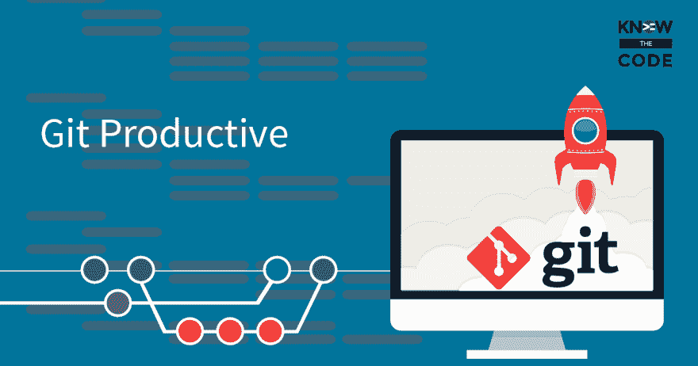
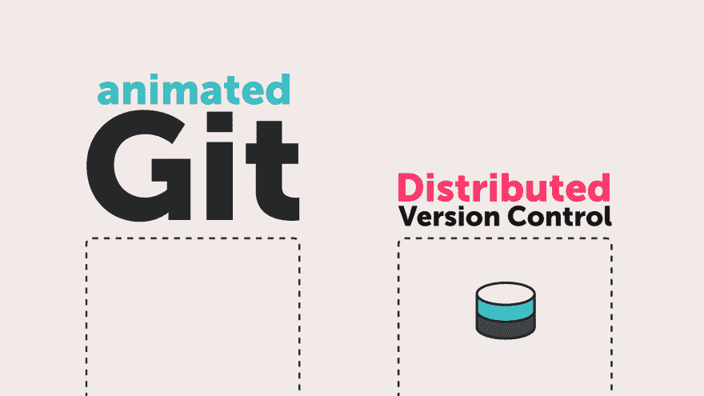
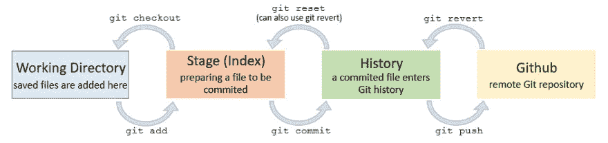
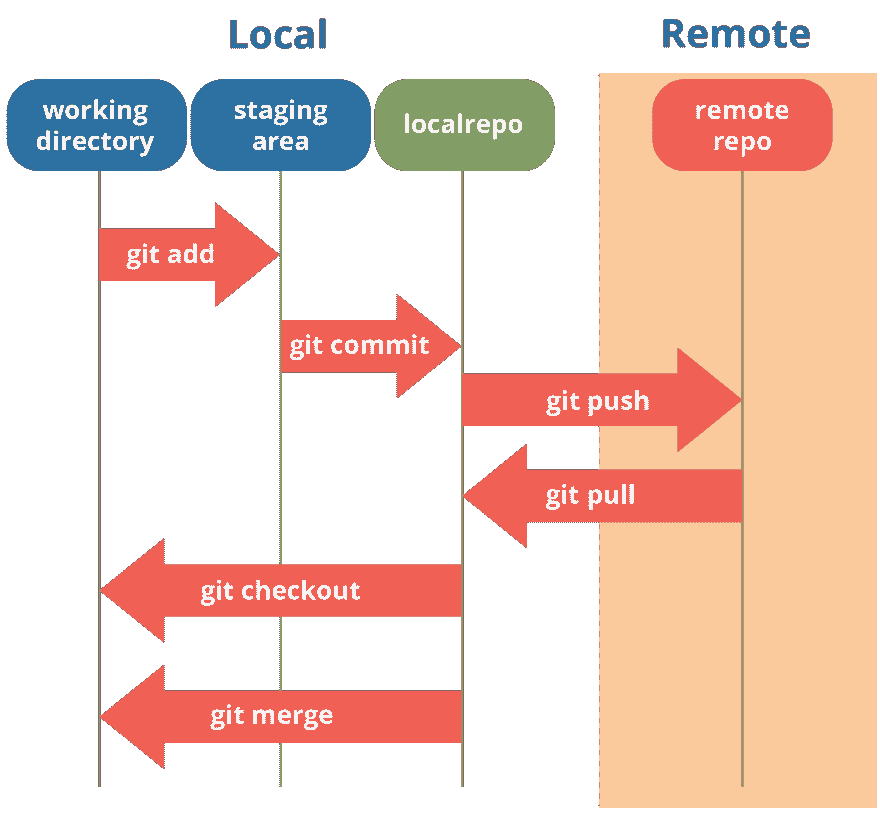
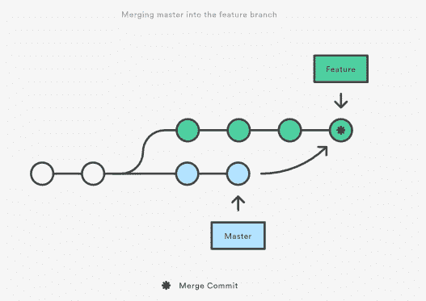
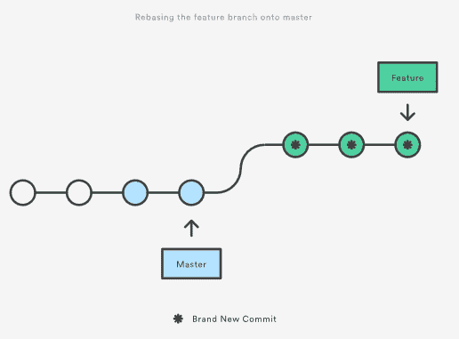
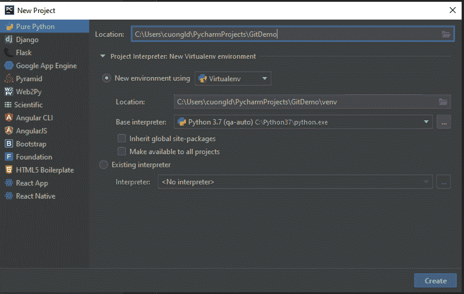
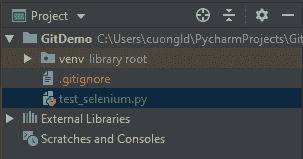
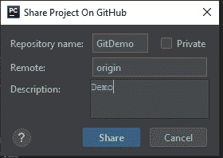
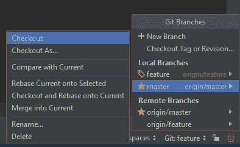

# Git 在行动

> 原文：<https://dev.to/cuongld2/git-in-action-1j3m>

```
I. Why Git?
    1\. Time Saving:
    2\. Work Offline:
    3\. Undo Mistake:
    4\. Don't worry:
    5\. Useful Commit:
    6\. Don't make things up:
    7\. Go with the flow:
II. Git essential commands and notes:
III. Git general rules and best practices:
IV. Using Git with Pycharm: 
```

Enter fullscreen mode Exit fullscreen mode

我也是。你为什么要走？

1.  节省时间:

Git 快如闪电。虽然我们谈论的是每个命令只有几秒钟，但它会在你的工作日中迅速累积。把你的时间用在比等待版本控制系统回复你更有用的事情上。

[](https://res.cloudinary.com/practicaldev/image/fetch/s--5Gc7Z8QM--/c_limit%2Cf_auto%2Cfl_progressive%2Cq_auto%2Cw_880/https://thepracticaldev.s3.amazonaws.com/i/p05vwnpby6qnjd7datkc.png)

1.  脱机工作:

如果您想在旅途中工作，该怎么办？对于像 Subversion 或 CVS 这样的集中式 VCS，如果没有连接到中央存储库，您就会束手无策。有了 Git，几乎所有事情都可以在本地机器上简单地实现:提交、浏览项目的完整历史、合并或创建分支...Git 让你决定何时何地想工作。

[](https://res.cloudinary.com/practicaldev/image/fetch/s--uTa4Lp2L--/c_limit%2Cf_auto%2Cfl_progressive%2Cq_auto%2Cw_880/https://thepracticaldev.s3.amazonaws.com/i/zbasskx8krakphvb4p2m.png)

1.  撤销错误:

人都会犯错。Git 的一个好处是几乎在所有情况下都有一个小小的“撤销”命令。纠正你最后一次提交，因为你忘了包括小的变化。恢复整个提交，因为不再需要该特性。当遇到困难时，您甚至可以用 Reflog 恢复丢失的提交——因为在幕后，Git 很少真正删除某些东西。这才是安心。

[](https://res.cloudinary.com/practicaldev/image/fetch/s--a2Ruj_Qt--/c_limit%2Cf_auto%2Cfl_progressive%2Cq_auto%2Cw_880/https://thepracticaldev.s3.amazonaws.com/i/xse47ncs32eaalmtxl4x.jpg)

1.  不要担心:

Git 给了你不会把事情搞砸的信心——这是一种很棒的感觉。在 Git 中，您的一个队友可能在他的本地计算机上拥有的项目的每个克隆都是完全可用的备份。此外，Git 中的几乎每个操作都只添加数据(很少删除)。这意味着丢失数据或破坏存储库无法修复是非常困难的。

[](https://res.cloudinary.com/practicaldev/image/fetch/s--Tob4pQIZ--/c_limit%2Cf_auto%2Cfl_progressive%2Cq_auto%2Cw_880/https://thepracticaldev.s3.amazonaws.com/i/7foifilp68bri481j3hs.png)

1.  有用的提交:

只有当提交只包含相关的更改时，它才真正有用。想象一下，有一个包含特性 A、一点特性 B 和 bugfix C 的提交，这对于您的队友来说很难理解，并且如果一些代码导致了问题，也不容易回滚。Git 通过其独特的“staging area”概念帮助您创建细粒度的提交:您可以准确地确定哪些更改应该包含在您的下一次提交中，甚至可以精确到单行。这就是版本控制开始有用的地方。

1.  不要胡编乱造:

关注点的分离对于跟踪事物是至关重要的。当你在处理特性 A 的时候，没有任何东西(或者任何人)会被你未完成的代码所影响。如果这个特性不再是必需的了呢？或者，如果在 10 次提交之后，您发现您采用了一种完全错误的方法？分支是这些问题的答案。虽然其他版本控制系统也知道分支，但 Git 是第一个让它正常工作的系统:快速而简单。

1.  随波逐流:

只有死鱼会随波逐流。有时候，聪明的开发人员也会这样做。Git 被越来越多的知名公司和开源项目使用:Ruby On Rails、jQuery、Perl、Debian、Linux 内核等等。一个大的社区通常本身就是一个优势，因为一个生态系统围绕着这个系统进化。大量的教程、工具和服务使得 Git 更有吸引力。
二。Git 基本命令和注释:

```
git config
Configure the author name and email address to be used with your commits.

Note that Git strips some characters (for example trailing periods) from user.name.
git config --global user.name "Sam Smith"

git config --global user.email sam@example.com
git init
Create a new local repository

git clone
- Create a working copy of a local repository:

git clone /path/to/repository

-  For a remote server, use:

git clone username@host:/path/to/repository

git add
Add one or more files to staging (index):

git add <filename>

git add *

git commit
Commit changes to head (but not yet to the remote repository):
git commit -m "Commit message"
Commit any files you've added with git add, and also commit any files you've changed since then:

git commit -a

git push
Send changes to the master branch of your remote repository:

git push origin master

git status
List the files you've changed and those you still need to add or commit:

git remote
If you haven't connected your local repository to a remote server, add the server to be able to push to it:
git remote add origin <server>
List all currently configured remote repositories:
git remote -v

git branch
List all the branches in your repo, and also tell you what branch you're currently in:

git branch

Delete the feature branch:

git branch -d <branchname>

git checkout
Create a new branch and switch to it:

git checkout -b <branchname>

Switch from one branch to another:

git checkout <branchname>

git merge
Join two or more development histories together
git merge <branchname>

git stash
Save the changes if you don't want to commit immediately
git stash
and then when you want to apply the stash
git stash pop

git reset
You know when you commit changes that are not complete, this sets your index to the latest commit that you want to work on with.
git reset <:mode:> <:COMMIT:>
git remote
To check what remote/source you have or add a new remote
git remote to check and list. And git remote add <:remote_url:>

git fetch
when you do a git fetch, it gets all the changes from the remote repository, stores the changes in a separate branch in your local repository and if you want to reflect those changes in your corresponding branches, use a git merge to do that.

git pull
when you do a git pull, it gets all the changes from the remote or central repository and attaches it to your corresponding branch in your local repository.
→ git pull = git fetch + git merge
git log
show all commits in the current branch's history
.gitignore file:

Git sees every file in your working copy as one of three things:
    tracked - a file which has been previously staged or committed;
    untracked - a file which has not been staged or committed; or
    ignored - a file which Git has been explicitly told to ignore. 
```

Enter fullscreen mode Exit fullscreen mode

被忽略的文件通常是构建工件和机器生成的文件，它们可以从您的存储库源获得，或者不应该被提交。一些常见的例子有:

```
dependency caches, such as the contents of /node_modules or /packages
compiled code, such as .o, .pyc, and .class files
build output directories, such as /bin, /out, or /target
files generated at runtime, such as .log, .lock, or .tmp
hidden system files, such as .DS_Store or Thumbs.db
personal IDE config files, such as .idea/workspace.xml 
```

Enter fullscreen mode Exit fullscreen mode

被忽略的文件在一个名为。gitignore 在您的存储库的根目录下签入。没有显式的 git ignore 命令:相反。当你有想要忽略的新文件时，必须手工编辑和提交 gitignore 文件。。gitignore 文件包含与存储库中的文件名匹配的模式，以确定它们是否应该被忽略。

更多信息，直接上这个:gitignore
III。Git 一般规则和最佳实践:

```
Public branch and private branch:
- Public branch used for multiple user
- Private branch used for personal use

Merge vs rebase:
Please check this for details merge vs rebase

The first thing to understand about git rebase is that it solves the same problem as git merge. Both of these commands are designed to integrate changes from one branch into another branch—they just do it in very different ways.

Consider what happens when you start working on a new feature in a dedicated branch, then another team member updates the master branch with new commits. This results in a forked history, which should be familiar to anyone who has used Git as a collaboration tool.

For merge:

git checkout feature
git merge master

Or, you can condense this to a one-liner:
git merge feature master 
```

Enter fullscreen mode Exit fullscreen mode

[](https://res.cloudinary.com/practicaldev/image/fetch/s--gp2PijHC--/c_limit%2Cf_auto%2Cfl_progressive%2Cq_auto%2Cw_880/https://thepracticaldev.s3.amazonaws.com/i/xb8p75fn4jvabye8mrjm.PNG)

```
Merging is nice because it’s a non-destructive operation. The existing branches are not changed in any way. This avoids all of the potential pitfalls of rebasing.

On the other hand, this also means that the feature branch will have an extraneous merge commit every time you need to incorporate upstream changes. If master is very active, this can pollute your feature branch’s history quite a bit. While it’s possible to mitigate this issue with advanced git log options, it can make it hard for other developers to understand the history of the project.

For rebase:

git checkout feature
git rebase master 
```

Enter fullscreen mode Exit fullscreen mode

[](https://res.cloudinary.com/practicaldev/image/fetch/s--ZGX6IbD8--/c_limit%2Cf_auto%2Cfl_progressive%2Cq_auto%2Cw_880/https://thepracticaldev.s3.amazonaws.com/i/alkxmy0u2koakf3v01vm.PNG)

```
The major benefit of rebasing is that you get a much cleaner project history. First, it eliminates the unnecessary merge commits required by git merge. Second, as you can see in the above diagram, rebasing also results in a perfectly linear project history—you can follow the tip of feature all the way to the beginning of the project without any forks. This makes it easier to navigate your project with commands like git log, git bisect, and gitk.

But, there are two trade-offs for this pristine commit history: safety and traceability. If you don’t follow the Golden Rule of Rebasing, re-writing project history can be potentially catastrophic for your collaboration workflow. And, less importantly, rebasing loses the context provided by a merge commit—you can’t see when upstream changes were incorporated into the feature.

Resolve conflict
Version control systems are all about managing contributions between multiple distributed authors ( usually developers ). Sometimes multiple developers may try to edit the same content. If Developer A tries to edit code that Developer B is editing a conflict may occur. To alleviate the occurrence of conflicts developers will work in separate isolated branches. The git merge command's primary responsibility is to combine separate branches and resolve any conflicting edits.

Conflicts generally arise when two people have changed the same lines in a file, or if one developer deleted a file while another developer was modifying it. In these cases, Git cannot automatically determine what is correct. Conflicts only affect the developer conducting the merge, the rest of the team is unaware of the conflict. Git will mark the file as being conflicted and halt the merging process. It is then the developers' responsibility to resolve the conflict. 
```

Enter fullscreen mode Exit fullscreen mode

四。使用 Git 和 Pycharm:

```
Create new project with git 
```

Enter fullscreen mode Exit fullscreen mode

[](https://res.cloudinary.com/practicaldev/image/fetch/s--2tijCjVs--/c_limit%2Cf_auto%2Cfl_progressive%2Cq_auto%2Cw_880/https://thepracticaldev.s3.amazonaws.com/i/fn9o3oi05lr4pm3z7rli.PNG)

[](https://res.cloudinary.com/practicaldev/image/fetch/s--V68e_ypY--/c_limit%2Cf_auto%2Cfl_progressive%2Cq_auto%2Cw_880/https://thepracticaldev.s3.amazonaws.com/i/20w5ao3mwbj9krexwf49.PNG)

```
Create Git repository:

VCS→ Import into version control → Create Git repository 
```

Enter fullscreen mode Exit fullscreen mode

[](https://res.cloudinary.com/practicaldev/image/fetch/s--zDa2ZLZk--/c_limit%2Cf_auto%2Cfl_progressive%2Cq_auto%2Cw_880/https://thepracticaldev.s3.amazonaws.com/i/tsuni5pozn2wdnj2e9ch.PNG)

```
Add file to git:
Click on the file want to add, right click → git  →  add

After add, the file will be become green 
```

Enter fullscreen mode Exit fullscreen mode

[](https://res.cloudinary.com/practicaldev/image/fetch/s--DASCio91--/c_limit%2Cf_auto%2Cfl_progressive%2Cq_auto%2Cw_880/https://thepracticaldev.s3.amazonaws.com/i/0g1zdjpe2ipwq6wcds4m.PNG)

```
Share the project to Github

VCS → Import into version control  → Share Project in Github 
```

Enter fullscreen mode Exit fullscreen mode

[](https://res.cloudinary.com/practicaldev/image/fetch/s--C6gCtzLB--/c_limit%2Cf_auto%2Cfl_progressive%2Cq_auto%2Cw_880/https://thepracticaldev.s3.amazonaws.com/i/zxbn99mbo3lqfkudnkfx.PNG)

```
Clone project
Already covered in clone project
Fetch/Pull/Push branch

VCS→ Git  → Fetch/Pull/Push
Merge project:
At the right bottom of Pycharm Windows, has Git:<branch version> → click  → choose the branch you want to merge into current → choose merge into current 
```

Enter fullscreen mode Exit fullscreen mode

[](https://res.cloudinary.com/practicaldev/image/fetch/s--MOWm-zOf--/c_limit%2Cf_auto%2Cfl_progressive%2Cq_auto%2Cw_880/https://thepracticaldev.s3.amazonaws.com/i/zx5eezknpzov0mwpgpaz.png)

注意:如果你觉得这个博客对你有帮助，想表达你的感激之情，请随时访问:

[](https://www.buymeacoffee.com/dOaeSPv)

这将有助于我贡献更多有价值的内容。