# 思考原生 Android 应用的反应

> 原文:[https://dev . to/osamaq/thinking-in-react-for-native-Android-apps-40h 0](https://dev.to/osamaq/thinking-in-react-for-native-android-apps-40h0)

*本文最初发表在我的个人[博客](https://osamaq.com/thinking-in-react-for-writing-native-android-apps/)上。*

* * *

我喜欢用 React Native 写应用。相比之下，开发 Java Android 应用程序总是不太令人满意，因为:

1.  样板文件。
2.  ConstraintLayout？LinearLayout？RelativeLayout？表格布局？GridLayout？
3.  [？？？](https://i.stack.imgur.com/fRxIQ.png)

这是一个简单的事实，你写的代码越多，你就越有可能写错误。我知道使用 Kotlin 会在这方面有所改进，但是我想在 Java 方面获得更多的经验，这样当我采取行动时，我会更好地欣赏 Kotlin。我也不相信仅仅通过使用 Kotlin，我会突然喜欢上开发原生应用。

最近碰到 [MvRx(小牛)](https://github.com/airbnb/MvRx/wiki)。一个 Android 框架[由 Airbnb 开源](https://medium.com/airbnb-engineering/introducing-mvrx-android-on-autopilot-552bca86bd0a)。我了解到它在概念上是由 React 激发的，这激起了我的兴趣。它甚至带来了熟悉的`setState()`语法。由于 MvRx 是 Kotlin 专用的，这让我开始学习 Kotlin。

> 使用 MvRx 编写的相同的 todo 应用程序比使用 Java 编写的相同应用程序少大约 [1000 行代码*。*](https://github.com/airbnb/MvRx/tree/master/todomvrx)

 *在语法方面，Kotlin 和我一直喜欢使用的 TypeScript 有很多相似之处。我通过查阅科特林官方文件(这很棒)和做一些[科特林公案](https://play.kotlinlang.org/koans/overview)来学习。

他们说，没有一个 Java 开发人员尝试过 Kotlin，想回去写 Java。我同意。

我之前用的是 [MVP 架构](https://github.com/osamaq/android-mvp-tutorial)，而 MvRx 是 MVVM。演示者和视图模型包含了屏幕的逻辑(类似于 React 中的容器组件)。它们之间的主要区别是视图模型从不保存对任何视图的引用。它只是更新它的状态，视图观察数据的变化，就像 React 一样，相应地重新呈现。因此，不用担心引用`null`视图(类似于在卸载的 React 组件上调用`setState()`)。这极大地简化了视图生命周期的处理。

[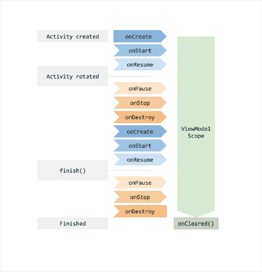T2】](https://res.cloudinary.com/practicaldev/image/fetch/s--1F-fo30a--/c_limit%2Cf_auto%2Cfl_progressive%2Cq_auto%2Cw_880/https://i.imgur.com/xiAMXpf.png)

在我学习 MvRx 和 Kotlin 的过程中，我遇到了几个提高开发体验的助手库。我决定学习和使用它们。

我慢慢意识到，有时候，我们可能不喜欢使用框架，不是因为框架本身，而仅仅是因为我们应用它的方式。

* * *

## [](#guide)向导

我们将利用以下库制作一个简单的应用程序:

*   导航组件
*   Kotlin Android 扩展
*   MvRx
*   Flexbox 布局

应用程序流程如下:

1.  登录屏幕:
    *   两个文本输入字段。
    *   登录按钮。

一旦用户按下登录按钮，我们将使用一个简单的延迟来模拟一个请求。在模拟请求期间，我们将隐藏视图并显示一个加载指示器。请求完成后，我们将恢复我们的视图，隐藏加载指示器并导航到登录屏幕。

1.  登录屏幕:
    *   该屏幕将只显示先前文本输入中输入的数据和一个注销按钮。

很简单。

### [](#dependencies)依赖关系

让我们首先用 Kotlin 创建一个空白的 Android Studio 项目，并添加我们的依赖项。

[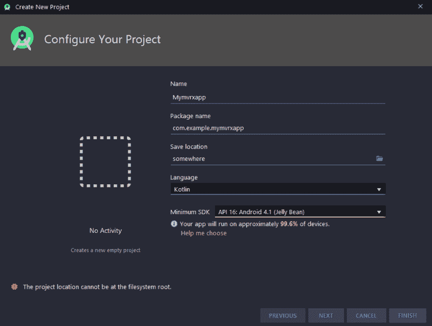T2】](https://res.cloudinary.com/practicaldev/image/fetch/s--KGlTUMA4--/c_limit%2Cf_auto%2Cfl_progressive%2Cq_auto%2Cw_880/https://i.imgur.com/bj81gfn.png)

将 MvRx 和导航组件添加到依赖块中，位于`app/build.gradle` :
下

```
dependencies {
    def navVersion = "2.1.0"
    def mvrxVersion = '1.1.0'

    // Navigation component
    implementation "androidx.navigation:navigation-fragment-ktx:$navVersion"
    implementation "androidx.navigation:navigation-ui-ktx:$navVersion"

    // MvRx
    implementation "com.airbnb.android:mvrx:$mvrxVersion"

    // Flexbox
    implementation 'com.google.android:flexbox:1.1.0'
    .. 
```

在同一文件的顶部:

```
// Kotlin Android Extensions
apply plugin: 'kotlin-android-extensions' 
```

### [](#layouts)Layouts

我们将使用**单活动-多片段**模式。片段应该被设计成可重用的模块化组件，就像 React 中的表示组件一样。

创建我们的布局文件:右击`res`文件夹，然后选择**新建> Android 资源文件**。将类型设置为`Layout`。

[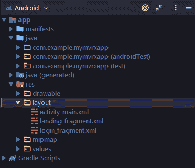T2】](https://res.cloudinary.com/practicaldev/image/fetch/s--QR4cWLm6--/c_limit%2Cf_auto%2Cfl_progressive%2Cq_auto%2Cw_880/https://i.imgur.com/Xdkq8hp.png)

`activity_main.xml`

```
<?xml version="1.0" encoding="utf-8"?>
<LinearLayout xmlns:android="http://schemas.android.com/apk/res/android"
    android:layout_width="match_parent"
    android:layout_height="match_parent"
    android:orientation="vertical">

    <fragment
        android:id="@+id/host"
        android:layout_width="match_parent"
        android:layout_height="match_parent" />

</LinearLayout> 
```

`login_fragment.xml`

```
<?xml version="1.0" encoding="utf-8"?>
<FrameLayout xmlns:android="http://schemas.android.com/apk/res/android"
    xmlns:app="http://schemas.android.com/apk/res-auto"
    xmlns:tools="http://schemas.android.com/tools"
    android:layout_width="match_parent"
    android:layout_height="match_parent"
    android:background="#F1F1F1">

    <com.google.android.flexbox.FlexboxLayout

        android:layout_width="match_parent"
        android:layout_height="250dp"
        android:layout_marginTop="200dp"
        app:alignItems="center"
        app:flexWrap="wrap"
        app:justifyContent="center">

        <EditText
            android:id="@+id/loginNameText"
            android:layout_width="120dp"
            android:layout_height="60dp"
            android:hint="Name"
            android:importantForAutofill="no"
            android:inputType="text"
            app:layout_flexBasisPercent="80%"
            tools:text="Name" />

        <EditText
            android:id="@+id/loginCityText"
            android:layout_width="120dp"
            android:layout_height="60dp"
            android:hint="City"
            android:importantForAutofill="no"
            android:inputType="text"
            app:layout_flexBasisPercent="80%"
            tools:text="City" />

        <Button
            android:id="@+id/loginButton"
            android:layout_width="wrap_content"
            android:layout_height="wrap_content"
            android:layout_marginTop="30dp"
            android:backgroundTint="#6200EE"
            android:text="LOGIN"
            android:textColor="#FFF"
            app:layout_flexBasisPercent="80%" />

        <ProgressBar
            android:id="@+id/loadingIndicator"
            android:layout_width="wrap_content"
            android:layout_height="wrap_content"
            android:visibility="gone"
            app:layout_flexBasisPercent="100%"
            />

    </com.google.android.flexbox.FlexboxLayout>

</FrameLayout> 
```

根是一个`<FrameLayout/>`。在我们的每个片段中，`activity_main.xml`中的`<fragment/>`标签将被替换为`<FrameLayout/>`的内容(孩子)。(有点像 React 的[小朋友](https://stackoverflow.com/questions/49706823/what-is-this-props-children-and-when-you-should-use-it)？)

根布局的子节点是 [`<FlexboxLayout/>`](https://github.com/google/flexbox-layout) 。相当酷。 [`ConstraintLayout`](https://developer.android.com/training/constraint-layout) 不错，如果你更喜欢视觉上的自定义布局。

想用什么就用什么。

[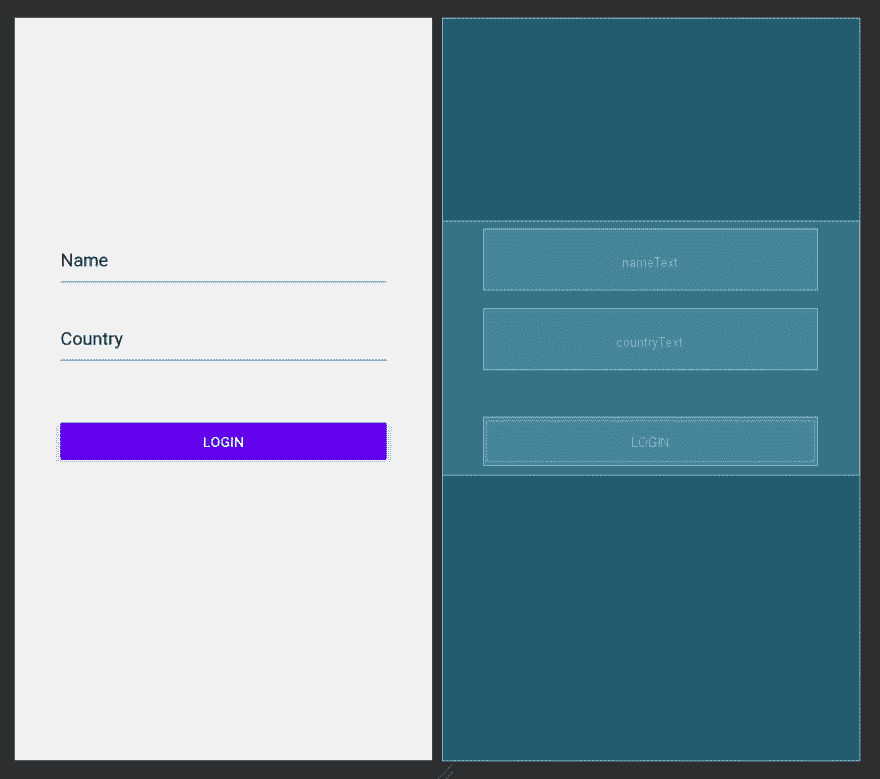T2】](https://res.cloudinary.com/practicaldev/image/fetch/s--gF0bj9CQ--/c_limit%2Cf_auto%2Cfl_progressive%2Cq_auto%2Cw_880/https://i.imgur.com/EoOCcJI.png)

`landing_fragment.xml`

```
<?xml version="1.0" encoding="utf-8"?>
<FrameLayout xmlns:android="http://schemas.android.com/apk/res/android"
    xmlns:app="http://schemas.android.com/apk/res-auto"
    xmlns:tools="http://schemas.android.com/tools"
    android:layout_width="match_parent"
    android:layout_height="match_parent"
    android:background="#F1F1F1">

    <com.google.android.flexbox.FlexboxLayout
        android:layout_width="match_parent"
        android:layout_height="250dp"
        android:layout_marginTop="200dp"
        app:alignItems="center"
        app:flexWrap="wrap"
        app:justifyContent="center">

        <TextView
            android:layout_width="wrap_content"
            android:layout_height="wrap_content"
            android:gravity="center"
            android:textColor="@android:color/black"
            android:textSize="24sp"
            app:layout_flexBasisPercent="50%"
            android:text="Name:" />

        <TextView
            android:id="@+id/landingNameText"
            android:layout_width="wrap_content"
            android:layout_height="wrap_content"
            android:gravity="center"
            android:textColor="@android:color/black"
            android:textSize="24sp"
            app:layout_flexBasisPercent="50%"
            tools:text="placeholder" />

        <TextView
            android:layout_width="wrap_content"
            android:layout_height="wrap_content"
            android:gravity="center"
            android:textColor="@android:color/black"
            android:textSize="24sp"
            app:layout_flexBasisPercent="50%"
            android:text="City:" />

        <TextView
            android:id="@+id/landingCityText"
            android:layout_width="wrap_content"
            android:layout_height="wrap_content"
            android:gravity="center"
            android:textColor="@android:color/black"
            android:textSize="24sp"
            app:layout_flexBasisPercent="50%"
            tools:text="placeholder" />

        <Button
            android:id="@+id/logoutButton"
            android:layout_width="wrap_content"
            android:layout_height="wrap_content"
            android:layout_marginTop="30dp"
            android:backgroundTint="#F05E54"
            android:text="LOGOUT"
            android:textColor="#FFF"
            app:layout_flexBasisPercent="80%" />

    </com.google.android.flexbox.FlexboxLayout>

</FrameLayout> 
```

[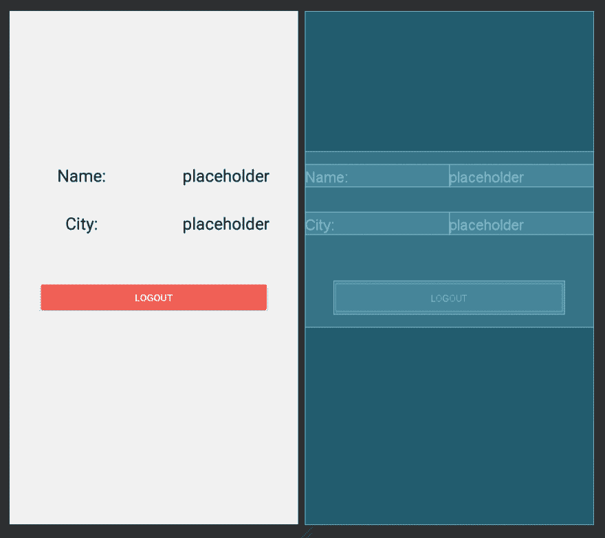T2】](https://res.cloudinary.com/practicaldev/image/fetch/s--htwu-OvI--/c_limit%2Cf_auto%2Cfl_progressive%2Cq_auto%2Cw_880/https://i.imgur.com/iTUjrWC.png)

### [](#classes)类

创建我们的 Kotlin 类来关联每个布局。

[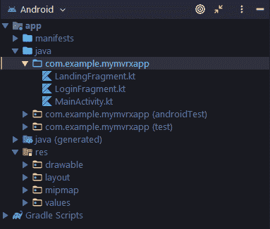T2】](https://res.cloudinary.com/practicaldev/image/fetch/s--5Evk7Rak--/c_limit%2Cf_auto%2Cfl_progressive%2Cq_auto%2Cw_880/https://i.imgur.com/4dq3iEl.png)

为了创建一个活动，我们通常会直接扩展`AppCompatActivity`类。但是因为我们想使用 MvRx，我们将扩展`BaseMvRxActivity`(继承自`AppCompatActivity`)来支持 MvRx。我们还将覆盖`onCreate()`并在这里给`activity_main.xml`充气。

> 提示:[这里的](https://developers.google.com/android/for-all/vocab-words/?hl=en)是一个超级有用的页面，可以用来查找 Android 术语，比如“inflate”。

`MainActivity.kt`

```
package com.example.mymvrxapp

import android.os.Bundle
import com.airbnb.mvrx.BaseMvRxActivity

class MainActivity() : BaseMvRxActivity() {
    override fun onCreate(savedInstanceState: Bundle?) {
        super.onCreate(savedInstanceState)
        setContentView(R.layout.activity_main)
    }
} 
```

每项活动都必须在清单中登记。我们将注册`MainActivity`并将其设置为开始活动。

`AndroidManifest.xml`

```
<manifest xmlns:android="http://schemas.android.com/apk/res/android"
    package="com.example.mymvrxapp">

    <application
        android:allowBackup="true"
        android:icon="@mipmap/ic_launcher"
        android:label="@string/app_name"
        android:roundIcon="@mipmap/ic_launcher_round"
        android:supportsRtl="true"
        android:theme="@style/AppTheme">
        <activity android:name="com.example.mymvrxapp.MainActivity">
            <intent-filter>
                <action android:name="android.intent.action.MAIN" />
                <category android:name="android.intent.category.LAUNCHER" />
            </intent-filter>
        </activity>
    </application>
</manifest> 
```

对于我们的片段，我们将扩展`BaseMvRxFragment`而不是`Fragment`。我们还必须实施`invalidate()`。我们将让它空着，以后再看。

`LoginFragment.kt`

```
package com.example.mymvrxapp

import android.os.Bundle
import android.view.LayoutInflater
import android.view.View
import android.view.ViewGroup
import com.airbnb.mvrx.BaseMvRxFragment

class LoginFragment : BaseMvRxFragment() {
    override fun onCreateView(
        inflater: LayoutInflater,
        container: ViewGroup?,
        savedInstanceState: Bundle?
    ): View? {
        return inflater.inflate(R.layout.login_fragment, container, false)
    }

    override fun invalidate() {
    }
} 
```

`LandingFragment.kt`

```
package com.example.mymvrxapp

import android.os.Bundle
import android.view.LayoutInflater
import android.view.View
import android.view.ViewGroup
import com.airbnb.mvrx.BaseMvRxFragment

class LandingFragment : BaseMvRxFragment() {
    override fun onCreateView(
        inflater: LayoutInflater,
        container: ViewGroup?,
        savedInstanceState: Bundle?
    ): View? {
        return inflater.inflate(R.layout.landing_fragment, container, false);
    }

    override fun invalidate() {
    }
} 
```

### [](#navigation)导航

如果我们现在运行应用程序，它将会崩溃。我们的`activity_main.xml`中的`<fragment/>`需要一个 ID 和一个名称来将它与一个片段相关联。我们已经给了它一个 ID，但是我们还没有告诉它它将托管哪个片段。

[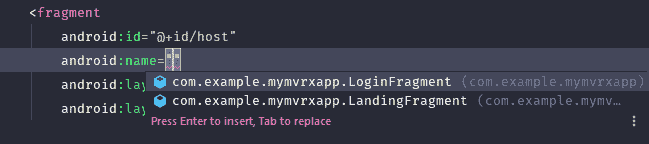T2】](https://res.cloudinary.com/practicaldev/image/fetch/s--U9mZSmLN--/c_limit%2Cf_auto%2Cfl_progressive%2Cq_auto%2Cw_880/https://i.imgur.com/bwalFSz.png)

我们不会这么做的。相反，我们将把它与我们的导航图联系起来。使用[导航组件](https://developer.android.com/guide/navigation/)。

简而言之，这是一个库，它用一个简洁的 API 和一个友好的界面来简化我们处理导航的方式，以可视化我们的路线。

> 导航组件完成与[反应导航](https://reactnavigation.org/)和[反应路由器](https://reacttraining.com/react-router/)相同的工作。
> 
> 有趣的反应导航事实:我们可以[配置]((https://reactnavigation.org/docs/en/react-native-screens.html))它使用碎片活动
> 而不是普通的`View`来提高性能。

创建我们的导航图。右击`res`文件夹，然后选择**新建>安卓资源文件**。将类型设置为`Navigation`。

`nav_graph.xml`

```
<?xml version="1.0" encoding="utf-8"?>
<navigation xmlns:android="http://schemas.android.com/apk/res/android"
    android:id="@+id/nav_graph" /> 
```

现在我们已经为我们的导航图创建了文件，我们将为`<fragment/>`添加一个 ID，并通过添加以下属性将其指定为我们的导航主机:

`activity_main.xml`

```
<?xml version="1.0" encoding="utf-8"?>
<LinearLayout xmlns:android="http://schemas.android.com/apk/res/android"
    xmlns:app="http://schemas.android.com/apk/res-auto"
    android:layout_width="match_parent"
    android:layout_height="match_parent"
    android:orientation="vertical">

    <fragment
        android:id="@+id/host"
        android:name="androidx.navigation.fragment.NavHostFragment"
        android:layout_width="match_parent"
        android:layout_height="match_parent"
        app:defaultNavHost="true"
        app:navGraph="@navigation/nav_graph" />

</LinearLayout> 
```

让我们将片段类添加到导航图中，将它们标记为可能的目的地。这部分我喜欢用可视化编辑器。

在可视化编辑器中打开`nav_graph.xml`，添加`LoginFragment`和`LandingFragment`。

[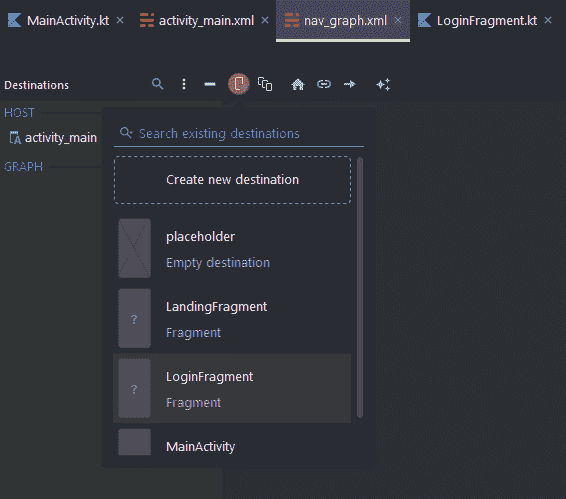T2】](https://res.cloudinary.com/practicaldev/image/fetch/s--KbTj-Qwz--/c_limit%2Cf_auto%2Cfl_progressive%2Cq_auto%2Cw_880/https://i.imgur.com/JHOwaX8.png)

选择图中的登录片段，然后单击 home 图标将其标记为起始目的地。

接下来，从登录片段的边缘拖动到着陆片段，以创建一个导航动作。

[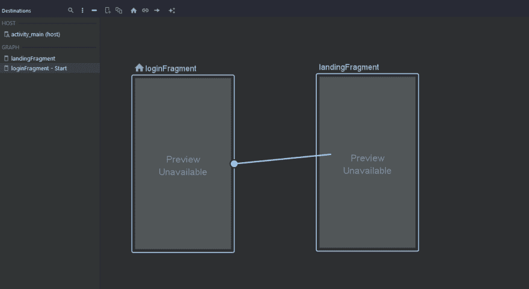T2】](https://res.cloudinary.com/practicaldev/image/fetch/s--yVovK39v--/c_limit%2Cf_auto%2Cfl_progressive%2Cq_auto%2Cw_880/https://i.imgur.com/a80Zbq5.png)

现在你的导航图和标记应该看起来像这样。

`nav_graph.xml`

```
<?xml version="1.0" encoding="utf-8"?>
<navigation xmlns:android="http://schemas.android.com/apk/res/android"
    xmlns:app="http://schemas.android.com/apk/res-auto"
    xmlns:tools="http://schemas.android.com/tools"
    android:id="@+id/nav_graph"
    app:startDestination="@id/loginFragment">
    <fragment
        android:id="@+id/landingFragment"
        android:name="com.example.mymvrxapp.LandingFragment"
        android:label="LandingFragment"
        tools:layout="@layout/landing_fragment" />
    <fragment
        android:id="@+id/loginFragment"
        android:name="com.example.mymvrxapp.LoginFragment"
        android:label="LoginFragment"
        tools:layout="@layout/login_fragment">
        <action
            android:id="@+id/action_loginFragment_to_landingFragment2"
            app:destination="@id/landingFragment" />
    </fragment>
</navigation> 
```

我添加了`tools:layout=...`属性，用于在导航图中显示你的布局，否则你只会看到一个普通而无聊的矩形。

[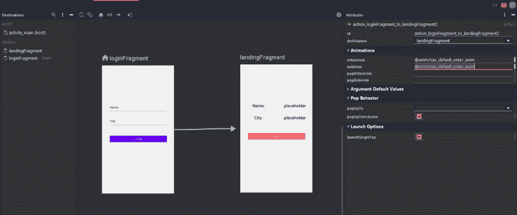T2】](https://res.cloudinary.com/practicaldev/image/fetch/s--K5iNpOjZ--/c_limit%2Cf_auto%2Cfl_progressive%2Cq_auto%2Cw_880/https://i.imgur.com/nAWcI9o.png)

如果我们现在运行应用程序，我们应该会看到登录屏幕。

### [](#logic)逻辑

让我们从向文本输入添加状态开始。我们需要做到以下几点:

*   创建描述我们状态的数据类。
*   创建我们的视图模型类，它将包含触发状态变化的函数。

为了方便起见，我在与`MainActivity.kt`相同的文件中创建了数据类和视图模型，但这不是必需的。

`FormState`

```
data class FormState(
    val name: String = "",
    val city: String = "",
    val loggedIn: Async<Boolean> = Uninitialized
) : MvRxState 
```

我们必须通过提供默认参数来设置初始状态。注意它实现了`MvRxState`。这是我们希望用作 state 的任何数据类所必需的。

在 React 中，我们可能有一个`loading`状态，并在异步任务完成前后设置它。在 MvRx 中， [`Async`](https://github.com/airbnb/MvRx/wiki#async) 是一个[密封类](https://kotlinlang.org/docs/reference/sealed-classes.html)，带有类似`Loading`和`Success`的类型。我们可以简单地引用异步值的当前类型来对加载和成功状态做出反应。超级有帮助。

`FormViewModel`

```
class FormViewModel(initialState: FormState) :
    BaseMvRxViewModel<FormState>(initialState, debugMode = BuildConfig.DEBUG) {

    init {
        logStateChanges()
    }

    fun setNameAndCity(name: String, city: String) {
        setState { copy(city = city, name = name) }
    }
    // We will go over this one in depth later on
    fun doLogIn() {
        Single.just(true)
            .delaySubscription(5, TimeUnit.SECONDS)
            .subscribeOn(Schedulers.io())
            .observeOn(AndroidSchedulers.mainThread())
            .execute { copy(loggedIn = it) }
    }

    fun doLogout() {
        setState {
            copy(loggedIn = Uninitialized)
        }
    }
} 
```

`debugMode = BuildConfig.DEBUG`将在使用调试版本时进行一些[安全检查](https://github.com/airbnb/MvRx/wiki#debug-checks)。`init`块和`logStateChanges()`也是可选的。`logStateChanges()`言出必行。当我们完成我们的应用程序时，我们将显示它的输出。

我们的`setState`reducer 将从我们的视图中被调用来更新状态。与 React 类似，`setState`块是一个异步操作和一个纯函数，它接受当前状态，并返回新状态。

注意`setState`块中的`copy()`语法。在`setState`中，`this`关键字是我们的数据类，`copy()`是属于 Kotlin 中数据类的[方法](https://kotlinlang.org/docs/reference/data-classes.html#copying)。它允许您修改选择属性而不是所有属性(在 React 行话中，我们不需要传播当前状态)。

接下来，我们希望能够从我们的片段中访问状态。我们的登录和着陆片段必须订阅我们在主活动中定义的同一个视图模型*实例*。

`LoginFragment.kt`

```
class LoginFragment : BaseMvRxFragment() {
    // Fetch the ViewModel scoped to the current activity or create one if it doesn't exist
    private val formViewModel: FormViewModel by activityViewModel()

    .. 
```

`LandingFragment.kt`

```
class LandingFragment : BaseMvRxFragment() {    
    // Fetch the existing ViewModel scoped to the current activity
    private val formViewModel: FormViewModel by existingViewModel()

    .. 
```

通知`by activityViewModel()`。这是一个 Kotlin [委托](https://kotlinlang.org/docs/reference/delegated-properties.html)懒洋洋地返回一个当前活动范围内的视图模型。因为我们的两个片段都属于同一个活动，所以共享状态非常简单。

对于`LandingFragment.kt`，我们使用了`existingViewModel()`，它返回当前活动范围内的现有视图模型。不同之处在于，如果不存在视图模型，这个函数将抛出异常，而不是创建一个新的视图模型。

> MvRx 让您[轻松地选择您想要使用的视图模型的范围](https://github.com/airbnb/MvRx/wiki#creating-and-subscribing-to-a-viewmodel)。

* * *

一旦我们的视图加载(React: mounts)，我们将:

*   向我们的登录按钮添加一个点击监听器。
*   当用户按下按钮时，我们将获取用户的输入并更新我们的`name`和`city`状态，然后调用`doLogIn`开始模拟请求/延迟。
*   当延迟开始时，我们必须隐藏我们的观点，并显示装载指示器。
*   当延迟结束时，我们必须隐藏装载指示器并显示我们的视图。然后，我们导航到登录屏幕。

覆盖`onViewCreated`并实现点击监听器，如下所述:

`LoginFragment.kt`

```
 override fun onViewCreated(view: View, savedInstanceState: Bundle?) {
        super.onViewCreated(view, savedInstanceState)

        loginButton.setOnClickListener {

            // Update the state
            formViewModel.setNameAndCity(
                loginNameText.text.toString(),
                loginCityText.text.toString()
            )

            formViewModel.doLogIn()
        }
    } 
```

因为有了 [Kotlin Android 扩展](https://kotlinlang.org/docs/tutorials/android-plugin.html)，我们能够直接引用视图而无需调用`findViewById`。这被称为视图绑定(类似于在 React 中获取一个节点的`ref`)。

> 注意:以后推荐使用[视图绑定组件](https://developer.android.com/topic/libraries/view-binding)，它有一些优点，没有[的缺点](https://old.reddit.com/r/androiddev/comments/ala9p2/why_kotlinx_synthetic_is_no_longer_a_recommended/efdvpkg/)。它将在新版本的 Android Studio 中提供。

```
 fun doLogIn() {
        Single.just(true)
            .delaySubscription(5, TimeUnit.SECONDS)
            .subscribeOn(Schedulers.io())
            .observeOn(AndroidSchedulers.mainThread())
            .execute { copy(loggedIn = it) }
    } 
```

> MvRx 利用了 RxJava。Primer: RxJava 在 Android 开发中非常有用，因为它提供了一个简洁的 API 来处理异步逻辑(就像 JavaScript 承诺的那样，但是有更多的功能)。
> 
> 重要的是在主线程(也称为 UI 线程)之外执行长时间运行的任务，以防止应用程序丢帧。RxJava 允许您轻松地以声明方式切换线程。
> 
> 要使用 RxJava 的任何 API，我们必须使用`observable`类型。RxJava 有 API 来从事物中创建可观察的事物。

当按下登录按钮时，调用`doLogin()`。让我们详细介绍一下，因为如果您以前从未使用过 Rx，它可能会令人生畏:

*   `Single`是一种解析为单个值的可观察值，就像 JavaScript 承诺一样。
*   `just()`用来表示这个可观察对象只解析为这个项目，在这种情况下这个项目就是`true`。所以第一行相当于 JavaScript 中的`Promise.resolve(true)`。

```
..
.delaySubscription(5, TimeUnit.SECONDS) 
```

*   我们需要订阅一个可观察对象，以便从中获得结果。这一行声明任何订阅都应该延迟 5 秒。

```
..
.subscribeOn(Schedulers.io())
.observeOn(AndroidSchedulers.mainThread()) 
```

*   这里，我们声明我们希望在`io`调度程序的帮助下使用`io`线程订阅这个可观察对象，并请求将值通知发送到主线程。

```
..
.execute { copy(loggedIn = it) } 
```

*   `execute`是 MvRx 提供的一个简洁的帮助函数，它将流程的当前状态映射到我们的`loggedIn`异步类型。当可观测量被执行时，`loggedIn`类型更新为`Loading`。完成后，`loggedIn`类型和值被更新到`Success`和`true`。

现在，`invalidate()`函数派上了用场。每当我们的状态被更新时，这个函数就会被调用(就像 React 重新渲染一样)。在这里，我们可以根据当前状态对视图进行更改。

`LoginFragment.kt`

```
 ..

    override fun invalidate() {
        withState(formViewModel) { state ->
            loadingIndicator.isVisible = state.loggedIn is Loading
            loginNameText.isVisible = state.loggedIn !is Loading
            loginCityText.isVisible = state.loggedIn !is Loading
            loginButton.isVisible = state.loggedIn !is Loading

            if (state.loggedIn is Success) {
                findNavController().navigate(R.id.action_loginFragment_to_landingFragment2)
            }
        }
    } 
```

`withState`允许我们访问视图模型的当前状态。在内部，我们将`loggedIn`的加载状态映射到加载指示器、输入和按钮的可见性。如果`loggedIn`是类型`Success`，那么我们导航到登陆屏幕。

> [导航 KTX](https://developer.android.com/kotlin/ktx#navigation) 帮助我们在这里获得导航控制器的参考。

对于着陆片段，我们需要实现`invalidate()`并使用当前状态更新我们的文本。我们将在注销按钮上添加一个监听器，将`loggedIn`设置为`Uninitialized`，然后将我们的片段弹出导航堆栈，返回登录屏幕。

`LandingFragment.kt`

```
 ..

    override fun onViewCreated(view: View, savedInstanceState: Bundle?) {
        super.onViewCreated(view, savedInstanceState)

        logoutButton.setOnClickListener {
            formViewModel.doLogout()
            findNavController().popBackStack()

        }
    }

    override fun invalidate() {
        withState(formViewModel) { state ->
            landingCityText.text = state.city
            landingNameText.text = state.name
        }
    } 
```

[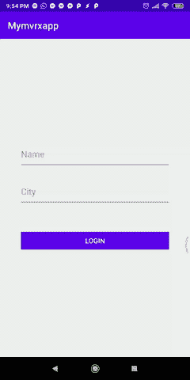T2】](https://res.cloudinary.com/practicaldev/image/fetch/s--zl-IpHjM--/c_limit%2Cf_auto%2Cfl_progressive%2Cq_66%2Cw_880/https://i.imgur.com/Nuk7agr.gif)

由`logStateChanges()` :
提供

```
D/FormViewModel: New State: FormState(name=Osama, city=Cyberjaya, loggedIn=com.airbnb.mvrx.Uninitialized@24591c4)
D/FormViewModel: New State: FormState(name=Osama, city=Cyberjaya, loggedIn=com.airbnb.mvrx.Loading@7749791c)
D/FormViewModel: New State: FormState(name=Osama, city=Cyberjaya, loggedIn=Success(value=true)) 
```

全部完成！希望你喜欢这个指南，并发现它很有用。

如果你想了解更多关于 MvRx 的信息，我建议浏览他们的 [wiki](https://github.com/airbnb/MvRx/wiki) 和他们的 [repo](https://github.com/airbnb/MvRx/) 上的代码样本。*