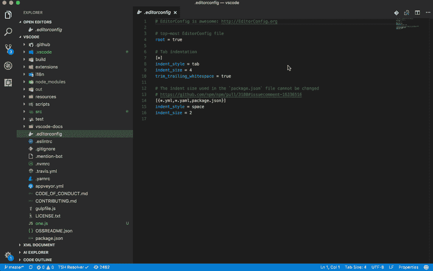
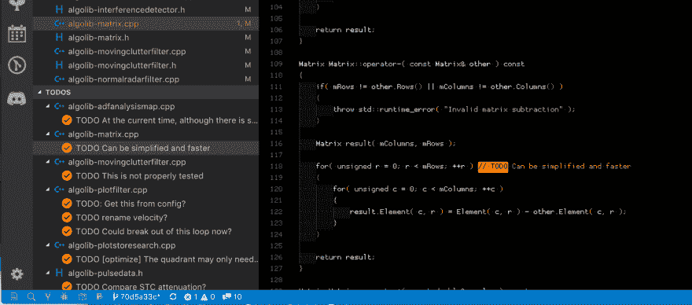
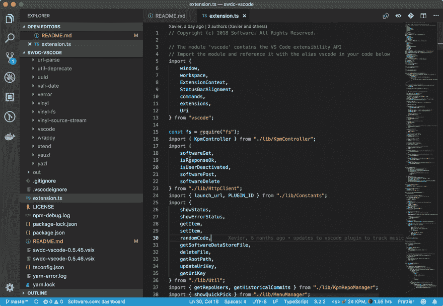
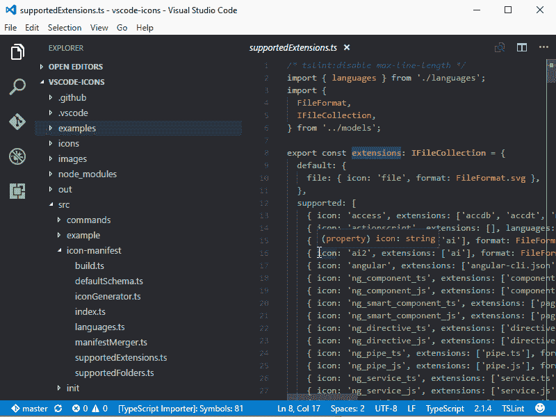

# web 开发的 VSCode 设置:设置和扩展

> 原文：<https://dev.to/boobo94/vscode-setup-for-web-development-settings-and-extensions-13hp>

就在今天。亲爱的朋友们，你们好，欢迎回到我写的一篇新的[文章](/developer-story/7-questions-from-a-beginner-developer/)，你的波波。

在本文中，我想向您展示我为 web 开发设置的 VSCode。作为一个日常工具，VSCode 正是我完成任务所需要的。

这几天主要写 JavaScript 代码，不过以前也是写 Golang，PHP，bash 脚本，SQL 查询，Java 或者 Python 的代码。我认为它是非常有用和非常强大的文本编辑器。但这不是关于什么是 VSCode，而是我的设置，所以让我们开始吧。

## VSCode 设置

下面的 JSON 配置是我的环境的配置。你可以简单地通过按压粘贴它

```
MAC: CMD+SHIFT+P
Windows/Linux: CTRL+SHIFT+P
```

在打开的窗口中键入: ***首选项:打开设置(JSON)*** ，粘贴以下 JSON 对象:

```
{
    "editor.minimap.enabled": false,
    "explorer.openEditors.visible": 0,
    "git.autofetch": true,
    "window.zoomLevel": -1,
    "workbench.colorCustomizations": {},
    "workbench.colorTheme": "One Dark Pro",
    "workbench.iconTheme": "vscode-icons",
    "editor.formatOnSave": true,
    "todo-tree.highlights.customHighlight": {
        "TODO": {
            "background": "#00b248",
            "foreground": "#66ffa6",
            "icon": "checklist",
            "type": "text"
        },
        "FIXME": {
            "background": "#c79400",
            "foreground": "#fff64f",
            "icon": "alert",
            "type": "text"
        }
    },
    "todo-tree.regex.regexCaseSensitive": false,
    "todo-tree.filtering.excludeGlobs": [
        "**/node_modules/**"
    ],
}
```

## 扩展ˌ扩张

根据我的任务，我不时地使用许多扩展，但这是我喜欢 VSCode 设置而不是 ide 的地方。您可以每天对其进行配置，而不必一直使用相同的配置。因为 VSCode 默认是非常 lite 的。

### [彩虹括号](https://marketplace.visualstudio.com/items?itemName=2gua.rainbow-brackets)

这是一个非常酷的工具，着色的括号，并提供一个很好的。

```
code --install-extension 2gua.rainbow-brackets
```

### [GitLens](https://marketplace.visualstudio.com/items?itemName=eamodio.gitlens)

> GitLens **增强了 Visual Studio 代码中内置的 Git 功能**。它帮助你**通过 Git 责备注释和代码透镜看一眼代码作者**，**无缝导航和探索** Git 库，**通过强大的比较命令获得有价值的见解**，等等。

我喜欢 gitlens，因为它为你提供了很多与 git 相关的很酷的功能。您可以看到所有的分支、提交和标记。你可以看到上次谁修改了一行代码，文件的最新变化是什么，以及其他很酷的东西。试试看！

```
code --install-extension eamodio.gitlens
```

### [Git 历史记录](https://marketplace.visualstudio.com/items?itemName=donjayamanne.githistory)

[](https://res.cloudinary.com/practicaldev/image/fetch/s--CFSsVcpI--/c_limit%2Cf_auto%2Cfl_progressive%2Cq_66%2Cw_880/https://raw.githubusercontent.com/DonJayamanne/gitHistoryVSCode/mastimg/gitLogv2.gif)

```
code --install-extension donjayamanne.githistory
```

### [VS 代码的编辑器配置](https://marketplace.visualstudio.com/items?itemName=EditorConfig.EditorConfig)

> 这个插件[试图用`.editorconfig`文件中的设置覆盖](https://marketplace.visualstudio.com/items?itemName=EditorConfig.EditorConfig#known-issues)的用户/工作区设置。不需要额外的或特定于 vscode 的文件。与任何 EditorConfig 插件一样，如果没有指定`root=true`，EditorConfig [将继续在](https://editorconfig.org/#file-location)中寻找项目外的`.editorconfig`文件。

```
code --install-extension EditorConfig.EditorConfig
```

### [更漂亮的代码格式化程序](https://marketplace.visualstudio.com/items?itemName=esbenp.prettier-vscode)

> [更漂亮](https://prettier.io/)是一个固执己见的代码格式化程序。它通过解析您的代码并根据自己的规则(考虑到最大行长度，必要时换行)重新打印代码来强制执行一致的风格。
> *JavaScript TypeScript 流程 JSX JSON*
> *CSS SCSS 少*
> *HTML Vue Angular*
> *graph QL Markdown YAML*

```
code --install-extension esbenp.prettier-vscode
```

### [待办事项树](https://marketplace.visualstudio.com/items?itemName=Gruntfuggly.todo-tree)

[](https://res.cloudinary.com/practicaldev/image/fetch/s--iNcMLghs--/c_limit%2Cf_auto%2Cfl_progressive%2Cq_auto%2Cw_880/https://raw.githubusercontent.com/Gruntfuggly/todo-tree/master/resources/screenshot.png)

我非常喜欢 Todo Tree，因为它的配置。使用非常简单，提供了非常简单但非常可靠的功能。但是它最好的特性是突出代码中的 todo 或 fixme 关键字。我个人选择突出整个系列。

```
code --install-extension Gruntfuggly.todo-tree
```

### [代码时间](https://marketplace.visualstudio.com/items?itemName=softwaredotcom.swdc-vscode)

[](https://res.cloudinary.com/practicaldev/image/fetch/s--5eGLZ929--/c_limit%2Cf_auto%2Cfl_progressive%2Cq_66%2Cw_880/https://s3-us-west-1.amazonaws.com/swdc-static-assets/vs-code-dashboard.gif)

在代码编辑器中提供每日和每周的编程活动报告。

```
code --install-extension softwaredotcom.swdc-vscode
```

### [虚拟代码图标](https://marketplace.visualstudio.com/items?itemName=vscode-icons-team.vscode-icons)

[](https://res.cloudinary.com/practicaldev/image/fetch/s--6HSp87V---/c_limit%2Cf_auto%2Cfl_progressive%2Cq_66%2Cw_880/https://raw.githubusercontent.com/vscode-icons/vscode-icons/mastimg/screenshot.gif)

我真的很喜欢这个插件，因为它让我的文本编辑器更加友好，并为我提供了一个很好的文件类型概览。我建议你试一试。

```
code --install-extension vscode-icons-team.vscode-icons
```

## 主题

[](https://camo.githubusercontent.com/48f39d862900e54913410490e566a9e761bc5ad5/68747470733a2f2f7773332e73696e61696d672e636e2f6c617267652f303036744e6252776779316676776b7236693139396a33316b7731366f7461742e6a7067)

我不知道你怎么想，但就我个人而言，我真的很喜欢黑屏。我喜欢看到我的电脑变暗，我喜欢黑暗模式的主题。目前我用的是[一个暗黑 Pro 主题](https://marketplace.visualstudio.com/items?itemName=zhuangtongfa.Material-theme)。

```
code --install-extension zhuangtongfa.Material-theme
```

我希望你喜欢它。如果你对我的日常设置有更多的问题，不要在我的文章之后等待，直接去联系表格给我写信。我会针对你的问题专门写一整篇文章。

我叫 94 `8-)`的波波，你刚刚把老虎从笼子里抓出来。