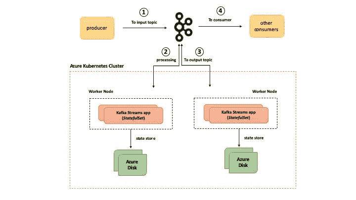

# 了解运行有状态 Kafka Streams 应用程序所需的 Kubernetes 组件

> 原文：<https://dev.to/azure/learn-about-the-kubernetes-components-required-to-run-stateful-kafka-streams-applications-44jl>

> 很高兴通过 [@abhi_tweeter](https://twitter.com/abhi_tweeter) 获得反馈或发表评论！

以前的[博客](https://dev.to/azure/learn-how-to-develop-a-kafka-streams-application-for-data-processing-and-deploy-it-to-kubernetes-25li)中有一篇是关于使用 [Kafka Streams](https://kafka.apache.org/documentation/streams/) 库构建一个**无状态**流处理应用程序，并以`Deployment`对象的形式将其部署到 Kubernetes。

在这一部分，我们将继续探索卡夫卡溪流和库伯内特斯的有力结合。但这一篇是关于有状态的应用程序，以及如何利用特定的 Kubernetes 原语，使用 Azure (AKS)上的 Kubernetes 集群来运行它。

> 我马上承认这是一个稍微有点长的博客，但是有很多东西要涵盖和学习！

当您完成此操作时，您将了解以下内容:

*   卡夫卡溪流
    *   什么是卡夫卡溪流？
    *   有状态 Kafka 流应用程序的概念
*   幕后
    *   使用 Kafka 流的流处理逻辑的 Java 代码中发生了什么
    *   Kubernetes 组件，用于运行有状态的 Kafka 流应用程序，如`StatefulSet`、批量声明模板和其他配置参数，如`Pod`反亲缘关系
    *   使用 [Azure Kubernetes 服务](https://docs.microsoft.com/azure/aks/?WT.mc_id=devto-blog-abhishgu)进行容器编排，使用 [Azure 磁盘](https://docs.microsoft.com/azure/virtual-machines/windows/managed-disks-overview?WT.mc_id=devto-blog-abhishgu)进行持久性存储，这一切是如何设置的
*   如何设置和配置一个 [Docker 容器注册表](https://docs.microsoft.com/azure/container-registry/?WT.mc_id=devto-blog-abhishgu)和 Azure Kubernetes 集群
*   如何在 Kubernetes 上构建和部署我们的应用程序，并最终使用 Kafka CLI 进行测试

> 源代码是 GitHub 上的

我们开始吧！

[](https://i.giphy.com/media/9DGFdfnT6SJSE/giphy.gif)

### 先决条件:

如果你还没有，请[安装 Azure CLI](https://docs.microsoft.com/cli/azure/install-azure-cli?view=azure-cli-latest&WT.mc_id=devto-blog-abhishgu) 和 [kubectl](https://kubernetes.io/docs/tasks/tools/install-kubectl/) 。流处理应用程序是用 Java 编写的，使用 [Maven](https://maven.apache.org/install.html) 。您还需要 [Docker](https://docs.docker.com/install/) 来构建应用程序容器映像。

> 本教程假设您有一个 Kafka 集群，可以从 Azure 上的 Kubernetes 集群访问它

### 卡夫卡溪流

本节将简要介绍 Kafka 流，以及在基于 Kafka 流的应用程序环境中“状态”的含义。

#### 卡夫卡溪流概述

它是一个简单的轻量级客户端库，可以很容易地嵌入到任何 Java app 或微服务中，其中输入和输出数据存储在 [Kafka clusters](https://kafka.apache.org/) 中。除了 Kafka 本身和它的分区模型之外，它对其他系统没有外部依赖性，可以水平扩展处理，同时保持强大的排序保证。它支持容错本地状态，采用一次一条记录处理来实现毫秒级处理延迟，并提供必要的流处理原语，以及一个[高级流 DSL](https://kafka.apache.org/23/documentation/streams/developer-guide/dsl-api.html) 和一个[低级处理器 API](https://kafka.apache.org/23/documentation/streams/developer-guide/processor-api.html) 。“状态存储”和[交互查询](https://kafka.apache.org/23/documentation/streams/developer-guide/interactive-queries.html)的结合允许你从应用程序外部利用应用程序的状态。

#### 有状态 Kafka Streams app

大多数流处理应用程序需要上下文数据，即状态，例如，为了维护库存中项目的连续计数，您将需要最后一次“计数”，以便计算“当前”计数。

您可以部署多个 Kafka Streams 应用程序实例来扩展您的处理。因为每个实例都从一个或多个分区(Kafka 主题的)中搅动数据，所以与每个实例相关的状态都存储在本地(除非你是[`GlobalKTable`API](https://kafka.apache.org/23/javadoc/org/apache/kafka/streams/kstream/GlobalKTable.html)——应该有一篇专门的博客文章！).Kafka Streams 在状态存储的帮助下支持“有状态”处理。通常，它是基于文件系统的(Kafka Streams 在内部使用嵌入式 [RocksDB 数据库](http://rocksdb.org/)),但是您也可以选择使用内存中的哈希映射，或者使用 [Kafka Streams 处理器 API](https://kafka.apache.org/23/documentation/streams/developer-guide/processor-api.html) 的可插拔特性来构建一个定制的实现状态存储。

除了存储状态之外，Kafka Streams 还内置了这些状态存储的容错机制。每个状态存储的内容被备份到一个复制的、[日志压缩的 Kafka 主题](https://kafka.apache.org/documentation/#compaction)。如果您的任何 Kafka Streams 应用程序实例失败，另一个实例可以出现，从 Kafka 恢复当前状态并继续处理。除了存储状态，您还可以“查询”这些状态存储。这是另一篇博文的主题——敬请关注！

> 请注意，可以调整“容错”行为，即您可以选择不将您的本地状态存储备份到 Kafka

在您深入了解之前，这里是该解决方案的高级概述

[](https://res.cloudinary.com/practicaldev/image/fetch/s--8OAuBtx5--/c_limit%2Cf_auto%2Cfl_progressive%2Cq_auto%2Cw_880/https://thepracticaldev.s3.amazonaws.com/i/l0gunt1pz1g2wnp52bsh.jpg)

### 幕后

让我们看看流处理代码是什么，然后深入到 Kubernetes 原语的一些本质，以及它们在运行“有状态”Kafka 流应用程序时提供的价值。

#### 流处理代码

处理管道执行类似于规范的“字数统计”的事情。它利用了[高层流 DSL](https://kafka.apache.org/23/documentation/streams/developer-guide/dsl-api.html) API:

*   接收来自输入/源 Kafka 主题的键值对流，例如`foo:bar`、`john:doe`、`foo:bazz`等。
*   保存和存储键的计数(忽略值)，例如`foo=2`、`john=1`等。
*   将计数转发到输出 Kafka 主题(接收器)

请注意，在撰写本文时，最新的 Kafka Streams 库版本是`2.3.0`，这就是该应用程序所使用的版本

```
 <dependency>
        <groupId>org.apache.kafka</groupId>
        <artifactId>kafka-streams</artifactId>
        <version>2.3.0</version>
    </dependency> 
```

<svg width="20px" height="20px" viewBox="0 0 24 24" class="highlight-action crayons-icon highlight-action--fullscreen-on"><title>Enter fullscreen mode</title></svg> <svg width="20px" height="20px" viewBox="0 0 24 24" class="highlight-action crayons-icon highlight-action--fullscreen-off"><title>Exit fullscreen mode</title></svg>

我们从`StreamsBuilder`的一个实例开始，调用它的`stream`方法来挂钩源主题。我们得到的是一个 [`KStream`对象](https://kafka.apache.org/23/javadoc/org/apache/kafka/streams/kstream/KStream.html)，它是发送到主题的连续记录流的表示。

```
 StreamsBuilder builder = new StreamsBuilder();
    KStream<String, String> inputStream = builder.stream(INPUT_TOPIC); 
```

<svg width="20px" height="20px" viewBox="0 0 24 24" class="highlight-action crayons-icon highlight-action--fullscreen-on"><title>Enter fullscreen mode</title></svg> <svg width="20px" height="20px" viewBox="0 0 24 24" class="highlight-action crayons-icon highlight-action--fullscreen-off"><title>Exit fullscreen mode</title></svg>

我们使用输入`KStream`上的 [`groupByKey`](https://kafka.apache.org/23/javadoc/org/apache/kafka/streams/kstream/KStream.html#groupByKey--) 将记录按其当前键分组到一个 [`KGroupedStream`](https://kafka.apache.org/23/javadoc/org/apache/kafka/streams/kstream/KGroupedStream.html) 中。为了对键进行计数，我们使用了`count`方法(这并不奇怪！).我们也保证字数如`foo=5`、`bar=3`等。被持久存储到状态存储- [`Materialized`](https://kafka.apache.org/23/javadoc/org/apache/kafka/streams/kstream/Materialized.html) 用于描述该状态存储应该如何被持久存储。在这种情况下，选择一个特定的名称，并在 KafkaStreams 配置中提到磁盘上的确切位置，如下所示:`configurations.put(StreamsConfig.STATE_DIR_CONFIG, "/data/count-store");`

> 默认行为是使用 RocksDB 将状态存储在磁盘上，除非进行了不同的配置

```
 inputStream.groupByKey()
               .count(Materialized.<String, Long, KeyValueStore<Bytes, byte[]>>as("count-store")
                    .withKeySerde(Serdes.String())
                    .withValueSerde(Serdes.Long())) 
```

<svg width="20px" height="20px" viewBox="0 0 24 24" class="highlight-action crayons-icon highlight-action--fullscreen-on"><title>Enter fullscreen mode</title></svg> <svg width="20px" height="20px" viewBox="0 0 24 24" class="highlight-action crayons-icon highlight-action--fullscreen-off"><title>Exit fullscreen mode</title></svg>

最后，为了便于演示，我们使用`toStream`将 [`KTable`](https://kafka.apache.org/23/javadoc/org/apache/kafka/streams/kstream/KTable.html) (由`count`创建)转换回`KStream`，使用 [`mapValues`](https://kafka.apache.org/23/javadoc/org/apache/kafka/streams/kstream/KStream.html#mapValues-org.apache.kafka.streams.kstream.ValueMapper-) 将`java.lang.Long`(即`count`数据类型)转换成`String`，并将结果传递给输出主题。这只是为了在 Kafka CLI 中方便使用，以便您能够实际看到每个单词的最终计数。

```
 .toStream()
            .mapValues(new ValueMapper<Long, String>() {
                @Override
                public String apply(Long v) {
                    return String.valueOf(v);
                }
            })
            .to(OUTPUT_TOPIC); 
```

<svg width="20px" height="20px" viewBox="0 0 24 24" class="highlight-action crayons-icon highlight-action--fullscreen-on"><title>Enter fullscreen mode</title></svg> <svg width="20px" height="20px" viewBox="0 0 24 24" class="highlight-action crayons-icon highlight-action--fullscreen-off"><title>Exit fullscreen mode</title></svg>

这就是建立流和定义逻辑的全部内容。我们使用`StreamsBuilder`中的`build`方法创建一个 [`Topology`](https://kafka.apache.org/23/javadoc/org/apache/kafka/streams/Topology.html) 对象，并使用该对象创建一个 [`KafkaStreams`](https://kafka.apache.org/23/javadoc/org/apache/kafka/streams/KafkaStreams.html) 实例，这是我们的应用程序本身的表示。我们使用`start`方法开始流处理

```
 Topology topology = builder.build();
    KafkaStreams streamsApp = new KafkaStreams(topology, getKafkaStreamsConfig());
    streamsApp.start(); 
```

<svg width="20px" height="20px" viewBox="0 0 24 24" class="highlight-action crayons-icon highlight-action--fullscreen-on"><title>Enter fullscreen mode</title></svg> <svg width="20px" height="20px" viewBox="0 0 24 24" class="highlight-action crayons-icon highlight-action--fullscreen-off"><title>Exit fullscreen mode</title></svg>

`getKafkaStreamsConfig()`只是一个帮助器方法，它创建一个 [`Properties`](https://docs.oracle.com/javase/8/docs/api/java/util/Properties.html?is-external=true) 对象，该对象包含 Kafka 流的特定配置，包括 Kafka broker 端点等。

```
static Properties getKafkaStreamsConfig() {
    String kafkaBroker = System.getenv().get(KAFKA_BROKER_ENV_VAR);
    Properties configurations = new Properties();
    configurations.put(StreamsConfig.BOOTSTRAP_SERVERS_CONFIG, kafkaBroker + ":9092");
    configurations.put(StreamsConfig.APPLICATION_ID_CONFIG, APP_ID);
    configurations.put(StreamsConfig.DEFAULT_KEY_SERDE_CLASS_CONFIG, Serdes.String().getClass().getName());
    configurations.put(StreamsConfig.DEFAULT_VALUE_SERDE_CLASS_CONFIG, Serdes.String().getClass().getName());
    configurations.put(StreamsConfig.REQUEST_TIMEOUT_MS_CONFIG, "20000");
    configurations.put(StreamsConfig.RETRY_BACKOFF_MS_CONFIG, "500");
    configurations.put(StreamsConfig.STATE_DIR_CONFIG, STATE_STORE_DIR);

    return configurations;
} 
```

<svg width="20px" height="20px" viewBox="0 0 24 24" class="highlight-action crayons-icon highlight-action--fullscreen-on"><title>Enter fullscreen mode</title></svg> <svg width="20px" height="20px" viewBox="0 0 24 24" class="highlight-action crayons-icon highlight-action--fullscreen-off"><title>Exit fullscreen mode</title></svg>

#### 立方基元

到目前为止一切顺利！我们有 Kafka Streams 应用程序生成字数并存储它们。我们可以简单地将它作为 Kubernetes `Deployment`(如前一篇博客中所展示的)，但是使用一个叫做 [`StatefulSet`](https://kubernetes.io/docs/concepts/workloads/controllers/statefulset/) 的东西会有一些好处。

> `StatefulSet`是一个值得一博的话题(或者更多！)本身。我们的目标不是在这篇博客中告诉你关于 Kubernetes `StatefulSet` s 的一切，而是提供足够的背景知识，并演示如何将其特性用于有状态的 Kafka Streams 应用程序。

[](https://i.giphy.com/media/26Ec4bWMsI2fFUqxG/giphy.gif)

**StatefulSet: the What**

下面是在 Kubernetes 中运行有状态工作负载的要点

*   `Pod`唯一性——`StatefulSet`中的每个`Pod`都是唯一的，并且在重启、重新调度等过程中保持不变。这也适用于联网和通信(Pod 间或外部)
*   持久存储——使用卷声明模板，您可以为一个`StatefulSet`中的每个`Pod`请求存储分配，这样,`Pod`和存储介质之间就有了一对一的映射
*   受管理的生命周期——您可以明确如何跨各个阶段管理 pod 的生命周期，包括启动、更新、删除。`StatefulSet`pod 可以配置为以有序的方式处理这种情况。

> 所有这些都与一般的`Deployment`形成鲜明对比，后者将 pod 作为没有身份的一次性实体处理，没有“稳定”附加存储或有序生命周期管理的概念。

**陈述:为什么**

让我们探讨一下为什么我们要在这个特定场景中使用`StatefulSet` s，即有状态的 Kafka Streams 应用程序背后的动机。

如前所述，您可以运行多个 Kafka Streams 应用程序实例。每个实例处理来自(一个主题的)一个或多个分区的数据，并在本地存储相关的状态。Kafka Streams 应用程序还内置了容错和弹性，因为每个状态存储的内容都备份到一个复制的日志压缩 Kafka 主题中。如果您的任何 Kafka Streams 应用程序实例失败，另一个实例可以出现，从 Kafka 恢复当前状态并继续处理。

现在问题来了。任何具有相当复杂的拓扑和处理管道的严肃应用程序都会生成大量的“状态”。在这种情况下，常规应用程序操作(如向外扩展)或异常情况(如崩溃等)都会发生。将从 Kafka 备份主题中触发恢复/刷新状态的过程。这在时间、网络带宽等方面代价很高。使用`StatefulSet`，我们可以确保每个`Pod`将总是有一个稳定的存储介质连接到它，并且这将在`StatefulSet`的生命周期内保持稳定(不变)。这意味着在重启、升级等之后。(大部分)状态已经存在于本地磁盘上，应用程序只需要从 Kafka 主题中获取“增量”状态(如果需要)。这意味着状态恢复时间会小得多，或者在少数情况下甚至不需要。

> 在本例中，我们将利用`StatefulSet`的前两个特性，即 Pod 唯一性和稳定持久存储。

**状态设置:如何进行**

是时候看看怎么做了。让我们从探索我们的应用程序的 Kubernetes YAML 清单(小块)开始——我们稍后将使用它将应用程序部署到 AKS

我们定义了我们的`StatefulSet` ( `kstreams-count`)的名称，并引用了一个 [`Headless`服务](https://kubernetes.io/docs/concepts/services-networking/service/#headless-services) ( `kstreams-count-service`)，它负责唯一的网络身份——它与`StatefulSet`本身捆绑在一起。

```
apiVersion: apps/v1
kind: StatefulSet
metadata:
    name: kstreams-count
spec:
    serviceName: "kstreams-count-service" 
```

<svg width="20px" height="20px" viewBox="0 0 24 24" class="highlight-action crayons-icon highlight-action--fullscreen-on"><title>Enter fullscreen mode</title></svg> <svg width="20px" height="20px" viewBox="0 0 24 24" class="highlight-action crayons-icon highlight-action--fullscreen-off"><title>Exit fullscreen mode</title></svg>

> 应该在`StatefulSet`之前创建`Headless`服务

```
apiVersion: v1
kind: Service
metadata:
name: kstreams-count-service
labels:
    app: kstreams-count
spec:
clusterIP: None
selector:
    app: kstreams-count 
```

<svg width="20px" height="20px" viewBox="0 0 24 24" class="highlight-action crayons-icon highlight-action--fullscreen-on"><title>Enter fullscreen mode</title></svg> <svg width="20px" height="20px" viewBox="0 0 24 24" class="highlight-action crayons-icon highlight-action--fullscreen-off"><title>Exit fullscreen mode</title></svg>

`Pod`规范(`spec.containers`)指向 Docker 图像并定义环境变量`KAFKA_BROKER`，该变量将在运行时注入我们的应用程序。

```
spec:
  containers:
  - name: kstreams-count
    image: <to be filled>.azurecr.io/kstreams-count:latest
    env:
      - name: KAFKA_BROKER
        value: [to be filled] 
```

<svg width="20px" height="20px" viewBox="0 0 24 24" class="highlight-action crayons-icon highlight-action--fullscreen-on"><title>Enter fullscreen mode</title></svg> <svg width="20px" height="20px" viewBox="0 0 24 24" class="highlight-action crayons-icon highlight-action--fullscreen-off"><title>Exit fullscreen mode</title></svg>

除了上述内容，容器规范还定义了持久存储。在这种情况下，这意味着容器将使用一个稳定的存储来存储指定路径中的内容，在这种情况下是`/data/count-store`(回想一下，这是在我们的 Kafka Streams 应用程序中配置的本地状态目录)

```
volumeMounts:
    - name: count-store
      mountPath: /data/count-store 
```

<svg width="20px" height="20px" viewBox="0 0 24 24" class="highlight-action crayons-icon highlight-action--fullscreen-on"><title>Enter fullscreen mode</title></svg> <svg width="20px" height="20px" viewBox="0 0 24 24" class="highlight-action crayons-icon highlight-action--fullscreen-off"><title>Exit fullscreen mode</title></svg>

这种持久存储将如何实现并提供给`Pod`？答案就在作为 [`StatefulSet`规格](https://kubernetes.io/docs/reference/generated/kubernetes-api/v1.15/#statefulsetspec-v1-apps)的一部分指定的批量索赔模板中。将为每个卷索赔模板创建一个 [`PersistentVolumeClaim`](https://kubernetes.io/docs/reference/generated/kubernetes-api/v1.15/#persistentvolumeclaim-v1-core) 和 [`PersistentVolume`](https://kubernetes.io/docs/reference/generated/kubernetes-api/v1.15/#persistentvolume-v1-core) 。

```
volumeClaimTemplates:
- metadata:
    name: count-store
    spec:
    accessModes: [ "ReadWriteOnce" ]
    resources:
        requests:
        storage: 1Gi 
```

<svg width="20px" height="20px" viewBox="0 0 24 24" class="highlight-action crayons-icon highlight-action--fullscreen-on"><title>Enter fullscreen mode</title></svg> <svg width="20px" height="20px" viewBox="0 0 24 24" class="highlight-action crayons-icon highlight-action--fullscreen-off"><title>Exit fullscreen mode</title></svg>

那么，存储介质是如何产生的呢？

这是由能够按需创建存储卷的**动态预配置**支持的。否则，集群管理员必须手动配置基于云的存储，然后在 Kubernetes 中创建等效的`PersistentVolume`对象。动态资源调配通过在用户请求时自动调配存储来消除这种情况。

动态预配置本身使用一个`StorageClass`，它提供了一种使用一组参数以及一个卷插件来描述存储类型的方法，该插件实际上负责存储介质的预配置。Azure Kubernetes 服务通过包含两个预播种的存储类，简化了动态配置:

*   `default`存储类:提供一个由标准硬盘支持的标准 [Azure 磁盘](https://docs.microsoft.com/azure/virtual-machines/windows/disks-types?WT.mc_id=devto-blog-abhishgu#standard-hdd)
*   `managed-premium`存储类:提供由高级固态硬盘支持的高级 [Azure 磁盘](https://docs.microsoft.com/azure/virtual-machines/windows/disks-types?WT.mc_id=devto-blog-abhishgu#premium-ssd)

您可以通过运行`kubectl get storageclass`命令进行检查

```
NAME                PROVISIONER                AGE
default (default)   kubernetes.io/azure-disk   6d10h
managed-premium     kubernetes.io/azure-disk   6d10h 
```

<svg width="20px" height="20px" viewBox="0 0 24 24" class="highlight-action crayons-icon highlight-action--fullscreen-on"><title>Enter fullscreen mode</title></svg> <svg width="20px" height="20px" viewBox="0 0 24 24" class="highlight-action crayons-icon highlight-action--fullscreen-off"><title>Exit fullscreen mode</title></svg>

> 请注意，`kubernetes.io/azure-disk`是卷插件(provisioner 实现)

因为我们在批量索赔模板中没有明确定义的`StorageClass`，所以将使用默认的`StorageClass`。对于 Kafka Streams 应用程序的每个实例，将创建一个 Azure Disk 实例，并安装到代表应用程序的`Pod`中。

最后，我们使用 Pod 反关联性(与`StatefulSet`无关)——这是为了确保我们的应用程序没有两个实例位于同一个节点上。

```
 affinity:
    podAntiAffinity:
      requiredDuringSchedulingIgnoredDuringExecution:
      - labelSelector:
          matchExpressions:
          - key: app
            operator: In
            values:
            - kstreams-count
        topologyKey: "kubernetes.io/hostname" 
```

<svg width="20px" height="20px" viewBox="0 0 24 24" class="highlight-action crayons-icon highlight-action--fullscreen-on"><title>Enter fullscreen mode</title></svg> <svg width="20px" height="20px" viewBox="0 0 24 24" class="highlight-action crayons-icon highlight-action--fullscreen-off"><title>Exit fullscreen mode</title></svg>

让我们继续基础设施的设置。

### AKS 集群设置

你只需要一个命令就可以在 Azure 上建立一个 Kubernetes 集群。但是，在此之前，我们必须创建一个资源组

```
export AZURE_SUBSCRIPTION_ID=[to be filled]
export AZURE_RESOURCE_GROUP=[to be filled]
export AZURE_REGION=[to be filled] (e.g. southeastasia) 
```

<svg width="20px" height="20px" viewBox="0 0 24 24" class="highlight-action crayons-icon highlight-action--fullscreen-on"><title>Enter fullscreen mode</title></svg> <svg width="20px" height="20px" viewBox="0 0 24 24" class="highlight-action crayons-icon highlight-action--fullscreen-off"><title>Exit fullscreen mode</title></svg>

切换到您的套餐并调用`az group create`

```
az account set -s $AZURE_SUBSCRIPTION_ID
az group create -l $AZURE_REGION -n $AZURE_RESOURCE_GROUP 
```

<svg width="20px" height="20px" viewBox="0 0 24 24" class="highlight-action crayons-icon highlight-action--fullscreen-on"><title>Enter fullscreen mode</title></svg> <svg width="20px" height="20px" viewBox="0 0 24 24" class="highlight-action crayons-icon highlight-action--fullscreen-off"><title>Exit fullscreen mode</title></svg>

您现在可以调用`az aks create`来创建新的集群

> 为了简单起见，下面的命令创建了一个双节点集群。请根据您的要求随意更改规格

```
export AKS_CLUSTER_NAME=[to be filled]

az aks create --resource-group $AZURE_RESOURCE_GROUP --name $AKS_CLUSTER_NAME --node-count 2 --node-vm-size Standard_B2s --node-osdisk-size 30 --generate-ssh-keys 
```

<svg width="20px" height="20px" viewBox="0 0 24 24" class="highlight-action crayons-icon highlight-action--fullscreen-on"><title>Enter fullscreen mode</title></svg> <svg width="20px" height="20px" viewBox="0 0 24 24" class="highlight-action crayons-icon highlight-action--fullscreen-off"><title>Exit fullscreen mode</title></svg>

使用`az aks get-credentials`获取 AKS 集群凭证——因此，`kubectl`现在将指向您的新集群。你可以证实这一点

```
az aks get-credentials --resource-group $AZURE_RESOURCE_GROUP --name $AKS_CLUSTER_NAME
kubectl get nodes 
```

<svg width="20px" height="20px" viewBox="0 0 24 24" class="highlight-action crayons-icon highlight-action--fullscreen-on"><title>Enter fullscreen mode</title></svg> <svg width="20px" height="20px" viewBox="0 0 24 24" class="highlight-action crayons-icon highlight-action--fullscreen-off"><title>Exit fullscreen mode</title></svg>

> 如果你对使用 [Azure](https://azure.microsoft.com/services/kubernetes-service/?WT.mc_id=devto-blog-abhishgu) 学习 Kubernetes 和 Containers 感兴趣，只需[创建一个**免费**账户](https://azure.microsoft.com/en-us/free/?WT.mc_id=devto-blog-abhishgu)就可以开始了！一个好的起点是使用文档中的[快速入门、教程和代码示例](https://docs.microsoft.com/azure/aks/?WT.mc_id=devto-blog-abhishgu)来熟悉这项服务。我也强烈推荐查看 [50 天 Kubernetes 学习路径](https://azure.microsoft.com/resources/kubernetes-learning-path/?WT.mc_id=devto-blog-abhishgu)。高级用户可能希望参考 [Kubernetes 最佳实践](https://docs.microsoft.com/azure/aks/best-practices?WT.mc_id=devto-blog-abhishgu)或观看一些[视频](https://azure.microsoft.com/resources/videos/index/?services=kubernetes-service&WT.mc_id=devto-blog-abhishgu)以了解演示、主要特性和技术会议。

### 设置 Azure 容器注册表

简单地说， [Azure Container Registry](https://azure.microsoft.com/services/container-registry/?WT.mc_id=devto-blog-abhishgu) (简称`ACR`)是云中的一个托管私有 Docker 注册表，它允许您为所有类型的容器部署构建、存储和管理映像。

首先创建一个 ACR 实例

```
export ACR_NAME=[to be filled]
az acr create --resource-group $AZURE_RESOURCE_GROUP --name $ACR_NAME --sku Basic 
```

<svg width="20px" height="20px" viewBox="0 0 24 24" class="highlight-action crayons-icon highlight-action--fullscreen-on"><title>Enter fullscreen mode</title></svg> <svg width="20px" height="20px" viewBox="0 0 24 24" class="highlight-action crayons-icon highlight-action--fullscreen-off"><title>Exit fullscreen mode</title></svg>

> 有效的 SKU 值- `Basic`、`Classic`、`Premium`、`Standard`。参见[命令文档](https://docs.microsoft.com/cli/azure/acr?view=azure-cli-latest&WT.mc_id=devto-blog-abhishgu#az-acr-create)

### 配置 ACR 与 AKS 协同工作

要访问存储在 ACR 中的图像，您必须授予 AKS 服务主体从 ACR 提取图像的正确权限。

获取与您的 AKS 集群相关联的服务主体的`appId`

```
AKS_SERVICE_PRINCIPAL_APPID=$(az aks show --name $AKS_CLUSTER_NAME --resource-group $AZURE_RESOURCE_GROUP --query servicePrincipalProfile.clientId -o tsv) 
```

<svg width="20px" height="20px" viewBox="0 0 24 24" class="highlight-action crayons-icon highlight-action--fullscreen-on"><title>Enter fullscreen mode</title></svg> <svg width="20px" height="20px" viewBox="0 0 24 24" class="highlight-action crayons-icon highlight-action--fullscreen-off"><title>Exit fullscreen mode</title></svg>

查找 ACR 资源 ID

```
ACR_RESOURCE_ID=$(az acr show --resource-group $AZURE_RESOURCE_GROUP --name $ACR_NAME --query "id" --output tsv) 
```

<svg width="20px" height="20px" viewBox="0 0 24 24" class="highlight-action crayons-icon highlight-action--fullscreen-on"><title>Enter fullscreen mode</title></svg> <svg width="20px" height="20px" viewBox="0 0 24 24" class="highlight-action crayons-icon highlight-action--fullscreen-off"><title>Exit fullscreen mode</title></svg>

授予 AKS 服务主体`acrpull`权限

```
az role assignment create --assignee $AKS_SERVICE_PRINCIPAL_APPID --scope $ACR_RESOURCE_ID --role acrpull 
```

<svg width="20px" height="20px" viewBox="0 0 24 24" class="highlight-action crayons-icon highlight-action--fullscreen-on"><title>Enter fullscreen mode</title></svg> <svg width="20px" height="20px" viewBox="0 0 24 24" class="highlight-action crayons-icon highlight-action--fullscreen-off"><title>Exit fullscreen mode</title></svg>

关于这个话题的更多细节，请查看我以前的博客

[](/azure) [## 快速提示:如何获得 Kubernetes 集群服务主体并使用它来访问其他 Azure 服务？

### abhishek Gupta for Microsoft Azure 2019 年 9 月 11 日 2 分钟阅读

#kubernetes #azure #productivity #showdev](/azure/azure-tip-how-to-get-your-kubernetes-cluster-service-principal-and-use-it-to-access-other-azure-services-2735)

好了，我们的 AKS 集群和 ACR 已经可以使用了！

### 从你的笔记本电脑到云中的 Docker 注册表

克隆 GitHub repo，切换到正确的目录并构建应用程序 JAR

```
git clone https://github.com/abhirockzz/kafka-streams-stateful-kubernetes
cd kafka-streams-stateful-kubernetes
mvn clean install 
```

<svg width="20px" height="20px" viewBox="0 0 24 24" class="highlight-action crayons-icon highlight-action--fullscreen-on"><title>Enter fullscreen mode</title></svg> <svg width="20px" height="20px" viewBox="0 0 24 24" class="highlight-action crayons-icon highlight-action--fullscreen-off"><title>Exit fullscreen mode</title></svg>

> 您应该会在`target`目录中看到`kstreams-count-statefulset-1.0.jar`

这是我们的流处理应用程序的`Dockerfile`

```
FROM openjdk:8-jre
WORKDIR /
COPY target/kstreams-count-statefulset-1.0.jar /
CMD ["java", "-jar","kstreams-count-statefulset-1.0.jar"] 
```

<svg width="20px" height="20px" viewBox="0 0 24 24" class="highlight-action crayons-icon highlight-action--fullscreen-on"><title>Enter fullscreen mode</title></svg> <svg width="20px" height="20px" viewBox="0 0 24 24" class="highlight-action crayons-icon highlight-action--fullscreen-off"><title>Exit fullscreen mode</title></svg>

我们现在将构建一个 Docker 映像...

```
export DOCKER_IMAGE=kstreams-count
export ACR_SERVER=$ACR_NAME.azurecr.io
docker build -t $DOCKER_IMAGE . 
```

<svg width="20px" height="20px" viewBox="0 0 24 24" class="highlight-action crayons-icon highlight-action--fullscreen-on"><title>Enter fullscreen mode</title></svg> <svg width="20px" height="20px" viewBox="0 0 24 24" class="highlight-action crayons-icon highlight-action--fullscreen-off"><title>Exit fullscreen mode</title></svg>

...并将其推送到 [Azure 容器注册表](https://azure.microsoft.com/services/container-registry/?WT.mc_id=devto-blog-abhishgu)

```
az acr login --name $ACR_NAME
docker tag $DOCKER_IMAGE $ACR_SERVER/$DOCKER_IMAGE
docker push $ACR_SERVER/$DOCKER_IMAGE 
```

<svg width="20px" height="20px" viewBox="0 0 24 24" class="highlight-action crayons-icon highlight-action--fullscreen-on"><title>Enter fullscreen mode</title></svg> <svg width="20px" height="20px" viewBox="0 0 24 24" class="highlight-action crayons-icon highlight-action--fullscreen-off"><title>Exit fullscreen mode</title></svg>

完成后，您可以使用`az acr repository list`进行确认

```
az acr repository list --name $ACR_NAME --output table 
```

<svg width="20px" height="20px" viewBox="0 0 24 24" class="highlight-action crayons-icon highlight-action--fullscreen-on"><title>Enter fullscreen mode</title></svg> <svg width="20px" height="20px" viewBox="0 0 24 24" class="highlight-action crayons-icon highlight-action--fullscreen-off"><title>Exit fullscreen mode</title></svg>

### 部署到 Kubernetes

部署和确认

```
kubectl apply -f kstreams-count-statefulset.yaml
kubectl get pods -l=app=kstreams-count 
```

<svg width="20px" height="20px" viewBox="0 0 24 24" class="highlight-action crayons-icon highlight-action--fullscreen-on"><title>Enter fullscreen mode</title></svg> <svg width="20px" height="20px" viewBox="0 0 24 24" class="highlight-action crayons-icon highlight-action--fullscreen-off"><title>Exit fullscreen mode</title></svg>

> 该应用程序将需要一些时间来启动，因为这也涉及到存储(Azure 磁盘)的创建和附件。一段时间后，您应该会看到两个 pod 处于`Running`状态

### 真相大白的时刻！

是时候测试我们的端到端流程了。总结一下:

*   您将在本地使用 Kafka CLI 向输入 Kafka 主题(`input-topic`)生成数据
*   AKS 中的流处理应用程序将搅动数据、存储状态并将其放回另一个 Kafka 主题
*   您的本地基于 Kafka CLI 的消费者进程将从输出主题(`counts-topic`)中获取该数据

让我们先创造卡夫卡的主题

```
export KAFKA_HOME=[kafka installation directory]
export INPUT_TOPIC=input-topic
export OUTPUT_TOPIC=counts-topic

$KAFKA_HOME/bin/kafka-topics.sh --create --topic $INPUT_TOPIC --partitions 4 --replication-factor 1 --bootstrap-server $KAFKA_BROKER
$KAFKA_HOME/bin/kafka-topics.sh --create --topic $OUTPUT_TOPIC --partitions 4 --replication-factor 1 --bootstrap-server $KAFKA_BROKER

$KAFKA_HOME/bin/kafka-topics.sh --list --bootstrap-server $KAFKA_BROKER 
```

<svg width="20px" height="20px" viewBox="0 0 24 24" class="highlight-action crayons-icon highlight-action--fullscreen-on"><title>Enter fullscreen mode</title></svg> <svg width="20px" height="20px" viewBox="0 0 24 24" class="highlight-action crayons-icon highlight-action--fullscreen-off"><title>Exit fullscreen mode</title></svg>

#### 启动消费流程

```
export KAFKA_HOME=[kafka installation directory]
export KAFKA_BROKER=[kafka broker e.g. localhost:9092]
export OUTPUT_TOPIC=counts-topic

$KAFKA_HOME/bin/kafka-console-consumer.sh --bootstrap-server 
$KAFKA_BROKER --topic $OUTPUT_TOPIC --from-beginning --property "print.key=true" 
```

<svg width="20px" height="20px" viewBox="0 0 24 24" class="highlight-action crayons-icon highlight-action--fullscreen-on"><title>Enter fullscreen mode</title></svg> <svg width="20px" height="20px" viewBox="0 0 24 24" class="highlight-action crayons-icon highlight-action--fullscreen-off"><title>Exit fullscreen mode</title></svg>

#### 启动生产者流程(不同的终端)

```
export KAFKA_HOME=[kafka installation directory]
export KAFKA_BROKER=[kafka broker e.g. localhost:9092]
export INPUT_TOPIC=input-topic

$KAFKA_HOME/bin/kafka-console-producer.sh --broker-list $KAFKA_BROKER --topic $INPUT_TOPIC 
```

<svg width="20px" height="20px" viewBox="0 0 24 24" class="highlight-action crayons-icon highlight-action--fullscreen-on"><title>Enter fullscreen mode</title></svg> <svg width="20px" height="20px" viewBox="0 0 24 24" class="highlight-action crayons-icon highlight-action--fullscreen-off"><title>Exit fullscreen mode</title></svg>

您将看到一个提示，然后您可以开始输入值，例如

```
> foo:bar
> hello:world
> hello:universe
> foo:baz
> john:doe 
```

<svg width="20px" height="20px" viewBox="0 0 24 24" class="highlight-action crayons-icon highlight-action--fullscreen-on"><title>Enter fullscreen mode</title></svg> <svg width="20px" height="20px" viewBox="0 0 24 24" class="highlight-action crayons-icon highlight-action--fullscreen-off"><title>Exit fullscreen mode</title></svg>

在消费终端中，您应该看到单词及其各自的计数，例如`foo 2`、`hello 2`、`john 1`等。

随着健全性测试的进行...

#### ...我们来看看 AKS 集群的状态。

检查`PersistentVolumeClaim` s (PVC)和`PersistentVolume`s(PV)——你将得到两组独立的 PVC-PV 对。

```
kubectl get pv
kubectl get pvc 
```

<svg width="20px" height="20px" viewBox="0 0 24 24" class="highlight-action crayons-icon highlight-action--fullscreen-on"><title>Enter fullscreen mode</title></svg> <svg width="20px" height="20px" viewBox="0 0 24 24" class="highlight-action crayons-icon highlight-action--fullscreen-off"><title>Exit fullscreen mode</title></svg>

s 的创建意味着 Azure 磁盘也被创建了。为了检查它们，让我们首先获得 AKS 节点资源组

```
AKS_NODE_RESOURCE_GROUP=$(az aks show --resource-group abhishgu-aks --name abhishgu-aks --query nodeResourceGroup -o tsv) 
```

<svg width="20px" height="20px" viewBox="0 0 24 24" class="highlight-action crayons-icon highlight-action--fullscreen-on"><title>Enter fullscreen mode</title></svg> <svg width="20px" height="20px" viewBox="0 0 24 24" class="highlight-action crayons-icon highlight-action--fullscreen-off"><title>Exit fullscreen mode</title></svg>

假设这是一个双节点 AKS 群集，我们将得到四个磁盘—两个节点各一个，两个应用程序实例各一个

```
az disk list -g $AKS_NODE_RESOURCE_GROUP 
```

<svg width="20px" height="20px" viewBox="0 0 24 24" class="highlight-action crayons-icon highlight-action--fullscreen-on"><title>Enter fullscreen mode</title></svg> <svg width="20px" height="20px" viewBox="0 0 24 24" class="highlight-action crayons-icon highlight-action--fullscreen-off"><title>Exit fullscreen mode</title></svg>

> 您会注意到磁盘的名称与 PVC 的名称相同

让我们深入研究运行我们的应用程序的`Pod`的文件系统。`kstreams-count-0`是这样一个实例的名字(是的，由于`StatefulSet`，这个名字是确定的)。回想一下，我们在应用程序中将`/data/count-store`指定为州商店目录，以及应用程序清单的`volumeMounts`部分——让我们来看看这个目录。

```
kubectl exec -it kstreams-count-0 -- ls -lrt /data/count-store/counts-app 
```

<svg width="20px" height="20px" viewBox="0 0 24 24" class="highlight-action crayons-icon highlight-action--fullscreen-on"><title>Enter fullscreen mode</title></svg> <svg width="20px" height="20px" viewBox="0 0 24 24" class="highlight-action crayons-icon highlight-action--fullscreen-off"><title>Exit fullscreen mode</title></svg>

您会注意到，状态数据分布在多个子目录中，这些子目录的数量等于应用程序实例正在处理的主题分区的数量，例如，如果您有四个分区和两个实例，每个实例将处理来自两个分区的数据

```
total 24
drwxr-xr-x 3 root root 4096 Sep 16 11:58 0_0
drwxr-xr-x 3 root root 4096 Sep 16 12:02 0_1 
```

<svg width="20px" height="20px" viewBox="0 0 24 24" class="highlight-action crayons-icon highlight-action--fullscreen-on"><title>Enter fullscreen mode</title></svg> <svg width="20px" height="20px" viewBox="0 0 24 24" class="highlight-action crayons-icon highlight-action--fullscreen-off"><title>Exit fullscreen mode</title></svg>

> 您可以对第二个实例重复相同的过程，即`kstreams-count-1`

如果您使用 Kafka CLI 列出主题的数量，您还应该看到一个名为`counts-app-counts-store-changelog`的主题。这是我们前面讨论过的备份、日志压缩的 changelog 主题

> 名称格式为`<application_name>-<state_store_name>-changelog`

### 清理干净

首先删除`StatefulSet`和相关的`Headless`服务

```
kubectl delete -f kstreams-count-statefulset.yaml 
```

<svg width="20px" height="20px" viewBox="0 0 24 24" class="highlight-action crayons-icon highlight-action--fullscreen-on"><title>Enter fullscreen mode</title></svg> <svg width="20px" height="20px" viewBox="0 0 24 24" class="highlight-action crayons-icon highlight-action--fullscreen-off"><title>Exit fullscreen mode</title></svg>

与`PersistentVolumeClaim`相关联的`PersistentVolume`不会被自动删除

```
kubectl delete pvc 
```

<svg width="20px" height="20px" viewBox="0 0 24 24" class="highlight-action crayons-icon highlight-action--fullscreen-on"><title>Enter fullscreen mode</title></svg> <svg width="20px" height="20px" viewBox="0 0 24 24" class="highlight-action crayons-icon highlight-action--fullscreen-off"><title>Exit fullscreen mode</title></svg>

这将触发删除`PersistentVolume`和相应的 Azure 磁盘。你可以证实这一点

```
kubectl get pv
az disk list -g $AKS_NODE_RESOURCE_GROUP 
```

<svg width="20px" height="20px" viewBox="0 0 24 24" class="highlight-action crayons-icon highlight-action--fullscreen-on"><title>Enter fullscreen mode</title></svg> <svg width="20px" height="20px" viewBox="0 0 24 24" class="highlight-action crayons-icon highlight-action--fullscreen-off"><title>Exit fullscreen mode</title></svg>

最后，清理您的 AKS 集群、ACR 实例和相关资源

```
az group delete --name $AZURE_RESOURCE_GROUP --yes --no-wait 
```

<svg width="20px" height="20px" viewBox="0 0 24 24" class="highlight-action crayons-icon highlight-action--fullscreen-on"><title>Enter fullscreen mode</title></svg> <svg width="20px" height="20px" viewBox="0 0 24 24" class="highlight-action crayons-icon highlight-action--fullscreen-off"><title>Exit fullscreen mode</title></svg>

这个博客到此为止！如果您觉得它有帮助，请点赞并关注:-)