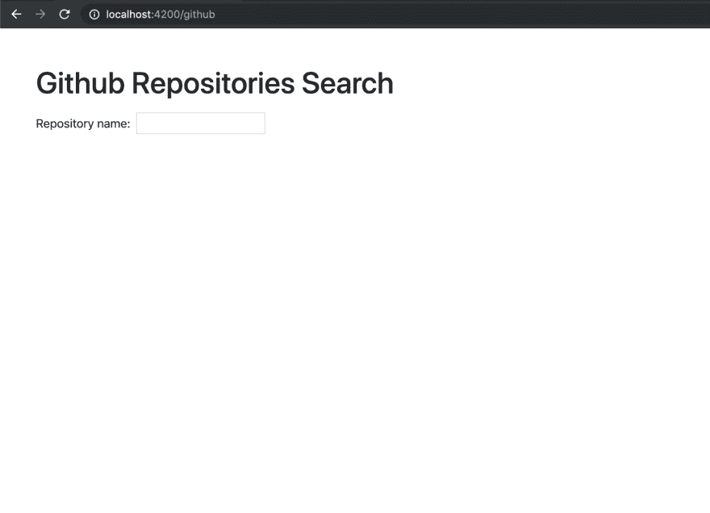
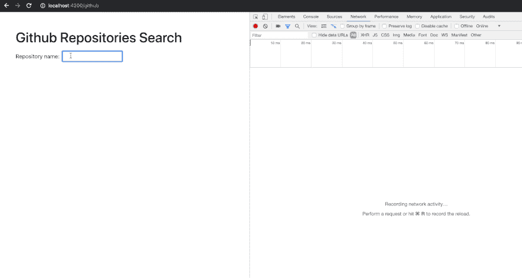
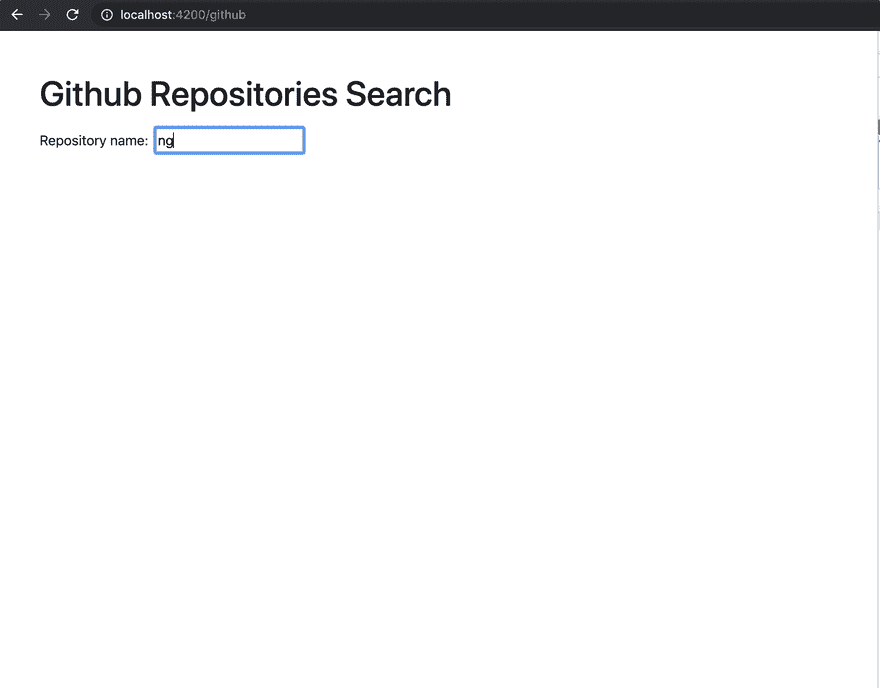
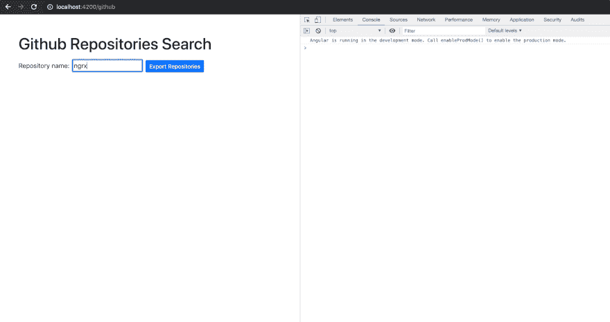
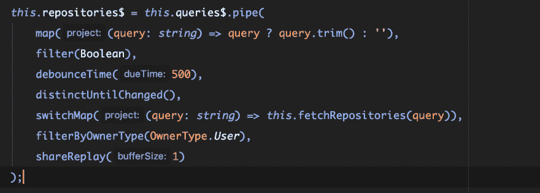
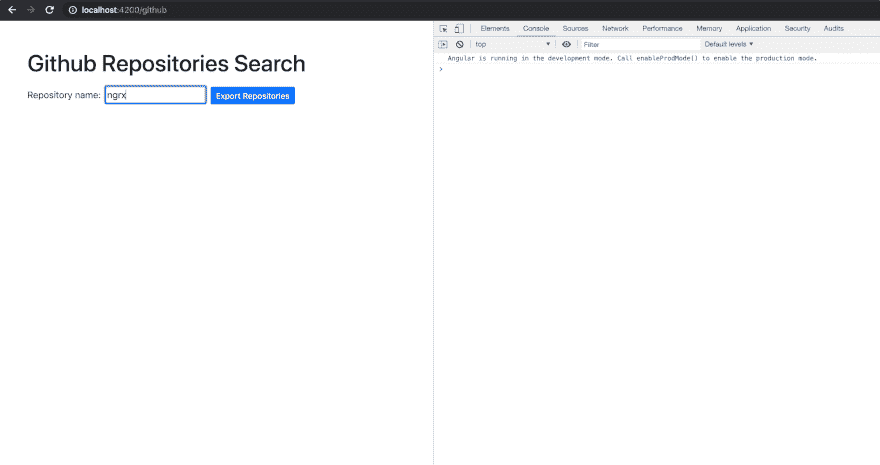
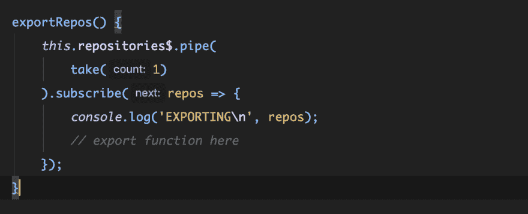

# 实用 RxJS 和角度

> 原文:[https://dev.to/gc_psk/practical-rxjs-and-angular-5heg](https://dev.to/gc_psk/practical-rxjs-and-angular-5heg)

与 RxJS **一起工作有点像拥有超能力**:你的能力允许你做非凡的事情，但它们很容易被滥用，当这种情况发生时——它会非常危险！

在这篇文章中，我想谈谈我在使用 Angular 和 RxJS 时发现有用的实际场景，浏览一下您可能使用的有用模式以及需要注意的事项。

从只涉及显示列表的基本情况开始，我们将进入更复杂的情况，例如停止正在进行的请求、延迟用户的输入以及用*主题*存储数据。

## RxJS 的基础知识

### [](#getting-and-displaying-data-with-http%C2%A0client)通过 HTTP 客户端获取并显示数据

在这个例子中，我们将使用 Angular 的 HTTP 客户端从 Github 的 API 获取存储库，并将其显示为一个列表。这是组件的外观:

[T2】](https://res.cloudinary.com/practicaldev/image/fetch/s--jByeX5vF--/c_limit%2Cf_auto%2Cfl_progressive%2Cq_auto%2Cw_880/https://cdn-images-1.medium.com/max/1600/1%2AV_yVBwZ0AluJFmDf2kxzxQ.png)

告诉过你这很简单！

让我们假设我们有一个使用 CLI 创建的功能性角度工作空间，并且我们创建了一个名为 *GithubRepositoriesComponent 的新路径。*这是它最初的样子:

```
@Component({
    selector: 'app-github-repositories',
    templateUrl: './github-repositories.component.html',
    styleUrls: ['./github-repositories.component.scss'],
    changeDetection: ChangeDetectionStrategy.OnPush
})
export class GithubRepositoriesComponent {} 
```

> 为了简单起见，我们将对组件中的所有逻辑进行编码。虽然我不建议这样做！

接下来，我们做以下事情:

*   我们通过依赖注入导入 *HttpClient*
*   我们声明了两个方法: *onTextChange，*它只是输入元素的处理程序，以及 *fetchRepositories，*它负责执行对 API 的请求
*   我们将 HTTP 客户端返回的可观察值分配给 *searchResult$*

```
import { ChangeDetectionStrategy, Component } from '@angular/core';
import { HttpClient } from '@angular/common/http';
import { Observable } from 'rxjs';
import { RepositorySearchResponse } from '../../shared/models/repository-search-response.interface';

const GITHUB_URL = 'https://api.github.com/search/repositories';

@Component({
    selector: 'app-github-repositories',
    templateUrl: './github-repositories.component.html',
    styleUrls: ['./github-repositories.component.scss'],
    changeDetection: ChangeDetectionStrategy.OnPush
})
export class GithubRepositoriesComponent {
    searchResult$: Observable<RepositorySearchResponse>;

    constructor(private http: HttpClient) {
    }

    onTextChange(query: string) {
        this.searchResult$ = this.fetchRepositories(query);
    }

    private fetchRepositories(query: string): Observable<RepositorySearchResponse> {
        const params = { q: query };
        return this.http.get<RepositorySearchResponse>(GITHUB_URL, { params });
    }
} 
```

然后，由于 _async 管道，我们在组件中而不是在模板中订阅了 *searchResult$ *。是—我们让异步管道订阅它，而不是在组件内订阅并将结果值赋给本地属性。** 

```
<h1>Github Repositories Search</h1>

<label class="mt-2">
    <span>Repository name:</span>

    <input type="text"
           class="ml-2"
           [ngModel]="''"
           (ngModelChange)="onTextChange($event)"
    />
</label>

<div *ngIf="(searchResult$ | async) as searchResult">
    <h2>Repositories</h2>

    <ng-container [ngSwitch]="searchResult.items.length">
        <ng-container *ngSwitchCase="0">
            No results found
        </ng-container>

        <ng-container *ngSwitchDefault>
            <div *ngFor="let result of searchResult.items">
                {{ result.name }}
            </div>
        </ng-container>
    </ng-container>
</div> 
```

但是你可能已经注意到了，这是一个非常基本而且相当生疏的搜索表单。让我们通过一些 RxJS 魔法来改进它。

> 模板使用了一些有用的引导类来设计样式

### [](#skipping-requests)跳过请求

我们想成为优秀的程序员，因此我们尽量不消耗我们服务中的宝贵资源。RxJS 通过其强大的操作器帮助了我们，但不幸的是，我们最初的解决方案存在一些问题:

*   如果我们输入一个空格，请求会被再次发出
*   一旦模型发生变化，请求就会运行
*   如果用户在请求完成前输入了某些内容，请求会继续运行

我们可以使用一些新的操作符来避免这些问题，但是我们也需要稍微重构一下我们的代码。

这是我们接下来要做的:

*   我们没有在每次模型改变时重新分配我们的可观察值，而是在组件启动时创建一个单独的流。为此，我们引入了一个*主题*，这是一个查询流
*   我们修剪并规范化我们的查询流，因此我们可以**过滤**空查询
*   我们添加操作符*去抖时间(500)* ，以便每 500 毫秒对查询进行**去抖**
*   我们添加了 *distinctUntilChanged，*，如果连续输入查询，**将跳过**个请求
*   我们用 *switchMap* 将查询流映射为一个请求流

考虑对我们的初始解决方案进行以下更改:

*为什么选择 switchMap？* switchMap 不仅将查询映射到 HTTP 请求，还会取消任何正在进行的请求。请参见以下内容:

[T2】](https://res.cloudinary.com/practicaldev/image/fetch/s--WDDu6UW1--/c_limit%2Cf_auto%2Cfl_progressive%2Cq_66%2Cw_880/https://cdn-images-1.medium.com/max/1600/1%2AQOncAKIrICia9bNZPCh10A.gif)

我输入了一个可能要花很多时间的搜索词，所以在搜索请求运行时，我有足够的时间重新输入一个词。

正如您在 network 选项卡中看到的，前三个请求被取消了！

耶！🎉

* * *

我们的应用程序可以做的下一件事是，当我们将鼠标悬停在存储库名称上时，显示所有者的信息。我们可以显示姓名、头像、简历和所有者所属的组织，为此我们需要提出一个额外的请求。

我们需要做什么？

*   当用户悬停并离开存储库项目时创建一个处理程序
*   当鼠标悬停在存储库上时获取组织，当鼠标离开时重置
*   因为在我们的列表中保留属于组织的存储库是没有意义的，我们将借助一个强大的自定义操作符来过滤它！
*   为了简化，稍微重构一下我们的初始代码

### [](#custom-operators)自定义运算符

创建自定义操作符是一项非常有用的技术，对于重用我们在类似情况下最终会用到的一些逻辑，或者通过将通用操作符与我们的领域业务逻辑混合在一起，使其更具声明性，从而提高可读性，这种技术非常有用。

例如，在我们的应用程序中，我们想要添加一个操作符来过滤一个可观察到的存储库，其中只有存储库属于一个用户，而不属于一个组织。

代码可能是这样的:

```
import { map } from 'rxjs/operators';

import { OwnerType } from '../enums/owner-type.enum';
import { Repository } from '../models/repository.interface';

export const filterByOwnerType = (type: OwnerType) => {
    const filterFn = (repository: Repository) => repository.owner.type === type;

    return map((repositories: Repository[]) => {
        return repositories.filter(filterFn);
    });
}; 
```

这段代码简单地对存储库数组应用了一个过滤函数，并将其映射为一个可观察对象。

### [](#complete-example)完整的例子

代码的其余部分应该相当简单:

*   我们用*存储库$* 替换了*搜索结果$*
*   我们添加了可观察的*组织$* 和*选择的存储$* 主题
*   处理程序 *onRepositoryMouseEvent* 负责更新*选择的存储库$*
*   自定义操作符 *filterByUOwnerType* 被添加到*存储库$* 流中
*   在模板中，我们添加了组织列表和所有者部分，当存储库被悬停时会出现

```
import { ChangeDetectionStrategy, Component, OnInit } from '@angular/core';
import { HttpClient } from '@angular/common/http';

// Rx
import { Observable, of, Subject } from 'rxjs';

import {
    debounceTime,
    distinctUntilChanged,
    filter,
    map,
    switchMap,
} from 'rxjs/operators';

import { filterByOwnerType } from '../../shared/operators/filter-by-owner-type';

// interfaces
import { RepositorySearchResponse } from '../../shared/models/repository-search-response.interface';
import { Organization } from '../../shared/models/organization.interface';
import { Repository } from '../../shared/models/repository.interface';
import { OwnerType } from '../../shared/enums/owner-type.enum';

const GITHUB_URL = 'https://api.github.com/search/repositories';

@Component({
    selector: 'app-github-repositories',
    templateUrl: './github-repositories.component.html',
    styleUrls: ['./github-repositories.component.scss'],
    changeDetection: ChangeDetectionStrategy.OnPush
})
export class GithubRepositoriesComponent implements OnInit {
    queries$ = new Subject<string>();
    selectedRepository$ = new Subject<Repository | undefined>();
    repositories$: Observable<Repository[]>;
    organizations$: Observable<Organization[]>;

    constructor(private http: HttpClient) {
    }

    ngOnInit() {
        this.repositories$ = this.queries$.pipe(
            map((query: string) => query ? query.trim() : ''),
            filter(Boolean),
            debounceTime(500),
            distinctUntilChanged(),
            switchMap((query: string) => this.fetchRepositories(query)),
            filterByOwnerType(OwnerType.User)
        );

        this.organizations$ = this.selectedRepository$.pipe(
            map((repository) => repository && repository.owner.organizations_url),
            switchMap((url: string | false) => {
                return url ? this.fetchUserOrganizations(url) : of(undefined);
            }),
        );
    }

    onTextChange(query: string) {
        this.queries$.next(query);
    }

    onRepositoryMouseEvent(repository: Repository | undefined) {
        this.selectedRepository$.next(repository);
    }

    private fetchRepositories(query: string): Observable<Repository[]> {
        const params = { q: query };

        return this.http
            .get<RepositorySearchResponse>(GITHUB_URL, { params })
            .pipe(
                map((response: RepositorySearchResponse) => response.items)
            );
    }

    private fetchUserOrganizations(url: string): Observable<Organization[]> {
        return this.http.get<Organization[]>(url);
    }
} 
```

```
<h1>Github Repositories Search</h1>

<label class="mt-2">
    <span>Repository name:</span>

    <input type="text"
           class="ml-2"
           [ngModel]="''"
           (ngModelChange)="onTextChange($event)"
    />
</label>

<div class="row">
    <div class="col-md-6" *ngIf="(repositories$ | async) as repositories">
        <h2>Repositories</h2>

        <ng-container [ngSwitch]="repositories.length">
            <ng-container *ngSwitchCase="0">
                No results found
            </ng-container>

            <div class="d-flex justify-content-between row" *ngSwitchDefault>
                <div class="col-md-6">
                    <!-- REPOS LIST -->
                    <div
                        *ngFor="let repository of repositories"
                        (mouseover)="onRepositoryMouseEvent(repository)"
                        (mouseleave)="onRepositoryMouseEvent(undefined)"
                    >
                        {{ repository.name }}
                    </div>
                </div>

                <div>
                    <!-- OWNER -->
                    <div *ngIf="(selectedRepository$ | async) as selectedRepository">
                        <h4>{{ selectedRepository.owner.login }}</h4>

                        
                    </div>

                    <!-- ORGANIZATIONS -->
                    <div *ngIf="(organizations$ | async) as organizations" class="mt-2">
                        <h6>Organizations</h6>

                        <div *ngFor="let org of organizations" class="d-inline-flex mr-2">
                            
                        </div>
                    </div>
                </div>
            </div>
        </ng-container>
    </div>
</div> 
```

这是它看起来的样子:

[T2】](https://res.cloudinary.com/practicaldev/image/fetch/s--u-lFK0ns--/c_limit%2Cf_auto%2Cfl_progressive%2Cq_66%2Cw_880/https://cdn-images-1.medium.com/max/1600/1%2AukvZnxzqT3yTKitCVjvVJQ.gif)

哦，对了，那是我！🙄

## [](#state-management)状态管理

不，这不是关于 *NGRX* ，或者 *Redux* 的另一种解释。

我想向你们展示一些问题，当我们从我们的观察对象和主题中获取当前状态时。

比方说，我们想要检索最新收到的信息，而不需要通过模板，正如我们所看到的，这是相当容易的。

让我们添加一个按钮，允许用户导出当前的存储库列表(当然，我们不会实现该功能，但我们将只记录列表)。

很简单，对吧？

让我们创建导出函数:

```
exportRepos() {  
    this.repositories$.subscribe(repos => {  
        console.log(repos);  
        // export function here }); 
    });
} 
```

看看它的表现如何:

[T2】](https://res.cloudinary.com/practicaldev/image/fetch/s--iVBKO_V7--/c_limit%2Cf_auto%2Cfl_progressive%2Cq_66%2Cw_880/https://cdn-images-1.medium.com/max/2400/1%2A0QLd2zSp8Dg6iXRUhYEtQw.gif)

正如您可能已经看到的，日志直到可观察对象发出一个新值才出现！原因是可观察对象在发出值后被订阅**。**

为了解决这个问题，我们引入了另一个叫做 *shareReplay 的操作符。*

这个操作员将保存一个我们以后可以订阅的排放记忆。在底层，它使用一个 *ReplaySubject* 来保持状态。因为我们只希望它保存最新的发射，这是我们当前的状态，所以我们需要传递一个名为 *bufferSize* 的参数，我们将它设置为 *1，*，用简单的英语来说就是“请在你的内存中保存最新的 1 次发射”。

这是我们最终的结果:

[T2】](https://res.cloudinary.com/practicaldev/image/fetch/s--MiOkHMgL--/c_limit%2Cf_auto%2Cfl_progressive%2Cq_auto%2Cw_880/https://cdn-images-1.medium.com/max/1600/1%2AEkvWjPMk8eNWXJPbTXrFWw.png)

让我们看看我们的应用程序将如何工作！

[T2】](https://res.cloudinary.com/practicaldev/image/fetch/s--RbqZ_kqG--/c_limit%2Cf_auto%2Cfl_progressive%2Cq_66%2Cw_880/https://cdn-images-1.medium.com/max/2400/1%2A-otqLWTJJ5g1L3iipnE03Q.gif)

等等，什么？你注意到了吗，当我输入“react”作为搜索词时，不用我们点击按钮，存储库又被记录了。这听起来确实像是一个错误，如果我可以补充的话，是一个非常常见的错误。

很简单——我们忘了更改导出函数，该函数应该订阅可观察对象，但是马上关闭订阅！我们手动退订吗？也许不需要。让我们使用操作符 *take，*，一旦它发出的次数等于我们作为参数给它的次数，它就会取消订阅。

让我们解决这个问题！我们用运算符 *take(1):* 来表示我们的可观测值

[T2】](https://res.cloudinary.com/practicaldev/image/fetch/s--CujsT0qR--/c_limit%2Cf_auto%2Cfl_progressive%2Cq_auto%2Cw_880/https://cdn-images-1.medium.com/max/1600/1%2AeSCkhW5u6RH0vjhh1OKNxw.png)

#### [](#why-is-this-important)这个为什么重要？

*   这是逻辑错误的常见原因。方法在不应该被调用的时候被调用
*   这是内存泄漏的一个常见原因，因为订阅没有被清理！
*   可观测辐射越频繁，问题就越大。尝试绝对热衷于此与可观的实时来源发射！
*   在 NGRX 中使用 *store.select()* 很常见，所以在使用时要小心

## [](#final-words)最后的话

正如您可能已经看到的——我们用几行 RxJS 代码就完成了原本需要数百行代码才能完成的任务。这是一个强大的工具，如果理解得好，使用得正确，它真的可以让你的代码变得美观易读。

正如您可能已经看到的，使用它也不需要太多的时间就可以犯错误。对某种行为的小小误解可能会导致程序错误和内存泄漏。如果你的团队开始使用它，这是需要考虑的事情——但是请放心——这是值得的。

* * *

如果您需要任何澄清，或者如果您认为有些事情不清楚或错误，请留下评论！

我希望你喜欢这篇文章！如果你有，请在 [Medium](https://medium.com/@.gc) 、 [Twitter](https://twitter.com/gc_psk) 或 [my website](https://frontend.consulting/articles) 上关注我，获取更多关于软件开发、前端、RxJS、Typescript 等方面的文章！