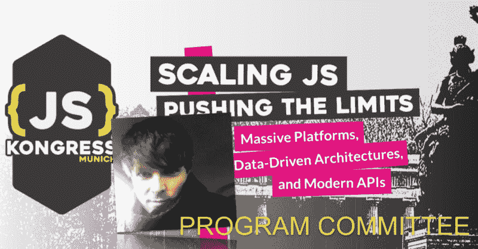

# 有请筹委会成员米洛什·苏塔诺瓦茨

> 原文:[https://dev . to/jskongress/please-welcome-PC-member-Milos-sutanovac-108 o](https://dev.to/jskongress/please-welcome-pc-member-milos-sutanovac-108o)

<figure>

<figcaption>[Milo Sutanovac](https://medium.com/u/d3d973645fb):软件开发人员，顾问&主讲人，多年从事 JavaScript 及前端技术教学。Vue.js Munich 主办方，MunichJS 协办方。心态:进化或死亡。</figcaption>

</figure>

请欢迎 Milo 成为 JS Kongress 2020 计划委员会(PC)的成员。他在慕尼黑组织社区聚会多年，从这次经历中他可以说:“提交你的演讲，你要说的话总是有价值的！”

首先，我们问了他几个问题:

**你为什么期待#jskongress？**

作为一个迄今为止参加过#jskongress 所有版本的人，我希望在我的生产力应用程序中保持我的连胜纪录。

当然，只是开个玩笑——# jskongress 对我来说是一个很好的机会，让我可以结识其他工程师并见到一些老朋友，同时也开阔了我的视野。

你如何看待或联想到 2020 年的格言“扩展 JS——挑战极限:大规模平台、数据驱动架构和现代 API”？

我一直喜欢以主题为中心的会议方式，这也是#jskongress 如此独特的原因之一。

看到人们如何推广我们最喜爱的语言，特别是在 PWA 领域，我真的很兴奋。

你对这个项目的愿景是什么？

就我个人而言，我总是对#DeepTrack 感到非常兴奋，并希望它能卷土重来。  【编辑注:是的，#DeepTrack 也将在 2020 年回归。 [Github 回购开放](https://github.com/JSKongress/JS-Kongress-Munich-Deep-Track) — [更多详情请见](https://js-kongress.com/deep-track/)

与我们行业的领导者分享他们所关心的一切的详细见解？是的，请吧。

你还记得你第一次接触 JS 的时候吗？原因是什么，或者是谁？

不幸的是，我没有一个可爱的，情绪化的开发者的故事可以讲。[T2】](https://res.cloudinary.com/practicaldev/image/fetch/s--0FvlDT7J--/c_limit%2Cf_auto%2Cfl_progressive%2Cq_auto%2Cw_880/https://s.w.oimg/core/emoji/12.0.0-1/72x72/1f60a.png)

我学的是设计，JS 是课程的一部分。我当时就被吸引住了。

你对所有演讲者和所有想提交演讲想法的人有什么激励吗？

作为 meetups 的热心组织者，我不能说也不能强调这一点:

不管你有多认为做一次演讲可能是一个愚蠢的想法，相信我，它不是。

没有一个人知道你要说的每一件事，是的，你的大脑会试着骗你说事实就是这样。你谈论这个话题没有任何好处。你不应该这么做。

我自己去过那里很多次。

但是相信我。

研究并准备演讲。提交吧。做这个小演示来想象它。你要说的话里总有**的**值。

你在慕尼黑生活和工作。你有秘密的慕尼黑秘诀吗？

在我看来，Isar 的一次长时间漫步的确创造了奇迹——这是一个强烈推荐但并不秘密的建议。[T2】](https://res.cloudinary.com/practicaldev/image/fetch/s--QSre4hF9--/c_limit%2Cf_auto%2Cfl_progressive%2Cq_auto%2Cw_880/https://s.w.oimg/core/emoji/12.0.0-1/72x72/1f913.png)

* * *

2020 # jskongress 的**论文征集**截止到 10 月 15 日——我们期待在 https://sessionize.com/js-kongress-2020[上读到你的想法](https://sessionize.com/js-kongress-2020)

在[https://medium . com/@ jskongress/CFP-FAQ-first-members-join-program-Committee-8 FEC 626 a1 ce 0](https://medium.com/@jskongress/cfp-faq-first-members-join-program-committee-8fec626a1ce0)上找到我们征文的 **FAQ**

此外，我们也在寻找您对#DeepTrack 的想法。每一个有票的人都可以参与，所有与会者一起创造节目:【https://github.com/JSKongress/JS-Kongress-Munich-Deep-Track

帖子[有请 PC 成员 Milo Sutanovac](https://js-kongress.com/2019/09/20/please-welcome-pc-member-milos-sutanovac/)最早出现在 [JS KONGRESS 2020:扩展 JS——挑战极限:大规模平台、数据驱动架构和现代 API。](https://js-kongress.com)。