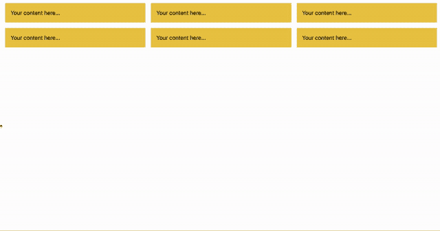
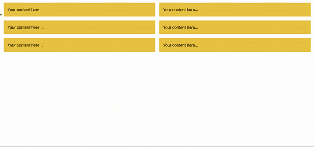
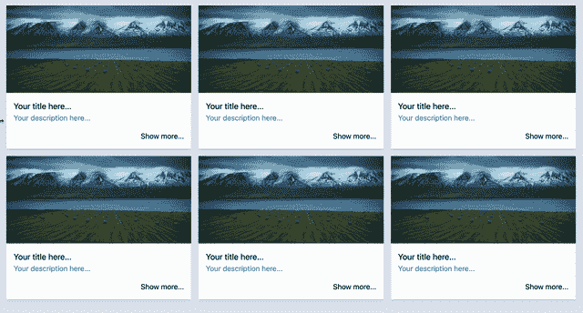

# tailwindcss 的 4 个有用片段

> 原文:[https://dev . to/mauro _ codes/4-useful-snippets-for-tailwindcss-2115](https://dev.to/mauro_codes/4-useful-snippets-for-tailwindcss-2115)

我决定写这篇文章，向您展示用 tailwindcss 构建令人惊叹的 UI 组件是多么简单。不需要自定义 CSS。

"但是，让我的组件响应所需的媒体查询呢？"。忘记媒体的询问。tailwindcss 拥有一组令人惊叹的[响应实用程序变体](https://tailwindcss.com/docs/responsive-design/)。

我将向您展示 4 个有用的片段，它们将帮助您在使用 tailwind 构建界面时加快开发过程。

# [](#avoid-code-duplication-with-reusable-components)使用可重用组件避免代码重复

有些情况下，您可能会想:“重复代码太多了”。但是如果你正在使用任何现代的 JS 框架，比如 Angular、React 或 Vue，你将很容易通过提取可重用组件来减少重复代码。关于这个话题的更多信息将在下一篇文章中发布。

# [](#responsive-grids)响应式电网

## [](#1-three-column-grid)1-三列网格

[](https://res.cloudinary.com/practicaldev/image/fetch/s--vjHTCDEL--/c_limit%2Cf_auto%2Cfl_progressive%2Cq_66%2Cw_880/https://i.imgur.com/6G99al3.gif)T3】

```
<!-- Container -->
<div class="flex flex-wrap mt-2 mx-2">
    <!-- Item -->
    <div class="w-full md:w-1/2 lg:w-1/3 px-2 my-2">
        <div class="bg-yellow-500 p-4">
            Your content here...
        </div>
    </div>
    <!-- Item -->
    <div class="w-full md:w-1/2 lg:w-1/3 px-2 my-2">
        <div class="bg-yellow-500 p-4">
            Your content here...
        </div>
    </div>
    ...
</div> 
```

<svg width="20px" height="20px" viewBox="0 0 24 24" class="highlight-action crayons-icon highlight-action--fullscreen-on"><title>Enter fullscreen mode</title></svg> <svg width="20px" height="20px" viewBox="0 0 24 24" class="highlight-action crayons-icon highlight-action--fullscreen-off"><title>Exit fullscreen mode</title></svg>

我对每个网格元素使用以下实用程序:

*   `w-full`将应用宽度:100%
*   `md:w-1/2`将应用宽度:中等及以上屏幕尺寸的 50%
*   `lg:w-1/3`将在大屏幕尺寸及以上应用宽度:33.33%

### [](#two-column-grid)两列网格

假设我们只想每行显示 2 列。在这种情况下，我们需要对代码做一点小小的修改。本质上，我们需要删除`lg:w-1/3`实用程序。这样，每个项目都将应用宽度:中等及以上屏幕尺寸为 50%。

[T2】](https://res.cloudinary.com/practicaldev/image/fetch/s--YgcmZEbk--/c_limit%2Cf_auto%2Cfl_progressive%2Cq_66%2Cw_880/https://i.imgur.com/UTd9nQ2.gif)

## [](#2-three-column-cards-grid)2-三列卡片网格

[](https://res.cloudinary.com/practicaldev/image/fetch/s--lwmkEjkW--/c_limit%2Cf_auto%2Cfl_progressive%2Cq_66%2Cw_880/https://i.imgur.com/Ux9Quer.gif)T3】

```
<!-- Container -->
<div class="flex flex-wrap mt-2 mx-2">
    <!-- Item -->
    <div class="w-full md:w-1/2 lg:w-1/3 px-2 my-2">
        <div class="shadow-md bg-white">
            
            <div class="flex flex-col p-4">
                <p class="text-lg">Your title here...</p>
                <p class="text-gray-600">Your description here...</p>
                <button class="self-end mt-4">Show more...</button>
            </div>
        </div>
    </div>
    ...
</div> 
```

<svg width="20px" height="20px" viewBox="0 0 24 24" class="highlight-action crayons-icon highlight-action--fullscreen-on"><title>Enter fullscreen mode</title></svg> <svg width="20px" height="20px" viewBox="0 0 24 24" class="highlight-action crayons-icon highlight-action--fullscreen-off"><title>Exit fullscreen mode</title></svg>

*   我在图像上使用`object-cover`工具来调整元素内容的大小以覆盖其容器。
*   如果你需要改变你的图像在其容器中的位置，检查[对象位置](https://tailwindcss.com/docs/object-position/#app)工具

# [](#3-colorful-notes)3-彩色音符

[https://codepen.io/maurogarcia0209/embed/VwZGKZE?height=600&default-tab=result&embed-version=2](https://codepen.io/maurogarcia0209/embed/VwZGKZE?height=600&default-tab=result&embed-version=2)T2】

```
<!-- Orange note -->
<div class="bg-orange-100 text-orange-500 border-l-8 border-orange-500 p-4 mb-2">
    <p class="font-bold">Note</p>
    <p>Lorem ipsum dolor sit amet, consectetur adipiscing elit, sed do eiusmod tempor incididunt...</p>
</div> 
```

<svg width="20px" height="20px" viewBox="0 0 24 24" class="highlight-action crayons-icon highlight-action--fullscreen-on"><title>Enter fullscreen mode</title></svg> <svg width="20px" height="20px" viewBox="0 0 24 24" class="highlight-action crayons-icon highlight-action--fullscreen-off"><title>Exit fullscreen mode</title></svg>

# [](#4-buttons)4 个按钮

[https://codepen.io/maurogarcia0209/embed/XWrPjgE?height=600&default-tab=result&embed-version=2](https://codepen.io/maurogarcia0209/embed/XWrPjgE?height=600&default-tab=result&embed-version=2)T2】

```
<!-- Simple button -->
<button class="bg-blue-500 hover:bg-blue-700 text-white font-bold py-2 px-4 rounded mb-2">Button</button>
<!-- Outline button -->
<button class="hover:bg-blue-500 text-blue-700 font-semibold hover:text-white py-2 px-4 border border-blue-500 hover:border-transparent rounded mb-2">Button</button>
<!-- Simple button with icon -->
<button class="bg-blue-500 hover:bg-blue-700 text-white font-bold py-2 px-4 rounded flex mr-2 mb-2">
    <svg xmlns="http://www.w3.org/2000/svg" viewBox="0 0 24 24" width="24" height="24"><path class="heroicon-ui" fill="white" d="M9.3 8.7a1 1 0 0 1 1.4-1.4l4 4a1 1 0 0 1 0 1.4l-4 4a1 1 0 0 1-1.4-1.4l3.29-3.3-3.3-3.3z"/></svg>
    <span>Button</span>
</button> 
```

<svg width="20px" height="20px" viewBox="0 0 24 24" class="highlight-action crayons-icon highlight-action--fullscreen-on"><title>Enter fullscreen mode</title></svg> <svg width="20px" height="20px" viewBox="0 0 24 24" class="highlight-action crayons-icon highlight-action--fullscreen-off"><title>Exit fullscreen mode</title></svg>

*   我正在使用`hover:bg-blue-700`为悬停状态应用不同的背景颜色

* * *

你试过 tailwindcss 吗？你的体验如何？