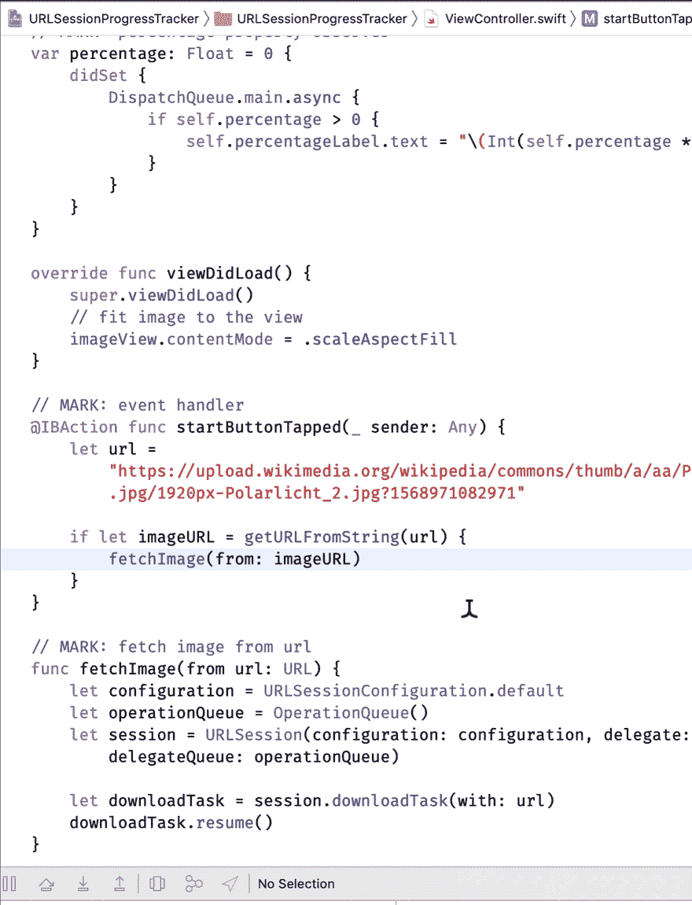
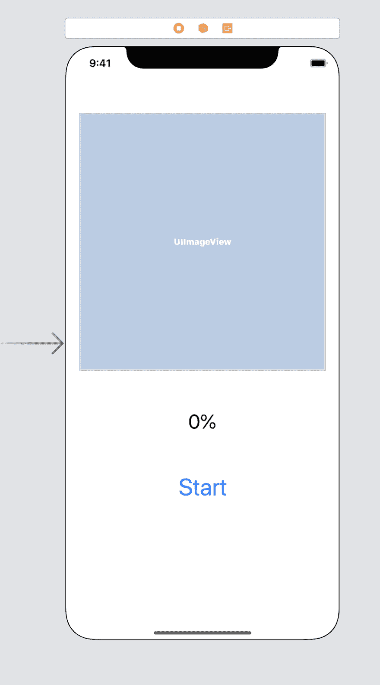

# 使用 URLSessionDownloadDelegate 跟踪下载进度

> 原文：<https://dev.to/shawonashraf/tracking-download-progress-with-urlsessiondownloaddelegate-9io>

## 下载中....

你有一个很酷的应用程序，它必须从互联网上下载一些东西，无论是图像、数据还是 pdf 文件等等。当你的应用程序下载所需的资源时，你的用户必须等待。如果资源很小或者可以很快获取，这就不是问题了。如果进程不够快或者资源非常大(比如以两位数甚至三位数的 MB 为单位的大小！)?你的用户将不得不盯着一个可能没有响应的应用程序的空白屏幕(取决于你如何处理资源加载),这是一个交易破坏者，可能会导致用户远离你的应用程序。你必须做一些事情来让用户确信所需的资源确实在加载，并且应用程序没有陷入死锁。向他们展示一些进步。动画、文本、百分比标签——你的应用程序应有尽有。问题是，你如何跟踪下载进度以显示给你的用户？

## URLSessionDownloadDelegate

您可以使用`URLSessionDownloadDelegate`功能在 Swift 应用程序中跟踪下载进度。你要做的是-

*   使用`.default`配置创建一个`URLSession`
*   使用创建的会话，初始化一个`downloadTask`
*   用`URLSessionDownloadDelegate`功能跟踪那个`downloadTask`的进度-

```
func urlSession(_ session: URLSession, downloadTask: URLSessionDownloadTask, didWriteData bytesWritten: Int64, totalBytesWritten: Int64, totalBytesExpectedToWrite: Int64) 
```

<svg width="20px" height="20px" viewBox="0 0 24 24" class="highlight-action crayons-icon highlight-action--fullscreen-on"><title>Enter fullscreen mode</title></svg> <svg width="20px" height="20px" viewBox="0 0 24 24" class="highlight-action crayons-icon highlight-action--fullscreen-off"><title>Exit fullscreen mode</title></svg>

*   是的，你必须实现这个功能
*   还有另一个你必须实现的功能，当你的下载任务完成时它就会启动

```
func urlSession(_ session: URLSession, downloadTask: URLSessionDownloadTask, didFinishDownloadingTo location: URL) 
```

<svg width="20px" height="20px" viewBox="0 0 24 24" class="highlight-action crayons-icon highlight-action--fullscreen-on"><title>Enter fullscreen mode</title></svg> <svg width="20px" height="20px" viewBox="0 0 24 24" class="highlight-action crayons-icon highlight-action--fullscreen-off"><title>Exit fullscreen mode</title></svg>

## 开始吧！

我们首先在 Xcode 中创建一个单视图 iOS 应用程序。这个应用程序要做的是:从一个网址下载一个图像，在一个带有百分比的标签中显示进度，最后将下载的图像设置为图像视图(这样我们就可以确定图像确实下载了！).最后应该是这样的-

[](https://res.cloudinary.com/practicaldev/image/fetch/s--lmdD42Qf--/c_limit%2Cf_auto%2Cfl_progressive%2Cq_66%2Cw_880/https://i.imgur.com/FfiyPbQ.gif)

## 界面

打开故事板，添加 3 个控件——一个 imageview，一个 label 和一个 button，使用你喜欢的任何约束。(约束对于我们目前的讨论来说是不必要的)以下面的图片作为参考。

[](https://res.cloudinary.com/practicaldev/image/fetch/s--GxS_Z2PK--/c_limit%2Cf_auto%2Cfl_progressive%2Cq_auto%2Cw_880/https://thepracticaldev.s3.amazonaws.com/i/fsmnlz0jn13rp8qqifyw.png)

创建必要的出口，并为按钮添加一个动作(ctrl +拖动)。

```
class ViewController: UIViewController, URLSessionDownloadDelegate {
    @IBOutlet weak var imageView: UIImageView!
    @IBOutlet weak var percentageLabel: UILabel!
    @IBOutlet weak var startButton: UIButton!

    override func viewDidLoad() {
        super.viewDidLoad()
    }

    // MARK: event handler
    @IBAction func startButtonTapped(_ sender: Any) {
       // code goes here
    }
} 
```

<svg width="20px" height="20px" viewBox="0 0 24 24" class="highlight-action crayons-icon highlight-action--fullscreen-on"><title>Enter fullscreen mode</title></svg> <svg width="20px" height="20px" viewBox="0 0 24 24" class="highlight-action crayons-icon highlight-action--fullscreen-off"><title>Exit fullscreen mode</title></svg>

我们还必须为 imageview 设置内容模式，以便下载的图像能够正确地适应。你可以从故事板中完成，或者像我一样只使用`viewDidLoad`中的代码。

```
override func viewDidLoad() {
    super.viewDidLoad()
    // fit image to the view
    imageView.contentMode = .scaleAspectFill
} 
```

<svg width="20px" height="20px" viewBox="0 0 24 24" class="highlight-action crayons-icon highlight-action--fullscreen-on"><title>Enter fullscreen mode</title></svg> <svg width="20px" height="20px" viewBox="0 0 24 24" class="highlight-action crayons-icon highlight-action--fullscreen-off"><title>Exit fullscreen mode</title></svg>

## 现在为主菜

### 创建下载任务

让我们给我们的`ViewController`类添加一个名为`download`的函数。它将把图像的`url`作为唯一的参数。

```
// MARK: fetch image from url
func download(from url: URL) {
    let configuration = URLSessionConfiguration.default
    let operationQueue = OperationQueue()
    let session = URLSession(configuration: configuration, delegate: self, delegateQueue: operationQueue)

    let downloadTask = session.downloadTask(with: url)
    downloadTask.resume()
} 
```

<svg width="20px" height="20px" viewBox="0 0 24 24" class="highlight-action crayons-icon highlight-action--fullscreen-on"><title>Enter fullscreen mode</title></svg> <svg width="20px" height="20px" viewBox="0 0 24 24" class="highlight-action crayons-icon highlight-action--fullscreen-off"><title>Exit fullscreen mode</title></svg>

让我们检查一下我们在这里做了什么。我们已经为 URLSession 创建了一个默认配置。接下来，我们创建了一个 OperationQueue，以便我们的 downloadTask 可以异步运行，而不会锁定应用程序(即导致死锁)。(要了解更多信息，请阅读文档中的 GCD)。这将确保应用程序下载图像时，用户可以访问我们应用程序的其他部分。最后，我们使用会话创建下载任务，并要求它恢复/开始操作。对于图片 url，我们将使用这个- `https://upload.wikimedia.org/wikipedia/commons/thumb/a/aa/Polarlicht_2.jpg/1920px-Polarlicht_2.jpg?1568971082971`。

现在我们有一个小问题。我们的函数需要一个 URL，但是我们有一个字符串。因此，我们需要将字符串转换成 URL。

```
// MARK: prepare url from string
func getURLFromString(_ str: String) -> URL? {
    return URL(string: str)
} 
```

<svg width="20px" height="20px" viewBox="0 0 24 24" class="highlight-action crayons-icon highlight-action--fullscreen-on"><title>Enter fullscreen mode</title></svg> <svg width="20px" height="20px" viewBox="0 0 24 24" class="highlight-action crayons-icon highlight-action--fullscreen-off"><title>Exit fullscreen mode</title></svg>

### 开始下载

当用户点击按钮时，我们将调用下载功能。

```
// MARK: event handler
@IBAction func startButtonTapped(_ sender: Any) {
    let url = "https://upload.wikimedia.org/wikipedia/commons/thumb/a/aa/Polarlicht_2.jpg/1920px-Polarlicht_2.jpg?1568971082971"

    if let imageURL = getURLFromString(url) {
        download(from: imageURL)
    }
} 
```

<svg width="20px" height="20px" viewBox="0 0 24 24" class="highlight-action crayons-icon highlight-action--fullscreen-on"><title>Enter fullscreen mode</title></svg> <svg width="20px" height="20px" viewBox="0 0 24 24" class="highlight-action crayons-icon highlight-action--fullscreen-off"><title>Exit fullscreen mode</title></svg>

### 进展在哪里？

我们确实有一个 progressLabel，我们可以在每次`downloadTask`取得进展时更新它的 text 属性。但问题是我们在哪里更新它？我们有两个委托函数要实现，对吗？让我们实现第一个，并将标签更新代码放入其中。

对于下载任务，URLSessionDownloadDelegate 允许您跟踪要接收的字节数和当前正在接收的字节数。使用这两个指标，我们可以计算百分比。

```
// MARK: protocol stub for tracking download progress
func urlSession(_ session: URLSession, downloadTask: URLSessionDownloadTask, didWriteData bytesWritten: Int64, totalBytesWritten: Int64, totalBytesExpectedToWrite: Int64) {

    let percentDownloaded = totalBytesWritten / totalBytesExpectedToWrite

    // update the percentage label
    DispatchQueue.main.async {
        self.percentageLabel.text = "\(percentDownloaded * 100)%"
    }
} 
```

<svg width="20px" height="20px" viewBox="0 0 24 24" class="highlight-action crayons-icon highlight-action--fullscreen-on"><title>Enter fullscreen mode</title></svg> <svg width="20px" height="20px" viewBox="0 0 24 24" class="highlight-action crayons-icon highlight-action--fullscreen-off"><title>Exit fullscreen mode</title></svg>

这将负责跟踪下载进度，也就是我们目前所追求的。但是等等，我们还没完呢。

## 侧面关注——下载完成，如何设置镜像呢？

默认情况下，使用 downloadTask 下载的资源最终会保存在应用程序的 documents 包中，可以使用`FileHandle`来访问。为此，我们需要文件的`URL`,我们从哪里得到它呢？还记得第二协议功能吗？这将为我们提供文件的`URL`。

```
// MARK: protocol stub for download completion tracking
func urlSession(_ session: URLSession, downloadTask: URLSessionDownloadTask, didFinishDownloadingTo location: URL) {

    // get downloaded data from location

    // set image to imageview
} 
```

<svg width="20px" height="20px" viewBox="0 0 24 24" class="highlight-action crayons-icon highlight-action--fullscreen-on"><title>Enter fullscreen mode</title></svg> <svg width="20px" height="20px" viewBox="0 0 24 24" class="highlight-action crayons-icon highlight-action--fullscreen-off"><title>Exit fullscreen mode</title></svg>

### 访问下载的数据

我们将添加一个函数`readDownloadedData`，它将下载的资源作为原始数据读取并返回。为了安全起见，该函数返回一个可选的。

```
// MARK: read downloaded data
func readDownloadedData(of url: URL) -> Data? {
    do {
        let reader = try FileHandle(forReadingFrom: url)
        let data = reader.readDataToEndOfFile()

        return data
    } catch {
        print(error)
        return nil
    }
} 
```

<svg width="20px" height="20px" viewBox="0 0 24 24" class="highlight-action crayons-icon highlight-action--fullscreen-on"><title>Enter fullscreen mode</title></svg> <svg width="20px" height="20px" viewBox="0 0 24 24" class="highlight-action crayons-icon highlight-action--fullscreen-off"><title>Exit fullscreen mode</title></svg>

现在我们有了原始数据，我们可以用它来创建一个`UIImage`来设置我们的 imageview。

### UIImage 来自数据？

```
func getUIImageFromData(_ data: Data) -> UIImage? {
    return UIImage(data: data)
} 
```

<svg width="20px" height="20px" viewBox="0 0 24 24" class="highlight-action crayons-icon highlight-action--fullscreen-on"><title>Enter fullscreen mode</title></svg> <svg width="20px" height="20px" viewBox="0 0 24 24" class="highlight-action crayons-icon highlight-action--fullscreen-off"><title>Exit fullscreen mode</title></svg>

### 设置图像

```
// MARK: set image to image view
func setImageToImageView(from data: Data?) {
    guard let imageData = data else { return }
    guard let image = getUIImageFromData(imageData) else { return }

    DispatchQueue.main.async {
        self.imageView.image = image
    }
} 
```

<svg width="20px" height="20px" viewBox="0 0 24 24" class="highlight-action crayons-icon highlight-action--fullscreen-on"><title>Enter fullscreen mode</title></svg> <svg width="20px" height="20px" viewBox="0 0 24 24" class="highlight-action crayons-icon highlight-action--fullscreen-off"><title>Exit fullscreen mode</title></svg>

### 完成协议功能

```
// MARK: protocol stub for download completion tracking
func urlSession(_ session: URLSession, downloadTask: URLSessionDownloadTask, didFinishDownloadingTo location: URL) {

    // get downloaded data from location
    let data = readDownloadedData(of: location)

    // set image to imageview
    setImageToImageView(from: data)
} 
```

<svg width="20px" height="20px" viewBox="0 0 24 24" class="highlight-action crayons-icon highlight-action--fullscreen-on"><title>Enter fullscreen mode</title></svg> <svg width="20px" height="20px" viewBox="0 0 24 24" class="highlight-action crayons-icon highlight-action--fullscreen-off"><title>Exit fullscreen mode</title></svg>

我们完事了。当你在 Simulator 或你的设备上运行这个应用时，你会看到类似的结果，比如我之前展示的 gif。

## AAAA 和......

这就是您如何使用`URLSessionDownloadDelegate`在 Swift 应用程序中跟踪下载进度，而无需向您的应用程序添加任何额外的依赖项。你也可以用像 Alamofire 这样的库做同样的事情，代码更少，麻烦更少，但这会增加额外的依赖性，这可能是你想要的，也可能是你不想要的！

## 代码——在哪里？

你可以找到这篇文章的所有代码@[URLSessionProgressTrackerExample](https://github.com/ShawonAshraf/URLSessionProgressTrackerExample)