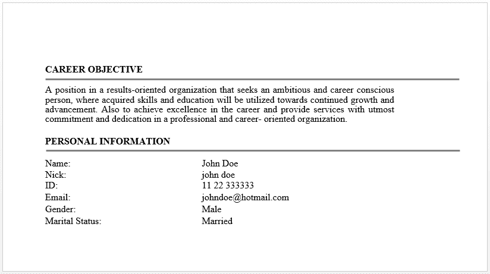
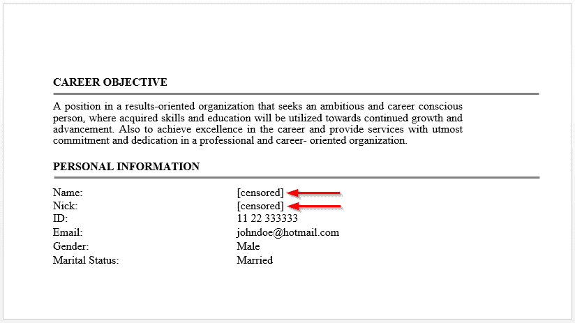
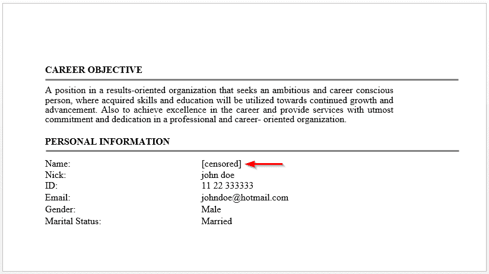
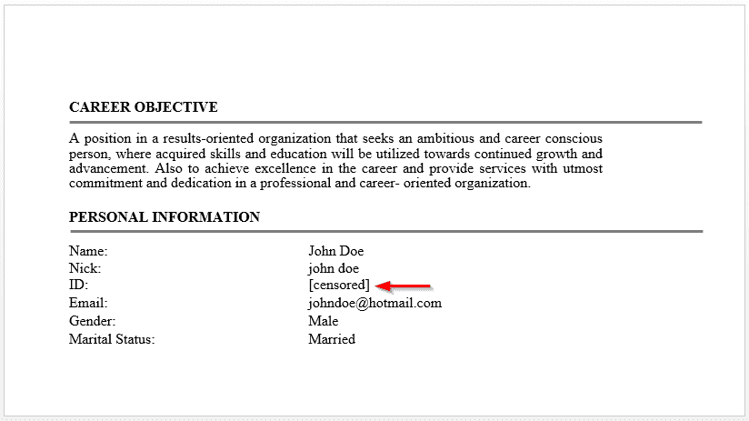
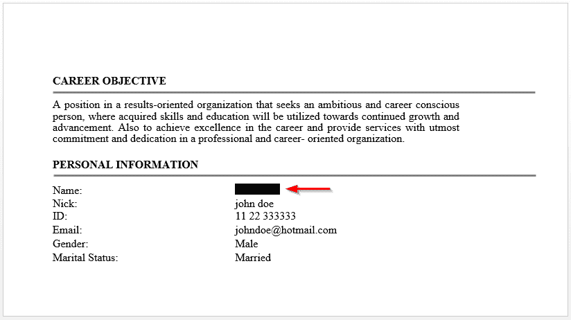

# 使用查找和替换文档中的文本。NET API

> 原文:[https://dev . to/usmanaziz/find-and-replace-text-in-word-documents-using-net-API-54an](https://dev.to/usmanaziz/find-and-replace-text-in-word-documents-using-net-api-54an)

与文档相关的一个流行用例是以编程方式查找和替换文本。当您需要替换文档中的单词或短语时，可能会有多种情况。例如，您希望在公开共享文档之前审查内容，或者您希望在将文档放到网上之前隐藏/删除文档中提供的所有电子邮件 id 或社会保险号。

因此，在本文中，我将针对这个用例，向您展示如何使用 **C#** 以编程方式**在**文档**中找到并替换**您想要的文本。为此，我将使用 [**GroupDocs。的修订。NET**](https://products.groupdocs.com/redaction/net) **API** ，它提供了多种方法来隐藏或替换 **MS Word** 、 **Excel** 、 **PowerPoint** 和 **PDF** 文档中的流行格式的文本。

所以这种场景下不需要 MS Office、PDF 编辑器或者其他任何第三方软件。现在，让我们开始看看在文档中查找和替换文本的不同方法。下面是我在示例中使用的一个 Word 文档的屏幕截图。同样的方法也适用于我上面提到的其他文档格式，不需要对代码做任何修改。

[T2】](https://res.cloudinary.com/practicaldev/image/fetch/s--nr-LNIaR--/c_limit%2Cf_auto%2Cfl_progressive%2Cq_auto%2Cw_880/https://thepracticaldev.s3.amazonaws.com/i/j40ljze1qhb00q41c1fk.png)

#### [](#find-and-replace-a-word-or-phrase)**查找并替换单词或短语**

这是您如何替换文档中的单个单词或短语。

```
using GroupDocs.Redaction;
using GroupDocs.Redaction.Redactions;
...

using (Document doc = Redactor.Load("sample.docx"))
{
    doc.RedactWith(new ExactPhraseRedaction("John Doe", new ReplacementOptions("[censored]")));
    doc.Save();
} 
```

<svg width="20px" height="20px" viewBox="0 0 24 24" class="highlight-action crayons-icon highlight-action--fullscreen-on"><title>Enter fullscreen mode</title></svg> <svg width="20px" height="20px" viewBox="0 0 24 24" class="highlight-action crayons-icon highlight-action--fullscreen-off"><title>Exit fullscreen mode</title></svg>

*输出*

[T2】](https://res.cloudinary.com/practicaldev/image/fetch/s--5DKdLPC---/c_limit%2Cf_auto%2Cfl_progressive%2Cq_auto%2Cw_880/https://thepracticaldev.s3.amazonaws.com/i/n5zri0fjg01laueu7qg0.png)

#### [](#find-and-replace-casesensitive-word-or-phrase)**查找并替换区分大小写的单词或短语**

如果您想替换区分大小写的文本，请使用下面的代码。

```
using GroupDocs.Redaction;
using GroupDocs.Redaction.Redactions;
...

using (Document doc = Redactor.Load("sample.docx"))
{
    doc.RedactWith(new ExactPhraseRedaction("John Doe", true /*isCaseSensitive*/, new ReplacementOptions("[censored]")));
    doc.Save();
} 
```

<svg width="20px" height="20px" viewBox="0 0 24 24" class="highlight-action crayons-icon highlight-action--fullscreen-on"><title>Enter fullscreen mode</title></svg> <svg width="20px" height="20px" viewBox="0 0 24 24" class="highlight-action crayons-icon highlight-action--fullscreen-off"><title>Exit fullscreen mode</title></svg>

*输出*

[T2】](https://res.cloudinary.com/practicaldev/image/fetch/s--kJtSkq_e--/c_limit%2Cf_auto%2Cfl_progressive%2Cq_auto%2Cw_880/https://thepracticaldev.s3.amazonaws.com/i/87wfoz65kk3ajd1oqcrb.png)

#### [](#find-and-replace-text-using-regular-expressions-regex)**使用正则表达式(regex)查找和替换文本**

如果需要替换符合特定模式的文本，例如 SS#，可以使用正则表达式来完成。

```
using GroupDocs.Redaction;
using GroupDocs.Redaction.Redactions;
...

using (Document doc = Redactor.Load("sample.docx"))
{
    // Regex to match a number having 2 digits, space, 2 digits, space, 6 digits
    doc.RedactWith(new RegexRedaction(@"\\d{2}\\s*\\d{2}[^\\d]*\\d{6}", new ReplacementOptions("[censored]")));
    doc.Save();
} 
```

<svg width="20px" height="20px" viewBox="0 0 24 24" class="highlight-action crayons-icon highlight-action--fullscreen-on"><title>Enter fullscreen mode</title></svg> <svg width="20px" height="20px" viewBox="0 0 24 24" class="highlight-action crayons-icon highlight-action--fullscreen-off"><title>Exit fullscreen mode</title></svg>

*输出*

[T2】](https://res.cloudinary.com/practicaldev/image/fetch/s--NQGQLWGJ--/c_limit%2Cf_auto%2Cfl_progressive%2Cq_auto%2Cw_880/https://thepracticaldev.s3.amazonaws.com/i/rp5tfr8pf3cdp0l19tpg.png)

#### [](#find-and-replace-the-text-with-colored-box)**用彩色框找到并替换文本**

您也可以用彩色框替换您想要的文本。

```
using GroupDocs.Redaction;
using GroupDocs.Redaction.Redactions;
...

using (Document doc = Redactor.Load("sample.docx"))
{
    doc.RedactWith(new ExactPhraseRedaction("John Doe", true, new ReplacementOptions(System.Drawing.Color.Black)));
    doc.Save();
} 
```

<svg width="20px" height="20px" viewBox="0 0 24 24" class="highlight-action crayons-icon highlight-action--fullscreen-on"><title>Enter fullscreen mode</title></svg> <svg width="20px" height="20px" viewBox="0 0 24 24" class="highlight-action crayons-icon highlight-action--fullscreen-off"><title>Exit fullscreen mode</title></svg>

*输出*

[T2】](https://res.cloudinary.com/practicaldev/image/fetch/s--NTdH6tlB--/c_limit%2Cf_auto%2Cfl_progressive%2Cq_auto%2Cw_880/https://thepracticaldev.s3.amazonaws.com/i/jg3l2on7bru2qqrku6hb.png)

干杯！

### [](#see-also)亦见

[从 PDF C#中提取文本](https://blog.aspose.com/2020/05/16/extract-text-from-pdf-csharp-vb-net/)
[从 PowerPoint C#中提取文本](https://blog.aspose.com/2021/03/06/extract-text-from-powerpoint-pptx-using-csharp/)
[在 Excel C#中查找并替换文本](https://blog.aspose.com/2020/02/15/find-and-replace-text-in-excel-xls-xlsx-in-csharp-net/)
[在 Word C#中查找并替换文本](https://blog.aspose.com/2020/01/24/find-and-replace-text-in-word-documents-in-csharp-net/)
[在 PDF C#中查找并替换文本](https://blog.aspose.com/2020/12/22/find-and-replace-text-in-pdf-using-csharp/)