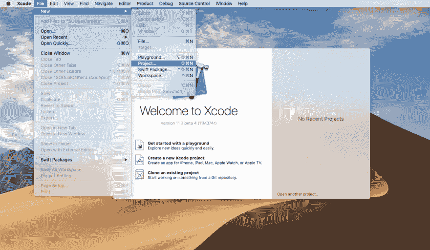
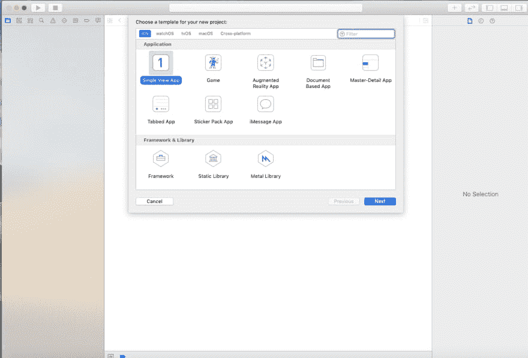
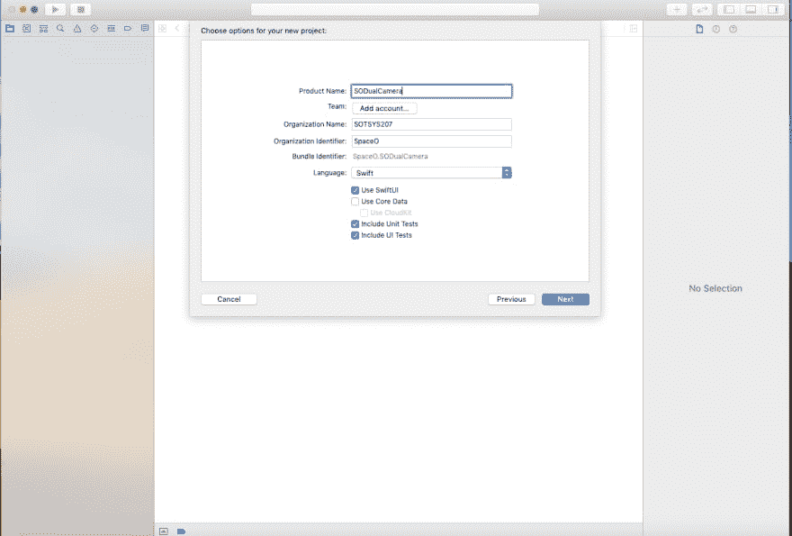
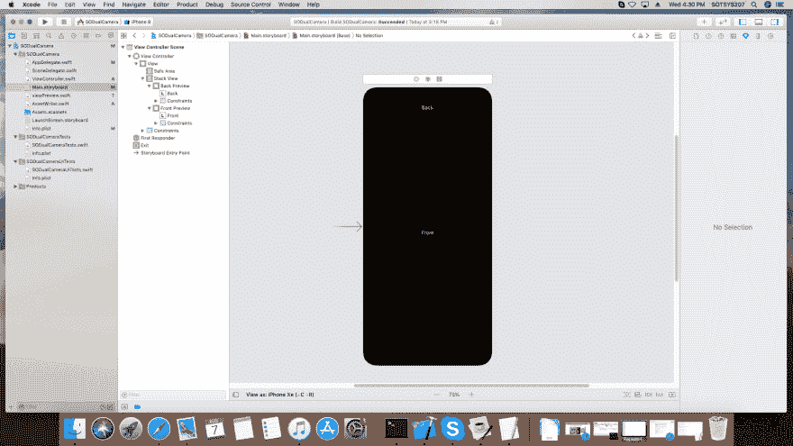
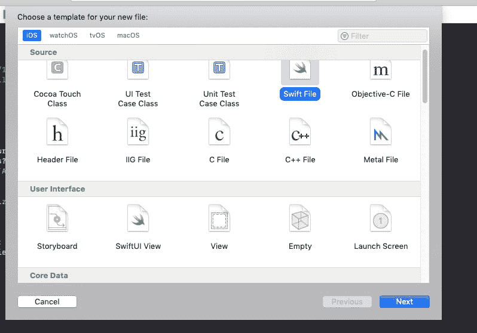
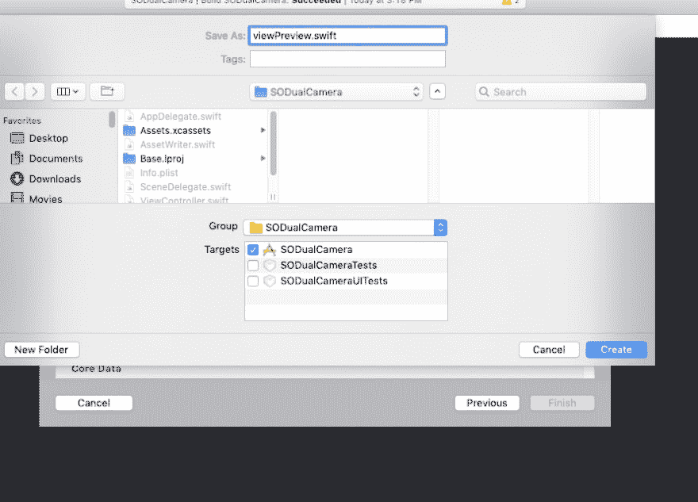
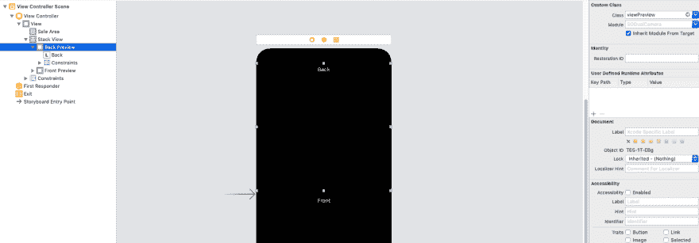
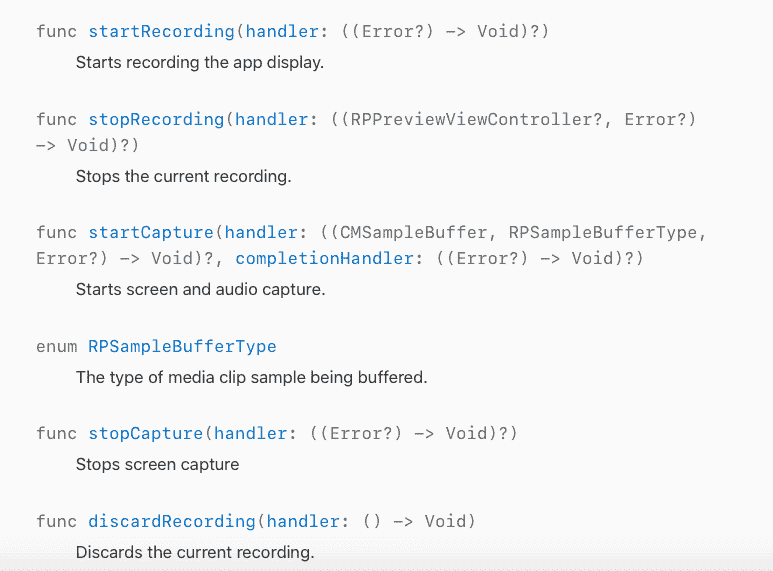

# 如何在你的 iOS 应用中集成双摄像头视频录制功能？

> 原文:[https://dev . to/amitspaceo/how-to-integrated-the-dual-camera-video-recording-feature-in-your-IOs-app-1li 3](https://dev.to/amitspaceo/how-to-integrate-the-dual-camera-video-recording-feature-in-your-ios-app-1li3)

本博客是在 Hitesh Trivedi 的帮助下撰写的，他在 iOS 应用程序开发方面有超过 9 年的经验。他指导开发了 100 多个具有独特特性和功能的 iPhone 应用程序。他在快速和客观方面有特殊专长——c .

苹果在 2019 年苹果全球开发者大会(WWDC)期间宣布了新版本的操作系统(iOS13)、更新(例如 Siri 语音体验)、技术和功能。我们的客户询问了一些关于在他们的 iPhone 应用中集成双重录音的问题，我们决定写这篇博客。这是一个关于如何无缝集成这个特性的完整教程。

**您将在本教程中学到什么**

*   如何在 iOS 应用程序中集成双重录制功能

我们是一家 iOS 应用程序开发公司，总是热衷于学习和实现最新的功能。我们的 iOS 开发人员一直在尝试各种功能，以发挥我们开发的应用程序的最佳性能。在本教程中，我们解释了如何在 iPhone 应用程序中集成多摄像头视频录制功能。

今年六月的 WWDC 已经过去一段时间了。就像每年一样，苹果发布了许多令人兴奋的公告。其中一些公告包括:

*   iOS 13
*   ipad ios
*   Mac OS Catalina
*   TVOS 13 号
*   手表 OS 6
*   新的 MAC Pro 和 XDR DisplayiOS 13 最近引起了很多关注，这是理所当然的。它配备了许多新的或更新的特性和功能。让我们看看它的一些新特性。

**iOS 13 有什么新功能？**

*   [黑暗模式](https://www.spaceotechnologies.com/dark-mode-ios-13-tutorial/)
*   相机捕捉
*   滑动键盘
*   改进的提醒应用程序
*   ARKit 3 (AR Quick Look，人物遮挡，动作捕捉，Reality Composer，跟踪多张脸)
*   Siri(语音体验。快捷方式应用)
*   [登录苹果](https://www.spaceotechnologies.com/sign-in-with-apple-ios-tutorial/)
*   多个 UI 实例
*   摄像机捕捉(同时记录视频正面/背面)
*   铅笔套件
*   组合框架
*   核心数据–将核心数据同步到云套件
*   [后台任务](https://www.spaceotechnologies.com/ios-background-task-framework-app-update/)

在本 iOS 教程中，我们将讨论使用 AVMultiCamPiP 从多个摄像机(正面和背面)采集和记录的摄像机采集功能。

**使用摄像机捕捉的多摄像机录制**

在 iOS 13 之前，苹果不允许同时使用前后摄像头录制视频。现在，用户可以同时使用前后摄像头进行双摄像头录制。这是通过相机捕捉来完成的

AVMultiCamPiP 中的 PiP 代表“画中画”。此功能有助于以全屏方式查看视频输出，并以小屏幕方式显示。在这之间的任何时候，用户都可以改变焦点。

我们创建了一个名为“SODualCamera”的项目，旨在 XCode 11 上演示 iOS 13 相机捕捉功能。让我们看一下[逐步指南来整合这个特性](https://www.spaceotechnologies.com/integrate-multi-camera-video-recording-ios/)。

**在 iOS 应用程序中集成多摄像头录制功能的步骤**

**1)使用 XCODE 11** 创建一个新项目

*   

**2)在 iOS 部分选择“单视图 App”，输入项目名称。我们把它保存为“数码相机”。**

[T2】](https://res.cloudinary.com/practicaldev/image/fetch/s--87iNVNDo--/c_limit%2Cf_auto%2Cfl_progressive%2Cq_auto%2Cw_880/https://thepracticaldev.s3.amazonaws.com/i/nlb5wk7ja43jeoe0w422.png)

[T2】](https://res.cloudinary.com/practicaldev/image/fetch/s--vcIPqvG2--/c_limit%2Cf_auto%2Cfl_progressive%2Cq_auto%2Cw_880/https://thepracticaldev.s3.amazonaws.com/i/0ga9b0fm0my7npnr5071.png)

3)转到项目名称文件夹，打开 Main.storyboard 文件。如图所示添加 Stackview。在 StackView 中添加两个 UIView，并在 UIview 中添加标签。

[T2】](https://res.cloudinary.com/practicaldev/image/fetch/s--CBAo5tlP--/c_limit%2Cf_auto%2Cfl_progressive%2Cq_auto%2Cw_880/https://thepracticaldev.s3.amazonaws.com/i/2k1e5odxm9pcywqa3e3k.png)

**4)进入 Xcode 文件菜单，选择新建，选择文件，选择 Swift 文件，如图所示，点击下一步按钮。**

[T2】](https://res.cloudinary.com/practicaldev/image/fetch/s--U1E3Q4FO--/c_limit%2Cf_auto%2Cfl_progressive%2Cq_auto%2Cw_880/https://thepracticaldev.s3.amazonaws.com/i/4slf5hvh7lazkue7mjwa.png)

**5)现在输入文件名为 ViewPreview.swift.**

[T2】](https://res.cloudinary.com/practicaldev/image/fetch/s--uMa8qUH5--/c_limit%2Cf_auto%2Cfl_progressive%2Cq_auto%2Cw_880/https://thepracticaldev.s3.amazonaws.com/i/1cwhffk7t2t1u4m65mum.png)

**6)现在打开 ViewPreview.swift，添加如下代码**

```
import AVFoundation

class ViewPreview: UIView {
    var videoPreviewLayer: AVCaptureVideoPreviewLayer {
        guard let layer = layer as? AVCaptureVideoPreviewLayer else {
            fatalError("Expected `AVCaptureVideoPreviewLayer` type for layer. Check PreviewView.layerClass implementation.")
        }

        layer.videoGravity = .resizeAspect
        return layer
    }

    override class var layerClass: AnyClass {
        return AVCaptureVideoPreviewLayer.self  
    }
}

```

进入 Main.storyboard 并选择 StackView。在 StackView 下，选择 UIView，添加自定义类为“ViewPreview”，如图。

[T2】](https://res.cloudinary.com/practicaldev/image/fetch/s--xZsW6709--/c_limit%2Cf_auto%2Cfl_progressive%2Cq_auto%2Cw_880/https://thepracticaldev.s3.amazonaws.com/i/raitc9pg7a25xyleiotx.png)

对第二个视图重复相同的过程。

为两个视图创建出口。我们将使用此视图作为相机输出的预览。

```
@IBOutlet weak var backPreview: ViewPreview!
@IBOutlet weak var frontPreview: ViewPreview!

```

由于我们的目标是捕捉视频，我们需要导入 AVFoundation 框架。
我们正在将输出视频保存到用户的照片库中，我们还需要在 ViewController.swift 中导入照片框架

```
import AVFoundation
import Photos

```

10)声明一个变量来执行双视频会话。

```
 var dualVideoSession = AVCaptureMultiCamSession() 
```

创建一个 AVCaptureMultiCamSession 对象来执行摄像机会话。

```
 var audioDeviceInput: AVCaptureDeviceInput? 
```

**12)对于运行双视频会话时录制音频的音频设备输入，您需要如下声明变量:**

```
 var backDeviceInput:AVCaptureDeviceInput?
 var backVideoDataOutput = AVCaptureVideoDataOutput()
 var backViewLayer:AVCaptureVideoPreviewLayer?
 var backAudioDataOutput = AVCaptureAudioDataOutput()

 var frontDeviceInput:AVCaptureDeviceInput? 
 var frontVideoDataOutput = AVCaptureVideoDataOutput()
 var frontViewLayer:AVCaptureVideoPreviewLayer?
 var frontAudioDataOutput = AVCaptureAudioDataOutput()

```

在 ViewDidAppear 中添加以下代码，以检测应用程序是否在模拟器上运行。

```
override func viewDidAppear(_ animated: Bool) {
        super.viewDidAppear(animated)

        #if targetEnvironment(simulator)
          let alertController = UIAlertController(title: "SODualCamera", message: "Please run on physical device", preferredStyle: .alert)
          alertController.addAction(UIAlertAction(title: "OK",style: .cancel, handler: nil))
          self.present(alertController, animated: true, completion: nil)
          return
        #endif
    }

```

**14)创建一个设置方法来配置视频会话并管理用户权限。如果一个应用程序正在模拟器上运行，那么立即返回。**

```
#if targetEnvironment(simulator)
            return
        #endif

```

**15)现在使用代码**检查录像许可

```
switch AVCaptureDevice.authorizationStatus(for: .video) {
            case .authorized:
                // The user has previously granted access to the camera.
                 configureDualVideo()
                break

            case .notDetermined:

                AVCaptureDevice.requestAccess(for: .video, completionHandler: { granted in
                    if granted{
                        self.configureDualVideo()
                    }
                })

                break

            default:
                // The user has previously denied access.
            DispatchQueue.main.async {
                let changePrivacySetting = "Device doesn't have permission to use the camera, please change privacy settings"
                let message = NSLocalizedString(changePrivacySetting, comment: "Alert message when the user has denied access to the camera")
                let alertController = UIAlertController(title: "Error", message: message, preferredStyle: .alert)

                alertController.addAction(UIAlertAction(title: "OK", style: .cancel, handler: nil))

                alertController.addAction(UIAlertAction(title: "Settings", style: .`default`,handler: { _ in
                    if let settingsURL = URL(string: UIApplication.openSettingsURLString) {
                        UIApplication.shared.open(settingsURL,  options: [:], completionHandler: nil)
                    }
                }))

                self.present(alertController, animated: true, completion: nil)
            }
        }

```

在获得用户录制视频的许可后，我们配置视频会话参数。

首先，我们需要检查设备是否支持多机位会话

```
if !AVCaptureMultiCamSession.isMultiCamSupported{
            DispatchQueue.main.async {
               let alertController = UIAlertController(title: "Error", message: "Device is not supporting multicam feature", preferredStyle: .alert)
               alertController.addAction(UIAlertAction(title: "OK",style: .cancel, handler: nil))
               self.present(alertController, animated: true, completion: nil)
            }
            return
        }

```

现在，我们先安装前置摄像头。

```
func setUpBackCamera() -> Bool{
        //start configuring dual video session
        dualVideoSession.beginConfiguration()
            defer {
                //save configuration setting
                dualVideoSession.commitConfiguration()
            }

            //search back camera
            guard let backCamera = AVCaptureDevice.default(.builtInWideAngleCamera, for: .video, position: .back) else {
                print("no back camera")
                return false
            }

            // append back camera input to dual video session
            do {
                backDeviceInput = try AVCaptureDeviceInput(device: backCamera)

                guard let backInput = backDeviceInput,dualVideoSession.canAddInput(backInput) else {
                    print("no back camera device input")
                    return false
                }
                dualVideoSession.addInputWithNoConnections(backInput)
            } catch {
                print("no back camera device input: \(error)")
                return false
            }

            // seach back video port
            guard let backDeviceInput = backDeviceInput,
                let backVideoPort = backDeviceInput.ports(for: .video, sourceDeviceType: backCamera.deviceType, sourceDevicePosition: backCamera.position).first else {
                print("no back camera input's video port")
                return false
            }

            // append back video output
            guard dualVideoSession.canAddOutput(backVideoDataOutput) else {
                print("no back camera output")
                return false
            }
            dualVideoSession.addOutputWithNoConnections(backVideoDataOutput)
            backVideoDataOutput.videoSettings = [kCVPixelBufferPixelFormatTypeKey as String: Int(kCVPixelFormatType_32BGRA)]
            backVideoDataOutput.setSampleBufferDelegate(self, queue: dualVideoSessionOutputQueue)

            // connect back output to dual video connection
            let backOutputConnection = AVCaptureConnection(inputPorts: [backVideoPort], output: backVideoDataOutput)
            guard dualVideoSession.canAddConnection(backOutputConnection) else {
                print("no connection to the back camera video data output")
                return false
            }
            dualVideoSession.addConnection(backOutputConnection)
            backOutputConnection.videoOrientation = .portrait

            // connect back input to back layer
            guard let backLayer = backViewLayer else {
                return false
            }
            let backConnection = AVCaptureConnection(inputPort: backVideoPort, videoPreviewLayer: backLayer)
            guard dualVideoSession.canAddConnection(backConnection) else {
                print("no a connection to the back camera video preview layer")
                return false
            }
            dualVideoSession.addConnection(backConnection)

        return true
    }

```

我们现在已经成功地为视频会话配置了前置摄像头。

我们需要按照同样的流程来设置背部摄像头。

```
func setUpBackCamera() -> Bool{
        //start configuring dual video session
        dualVideoSession.beginConfiguration()
            defer {
                //save configuration setting
                dualVideoSession.commitConfiguration()
            }

            //search back camera
            guard let backCamera = AVCaptureDevice.default(.builtInWideAngleCamera, for: .video, position: .back) else {
                print("no back camera")
                return false
            }

            // append back camera input to dual video session
            do {
                backDeviceInput = try AVCaptureDeviceInput(device: backCamera)

                guard let backInput = backDeviceInput,dualVideoSession.canAddInput(backInput) else {
                    print("no back camera device input")
                    return false
                }
                dualVideoSession.addInputWithNoConnections(backInput)
            } catch {
                print("no back camera device input: \(error)")
                return false
            }

            // search back video port
            guard let backDeviceInput = backDeviceInput,
                let backVideoPort = backDeviceInput.ports(for: .video, sourceDeviceType: backCamera.deviceType, sourceDevicePosition: backCamera.position).first else {
                print("no back camera input's video port")
                return false
            }

            // append back video output
            guard dualVideoSession.canAddOutput(backVideoDataOutput) else {
                print("no back camera output")
                return false
            }
            dualVideoSession.addOutputWithNoConnections(backVideoDataOutput)
            backVideoDataOutput.videoSettings = [kCVPixelBufferPixelFormatTypeKey as String: Int(kCVPixelFormatType_32BGRA)]
            backVideoDataOutput.setSampleBufferDelegate(self, queue: dualVideoSessionOutputQueue)

            // connect back output to dual video connection
            let backOutputConnection = AVCaptureConnection(inputPorts: [backVideoPort], output: backVideoDataOutput)
            guard dualVideoSession.canAddConnection(backOutputConnection) else {
                print("no connection to the back camera video data output")
                return false
            }
            dualVideoSession.addConnection(backOutputConnection)
            backOutputConnection.videoOrientation = .portrait

            // connect back input to back layer
            guard let backLayer = backViewLayer else {
                return false
            }
            let backConnection = AVCaptureConnection(inputPort: backVideoPort, videoPreviewLayer: backLayer)
            guard dualVideoSession.canAddConnection(backConnection) else {
                print("no connection to the back camera video preview layer")
                return false
            }
            dualVideoSession.addConnection(backConnection)

        return true
    }

    func setUpFrontCamera() -> Bool{

              //start configuring dual video session
            dualVideoSession.beginConfiguration()
            defer {
              //save configuration setting
                dualVideoSession.commitConfiguration()
            }

            //search front camera for dual video session
            guard let frontCamera = AVCaptureDevice.default(.builtInWideAngleCamera, for: .video, position: .front) else {
                print("no front camera")
                return false
            }

            // append front camera input to dual video session
            do {
                frontDeviceInput = try AVCaptureDeviceInput(device: frontCamera)

                guard let frontInput = frontDeviceInput, dualVideoSession.canAddInput(frontInput) else {
                    print("no front camera input")
                    return false
                }
                dualVideoSession.addInputWithNoConnections(frontInput)
            } catch {
                print("no front input: \(error)")
                return false
            }

            // search front video port for dual video session
            guard let frontDeviceInput = frontDeviceInput,
                let frontVideoPort = frontDeviceInput.ports(for: .video, sourceDeviceType: frontCamera.deviceType, sourceDevicePosition: frontCamera.position).first else {
                print("no front camera device input's video port")
                return false
            }

            // append front video output to dual video session
            guard dualVideoSession.canAddOutput(frontVideoDataOutput) else {
                print("no the front camera video output")
                return false
            }
            dualVideoSession.addOutputWithNoConnections(frontVideoDataOutput)
            frontVideoDataOutput.videoSettings = [kCVPixelBufferPixelFormatTypeKey as String: Int(kCVPixelFormatType_32BGRA)]
            frontVideoDataOutput.setSampleBufferDelegate(self, queue: dualVideoSessionOutputQueue)

            // connect front output to dual video session
            let frontOutputConnection = AVCaptureConnection(inputPorts: [frontVideoPort], output: frontVideoDataOutput)
            guard dualVideoSession.canAddConnection(frontOutputConnection) else {
                print("no connection to the front video output")
                return false
            }
            dualVideoSession.addConnection(frontOutputConnection)
            frontOutputConnection.videoOrientation = .portrait
            frontOutputConnection.automaticallyAdjustsVideoMirroring = false
            frontOutputConnection.isVideoMirrored = true

            // connect front input to front layer
            guard let frontLayer = frontViewLayer else {
                return false
            }
            let frontLayerConnection = AVCaptureConnection(inputPort: frontVideoPort, videoPreviewLayer: frontLayer)
            guard dualVideoSession.canAddConnection(frontLayerConnection) else {
                print("no connection to front layer")
                return false
            }
            dualVideoSession.addConnection(frontLayerConnection)
            frontLayerConnection.automaticallyAdjustsVideoMirroring = false
            frontLayerConnection.isVideoMirrored = true

            return true
    }

```

**19)设置好前后摄像头后，我们需要为音频进行配置。**

首先，我们需要找到音频设备输入，然后将其添加到会话中。然后找到前置和后置摄像头的音频端口，并将该端口分别添加到前置音频输出和视频输出。

代码看起来像这样:

```
func setUpAudio() -> Bool{
         //start configuring dual video session
        dualVideoSession.beginConfiguration()
        defer {
            //save configuration setting

            dualVideoSession.commitConfiguration()
        }

        // search audio device for dual video session
        guard let audioDevice = AVCaptureDevice.default(for: .audio) else {
            print("no the microphone")
            return false
        }

        // append audio to dual video session
        do {
            audioDeviceInput = try AVCaptureDeviceInput(device: audioDevice)

            guard let audioInput = audioDeviceInput,
                dualVideoSession.canAddInput(audioInput) else {
                    print("no audio input")
                    return false
            }
            dualVideoSession.addInputWithNoConnections(audioInput)
        } catch {
            print("no audio input: \(error)")
            return false
        }

        //search audio port back
        guard let audioInputPort = audioDeviceInput,
            let backAudioPort = audioInputPort.ports(for: .audio, sourceDeviceType: audioDevice.deviceType, sourceDevicePosition: .back).first else {
            print("no front back port")
            return false
        }

        // search audio port front
        guard let frontAudioPort = audioInputPort.ports(for: .audio, sourceDeviceType: audioDevice.deviceType, sourceDevicePosition: .front).first else {
            print("no front audio port")
            return false
        }

        // append back output to dual video session
        guard dualVideoSession.canAddOutput(backAudioDataOutput) else {
            print("no back audio data output")
            return false
        }
        dualVideoSession.addOutputWithNoConnections(backAudioDataOutput)
        backAudioDataOutput.setSampleBufferDelegate(self, queue: dualVideoSessionOutputQueue)

        // append front output to dual video session
        guard dualVideoSession.canAddOutput(frontAudioDataOutput) else {
            print("no front audio data output")
            return false
        }
        dualVideoSession.addOutputWithNoConnections(frontAudioDataOutput)
        frontAudioDataOutput.setSampleBufferDelegate(self, queue: dualVideoSessionOutputQueue)

        // add back output to dual video session
        let backOutputConnection = AVCaptureConnection(inputPorts: [backAudioPort], output: backAudioDataOutput)
        guard dualVideoSession.canAddConnection(backOutputConnection) else {
            print("no back audio connection")
            return false
        }
        dualVideoSession.addConnection(backOutputConnection)

        // add front output to dual video session
        let frontutputConnection = AVCaptureConnection(inputPorts: [frontAudioPort], output: frontAudioDataOutput)
        guard dualVideoSession.canAddConnection(frontutputConnection) else {
            print("no front audio connection")
            return false
        }
        dualVideoSession.addConnection(frontutputConnection)

        return true
    }

```

现在，我们已经成功配置了前置摄像头、后置摄像头和音频。

现在，当我们启动一个会话时，它会在 CMSampleBuffer 中发送输出。我们必须收集这个样本缓冲区输出，并对其执行所需的操作。

为此，我们需要为摄像机和音频设置示例委托方法。我们已经使用以下代码为前置、后置摄像头和音频设置了代理:

```
frontVideoDataOutput.setSampleBufferDelegate(self, queue: dualVideoSessionOutputQueue)

  backVideoDataOutput.setSampleBufferDelegate(self, queue: dualVideoSessionOutputQueue)

   backAudioDataOutput.setSampleBufferDelegate(self, queue: dualVideoSessionOutputQueue)

```

为了处理一个会话的运行时错误，我们需要如下添加观察者:

```
NotificationCenter.default.addObserver(self, selector: #selector(sessionRuntimeError), name: .AVCaptureSessionRuntimeError,object: dualVideoSession)

        NotificationCenter.default.addObserver(self, selector: #selector(sessionWasInterrupted), name: .AVCaptureSessionWasInterrupted, object: dualVideoSession)

        NotificationCenter.default.addObserver(self, selector: #selector(sessionInterruptionEnded), name: .AVCaptureSessionInterruptionEnded, object: dualVideoSession)

```

现在我们已经准备好开始会议了。我们将为会话使用不同的队列，因为当我们在主线程上运行会话时，它会导致性能问题、延迟和内存泄漏。

使用以下代码启动会话:

```
dualVideoSessionQueue.async {
          self.dualVideoSession.startRunning()
      }

```

**23)现在，我们将在设置方法中添加用于开始和停止录制的手势识别器，如下所示:**

```
func addGestures(){

        let tapSingle = UITapGestureRecognizer(target: self, action: #selector(self.handleSingleTap(_:)))
        tapSingle.numberOfTapsRequired = 1
        self.view.addGestureRecognizer(tapSingle)

        let tapDouble = UITapGestureRecognizer(target: self, action: #selector(self.handleDoubleTap(_:)))
        tapDouble.numberOfTapsRequired = 2
        self.view.addGestureRecognizer(tapDouble)

        tapSingle.require(toFail: tapDouble) 
//differentiate single tap and double tap recognition if the user do both gestures simultaneously. 

}

```

**24)在 Apple Capture demo 中，他们已经使用 AVCapture Delegate 方法来获取前后视频。**

这里，我们不打算使用这个示例输出委托方法。我们将使用 ReplayKit 来记录它。我们将在这里进行屏幕录制以生成输出视频。

**25)导入 Replaykit 框架如下:**

```
 import ReplayKit 
```

创建一个 RPScreenRecorder 的共享对象，来开始和停止屏幕录制。

```
 let screenRecorder = RPScreenRecorder.shared() 
```

我们将使用 isRecording 变量跟踪记录状态。

```
 var isRecording = false 
```

**28)当用户点击屏幕一次时，它开始屏幕录制，当用户双击屏幕时，它停止屏幕录制，并将输出视频保存到用户的照片库中。**

我们使用了一个自定义类，通过 AssetWriter.swift 将视频和音频输出附加到一个视频输出中

```
import UIKit
import Foundation
import AVFoundation
import ReplayKit
import Photos

extension UIApplication {

    class func getTopViewController(base: UIViewController? = UIApplication.shared.keyWindow?.rootViewController) -> UIViewController? {

        if let nav = base as? UINavigationController {
            return getTopViewController(base: nav.visibleViewController)

        } else if let tab = base as? UITabBarController, let selected = tab.selectedViewController {
            return getTopViewController(base: selected)

        } else if let presented = base?.presentedViewController {
            return getTopViewController(base: presented)
        }
        return base
    }
}

class AssetWriter {
    private var assetWriter: AVAssetWriter?
    private var videoInput: AVAssetWriterInput?
    private var audioInput: AVAssetWriterInput?
    private let fileName: String

    let writeQueue = DispatchQueue(label: "writeQueue")

    init(fileName: String) {
        self.fileName = fileName
    }

    private var videoDirectoryPath: String {
        let dir = NSSearchPathForDirectoriesInDomains(.documentDirectory, .userDomainMask, true)[0]
        return dir + "/Videos"
    }

    private var filePath: String {
        return videoDirectoryPath + "/\(fileName)"
    }

    private func setupWriter(buffer: CMSampleBuffer) {
        if FileManager.default.fileExists(atPath: videoDirectoryPath) {
            do {
                try FileManager.default.removeItem(atPath: videoDirectoryPath)
            } catch {
                print("fail to removeItem")
            }
        }
        do {
            try FileManager.default.createDirectory(atPath: videoDirectoryPath, withIntermediateDirectories: true, attributes: nil)
        } catch {
            print("fail to createDirectory")
        }

        self.assetWriter = try? AVAssetWriter(outputURL: URL(fileURLWithPath: filePath), fileType: AVFileType.mov)

        let writerOutputSettings = [
            AVVideoCodecKey: AVVideoCodecType.h264,
            AVVideoWidthKey: UIScreen.main.bounds.width,
            AVVideoHeightKey: UIScreen.main.bounds.height,
            ] as [String : Any]

        self.videoInput = AVAssetWriterInput(mediaType: AVMediaType.video, outputSettings: writerOutputSettings)
        self.videoInput?.expectsMediaDataInRealTime = true

        guard let format = CMSampleBufferGetFormatDescription(buffer),
            let stream = CMAudioFormatDescriptionGetStreamBasicDescription(format) else {
                print("fail to setup audioInput")
                return
        }

        let audioOutputSettings = [
            AVFormatIDKey : kAudioFormatMPEG4AAC,
            AVNumberOfChannelsKey : stream.pointee.mChannelsPerFrame,
            AVSampleRateKey : stream.pointee.mSampleRate,
            AVEncoderBitRateKey : 64000
            ] as [String : Any]

        self.audioInput = AVAssetWriterInput(mediaType: AVMediaType.audio, outputSettings: audioOutputSettings)
        self.audioInput?.expectsMediaDataInRealTime = true

        if let videoInput = self.videoInput, (self.assetWriter?.canAdd(videoInput))! {
            self.assetWriter?.add(videoInput)
        }

        if  let audioInput = self.audioInput, (self.assetWriter?.canAdd(audioInput))! {
            self.assetWriter?.add(audioInput)
        }
    }

    public func write(buffer: CMSampleBuffer, bufferType: RPSampleBufferType) {
        writeQueue.sync {
            if assetWriter == nil {
                if bufferType == .audioApp {
                    setupWriter(buffer: buffer)
                }
            }

            if assetWriter == nil {
                return
            }

            if self.assetWriter?.status == .unknown {
                print("Start writing")
                let startTime = CMSampleBufferGetPresentationTimeStamp(buffer)
                self.assetWriter?.startWriting()
                self.assetWriter?.startSession(atSourceTime: startTime)
            }
            if self.assetWriter?.status == .failed {
                print("assetWriter status: failed error: \(String(describing: self.assetWriter?.error))")
                return
            }

            if CMSampleBufferDataIsReady(buffer) == true {
                if bufferType == .video {
                    if let videoInput = self.videoInput, videoInput.isReadyForMoreMediaData {
                        videoInput.append(buffer)
                    }
                } else if bufferType == .audioApp {
                    if let audioInput = self.audioInput, audioInput.isReadyForMoreMediaData {
                        audioInput.append(buffer)
                    }
                }
            }
        }
    }

    public func finishWriting() {
        writeQueue.sync {
            self.assetWriter?.finishWriting(completionHandler: {
                print("finishWriting")
                PHPhotoLibrary.shared().performChanges({
                    PHAssetChangeRequest.creationRequestForAssetFromVideo(atFileURL: URL(fileURLWithPath: self.filePath))
                }) { saved, error in
                    if saved {
                        let alertController = UIAlertController(title: "Your video was successfully saved", message: nil, preferredStyle: .alert)
                        let defaultAction = UIAlertAction(title: "OK", style: .default, handler: nil)
                        alertController.addAction(defaultAction)
                        if let topVC = UIApplication.getTopViewController() {
                            topVC.present(alertController, animated: true, completion: nil)
                        }
                    }
                }
            })
        }
    }
}

```

现在我们可以进入演示的最后阶段了。

当用户点击屏幕时，我们需要开始屏幕录制。

创建如下开始捕获函数:

```
func startCapture() {
       screenRecorder.startCapture(handler: { (buffer, bufferType, err) in
            self.isRecording = true
            self.assetWriter!.write(buffer: buffer, bufferType: bufferType)
        }, completionHandler: {
            if let error = $0 {
                print(error)
            }
        })
    }

```

方法将作为缓冲区和缓冲区类型返回，我们需要将它们传递给 assetwriter。AssetWriter 将把这个缓冲区写入 URL，我们最初需要把它传递给 assetwriter。

我们已经创建了一个 AssetWriter assetWrite 的对象，并初始化如下:

```
let outputFileName = NSUUID().uuidString + ".mp4"

assetWriter = AssetWriter(fileName: outputFileName) 

```

现在，当用户双击屏幕时，屏幕录制停止。因此，我们将使用屏幕记录器的 stopCapture 方法如下:

```
func stopCapture() {
        screenRecorder.stopCapture {
            self.isRecording = false
            if let err = $0 {
                print(err)
            }
            self.assetWriter?.finishWriting()
        }
    }

```

由于我们没有向 assetWriter 写入任何缓冲区，我们需要告诉 assetWriter 完成写入并生成输出视频 URL。

现在，AssetWriter 将完成写入，它将请求用户允许将视频存储在用户照片库中，如果用户同意，视频将被保存在那里。

AssetWriter 为此完成了一个写函数。

```
public func finishWriting() {
        writeQueue.sync {
            self.assetWriter?.finishWriting(completionHandler: {
                print("finishWriting")
                PHPhotoLibrary.shared().performChanges({
                    PHAssetChangeRequest.creationRequestForAssetFromVideo(atFileURL: URL(fileURLWithPath: self.filePath))
                }) { saved, error in
                    if saved {
                        let alertController = UIAlertController(title: "Your video was successfully saved", message: nil, preferredStyle: .alert)
                        let defaultAction = UIAlertAction(title: "OK", style: .default, handler: nil)
                        alertController.addAction(defaultAction)
                        if let topVC = UIApplication.getTopViewController() {
                            topVC.present(alertController, animated: true, completion: nil)
                        }
                    }
                }
            })
        }
    }

```

注意:一些开发者可能会对 RPscreenRecorder 也提供 startRecording 和 stopRecording 感到困惑，但是我们已经使用了 startCapture 和 stopCapture。

为什么会这样呢？

这里有个图片来回答一下

[T2】](https://res.cloudinary.com/practicaldev/image/fetch/s--gLLA6pRn--/c_limit%2Cf_auto%2Cfl_progressive%2Cq_auto%2Cw_880/https://thepracticaldev.s3.amazonaws.com/i/pt59wf844o9n75w3cspg.png)

开始录制将开始录制应用程序显示。当我们使用 startRecording 方法时，要结束记录，我们需要调用 RPscreenRecorder 的 stopRecroding 方法。

当我们运行一个 AVSession 并想要记录屏幕时，这时候我们需要使用 startCapture 方法。

startCapture 将启动屏幕和音频捕获。用 startCapture 启动的记录必须以 stopCapture 结束。

# [](#summing-up)总结归纳

我们希望你觉得这个 iPhone 教程是有用的，并且你对 iPhone 双摄像头录制的概念是清楚的。你可以在 [Github](https://github.com/spaceotech/SODualCamera) 上找到这个记录前后摄像头同时 iPhone 插图的源代码。