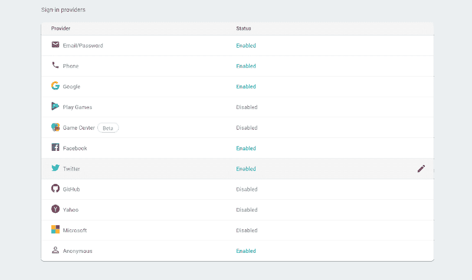
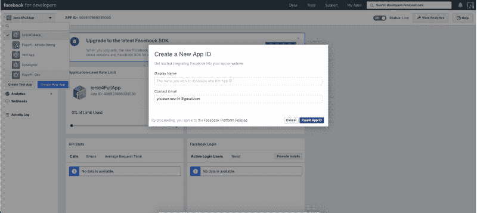
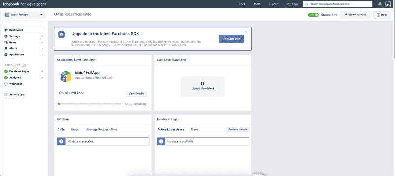
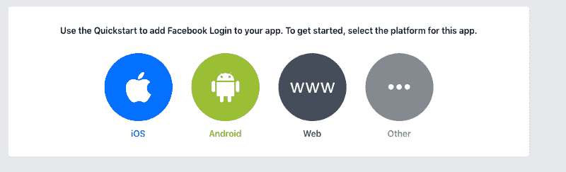
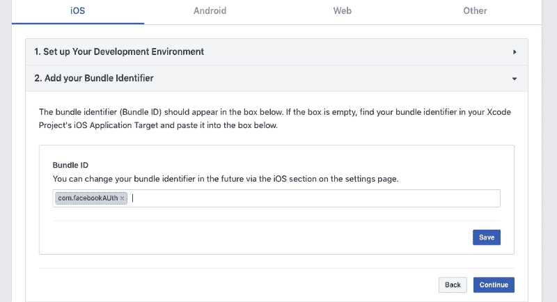
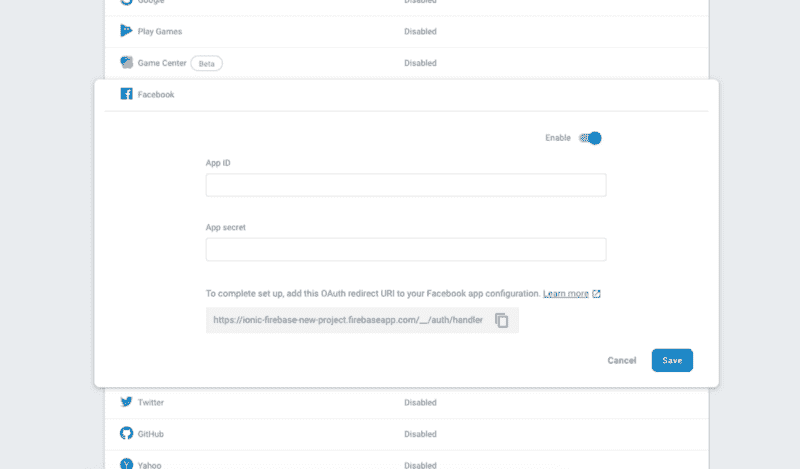
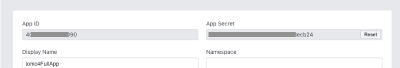
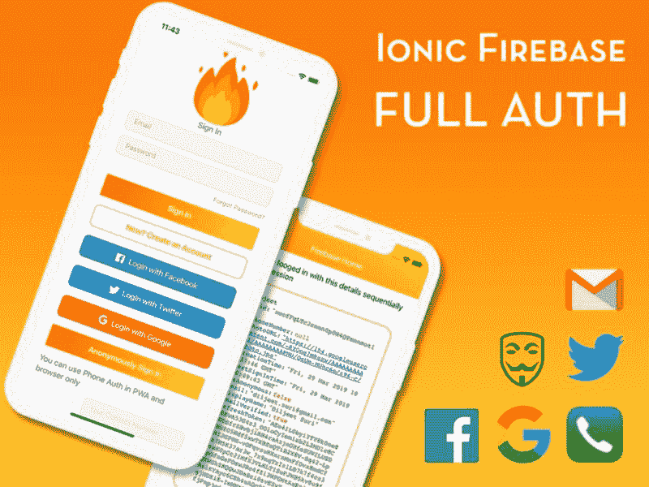

# 脸书使用 Firebase 登录 Ionic 4 应用程序🔥

> 原文:[https://dev . to/enappd/Facebook-log in-ionic-4-apps-using-firebase-153 o](https://dev.to/enappd/facebook-login-in-ionic-4-apps-using-firebase-153o)

* * *

这是两个帖子系列的第 1 部分。在这篇文章中，你将学习如何使用 Firebase 在 Ionic 4 应用中实现脸书认证🔥。在本系列的第 2 部分中，我们将讨论如何对本机存储使用脸书登录。

我们将制作一个示例应用程序，用户可以使用他们的脸书帐户登录。登录后，用户可以在主页上看到他们的基本资料信息，会话保存在 Firebase 中。

> *本教程的完整源代码可在*[*Ionic-4-Facebook-auth starter 中获得。*](https://store.enappd.com/product/ionic-4-facebook-login-with-firebase/)

### 社交登录——什么和为什么

对于不想创建和记住另一个用户名/密码组合的用户来说，使用 Ionic 的社交登录很有帮助。相反，您可以允许用户使用他们已经拥有的帐户登录。你不需要存储散列密码进行比较，你不需要处理发送注册电子邮件，你也不需要重置密码。用户选择的提供商将为您处理所有这一切。此外，在移动应用程序中，脸书登录是通过预装的脸书应用程序自动完成的。

### 脸书登录—内容和原因

您应该在应用程序中使用脸书登录有几个原因

*   **易用性** —当新用户使用您的应用程序时，只需点击两个按钮即可使用脸书登录。在其他情况下，用户必须输入电子邮件/密码并登录
*   **没有“忘记密码”** —当你的应用使用脸书登录时，用户不必担心忘记你的应用的登录密码
*   **没有“验证电子邮件”** —如果您使用自己的自定义电子邮件身份验证，您必须验证该电子邮件是否有效。脸书登录将始终有一个有效的相关电子邮件/电话号码。
*   **单一解决方案—** 脸书登录允许您的用户在多台设备上使用单一登录凭据
*   **脸书集成** —如果你的应用使用脸书认证，你也可以在应用内部使用脸书 API。这可以包括获取用户推文等。
*   **信任** —如今，人们普遍更信任社交登录，而不是自定义电子邮件登录。社交登录遵循标准隐私协议，因此在信息共享方面更加可靠

### 离子认证

Ionic 框架已经存在了 5 年左右，因为它比 Swift / Java 更容易使用，所以在开发人员中非常受欢迎。此外，它要求你有一个 Android 和 iOS 应用程序的单一源代码。开发商还能要求什么呢！

Ionic 4 是 Ionic 的最新版本(在撰写本文时),比以前的版本更加可靠和健壮。

Ionic 4 应用程序中有几种认证方式

*   **社交登录** —社交登录是移动应用中一种流行且简单的认证方式。你一定见过几乎所有现代应用程序中的谷歌、脸书、Instagram 登录。社交登录易于使用，对于快速集成来说更加可靠。
*   **后端即服务(BaaS)——**您可以使用预建的 BaaS 平台，轻松将身份验证集成到您的应用中。基本上这些平台给你提供了一个现成的后端，你就不用自己做了。Firebase，Parse，Back4App 都是一些 BaaS 平台。 ***Firebase*** 是其中最受欢迎的移动应用，我们将在下一节研究
*   **创建自己的后端** —你可以在 Node.js、Go、Django 或者 Ruby-on-rails 中创建自己的后端，将你的 app 认证连接到自己的后端。这种方法受到需要完全控制用户身份验证的开发人员的青睐。但这种方法也是最费时间的一种。

### 重火力点

Firebase 是一个后端即服务(BaaS)平台。它从 YC11 初创公司起步，成长为谷歌云平台上的下一代应用开发平台。它越来越受欢迎，因为它易于集成，功能多样。

Firebase 提供的一些快速集成包括

*   电子邮件认证
*   社交登录
*   实时数据库
*   分析学
*   Crashlytics
*   推送通知
*   应用内消息
*   远程配置

还有更多。Firebase 正在迅速成长为最受欢迎的移动应用后端平台。

#### Firebase 身份验证选项

Firebase 不仅提供现成的电子邮件身份验证，还提供使用各种社交登录的身份验证。您可以看到 Firebase 提供的身份验证选项



<figure>

<figcaption class="imageCaption">Authentication options available in Firebase</figcaption>

</figure>

一旦脸书登录完成，我们将使用 Firebase 来存储用户配置文件信息。这是首选方法，因为它对应用程序和 PWA 都是可靠的。

### 浅谈脸书认证

如前所述，我们将使用两种不同的存储方法来实现脸书认证

*   本地存储
*   重火力点

我们将在本帖的第 2 部分实现原生存储。

在这两种情况下，我们将使用爱奥尼亚科尔多瓦脸书插件与脸书互动，并验证用户。登录完成后，我们会收到用户资料信息。这些信息将保存在本机存储/ Firebase 中。这可以作为用户会话的安全存储，因为设备可以删除非持久的本地存储数据。**当用户关闭应用程序并返回应用程序时，保存在本机存储或 Firebase 中的信息/会话将允许用户自动登录。**

### 脸书认证的步骤

我们将按照这些一步一步的说明来创建带有脸书认证的 Ionic 4 应用程序

**第一步:脸书开发者控制台——创建您的应用**

**第二步:将您的平台添加到脸书**

**‌Step 3:在 Firebase 项目中启用 Facebook 登录**

‌ **第四步:安装 Cordova Facebook 插件，将你的应用程序与 Firebase** 连接起来

**步骤 5:使用脸书认证用户**

**步骤 6:将脸书认证令牌存储在 Firebase 中**

**步骤 7:使用 Firebase 自动登录用户**

**第 8 步:测试你的安卓应用**

### 步骤 1:脸书开发人员控制台

我们需要做的第一件事是在脸书的开发者仪表板中创建一个新的应用程序，当我们试图让用户登录我们的 Ionic 应用程序时，脸书将使用这个应用程序来请求他们的许可。

为此，你需要前往[**F**](https://developers.facebook.com/apps)[**acebook 开发者控制台**](https://developers.facebook.com/apps) 并创建一个新应用。



<figure>

<figcaption class="imageCaption">Create new app in Facebook Developer console</figcaption>

</figure>

一旦我们完成创建我们的应用程序，我们将前往脸书应用程序仪表板，并从那里选择**应用程序 Id** 。这将是在应用程序中安装脸书插件所必需的



<figure>

<figcaption class="imageCaption">Facebook Developer Console — App ID on top-left</figcaption>

</figure>

### ‌‌Step 2:将你的平台添加到 Facebook

我们需要让脸书知道我们将使用哪些平台(*如果只是 web、iOS 或 Android* )。

‌In 我们的情况下，我们将增加所有平台的 iOS 和 Android。

‌To 添加平台，在你的 Facebook 仪表盘中点击**设置**，然后在应用信息的正下方你会看到一个按钮，上面写着**添加平台**，点击它。

您将看到您正在创建的平台的几个选项



<figure>

<figcaption class="imageCaption">Options to create platforms</figcaption>

</figure>

#### 在脸书仪表板中添加平台

‌ **让我们从 iOS 开始:-** 你会看到一个要求你提供一些信息的表单，现在我们只需要`Bundle ID`。

​



<figure>

<figcaption class="imageCaption">Create iOS app in Facebook console</figcaption>

</figure>

如果你不知道从哪里获得包 ID，当你创建一个 Ionic 应用时，它与包名相同，它在你的`config.xml`文件中:

```
<widget id="co.ionic.facebookAuth" version="0.0.1" http://www.w3.org/ns/widgets">http://www.w3.org/ns/widgets" xmlns:cdv="http://cordova.apache.org/ns/1.0">
```

‌Once 你添加捆绑 ID，只需按照流程创建应用程序。

‌ **安卓:-** 不同的是，安卓称其为“Google Play 包名”，而不是`Bundle ID`

### ‌Step 3:在 Firebase 中启用 Facebook 登录。

现在一切都在脸书这边设置好了，我们需要进入我们的 Firebase 控制台，并为我们的应用程序启用脸书认证。

‌To 启用 Facebook，你需要进入[你的 Firebase 控制台](https://console.firebase.google.com/)并找到你正在使用的应用程序(或者创建一个新的 Firebase 项目)

‌Once:你进入应用程序的仪表盘，进入**身份验证>登录方式> Facebook** ，点击**启用**开关。



<figure>

<figcaption class="imageCaption">Enable Facebook login in Firebase console</figcaption>

</figure>

它会问你的应用程序 ID 和应用程序的秘密，你会从你的脸书控制台复制它，在你的应用程序的设置。



<figure>

<figcaption class="imageCaption">Pick App ID and App Secret from Facebook console</figcaption>

</figure>

### 第四步:安装脸书科尔多瓦插件

在这一步中，我们将在 Ionic 应用程序中安装 Cordova 插件。

‌For，打开你的终端，输入

```
$ ionic cordova plugin add cordova-plugin-facebook4 --variable APP_ID="123456789" --variable APP_NAME="myApplication"
```

‌You'll 需要用您的真实凭证替换值或`APP_ID`和`APP_NAME`。您可以在脸书开发者仪表板中找到这两个工具。

‌It's 有点笨拙地使用科尔多瓦插件，所以 ionic 团队创建了 **Ionic Native** ，这是科尔多瓦插件的包装器，所以我们可以以更“有角度/离子”的方式使用它们。

‌So 现在，我们将打开我们的终端，并尝试这个 command‌安装离子本地的 Facebook 包

```
$ npm install --save @ionic-native/facebook
```

#### 在你的应用中初始化 Firebase

首先，让我们创建一个 Ionic 应用程序。你既可以使用我们的 [Ionic 4 完全授权](https://store.enappd.com/product/firebase-starter-full-auth/)启动器，也可以从头开始创建自己的 Ionic 4 应用程序。这个应用程序包含所有类型的认证使用 Firebase。



<figure>

<figcaption class="imageCaption">Ionic 4 Full Auth app starter</figcaption>

</figure>

> ***要了解如何从*开始创建 Ionic app*，请阅读*** [***如何为初学者从头创建 Ionic 4 app***](https://enappd.com/blog/how-to-create-an-ionic-4-app-for-beginners/13/)

此外，我们需要安装 [AngularFire2 npm 模块](https://github.com/angular/angularfire2)，它实际上将 Firebase 功能连接到 Ionic app。要安装该模块，请运行

```
$ npm install firebase @angular/fire --save
```

另外，在`app.module.ts`中包含`environment`、`AngularFireModule`和`AngularFireAuthModule`