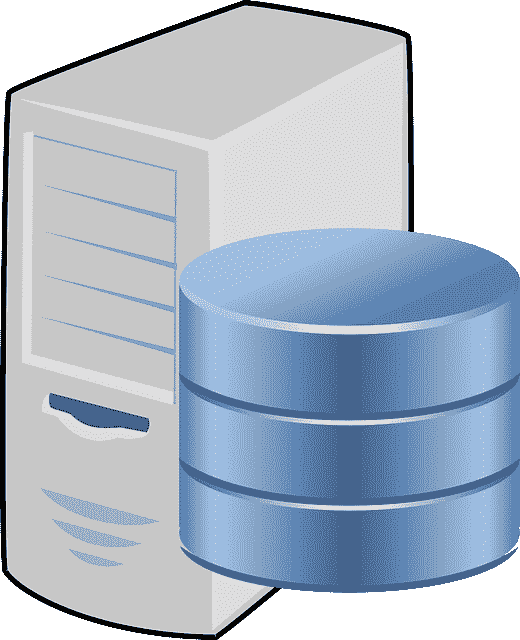

# 执行 Windows 服务器备份时要记住的 10 件事

> 原文：<https://dev.to/twaintaylor/10-things-to-keep-in-mind-when-performing-a-windows-server-backup-2pd>

备份对任何企业都极其重要。虚拟机通常被各种企业使用。虚拟机通常托管重要的应用程序，并包含可能因多种原因而丢失的重要数据。在这种情况下，有一个备份可以救命。许多企业使用的一个非常常见的环境是 Windows Server。Windows Server 提供企业级数据存储、管理以及与 SQL Server、Sharepoint、Exchange 和 Oracle 等应用程序的通信。Windows server 提供了内置的备份选项。让我们来看看在备份 Windows Server 时应该考虑的事项。

 
来源: [Pixabay](https://pixabay.com/photos/server-cloud-development-business-1235959/)

## 1)存储

Windows Server Backup 仅允许使用某些存储技术来存储备份数据。由于固定存储，用户将没有自动备份选项，也不会有很好的体验，因为这些固定备份效率不高。因此，企业应该寻找一种备份解决方案，允许用户将其备份存储在他们选择的任何位置，同时允许高效的自动化。理想的备份解决方案将提供出色的性能，并允许网络加速，以便在繁忙的网络上执行备份作业，而不考虑位置。

## 2)有限的备份副本

Windows Server Backup 仅允许维护备份的单个副本，当新备份激活时，该副本将被替换。这对于需要随时拥有以前备份的归档以恢复过去特定时期的数据的企业来说可能并不理想。因此，企业应该依靠备份来帮助节省存储，但同时允许维护多个备份副本。理想的解决方案是允许增量备份，这样可以确保只记录更改，而不运行整个备份，从而减少存储。

## 3)加密

默认情况下，Windows Server 备份不加密。要进行加密备份，需要 BitLocker。如果所需的驱动器没有加密，备份也会失败，这是一种低效的备份解决方案。企业应该寻找备份解决方案，通过加密备份并在需要时允许轻松解密和恢复来保护备份。这将有助于避免需要额外的工具。

 
来源: [Pixabay](https://pixabay.com/illustrations/cyber-security-security-lock-1915626/)

## 4)恢复

WSB 只允许恢复完整的备份。这意味着用户不能简单地从过去恢复特定的文件、特定的表或特定的邮箱。他们必须恢复整个服务器，这是一个非常耗时的过程。因此，企业应该依靠允许恢复某些特定文件而不是整个服务器的解决方案。理想的备份解决方案将允许用户快速高效地恢复特定的应用程序对象。

## 5)带宽管理

理想的备份解决方案应该允许用户能够控制执行某些备份任务的带宽使用。用户可以控制他们希望为特定备份作业设置的带宽，从而为任务关键型应用程序节省带宽。

## 6)备份调度

企业应该投资于允许他们计划 Windows server 备份作业的备份解决方案，因为整个过程非常耗时。通过将备份流程安排在下班后，企业可以确保没有重叠，从而确保更高效的备份。选择的备份解决方案还应该提供正在运行的所有备份任务的鸟瞰图，以确保简化管理。

## 7)备份大小缩减

Windows Server 备份可能非常庞大。但是，市场上有一些解决方案可以提供重复数据删除和压缩等功能，从而显著减少备份大小。一旦备份到达指定的备份存储库，这些解决方案将对备份进行重复数据消除，这意味着排除重复数据，仅保存唯一的数据块。完成后，理想的解决方案将进一步压缩备份，以确保备份数据占用尽可能少的空间。除此之外，备份解决方案还应该跳过交换文件，这些文件往往会在 windows 操作系统中占据大量空间，因此不备份它们至关重要。

 
来源: [Pixabay](https://pixabay.com/vectors/computer-database-network-server-156948/)

## 8)多份备份

允许用户拥有 Windows 服务器备份的多个副本的备份解决方案是最理想的。然后，这些副本可以存储在许多不同的位置，包括云和远程位置，以消除单点故障。拥有多个副本有助于确保即使主备份受到数据损坏、意外删除和硬件故障等威胁的影响，也始终有备份。

## 9)应用感知型备份

好的备份解决方案将提供诸如应用感知型 windows 服务器备份等功能。这意味着运行在 Windows 服务器上的应用程序和数据库中的数据将以事务一致的状态进行备份。这对于需要立即启动并运行的特定高优先级备份极其重要。

## 10)物理到虚拟备份

好的备份解决方案还允许用户将物理服务器恢复到虚拟环境中。您只需将物理工作负载迁移到虚拟环境中，并轻松恢复它们，而无需拥有单独的辅助物理基础架构。

## 总之

对于依赖 Windows Server 备份来处理各种工作负载的各种组织来说，windows Server 备份非常重要。因此，企业必须研究并找到最佳的备份解决方案，既能简化备份过程，又能轻松维护和存储这些备份。其中一个解决方案是最近发布的 9.0 版本的 Nakivo 备份和复制解决方案，它具有上述所有功能。任何希望执行高效备份的企业都可以轻松依赖 Nakivo 满足其所有需求。Nakivo 的功能包括增量、应用感知备份、备份计划、网络加速、重复数据删除和压缩以节省存储、带宽管理以及物理到虚拟，因此带来了更个性化和更精确的备份方法。此外，借助 Nakivo 的 AES 256 位加密技术，可以在备份过程中和备份后防止未经授权的访问。