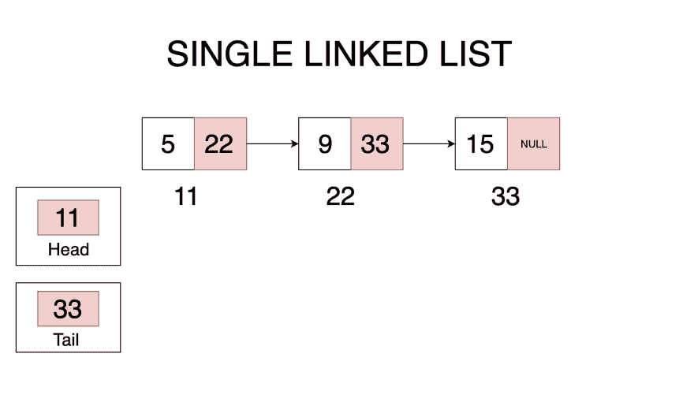

# 单向链表

> 原文:[https://dev . to/fausto 95/single-linked-list-lista-interligada-unica-em-JavaScript-17pj](https://dev.to/fausto95/singly-linked-list-lista-interligada-unica-em-javascript-17pj)

链接列表或在葡萄牙语中**链接列表**是线性数据结构。清单上的每个元素(Node 或葡文**node**包含两个元素─OS***data***和 a***reference*****互连列表**的最大潜力之一是其大小可能不同于阵列。

**参考**只是 RAM 中储存下一个**节点**的实体位址。

互连清单有四种类型:

*   <u>【单键链表】</u> :在这种**【链表】**中，每个**节点**存储 ***数据***
*   **<u>循环单个链接列表</u>** :在此，唯一的区别是列表中的最后**节点**总是指向第一个节点作为参考。
*   **<u>双联列表</u>** :在此，每一**节点**均包含三个要素，前**节点**的参考资料，以及下一【t】的参考资料
*   **<u>循环双联列表</u>** :与之前的类型相比，这次唯一的区别是列表中的最后**节点**总是指向第一个节点作为参考。

#### [](#propriedades-da-lista-interligada)**互连列表属性:**

*   节点(节点):包含下一个节点的数据和参考。

*   <u>Head:</u> 包含列表中第一个节点的引用。

*   <u>尾部:</u>包含列表中最后一个节点的引用。

*   <u>长度:</u>名单上**我们**的确切数字。

在本文中，我们将看到单链接列表的实现。

[T2】](https://res.cloudinary.com/practicaldev/image/fetch/s--OkN2rxus--/c_limit%2Cf_auto%2Cfl_progressive%2Cq_auto%2Cw_880/https://s3-us-west-2.amazonaws.com/faustino.dev/single-linked-list.png)

在上图中，我们可以看到每个节点都有一个参考。在一个简单的**互连列表**中，队列的最后一个节点被引用为 **null** ，因为同一节点并不指向任何其他**节点**。

#### [](#cria%C3%A7%C3%A3o-de-um-n%C3%B3)创建节点

```
class Node {
  constructor(value) {
    this.value = value;
    this.next = next;
  }
} 
```

一个节点只不过是一个具有两个属性的对象，value；将存储我们想要的任何类型的数据；**next**将存储对下一个节点的引用。为此，我们在 Javascript 中使用“**类**”创建了一个节点。

#### [](#criando-a-lista)创建列表

```
class ListaInterligada {
  constructor() {
    this.head = null;
    this.tail = null;
    this.length = 0;
  }
} 
```

新创建的列表包含上面列出的三个特性。

现在，我们将创建负责将新的添加到列表中的角色。

```
class ListaInterligada {
    // código anterior ocultado aqui
  add(value) {
    let node = new Node(value); // instanciamos um novo Nó
    let currentNode = this.head;

    // Caso a lista esteja vazia
    // adicionaremos o novo Nó no topo dela
    if (!currentNode) {
      this.head = node;
      this.tail = node;
      this.length++;
      return node;
    } else {
      // Caso a lista contenha elementos
      // adicionaremos o novo Nó no final da mesma
      while (currentNode.next) {
        currentNode = currentNode.next
      }
      currentNode.next = node;
      this.tail = node;
      this.length++;
      return node;
    }
  }
} 
```

#### [](#instanciando-a-lista-interligada-e-adicionando-n%C3%B3s-%C3%A0-mesma)实例化相互关联的列表，并在其上添加

 **```
let lista = new ListaInterligada();
lista.add(5);
lista.add(9);
lista.add(15);

console.log(lista)
/*
{
  "head": {
    "value": 5,
    "next": {
      "value": 9,
      "next": {
        "value": 15,
        "next": null
      }
    }
  },
  "tail": {
    "value": 15,
    "next": null
  },
  "length": 3
}
*/ 
```

打印控制台上的列表时，我们可以看到它包含三个我们，它们都是相互连接的。

我们就快到了，如果我们现在想从名单上删除其中一个？

这是完全可能的。

#### [](#removendo-n%C3%B3s-da-lista)从列表中删除**【我们】**

```
class ListaInterligada {
  // códigos anteriores ocultados aqui
  remove(location) {
    if (location === 0) {
      // caso queiramos remover o primeiro elemento
      this.head = this.head.next;
      this.length--;
      if (this.length === 0) {
        // e caso não haja mais elementos na lista
        this.tail = null;
      }
    }
    // caso o indice seja maior que o número de elementos na lista
    // removeremos o último elemento da mesma
    else if (location >= this.length) {
      let currentNode = this.head;
      for (let i = 0; i < this.length - 1; i++) {
        currentNode = currentNode.next; // currentNode sera o penúltimo elemento da lista
      }
      // caso este seja o último elemento da lista
      if (currentNode === this.head) {
        this.tail = this.head = null;
        this.length--;
        return;
      } else {
        currentNode.next = null;
        this.tail = currentNode;
        this.length--;
      }
    } else {
      // caso queiramos remover um Nó que não seja o último nem o primeiro
      let currentNode = this.head;
      for (let i = 0; i < location - 1; i++) {
        // atravessamos a lista até encontrarmos o elemento a ser removido
        currentNode = currentNode.next;
      }
      currentNode.next = currentNode.next.next; // removemos o elemento desejado
      this.tail = currentNode;
      this.length--;
    }
  }
} 
```

请注意，当我们将从列表中删除时，我们只是切断了他们之间的联系，然后垃圾收集器(用葡萄牙语 ***【垃圾收集器】*** 将进行清洁，然后从 RAM 中删除 os

#### [](#iterando-a-lista)Iterando a Lista

```
class ListaInterligada {
  // códigos anteriores ocultados aqui
  traverse() {
    let currentNode = this.head;
    for (let i = 0; i < this.length; i++) {
      console.log(currentNode.value);
      currentNode = currentNode.next;
    }
  }
} 
```

在上述代码中，我们在列表中迭代，并为列表中的每个“**”节点“**”打印其值。请注意，`this.length`属性对应于列表中包含的节点数！
在上述代码中应用的相同逻辑，可用于实现一个函数，在列表中查找特定的**节点**。**