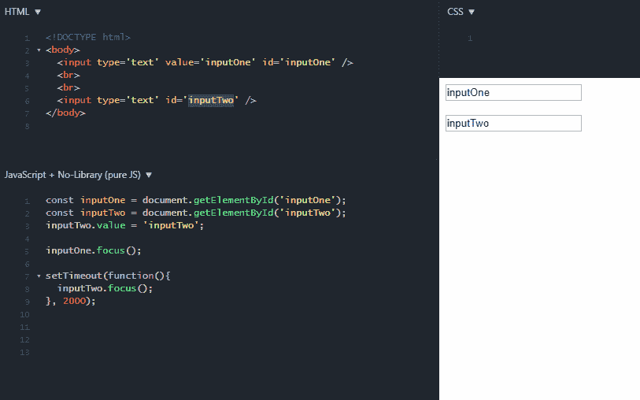

# 光标设置为输入的特征

> 原文:[https://dev . to/georgmielevski/features-of-cursor-setting-to-input-5gia](https://dev.to/georgmilevski/features-of-cursor-setting-to-input-5gia)

大家好👋🙋‍♂️

我想分享一些关于使用函数 focus()时输入光标的不同行为的经验。

*   如果跨属性设置输入元素的值，则当调用函数 focus()时，光标将设置在 start 中。

*   如果输入元素的值是跨值的属性设置的，则当调用函数 focus()时，光标将设置在输入的末尾。

[T2】](https://res.cloudinary.com/practicaldev/image/fetch/s--RgJcq_fW--/c_limit%2Cf_auto%2Cfl_progressive%2Cq_66%2Cw_880/https://thepracticaldev.s3.amazonaws.com/i/zux8bzge38tlxxbcqsm8.gif)

你可以试试这个例子[https://jsfiddle.net/g1nfcv98/](https://jsfiddle.net/g1nfcv98/)