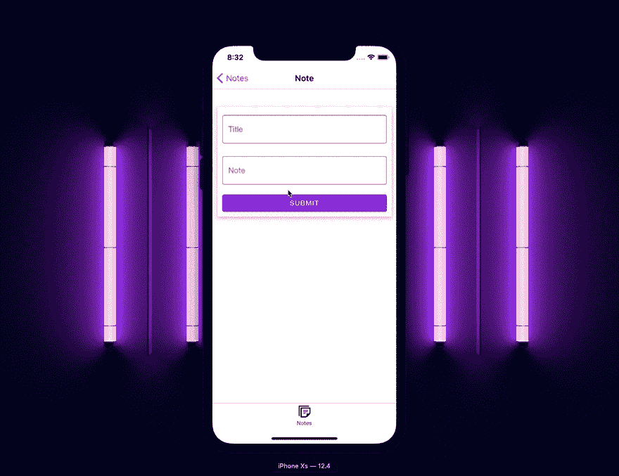

# 用钩子和上下文对本地通知做出反应

> 原文:[https://dev . to/salted-bytes/react-native-local-notifications-with-hooks-and-context-5g ke](https://dev.to/salted-bytes/react-native-local-notifications-with-hooks-and-context-5gke)

在任何应用程序中，总会有需要向用户传递小信息的时候。在 web 应用程序中，这通常是通过 toast 类型的消息来完成的。在移动应用程序中，这通常是某种提醒或本地通知。

在本教程中，我们将介绍如何创建用 React 上下文和钩子更新的可重用警报组件。

[T2】](https://res.cloudinary.com/practicaldev/image/fetch/s--hg1o3gwq--/c_limit%2Cf_auto%2Cfl_progressive%2Cq_66%2Cw_880/https://thepracticaldev.s3.amazonaws.com/i/i1c6g3l0xi7r2nzjzcje.gif)

我们将使用一个简单的 notes 应用程序，你可以从[这里](https://github.com/jim-at-jibba/rn-local-notifications-tut)克隆完成的项目。

您可以看到它已经具有查看和创建注释的功能，但是我们希望通知用户保存注释是否成功或者是否有错误。显然，这只是一个可以使用警报的例子。它可以用来通知用户任何事情！

在示例代码中，我使用了非常棒的 [React Native Paper](https://reactnativepaper.com/) 。[阅读我最近的文章](https://dev.to/salted-bytes/best-of-the-best-react-native-ui-libraries-31p3)，了解我为什么使用它，为什么我认为它是最好的原生 UI 库。我们将使用`Snackbar`组件作为我们的警报组件，但是您可以使用任何适合您的项目的组件。

我们正把这篇文章分成几个不同的部分。

我们将使用 [`React.context`](https://reactjs.org/docs/context.html) 来保持和设置我们的警戒状态。React 文档指出

> 上下文提供了一种通过组件树传递数据的方式，而不必在每一层手动向下传递属性。

上下文非常适合管理需要全局可用的简单状态。

## [](#global-context-provider)全局上下文提供者

我认为，根据**域**将存储在上下文中的状态进行拆分是一个好的做法，例如，为警报、侧栏、购物车等设置单独的上下文。通过这样做，你可以避免不必要的重新呈现，你的警告上下文不会在意你的侧边栏上下文，所以更新一个不应该使用另一个重新呈现组件。

通过将您的应用程序包装在一个`Context.provider`中，您的应用程序可以使用上下文。但是当你有多个上下文时，这可能是一个“问题”,因为这会使你的`App.js`变得臃肿，更不可读。但是并没有失去一切，来自 LevelUp tuts 的 Scott Tolinsky 给我介绍了一段很棒的代码，它将你的`Context.Providers`组成了一个单独的组件。这使得事情变得更加整洁。

你可能已经发现在你的`App.js`中有多个上下文实际上并不是一个问题。我只是喜欢东西整洁。

```
import * as React from "react";
// we will import our context providers here

function ProviderComposer({ contexts, children }) {
  return contexts.reduceRight(
    (kids, parent) =>
      React.cloneElement(parent, {
        children: kids
      }),
    children
  );
}

function ContextProvider({ children }) {
  return (
    // we add our providers to the contexts prop
    <ProviderComposer contexts={[]}>{children}</ProviderComposer>
  );
}

export default ContextProvider; 
```

<svg width="20px" height="20px" viewBox="0 0 24 24" class="highlight-action crayons-icon highlight-action--fullscreen-on"><title>Enter fullscreen mode</title></svg> <svg width="20px" height="20px" viewBox="0 0 24 24" class="highlight-action crayons-icon highlight-action--fullscreen-off"><title>Exit fullscreen mode</title></svg>

## [](#alert-provider)预警提供者

首先，我们需要创建可以保存我们的警报状态的上下文。我们使用`React.createContext`并将它赋给一个变量。注意，我们还导出了变量，这意味着我们以后可以在其他组件中使用它。

我们还创建了一个包装我们的`AlertContext.Provider`的`AlertProvider`组件，这让我们可以访问存储在我们的`AlertContext`中的状态。

```
import * as React from "react";

export const AlertContext = React.createContext({});

export const AlertProvider = ({ children }) => {

  return (
    <AlertContext.Provider
      value={// Our context values will go here}>
      {children}
    </AlertContext.Provider>
  );
}; 
```

<svg width="20px" height="20px" viewBox="0 0 24 24" class="highlight-action crayons-icon highlight-action--fullscreen-on"><title>Enter fullscreen mode</title></svg> <svg width="20px" height="20px" viewBox="0 0 24 24" class="highlight-action crayons-icon highlight-action--fullscreen-off"><title>Exit fullscreen mode</title></svg>

接下来，我们需要一种方法来管理存储在我们的上下文中的数据。我们可以为此使用`React.useState`,但是由于我们的数据结构稍微复杂一些，并且我们将更新多条数据来触发我们的警报组件，所以我决定使用`React.useReducer`。它使得警报提供者的实现及其方法的执行更加简洁。

```
[...]

const initialState = {
  type: "close",
  open: false,
  alertType: "info",
  message: ""
};

const reducer = (state, action) => {
  switch (action.type) {
    case "close":
      return {
        ...initialState
      };
    case "open":
      return {
        open: true,
        alertType: action.alertType,
        message: action.message
      };
    default:
      throw new Error("Action not found");
  }
}; 
```

<svg width="20px" height="20px" viewBox="0 0 24 24" class="highlight-action crayons-icon highlight-action--fullscreen-on"><title>Enter fullscreen mode</title></svg> <svg width="20px" height="20px" viewBox="0 0 24 24" class="highlight-action crayons-icon highlight-action--fullscreen-off"><title>Exit fullscreen mode</title></svg>

最后，我们需要把它们放在一起，并在我们的`provider`中使用我们的`reducer`,让我们能够访问所有存储的警报状态。这种组合允许我们从应用程序的任何部分更新和访问警报状态的任何部分，只要应用程序包装在我们的全局上下文提供程序中。

```
import * as React from "react";

const initialState = {
  type: "close",
  open: false,
  alertType: "info",
  message: ""
};

export const AlertContext = React.createContext({});

const reducer = (state, action) => {
  switch (action.type) {
    case "close":
      return {
        ...initialState
      };
    case "open":
      return {
        open: true,
        alertType: action.alertType,
        message: action.message
      };
    default:
      throw new Error();
  }
};

export const AlertProvider = ({ children }) => {
  const [alertState, dispatchAlert] = React.useReducer(reducer, initialState);
  return (
    <AlertContext.Provider
      value={{
        alertState,
        dispatchAlert
      }}>
      {children}
    </AlertContext.Provider>
  );
}; 
```

<svg width="20px" height="20px" viewBox="0 0 24 24" class="highlight-action crayons-icon highlight-action--fullscreen-on"><title>Enter fullscreen mode</title></svg> <svg width="20px" height="20px" viewBox="0 0 24 24" class="highlight-action crayons-icon highlight-action--fullscreen-off"><title>Exit fullscreen mode</title></svg>

## [](#the-alert-component)告警组件

正如我在本文开始时提到的，我们正在使用 [React Native Paper](https://reactnativepaper.com/) 及其 Snackbar 组件来提醒用户我们应用程序中的任何信息。但是这个可以换成其他任何东西。您只需要一种方法来使用从警报上下文传递下来的数据。

这个组件非常简单。我们使用`React.useContext`钩子来订阅对`AlertContext`的更改，然后根据状态打开/关闭弹出窗口。我们根据`alertState.alertType`属性设置警告框的样式，以恰当地传达消息的含义。

```
import * as React from "react";
import { Snackbar } from "react-native-paper";
import { AlertContext } from "../globalState";
import { colors } from "../constants";

const SnackBar = () => {
  const { alertState, dispatchAlert } = React.useContext(AlertContext);
  const [alertSyle, setAlertStyle] = React.useState({
    backgroundColor: colors.info
  });

  React.useEffect(() => {
    switch (alertState.alertType) {
      case "info":
        setAlertStyle({
          backgroundColor: colors.success
        });
        break;
      case "error":
        setAlertStyle({
          backgroundColor: colors.error
        });
        break;
      case "success":
        setAlertStyle({
          backgroundColor: colors.success
        });
        break;
      default:
        setAlertStyle({
          backgroundColor: colors.info
        });
    }
  }, [alertState]);

  const closeMe = () => {
    dispatchAlert({ type: "close" });
  };

  return (
    <>
      {typeof alertState.open === "boolean" && (
        <Snackbar
          style={alertSyle}
          visible={alertState.open}
          onDismiss={() => closeMe()}
          action={{
            label: "Undo",
            onPress: () => {
              console.log("Snackbar closed");
              // Do something
            }
          }}>
          {alertState.message}
        </Snackbar>
      )}
    </>
  );
};

export default SnackBar; 
```

<svg width="20px" height="20px" viewBox="0 0 24 24" class="highlight-action crayons-icon highlight-action--fullscreen-on"><title>Enter fullscreen mode</title></svg> <svg width="20px" height="20px" viewBox="0 0 24 24" class="highlight-action crayons-icon highlight-action--fullscreen-off"><title>Exit fullscreen mode</title></svg>

## [](#using-our-alert-provider)使用我们的警报提供程序

最后，我们现在可以在应用程序的任何地方使用我们可爱的新功能`AlertContext`。在下面的例子中，我们通知用户 GraphQL 突变的结果。

如果您想了解如何轻松地将 GraphQL 集成到您的 React 本机应用程序中，请查看本文。

同样，我们在 Snackbar 组件中使用了`useContext`钩子来访问`dispatchAlert`方法，这将允许我们提醒用户 GraphQL 变异的成功或错误。

```
[...]

const NoteCreateScreen = ({ navigation }) => {
  const { dispatchAlert } = React.useContext(AlertContext);

  const createNoteMutation = useMutation(gql(createNote));
  return (
    <SafeAreaView style={gStyle.container}>
      <ScrollView contentContainerStyle={gStyle.contentContainer}>
        <View style={{ flex: 1, height: '100%', width: '100%' }}>
          <Surface style={styles.surface}>
            <Formik
              initialValues={{ note: '', title: '' }}
              onSubmit={({ note, title }) => {
                const input = {
                  id: uuid(),
                  title,
                  note,
                  createdAt: moment().toISOString()
                };
                createNoteMutation({
                  variables: {
                    input
                  },
                  update: (_, { data, error }) => {
                    if (error) {
                      dispatchAlert({
                        type: 'open',
                        alertType: 'error',
                        message: 'Error creating note'
                      });
                    } else {
                      dispatchAlert({
                        type: 'open',
                        alertType: 'success',
                        message: 'Note created'
                      });
                      navigation.state.params.refetch();
                      navigation.goBack();
                    }
                  }
                });
              }}
            >
              {({ values, handleSubmit, handleChange }) => {
                return (
                  <>
                    [...]
                  </>
                );
              }}
            </Formik>
          </Surface>
        </View>
      </ScrollView>
    </SafeAreaView>
  );
};

export default NoteCreateScreen; 
```

<svg width="20px" height="20px" viewBox="0 0 24 24" class="highlight-action crayons-icon highlight-action--fullscreen-on"><title>Enter fullscreen mode</title></svg> <svg width="20px" height="20px" viewBox="0 0 24 24" class="highlight-action crayons-icon highlight-action--fullscreen-off"><title>Exit fullscreen mode</title></svg>

这就是你所拥有的，一个高度可定制的，可重用的，全球可执行的本地通知系统。这种情况是对`React Context`的完美运用，但显然还有更多。

你还会创作什么？

# [](#thanks-for-reading)感谢阅读🙏

如果我错过了什么，或者有更好的方法，请告诉我