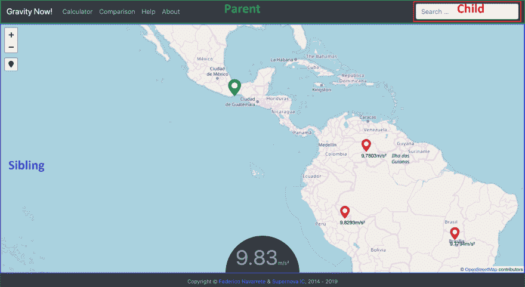

# 使用 RxJS 在 Angular 中的同级组件之间传输数据

> 原文：<https://dev.to/fanmixco/transfer-data-between-siblings-components-in-angular-a1m>

我在棱角方面还是挺清新的，但是不知怎么的就喜欢上了！我喜欢 web 组件体验。令人耳目一新。然而，我面临着一个疯狂的挑战，几乎没有关于如何在两个兄弟姐妹之间传输数据的文档。显而易见的答案是:**但是你可以使用一个服务！对吗？**

这听起来很简单，但是我找不到任何合适的文档。我读了很多这方面的东西，但什么都没有。所有的例子都太复杂了。这张照片代表了我当时面对的情况:

[](https://i.stack.imgur.com/XlmE4.png)

我需要将信息从搜索框转移到导航栏。从导航条到地图来定位新的点。听起来容易吗？不完全是，我想帮你简化一下。你需要什么？

安装:

[https://rxjs-dev.firebaseapp.com/](https://rxjs-dev.firebaseapp.com/)

```
npm install rxjs 
```

<svg width="20px" height="20px" viewBox="0 0 24 24" class="highlight-action crayons-icon highlight-action--fullscreen-on"><title>Enter fullscreen mode</title></svg> <svg width="20px" height="20px" viewBox="0 0 24 24" class="highlight-action crayons-icon highlight-action--fullscreen-off"><title>Exit fullscreen mode</title></svg>

这个库就是要做**这个小把戏**来转移它的库。我将把重点放在兄弟姐妹部分，因为另一部分(子到父)更容易，并且在@Outputs 和@Inputs 之间有很好的记录。

首先，让我们创建一个在兄弟之间传输数据的服务:

```
ng generate service message-transfer-service 
```

<svg width="20px" height="20px" viewBox="0 0 24 24" class="highlight-action crayons-icon highlight-action--fullscreen-on"><title>Enter fullscreen mode</title></svg> <svg width="20px" height="20px" viewBox="0 0 24 24" class="highlight-action crayons-icon highlight-action--fullscreen-off"><title>Exit fullscreen mode</title></svg>

稍后在这个类中，我们将定义一个**行为主题**，我们将使用它来存储“可转移对象”。

```
export class Locations {
    id: number;
    lat: number;
    lng: number;
    name: string;
}

export class MessageTransferService {

  private locations = new Locations();
      //This is the key the Subject to transfer
  locations$ = new BehaviorSubject<Locations>(this.locations)

  setLocations(location: Locations) {
    this.locations$.next(location);
  }

  constructor() { }
} 
```

<svg width="20px" height="20px" viewBox="0 0 24 24" class="highlight-action crayons-icon highlight-action--fullscreen-on"><title>Enter fullscreen mode</title></svg> <svg width="20px" height="20px" viewBox="0 0 24 24" class="highlight-action crayons-icon highlight-action--fullscreen-off"><title>Exit fullscreen mode</title></svg>

在您完成服务之后，您转到您的 AppModule 并在 providers:
中定义您的服务

```
providers: [MessageTransferService], 
```

<svg width="20px" height="20px" viewBox="0 0 24 24" class="highlight-action crayons-icon highlight-action--fullscreen-on"><title>Enter fullscreen mode</title></svg> <svg width="20px" height="20px" viewBox="0 0 24 24" class="highlight-action crayons-icon highlight-action--fullscreen-off"><title>Exit fullscreen mode</title></svg>

后来，在你的**父组件**中。您将服务设置为构造函数的参数。

```
constructor(private service: MessageTransferService){ }

//this function is an example for updating the value from the service
setLocations(currentLocation) {
    let d : Location = JSON.parse(currentLocation);
    this.service.setLocations(d);
} 
```

<svg width="20px" height="20px" viewBox="0 0 24 24" class="highlight-action crayons-icon highlight-action--fullscreen-on"><title>Enter fullscreen mode</title></svg> <svg width="20px" height="20px" viewBox="0 0 24 24" class="highlight-action crayons-icon highlight-action--fullscreen-off"><title>Exit fullscreen mode</title></svg>

最后，在你的兄弟类中定义相同的构造函数和主题:

```
locations$: this.service.locations$;

constructor(private service: MessageTransferService) { }

ngOnInit() {
    //this one is optional
    this.service.locations$.subscribe(value =>
    {
        console.log(value);
        // do something
    });
} 
```

<svg width="20px" height="20px" viewBox="0 0 24 24" class="highlight-action crayons-icon highlight-action--fullscreen-on"><title>Enter fullscreen mode</title></svg> <svg width="20px" height="20px" viewBox="0 0 24 24" class="highlight-action crayons-icon highlight-action--fullscreen-off"><title>Exit fullscreen mode</title></svg>

好了，现在你可以使用 Angular 中的服务在兄弟姐妹之间传输数据了！

如果您想检查它的运行情况或查看源代码。给你！

[https://fanmixco.github.io/gravitynow-angular](https://fanmixco.github.io/gravitynow-angular)

### 关注我:

| 商务化人际关系网 | 油管（国外视频网站） | 照片墙 | 网络先知 | 分享您的故事 |
| --- | --- | --- | --- | --- |
| [](https://bit.ly/3xLCmvb) | [](https://youtube.com/c/FedericoNavarrete) | [](https://www.instagram.com/federico_the_consultant) | [](https://redcircle.com/shows/cyber-prophets) | [](https://redcircle.com/shows/sharing-your-stories) |

[](https://www.buymeacoffee.com/fanmixco)