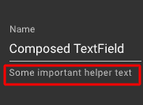

# 如何在 TextField material-ui 组件中设置 helperText 的样式

> 原文:[https://dev . to/oleksandrsachuk/how-to-style-helper text-in-the-textfield-material-ui-component-cob](https://dev.to/oleksandrsachuk/how-to-style-helpertext-in-the-textfield-material-ui-component-cob)

向“material-ui”组件添加自定义样式有时可能是一个挑战。

例如，我需要向“TextField”组件添加额外的自定义样式。

[T2】](https://res.cloudinary.com/practicaldev/image/fetch/s--zJkXLgN---/c_limit%2Cf_auto%2Cfl_progressive%2Cq_auto%2Cw_880/https://thepracticaldev.s3.amazonaws.com/i/e6t3o4d9uefgeam1najm.png)

我尝试了不同的解决方案，花了很多时间才找到最简单的一个。

最后，我发现这是一个可能的只是通过“className”键的“FormHelperTextProps”属性。