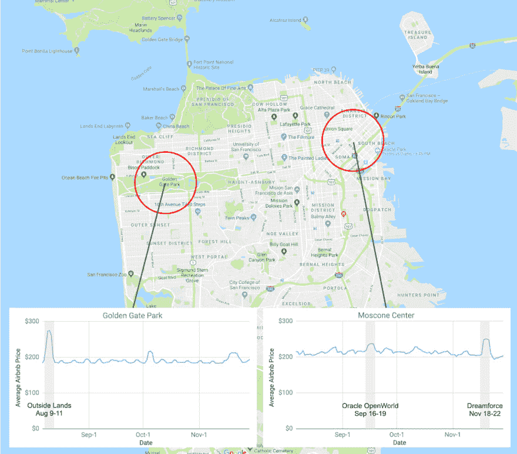
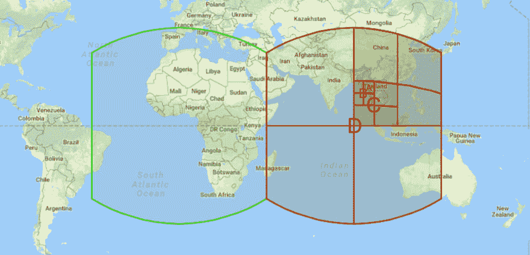
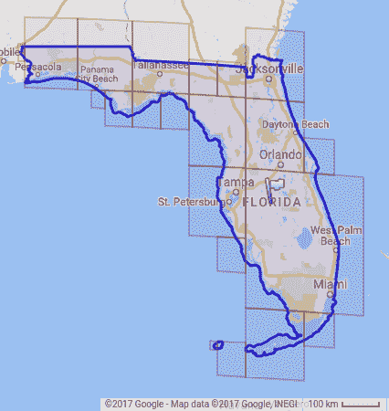
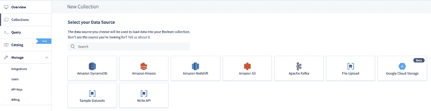
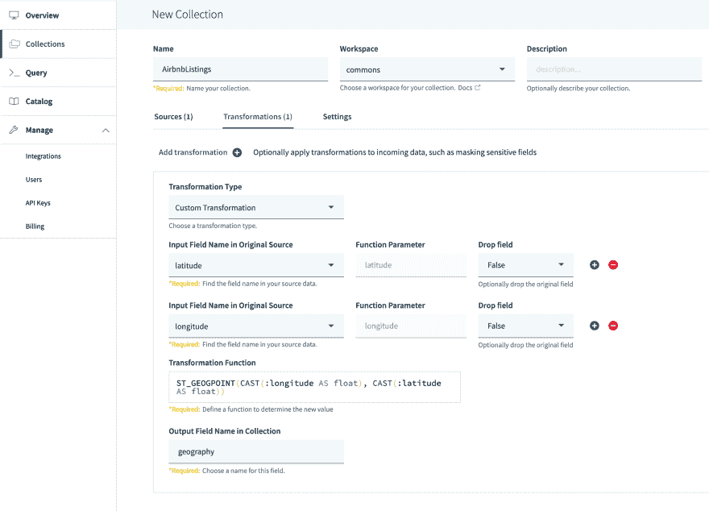
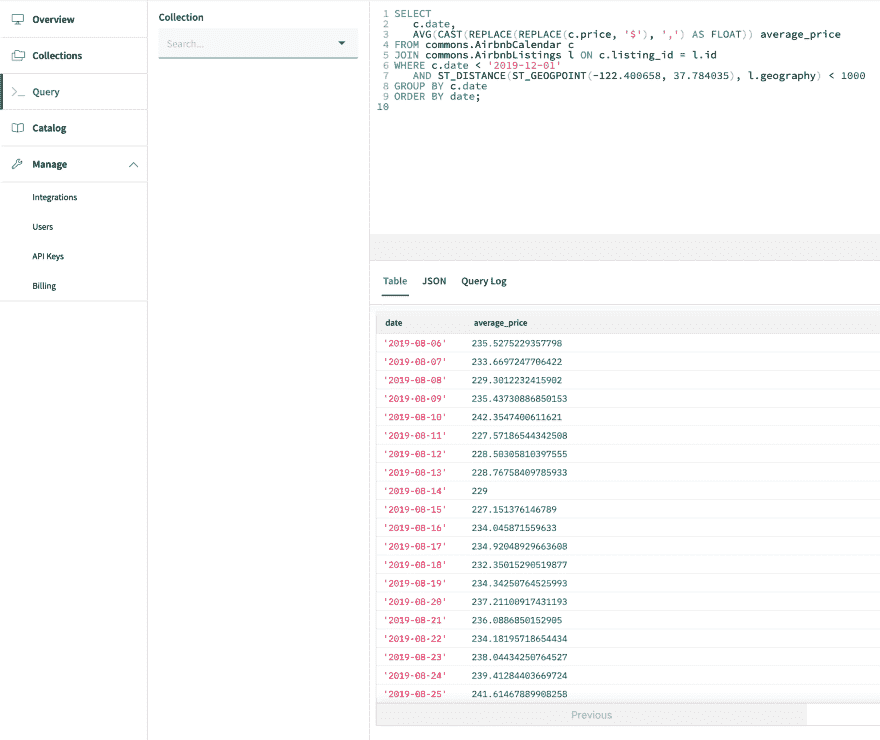
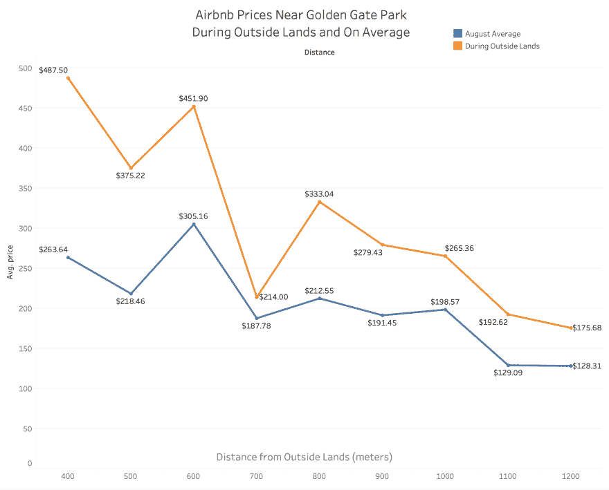

# 外部土地、Airbnb 价格和 Rockset 的地理空间查询

> 原文：<https://dev.to/rocksetcloud/outside-lands-airbnb-prices-and-rockset-s-geospatial-queries-17io>

*作者[本·汉内尔](https://www.linkedin.com/in/ben-hannel-383356112/)T3】*

## 重大活动前后 Airbnb 价格

[实时数据流的运营分析](https://rockset.com/blog/operational-analytics-what-every-software-engineer-should-know/)要求能够沿着对人们至关重要的所有轴(包括时间和空间)对数据流进行分割。我们可以通过查看一个完全关于位置的应用程序来了解空间分析数据有多重要:Airbnb。旧金山的重大事件导致大量人员涌入，Airbnb 价格相应上涨。然而，这些价格上涨是围绕这些事件高度本地化的。Airbnb [发布了过去和未来的价格数据](http://insideairbnb.com/get-the-data.html)，我们可以利用这些数据在重大事件发生前观察价格如何飙升。

我们将关注三个主要事件。第一个是外域音乐艺术节，8 月份吸引了 90，000 多人来到金门公园。我们还将关注甲骨文全球大会 2013 和 Dreamforce 的价格，这是在莫斯康中心举办的两个大型会议。我们使用 Rockset 的新地理空间功能运行查询。

[](https://res.cloudinary.com/practicaldev/image/fetch/s--4dONw1g---/c_limit%2Cf_auto%2Cfl_progressive%2Cq_auto%2Cw_880/https://images.ctfassets.net/1d31s1aajogl/55XdEx2CnUplyJiCUn1ObD/0d145e35c3eac777221205dd9fa6d5b6/image.png)

对于所有这三个事件，事件半径一公里内的航空旅馆的平均价格都有显著的增长。在外部土地的情况下，平均价格飙升了 30%以上！

## 幕后

为了使地理空间查询更快，我们重新设计了 Rockset 的搜索索引。Rockset 建立在三种类型的索引之上——列存储、行存储和搜索索引。我们将每个索引存储在 [RocksDB](https://rockset.com/blog/how-we-use-rocksdb-at-rockset/) 中，这是一个有序的键值存储。搜索索引允许快速查询具有特定值或值范围的所有文档。对于字段中的每个值，搜索索引都会存储一个具有该值的文档 id 的排序列表。这允许像这样的查询快速运行:

```
SELECT * FROM people WHERE name='Ben' 
```

<svg width="20px" height="20px" viewBox="0 0 24 24" class="highlight-action crayons-icon highlight-action--fullscreen-on"><title>Enter fullscreen mode</title></svg> <svg width="20px" height="20px" viewBox="0 0 24 24" class="highlight-action crayons-icon highlight-action--fullscreen-off"><title>Exit fullscreen mode</title></svg>

我们需要做的就是查找密钥“名称”。本”在搜索索引中。

当我们将 geography 类型引入到 [IValue 框架](https://rockset.com/blog/ivalue-efficient-representation-of-dynamic-types-in-cplusplus/)时，我们需要扩展搜索索引的功能。典型的地理空间查询通常不是精确地搜索一个点，而是搜索一些紧凑的点区域，例如给定距离内或多边形内的所有点。为了满足这一需求，我们重新调整了搜索索引的用途，以适应不同的地理位置。首先，我们使用 [S2 库](http://s2geometry.io/)将地球表面划分成一个大致为正方形的分层网格。

[](https://res.cloudinary.com/practicaldev/image/fetch/s--vj3cHbpD--/c_limit%2Cf_auto%2Cfl_progressive%2Cq_auto%2Cw_880/https://images.ctfassets.net/1d31s1aajogl/3OYKfWrhAtRi4l7im9nCJq/67c13e78f1489d090ebd935cc5e88c47/image__1_.png)

对于集合中的每个点，我们在搜索索引中为包含它的每个单元格添加一个条目。由于这些单元形成了一个层次结构，所以一个点包含在许多单元中——它的直接父单元，以及该单元的所有祖先。这增加了空间的使用，但带来了更好的查询性能。在上图中，图中单元格 A 中的一个点也会被添加到单元格 B、C 和 D 中，因为这些单元格中的每一个都包含单元格 A。

[](https://res.cloudinary.com/practicaldev/image/fetch/s--31yoIJPE--/c_limit%2Cf_auto%2Cfl_progressive%2Cq_auto%2Cw_880/https://images.ctfassets.net/1d31s1aajogl/6hDwuteeBuco3S7YBqTzI3/04c61ba60f08ae95481f345dd14f3fb2/image__2_.png)

为了找到给定区域中的所有点，我们找到覆盖该区域的一组单元。虽然该区域(在这种情况下是佛罗里达)中的每个单元都在覆盖它的单元集中，但是一些单元部分落在目标区域之外。为了确保我们的结果是准确的，我们在从存储器中检索这些候选点后，检查它们是否包含在该区域中，并丢弃那些不包含的候选点。由于有了索引，我们再也不必检查这组单元格之外的任何点，从而大大减少了选择性查询的时间。

## 自己怎么做

首先，[下载](http://insideairbnb.com/get-the-data.html)并从 Airbnb 中提取你感兴趣的地点和时间的 calendar.csv.gz 和 listings.csv.gz(我在旧金山使用的是 8 月份的数据)。然后[创建](https://console.rockset.com/create)一个 Rockset 账户(如果你还没有的话)，并将每个 CSV 上传到一个单独的 Rockset 集合。

[](https://res.cloudinary.com/practicaldev/image/fetch/s--SZeEx2Qw--/c_limit%2Cf_auto%2Cfl_progressive%2Cq_auto%2Cw_880/https://images.ctfassets.net/1d31s1aajogl/2tXIeZP5GGA3l5Q2jXXl6j/33d3e0c0a89adb9f3ee388101263d6e8/image__3_.png)

创建收藏并上传 calendar.csv。指定格式为 CSV/TSV，并且默认格式选项应该正确。

[](https://res.cloudinary.com/practicaldev/image/fetch/s--3G8JUgMz--/c_limit%2Cf_auto%2Cfl_progressive%2Cq_auto%2Cw_880/https://images.ctfassets.net/1d31s1aajogl/2I4SWj0LRknU9lYEnMSjXN/6bdf37e8dd98330339e16991e96093e0/image__4_.png)

创建另一个集合并上传 listings.csv，但是这次您需要指定一个转换。在地理类型和地理空间查询之前，您必须自己计算纬度/经度点之间的距离(正如我们在[分析 SF 汽车闯入](https://rockset.com/blog/data-driven-decisions-realtime-parking-risk-score/)时所做的)。对于 geographies，我们可以指定一个转换，将纬度和经度字段合并到一个对象中，并告诉 Rockset 在其上创建一个地理空间索引。这些字段最初是字符串，所以我们首先将它们转换成浮点数，然后通过下面的转换将它们转换成地理位置:

```
ST_GEOGPOINT(CAST(:longitude AS float), CAST(:latitude AS float)) 
```

<svg width="20px" height="20px" viewBox="0 0 24 24" class="highlight-action crayons-icon highlight-action--fullscreen-on"><title>Enter fullscreen mode</title></svg> <svg width="20px" height="20px" viewBox="0 0 24 24" class="highlight-action crayons-icon highlight-action--fullscreen-off"><title>Exit fullscreen mode</title></svg>

注意经度在最前面。

[](https://res.cloudinary.com/practicaldev/image/fetch/s--ThLD43_g--/c_limit%2Cf_auto%2Cfl_progressive%2Cq_auto%2Cw_880/https://images.ctfassets.net/1d31s1aajogl/JahjIyBsptMmfHt6ZKA2P/32c5c6287d71327e952726a6cf977e67/Screen_Shot_2019-09-19_at_3.35.35_PM.png)

一旦您的数据被接收并编入索引，您就可以运行此查询来获取 Moscone Center 附近的每日平均价格:

[](https://res.cloudinary.com/practicaldev/image/fetch/s--bQnCAtDn--/c_limit%2Cf_auto%2Cfl_progressive%2Cq_auto%2Cw_880/https://images.ctfassets.net/1d31s1aajogl/7rD5RViqE6lad1wSbeOKz1/dbb664e1a095a11610c576d56d2f2200/image__6_.png)

同样，为了便于复制和粘贴:

```
SELECT c.date,
  AVG(CAST(replace(REPLACE(c.price, '$'), ',') as FLOAT)) average_price
FROM commons.AirbnbCalendar c
JOIN commons.AirbnbListings l on c.listing_id = l.id
WHERE c.date < '2019-12-01'
  AND ST_DISTANCE(ST_GEOGPOINT(-122.400658, 37.784035), l.geography) < 1000
GROUP BY c.date
ORDER BY date; 
```

<svg width="20px" height="20px" viewBox="0 0 24 24" class="highlight-action crayons-icon highlight-action--fullscreen-on"><title>Enter fullscreen mode</title></svg> <svg width="20px" height="20px" viewBox="0 0 24 24" class="highlight-action crayons-icon highlight-action--fullscreen-off"><title>Exit fullscreen mode</title></svg>

我们也可以看看 Airbnb 和金门公园之间的价格。我用 Rockset 的 [Tableau integration](https://docs.rockset.com/tableau/) 创建了这个可视化。户外周末的价格是橙色的。蓝色部分是整个八月的平均价格。

[](https://res.cloudinary.com/practicaldev/image/fetch/s--REWz7x9g--/c_limit%2Cf_auto%2Cfl_progressive%2Cq_auto%2Cw_880/https://images.ctfassets.net/1d31s1aajogl/3RH96P52TvoCq2KWf5zs1h/c3bf0b4bcfd1c1a69769618d9c15ee9f/image__9_.png)

同样，为了便于复制和粘贴:

```
SELECT
    CAST(replace(REPLACE(c.price, '$'), ',') as FLOAT) price,
    ST_DISTANCE(
        ST_GEOGPOINT(-122.491341, 37.768761),
        l.geography
    ) distance,
    IF((
        c.date >= '2019-08-09'
        AND c.date <= '2019-08-11'
    ), 'During Outside Lands', 'August Average') AS during_outside_lands
FROM commons.AirbnbCalendar c
JOIN commons.AirbnbListings l on c.listing_id = l.id
WHERE c.date >= '2019-08-01'
    AND c.date <= '2019-08-30'
    AND ST_DISTANCE(
        ST_GEOGPOINT(-122.491341, 37.768761),
        l.geography
    ) < 1300 
```

<svg width="20px" height="20px" viewBox="0 0 24 24" class="highlight-action crayons-icon highlight-action--fullscreen-on"><title>Enter fullscreen mode</title></svg> <svg width="20px" height="20px" viewBox="0 0 24 24" class="highlight-action crayons-icon highlight-action--fullscreen-off"><title>Exit fullscreen mode</title></svg>

正如你所看到的，你将会支付一大笔额外费用，在周末去郊外的金门公园(Golden Gate Park)附近租一个 Airbnb。然而，如果你能满足于稍微远一点的地方，价格看起来更像典型的 Airbnb 价格。使用 Rockset，您可以在不到一个小时的时间内从带有纬度和经度字段的深度嵌套数据到快速、富于表现力的地理空间查询。